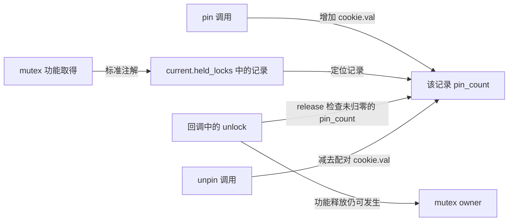
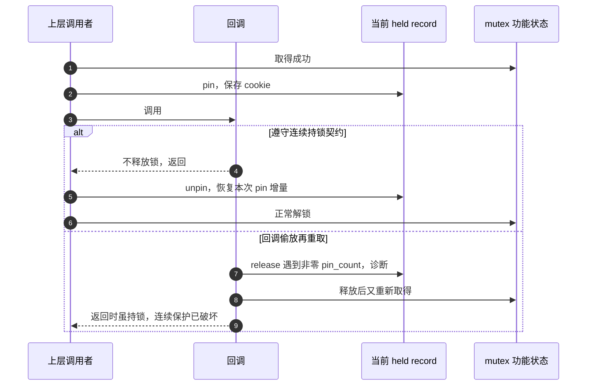

# 第6章\_查询\_断言\_pin与自定义原语接入

## 6.1\_先确认自己在哪一层使用Lockdep

前五章站在验证器内部观察事件和图。本章把模型交还给代码作者。**Lockdep 不是只有内核核心维护者才有资格使用的内部工具**；只要你能让自己的内核路径在启用 Lockdep 的调试内核中运行，就已经可以使用它。区别只在于你需要介入到哪一层：

| 使用者 | 实际要做什么 | 是否直接调用Lockdep接口 |
| --- | --- | --- |
| 普通驱动或内核模块开发者 | 继续使用标准 mutex、spinlock、rwsem 等原语，启用检查配置并覆盖自己的正常、失败、IRQ 与卸载路径 | 通常不需要；标准原语已经上报事件 |
| 维护带持锁前置条件的公共函数 | 在被保护函数、回调边界或潜在加锁入口加入断言、pin 或 `might_lock()` | 只使用面向调用契约的注解 |
| 实现新同步原语或逻辑保护域的维护者 | 定义稳定身份、真实等待类型、成功/失败配对和生命周期，再接入 `lockdep_map` 事件 | 需要，而且必须先证明事件模型忠实 |
| 测试、CI 或故障复现人员 | 构建调试内核，驱动组件链实际执行，保存首个报告、配置和检查器生命状态 | 一般不改业务接口，只负责环境与覆盖 |

因此，“我们自己能不能用”要按代码边界回答：编写外部内核模块、驱动或自定义内核时，完全可以用 Lockdep 检查自己的锁协议；没有权限重建或启动调试内核时，只能消费目标系统已经编译并保持启用的能力。普通用户态程序不能把 `pthread_mutex` 直接交给内核 Lockdep 分析，它最多通过系统调用触发内核路径；用户态锁需要 ThreadSanitizer、Helgrind 等相应工具。P08 会把内核配置、权限、安全启动和可重启环境这些工程条件落实成实验步骤。

确定使用层级以后，调用者通常会遇到四个不同问题：

| 调用者问题 | 应用的接口 | 是否改变影子状态 |
| --- | --- | --- |
| current 此刻是否持有指定实例 | `lockdep_is_held()` / `lockdep_is_held_type()` | 否，只查询 current 账本 |
| 这个函数的正确调用是否要求持锁或不持锁 | `lockdep_assert_*()` | 否，条件明确违反时告警 |
| 上层持锁穿过回调时，能否发现下层偷偷释放又重取 | `lockdep_pin_lock()` / `lockdep_unpin_lock()` | 修改已有 held record 的 pin 状态，不取得功能锁 |
| 自定义同步原语怎样进入依赖图 | `lock_acquire*()` / `lock_release()` 的正确封装 | 是，按真实协议产生事件 |

`might_lock()` 处在断言与事件之间：它表达“这个调用可能取得某锁”的潜在关系，但不建立真实持锁区间。标准原语使用者应先依赖自动接入，只有明确要验证调用契约时才添加断言；只有原语实现者才直接建立 acquire/release 事件。选择接口以前先说清要验证哪项契约，不能看见 lockdep 前缀就互换。

## 6.2\_查询current而不是查询锁是否忙

```c
int held = lockdep_is_held(&dev->state_lock);
```

返回值可能是 HELD、NOT_HELD 或 UNKNOWN，下一节再解释三态。普通未合并记录按这个锁实例的 `dep_map` 匹配 current 的有效 held records；在启用检查的固定实现中，特定 references/nest_lock 合并记录还可能按锁类匹配，不能把查询概括为任何情况下都精确到唯一地址。它不读取 mutex owner，也不扫描其他任务。因此它不回答：

- 锁是否被其他任务占用；
- 当前 CPU 上某个别的任务是否持锁；
- 同类设备中每一个具体实例分别由谁持有；
- 被保护对象是否仍存活，或访问是否没有数据竞争。

`mutex_is_locked(&dev->state_lock)` 关注功能锁是否处于占用状态；`lockdep_is_held(&dev->state_lock)` 关注 current 的检查账本。前者不能证明 current 是 owner，后者在检查关闭或停检时也不能提供功能同步。

版本化阅读先从 [Lockdep 总阅读索引](../../../../../research/source_reading/lockdep/navigation/P01_Linux_6.12_Lockdep源码导读.md#1.6_建议阅读顺序)进入，再读[查询适配与诊断模块导读](../../../../../research/source_reading/lockdep/navigation/P04_Linux_6.12_Lockdep查询适配与诊断模块导读.md#4.2_查询链)。Linux 6.12.20 的实例匹配见 [`lock_is_held_type()` 当前持锁查询](../../../../../research/source_reading/lockdep/source_explanations/P04_Linux_6.12_Lockdep查询注解与配置源码实现.md#4.2_lock_is_held_type当前持锁查询)。

## 6.3\_为什么查询不是简单布尔值

检查器可能明确找到、明确未找到，也可能已经无法可靠回答：

```text
LOCK_STATE_HELD      current账本找到符合查询规则的记录
LOCK_STATE_NOT_HELD  检查器有效且明确未找到
LOCK_STATE_UNKNOWN   检查器未构建、停检或当前不可可靠查询
```

普通持锁断言只在明确 `NOT_HELD` 时报告，不持锁断言只在明确 `HELD` 时报告，避免检查器失效后制造假阳性。UNKNOWN 只是“诊断者不知道”，不表示业务前置条件自动成立。

因此查询结果不能控制功能正确性。下面的写法是错误模型：

```c
/* 错误：非调试构建或停检会改变业务行为。 */
if (lockdep_is_held(&dev->state_lock))
	dev->active_mode++;
```

业务锁是否已经取得必须由程序控制流和功能 API 保证；Lockdep 查询只用于检查条件、诊断和专门设计的保护谓词。

在本章固定版本中，UNKNOWN 的值是 -1，NOT_HELD 是 0，HELD 是 1。因此上面的 if 不只是“关闭检查后可能不执行”：UNKNOWN 转成 C 布尔条件仍为真，反而可能继续访问。即使改成显式比较 HELD，也不能凭一次诊断查询创造功能互斥。正确路径应当先由调用者实际取得锁，再进入带断言的辅助函数。

## 6.4\_断言把隐含前置条件放到被调函数

假设 `demo_update_payload()` 由多个入口复用，真正契约是“调用者必须持有 `state_lock`”。只在两个现有调用点旁写注释，第三个调用点很容易漏掉。把断言放进被调函数后，所有实际覆盖到的调用都核对同一前置条件：

```c
static void demo_update_payload(struct demo_device *dev, int mode)
{
	lockdep_assert_held(&dev->state_lock);
	dev->active_mode = mode;
}

static void demo_set_mode(struct demo_device *dev, int mode)
{
	mutex_lock(&dev->state_lock);
	demo_update_payload(dev, mode); /* 正确调用。 */
	mutex_unlock(&dev->state_lock);
}

static void demo_reset_mode_bad(struct demo_device *dev)
{
	demo_update_payload(dev, 0); /* 测试覆盖到这里时断言报告。 */
}
```

断言没有替函数取得 mutex。修复 `demo_reset_mode_bad()` 仍要建立真正同步，而不是删除断言或把条件写成常量。

| 接口 | 精确契约 | 典型位置 | Linux 6.12.20 实现 |
| --- | --- | --- | --- |
| `lockdep_assert_held()` | current 必须持有指定实例，不限定读写类型 | 被保护状态修改前 | [`lockdep_assert系列断言展开`](../../../../../research/source_reading/lockdep/source_explanations/P04_Linux_6.12_Lockdep查询注解与配置源码实现.md#4.3_lockdep_assert系列断言展开) |
| `lockdep_assert_not_held()` | current 必须没有持有指定实例 | 外部调用、可能重入回调前 | [`lockdep_assert系列断言展开`](../../../../../research/source_reading/lockdep/source_explanations/P04_Linux_6.12_Lockdep查询注解与配置源码实现.md#4.3_lockdep_assert系列断言展开) |
| `lockdep_assert_held_read()` | current 必须以共享读方式持有 | 只读访问路径 | [`lockdep_assert系列断言展开`](../../../../../research/source_reading/lockdep/source_explanations/P04_Linux_6.12_Lockdep查询注解与配置源码实现.md#4.3_lockdep_assert系列断言展开) |
| `lockdep_assert_held_write()` | current 必须以独占方式持有 | 会修改读写锁保护的数据 | [`lockdep_assert系列断言展开`](../../../../../research/source_reading/lockdep/source_explanations/P04_Linux_6.12_Lockdep查询注解与配置源码实现.md#4.3_lockdep_assert系列断言展开) |

表中的链接都指向包含四个宏实际展开的同一权威标题，不再用“held 讲解”标题冒充其他断言。

## 6.5\_pin解决的是前后断言看不见的空洞

上层持锁调用一个可扩展回调，并要求回调期间始终保持锁。只在回调前后各断言一次有漏洞：

```text
进入回调前持锁
  → 下层unlock
  → 一段代码失去保护
  → 下层重新lock
  → 返回时仍显示持锁
```

pin 在已有 held record 上增加连续性检查：

```c
static void demo_run_callback_locked(struct demo_device *dev,
				     void (*callback)(struct demo_device *))
{
	struct pin_cookie cookie;

	mutex_lock(&dev->state_lock);
	cookie = lockdep_pin_lock(&dev->state_lock);
	callback(dev);
	lockdep_unpin_lock(&dev->state_lock, cookie);
	mutex_unlock(&dev->state_lock);
}
```

在检查有效、相关路径已接入的前提下，被 pin 期间释放该 held record 会触发诊断。cookie 是传回 unpin 的配对值，不是不可伪造的唯一句柄：本版本把生成的非零数值累加到 held record 的 pin_count，unpin 再减去该值并检查异常。它增加发现失配的机会，不构成恶意回调不能绕过的安全隔离。pin 不阻止功能 unlock，也不让锁获得额外硬件属性。若回调协议本来允许临时放锁，就不应使用 pin 假装禁止，而应重新定义并记录清楚调用契约。

调用这个示例前，state_lock 必须已初始化，callback 必须有效，对象必须由外层寿命协议保持存活到函数返回。回调前后只读“是否持锁”看不到中间空洞，而 pin 的写入地址始终是 current 的检查记录，不是 mutex owner：





诊断不是回滚：即使已经打印报告，也不能假定中间无保护访问被撤销。程序必须修复回调协议，不能依赖检查器替它阻止释放。

具体 `pin_count` 和 cookie 更新见 [`lockdep_pin_lock()` 锁保持注解](../../../../../research/source_reading/lockdep/source_explanations/P04_Linux_6.12_Lockdep查询注解与配置源码实现.md#4.4_lockdep_pin_lock锁保持注解)。

## 6.6\_might\_lock检查潜在调用关系

某函数只在特定分支取得 `state_lock`，但调用者必须把这个可能性纳入锁序设计：

```c
static void demo_maybe_refresh(struct demo_device *dev, bool refresh)
{
	might_lock(&dev->state_lock);
	if (!refresh)
		return;

	mutex_lock(&dev->state_lock);
	/* 刷新状态。 */
	mutex_unlock(&dev->state_lock);
}
```

`might_lock()` 通过成对的模拟检查表达“这个接口可能取得 state”，不建立覆盖整个函数的真实功能临界区。它用于让上层已持锁环境提前接受协议核对，不应给所有函数无差别添加，也不能代替被调函数真实锁路径的标准上报。

## 6.7\_自定义原语接入先画事件契约

标准 mutex、spinlock、rwsem 已经接入 Lockdep，业务代码不能在外面重复上报，否则 current 会出现两次虚假取得。只有实现新的同步原语或逻辑保护域时，才需要直接管理 `lockdep_map`。

此时不要先抄一个 `lock_acquire()` 调用，而应把原语的真实状态机与检查事件逐行对齐：

| 真实路径 | 功能结果 | Lockdep 事件要求 |
| --- | --- | --- |
| 初始化 | 原语可用，功能状态建立 | 用持久 key 初始化 map，选择真实 wait type |
| 阻塞进入 | 可能等待其他持有者 | 在等待关系形成前上报非 trylock acquire |
| try 进入成功 | 立即成为持有者 | 按 trylock 类型上报并建立当前记录 |
| try 进入失败 | 未持有且不等待 | 不得遗留 held record |
| 可中断进入失败 | 等待退出，从未取得功能所有权 | 用 release 回滚提前建立的影子记录 |
| 正常退出 | 功能保护区结束 | 与实例和取得类型匹配的 release |
| 销毁 | 无持有者、无等待者、身份不再使用 | 动态 key 在无全局引用的受支持边界注销 |

接入审查必须继续追问：真实路径会不会睡眠；共享读是否允许递归；是否有稳定 natural nesting；失败、超时、取消和异常跳转是否都配对；map/key 生命周期是否比所有可能引用更长。只要其中一项说不清，写出“能编译”的注解代码也不等于模型正确。

## 6.8\_本章结论

用三个反例核对接口选择：UNKNOWN 为 -1 时，错误示例的 if 会进入哪个分支？回调释放再重取以后，前后两个 held 断言和中间 pin 检查分别能看到什么？在标准 mutex 外面再手工上报一次 acquire，会把哪一层状态重复记录？答案是 if 仍为真、端点断言可能都通过但 pin 可诊断中途释放、当前影子账本被重复取得污染。以上推演依赖检查器有效，不能把无告警当成回调连续性或功能同步的完整证明。

普通驱动和模块开发者已经可以通过标准锁原语自动使用 Lockdep，不必先成为检查器维护者；公共契约维护者再按需使用查询、断言、pin 与 `might_lock()`；只有新同步原语或逻辑域的实现者才直接管理 map 和 acquire/release 事件。查询只读 current 的实例记录；断言把调用前置条件变成可执行诊断；pin 检查持锁连续性；`might_lock()` 表达潜在调用关系；这些检查都不提供功能互斥。

下一章用 RCU 观察一种更容易混淆的适配：读侧域没有一把供读者独占的实体 mutex，却仍能建立虚拟 lockdep map；业务锁查询又可以作为 RCU 访问条件。重点仍是功能状态与检查状态的分离。

上一篇：[递归、依赖环、IRQ 与读写规则](P05_递归_依赖环_IRQ与读写规则.md)。

下一篇：[RCU 与子系统检查适配](P07_RCU与子系统检查适配.md)。
