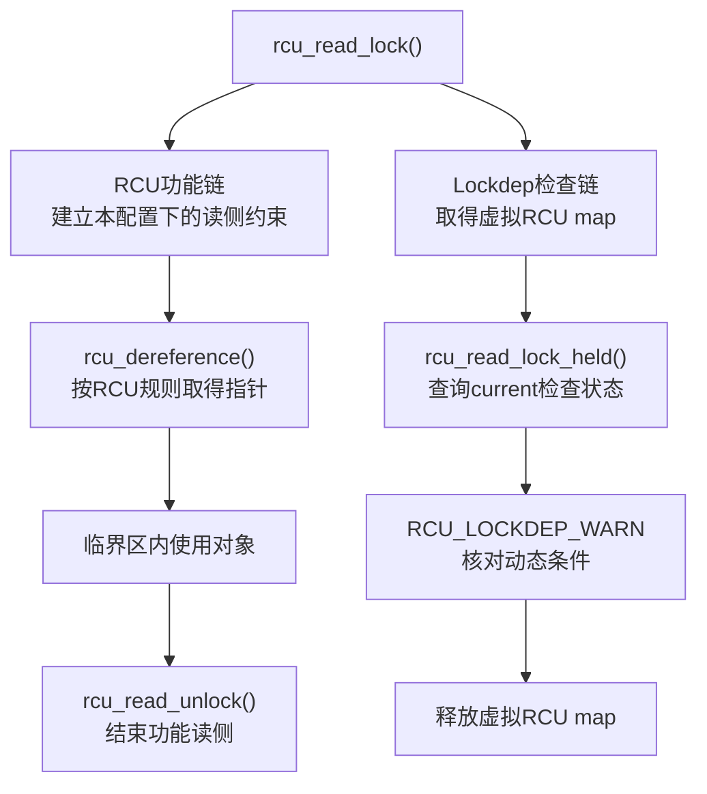
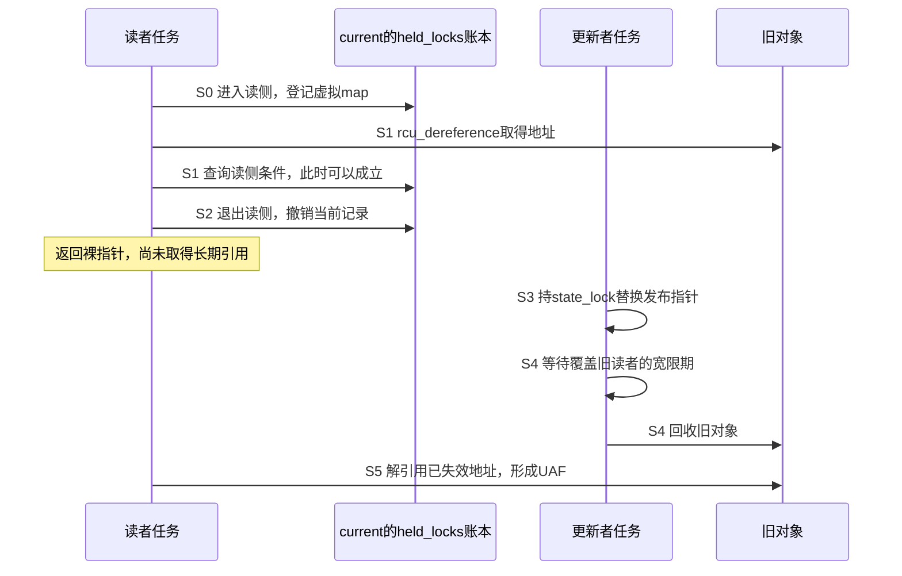

# 第7章\_RCU与子系统检查适配

## 7.1\_没有实体mutex为何仍需要动态契约

上一章的自定义原语接入容易让人形成另一个错误模型：只有真正会互斥等待的锁，才需要 `lockdep_map`。RCU 说明动态检查还有第二种用途——表达 **逻辑保护域和调用条件**。

`rcu_read_lock()` 不表示读者独占一把实体 mutex，也不让其他读者等待。但很多 RCU 访问器仍要求 current 位于认可的读侧临界区，或者调用者能提供另一项明确保护条件。如果这些条件只写成注释，错误路径即使在测试中执行，也缺少统一的动态检查入口。

RCU 因此为受支持读侧风味建立虚拟 lockdep maps，把进入和退出读侧范围映射为检查事件。这个映射服务于诊断，不把 RCU 改造成 mutex，也不参与宽限期怎样等待旧读者。

## 7.2\_同一次API调用的两条因果链



必须分清箭头承担的责任：

- 功能链决定读者语义、内存顺序，以及更新者何时可以结束对象生命周期；
- 检查链让 current 的逻辑读侧范围能够被查询和断言；
- 关闭 `CONFIG_PROVE_RCU` 或 Lockdep 只移除相应诊断，不能取消 RCU 功能义务。

## 7.3\_业务锁怎样成为RCU保护条件

贯穿设备的更新者用 `state_lock` 串行替换 RCU 指针。下面是更新路径片段，不是可独立加载的模块：约定所有更新者都持有同一把锁，`new_state` 已初始化完成，设备在调用期间仍存活，`demo_retire_state()` 负责等待旧读者退出后再回收旧对象。

```c
static void demo_replace_state(struct demo_device *dev,
			       struct demo_state *new_state)
{
	struct demo_state *old_state;

	mutex_lock(&dev->state_lock);
	old_state = rcu_replace_pointer(dev->state, new_state,
					lockdep_is_held(&dev->state_lock));
	mutex_unlock(&dev->state_lock);

	/* 旧对象的等待与回收仍按RCU生命周期协议处理。 */
	demo_retire_state(old_state);
}
```

这里的数据流不是“Lockdep 让替换变安全”，而是：

```text
mutex_lock(state_lock)
  → 功能mutex真正建立更新者互斥
  → 标准hook把state_lock实例写入current held账本

lockdep_is_held(state_lock)
  → 只查询current账本
  → 形成保护条件c

rcu_replace_pointer(..., c)
  → RCU检查层核对c
  → 指针访问和发布仍由RCU功能宏完成
```

`c` 是调用者给出的保护理由，不是同步原语。传常量 `1` 表示无条件声明理由成立，放弃了动态核对；它不会创建 mutex、内存屏障、宽限期或引用计数。

## 7.4\_检查通过为何仍可能UAF

下面的读者可以通过“当前位于 RCU 读侧”的动态检查，却仍把裸指针带出保护区：

```c
static struct demo_state *demo_bad_escape(struct demo_device *dev)
{
	struct demo_state *state;

	rcu_read_lock();
	state = rcu_dereference(dev->state);
	rcu_read_unlock();
	return state; /* 裸指针逃离；后续使用没有长期所有权。 */
}
```

在检查有效且执行到相应查询的通常路径上，Lockdep 可以检查 current 的虚拟 RCU map；它不跟踪返回值保存到了哪里，也不把这个返回值自动转换成长期引用。看一次完整交错，便能知道缺口发生在哪里：



S1 的检查没有撒谎：取得指针时确实在读侧范围内。S2 结束的是临时保护，读者手中保存的地址数值却没有随之消失。更新者在 S4 履行了等待义务，也没有责任知道一个已经退出的读者仍偷偷保存着地址。错误在于读者把“曾经受保护”当成了“以后一直有效”。

如果只是读取几个字段，最小修复是把字段复制安排在 S2 之前，退出后只使用副本；这仍要求字段自身满足既定并发访问协议。若必须把对象交给后续工作，则需要在临时保护结束前按该对象的协议取得长期引用，并在使用结束后归还。不能简单在 S2 之后补一次引用计数增加：引用计数所在的对象本身就可能已经释放。延长读侧范围也要遵守该读侧风味的上下文约束，不能随意把可睡眠工作塞进去。

所以“调用条件通过”不能推出“对象生命周期正确”。RCU 场景中的类型、动态上下文和生命期分工见 [RCU 类型语义、Sparse 与 Lockdep](../rcu/P23_RCU_类型语义_Sparse与Lockdep.md#23.7_三类检查不能互相替代)。

## 7.5\_从通用Lockdep到RCU实现的证据边界

本专题只展开 Lockdep 产生和查询影子状态的通用机制；RCU 虚拟 maps 与告警宏继续在 RCU 源码专题唯一展开：

首次追踪版本实现时，从 [Lockdep 源码总导读](../../../../../research/source_reading/lockdep/navigation/P01_Linux_6.12_Lockdep源码导读.md)定位查询层，再按下面的检查点进入实现。这里采用 NXP Linux 6.12.20 固定提交 `dfaf2136deb2af2e60b994421281ba42f1c087e0`，不把本地实验提交当作依据。

| 检查点 | 本章关心的问题 | 权威实现入口 |
| --- | --- | --- |
| `lockdep_is_held(&state_lock)` | current 的业务锁实例如何变成条件 | [`lock_is_held_type()` 当前持锁查询](../../../../../research/source_reading/lockdep/source_explanations/P04_Linux_6.12_Lockdep查询注解与配置源码实现.md#4.2_lock_is_held_type当前持锁查询) |
| `rcu_lock_acquire()` / `rcu_lock_release()` | RCU 读侧与 callback 怎样映射到四个虚拟 map | [RCU Lockdep适配层源码实现](../../../../../research/source_reading/rcu/source_explanations/P04_Linux_6.12_RCU_Lockdep适配层源码实现.md#4.1_实现所有权与读者目标) |
| `RCU_LOCKDEP_WARN()` | RCU 访问器怎样消费动态条件 | [`RCU_LOCKDEP_WARN()` 检查适配层](../../../../../research/source_reading/rcu/source_explanations/P01_Linux_6.12_RCU_公共接口与检查机制源码详解.md#1.6_RCU_LOCKDEP_WARN检查适配层) |

先用 [Lockdep 查询适配与诊断模块导读](../../../../../research/source_reading/lockdep/navigation/P04_Linux_6.12_Lockdep查询适配与诊断模块导读.md#4.4_RCU适配链)理解通用查询到 RCU 的连接，再进入 [RCU Lockdep适配模块源码概念导读](../../../../../research/source_reading/rcu/navigation/P12_Linux_6.12_RCU_Lockdep适配模块源码概念导读.md#12.1_模块问题与实现所有权)阅读 RCU 自己的四个实例和接入路径。

还要防止把诊断查询写进业务控制流。在该版本未启用 `CONFIG_DEBUG_LOCK_ALLOC` 的分支中，普通 `rcu_read_lock_held()` 直接返回 1；这表示该查询无法提供所期待的动态核对，而不是内核替调用者进入了读侧。不能据此决定是否调用 `rcu_read_lock()`，也不能据此决定是否释放对象。

`RCU_LOCKDEP_WARN(c, s)` 的 `c` 则是 **应当告警的条件**，与访问器接收的“保护理由成立”条件方向相反。启用 `CONFIG_PROVE_RCU` 时，它先检查诊断有效性，再判断 `c`，随后重新检查有效性，并使用该调用点的静态 `__warned` 限制重复报告；未启用时没有这项运行时告警。因此，同一调用点第二次没有打印，不表示第二次行为已经正确。配置开关、检查器是否有效、路径是否实际执行、该调用点是否已报告，都属于解读沉默时必须补齐的条件。

## 7.6\_其他逻辑保护域怎样判断能否适配

不是任何 `enter()/exit()` 都适合伪装成锁。一个子系统要建立虚拟 lockdep map，至少要先回答：

1. 逻辑域的进入、退出、嵌套和迁移语义是否明确；
2. 它表达的是实际阻塞依赖，还是仅供条件查询的同步域，取得类型是否忠实；
3. 正常、失败、超时和异常退出是否都能成对上报；
4. map/key 的生命周期和归类是否稳定；
5. 查询结果是否只用于诊断，关闭检查后功能正确性是否仍成立；
6. 文档能否指出真实功能状态存在哪里，避免把虚拟 map 当成功能实现。

如果这些问题没有答案，虚拟 map 只会向全局图注入错误事实，可能同时制造误报和漏报。

## 7.7\_本章结论

先用三个问题检查自己是否区分了这些责任：

1. 将 `rcu_replace_pointer()` 的保护条件改成常量 1，同时删除外面的 mutex，是否仍能串行更新？不能；常量只撤掉了动态核对，更新者之间的功能互斥已丢失。
2. 在上面的 S2 与 S3 之间增加一次 `lockdep_is_held()` 查询，能否修复 S5？不能；查询既不延长读侧，也不取得长期引用。
3. 关闭检查后 `rcu_read_lock_held()` 返回 1，能否删掉实际读侧入口？不能；退化返回值是诊断能力边界，功能保护义务保持不变。

RCU 使用虚拟 lockdep map 表达动态读侧域，业务 mutex 又可以通过 current 查询形成访问条件。两者只提供检查证据：真正的互斥、发布、读侧约束、宽限期和回收仍由各自功能机制承担；条件通过也不能证明裸指针没有逃逸。

有了机制与 API，下一步必须让它们在调试内核中真正运行。下一章从配置矩阵开始，构造不会真实卡死的最小顺序反转实验，并把一份报告还原成“本次新边＋历史路径＋当前账本”。

上一篇：[查询、断言、pin 与自定义原语接入](P06_查询_断言_pin与自定义原语接入.md)。

下一篇：[配置、亲手实验与报告解读](P08_配置_亲手实验与报告解读.md)。
