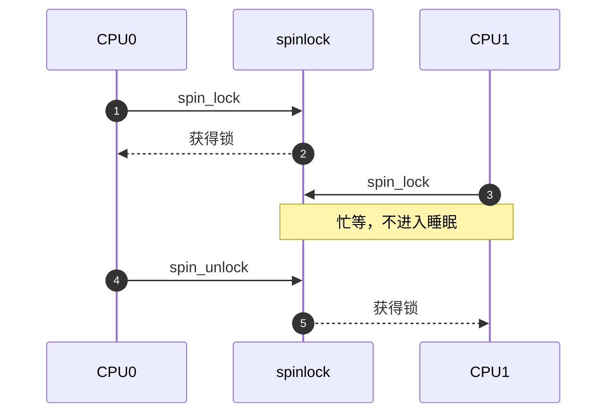
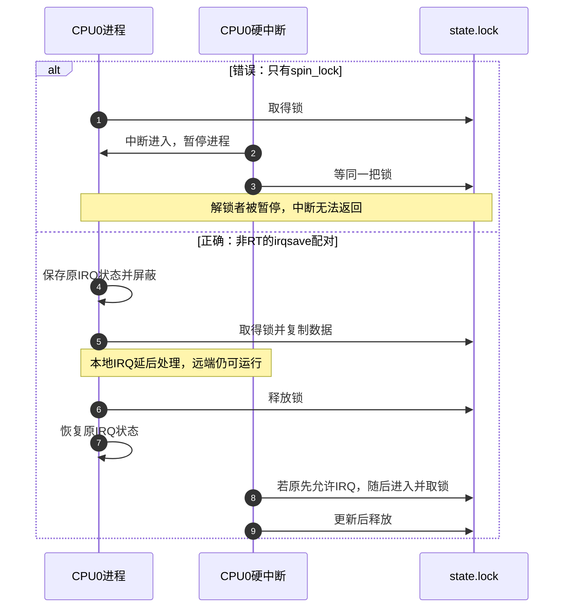
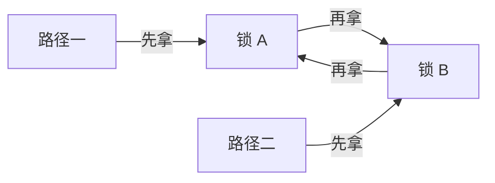

# 第1章\_自旋锁

## 1.1\_自旋锁解决什么问题

设想一个驱动保存“最近一次采样的值”和“已接收的样本数”。硬中断每收到一个样本便更新两者，进程上下文读取它们用于显示。即使每个字段都能单独读取，读者仍可能先读到新值、再读到旧计数。需要保护的不是某一条赋值，而是这两个字段共同表达的一次更新。

让所有访问者先取得同一把锁，可以把更新与读取排成先后。可是硬中断不能像普通任务那样，为等待 mutex 而交给调度器睡眠：它还必须完成本次中断处理并返回被打断的执行流。于是本章先建立 **非 PREEMPT_RT 内核中的普通自旋锁**：竞争者留在当前执行路径等待锁状态改变，取得资格后才访问数据。没有竞争这把锁的 CPU 继续正常执行，它不是“暂停所有 CPU”。PREEMPT_RT 是改变抢占与锁实现的实时内核配置，其差异在 1.6 节单独对照；不能把下面的忙等和关中断描述直接套到该配置的 `spinlock_t`。

下图把锁状态与本地中断状态分开；IRQ（Interrupt Request，中断请求）在这里指可由本地中断屏蔽约束的硬中断，不包括不可屏蔽中断 NMI（Non-Maskable Interrupt）。




图中的等待不需要任务唤醒队列；锁实现通过共享锁状态和体系结构机制传播释放信息，具体是否使用事件等待指令留到实现章。它付出的成本是竞争 CPU 不能去执行本路径之后的工作。因此持锁期间不得调用可能睡眠的接口，也应避免长循环、慢速总线访问和不可控的外部等待。短并非某个通用微秒数，而是临界区具有小且可控的工作量，持有者不依赖等待者才能完成。

## 1.2\_先判断竞争来自哪里

下表先按非 RT 内核整理。所谓 softirq 是内核推迟执行的一类软中断工作，hardirq 是直接响应硬件中断的执行上下文；前者的本地约束不等于后者的中断屏蔽。

| 共享双方 | 最低要求 |
| --- | --- |
| 两个进程上下文，临界区可睡 | 通常优先 mutex，不必用自旋锁 |
| 进程上下文与 softirq | 进程侧需要 `spin_lock_bh()`；softirq 侧使用匹配的锁 |
| 进程上下文与同一设备硬中断 | 进程侧通常用 `spin_lock_irqsave()`；中断侧锁同一对象 |
| 两个 CPU 上的原子上下文 | 普通或 raw 自旋锁，具体取决于 PREEMPT_RT 和子系统规则 |
| 仅当前 CPU 的每 CPU 数据 | 优先考虑 `local_lock`、禁抢占或子系统专用接口 |

仅仅“在中断处理函数里”不意味着必须关闭本地中断；关键是持锁路径会不会被同一 CPU 上另一个也要拿这把锁的中断上下文打断。

## 1.3\_基本接口

```c
#include <linux/spinlock.h>
#include <linux/types.h>

struct sample_snapshot {
    unsigned int value;
    unsigned int count;
};

struct sample_state {
    spinlock_t lock;
    struct sample_snapshot data;
};

static inline void sample_init(struct sample_state *state)
{
    /* 在注册中断和发布对象之前完成初始化。 */
    spin_lock_init(&state->lock);
    state->data.value = 0;
    state->data.count = 0;
}

static inline void sample_record(struct sample_state *state, unsigned int value)
{
    unsigned long flags;

    /* 非 RT 示例：采样路径只提交已经取得的数值。 */
    spin_lock_irqsave(&state->lock, flags);
    state->data.value = value;
    state->data.count++;
    spin_unlock_irqrestore(&state->lock, flags);
}

static inline struct sample_snapshot sample_read(struct sample_state *state)
{
    struct sample_snapshot result;
    unsigned long flags;

    spin_lock_irqsave(&state->lock, flags);
    result = state->data;
    spin_unlock_irqrestore(&state->lock, flags);
    /* 后续格式化、用户复制等工作使用局部副本，在锁外完成。 */
    return result;
}
```

这是可嵌入驱动的完整状态辅助代码，不是可单独加载的驱动：设备中断注册、确认和注销由驱动负责。对象必须先初始化、再交给调用者，并在全部调用者退出后才能释放。`sample_record()` 不在锁内等待硬件；`count` 是无符号计数，长期运行允许回绕，不能把它当作永不重复的身份编号。

先手工预测一次交错：初始 `(value,count)=(0,0)`，采样路径准备写入 42。若读取发生在整个更新之前，得到 `(0,0)`；发生在更新之后，得到 `(42,1)`；不能在赋值和递增之间进入。若把 `sample_read()` 中的锁去掉，读到 `(42,0)` 就重新成为可能。锁保护的是 **两字段的对应关系**，不是保证每个读者都看见“最新一次”或保证随后数据不再变化。

成功获取锁提供 acquire 语义，释放锁提供 release 语义，使使用同一把锁的临界区按锁序观察数据。它们不能被描述成每个操作各自等价于完整 `smp_mb()`。

锁只保护所有参与者一致遵守的状态。若某条访问路径绕过锁，锁不会自动使它安全。

## 1.4\_中断与软中断变体

下面两种包装都操作同一把跨 CPU 锁，新增的是当前 CPU 的本地执行约束：先看硬中断重入，再看 softirq 重入，不能把后缀误解成另一套全局锁。

### 1.4.1\_硬中断共享

```c
unsigned long flags;

spin_lock_irqsave(&m->lock, flags);
update_state(m);
spin_unlock_irqrestore(&m->lock, flags);
```

`irqsave` 保存并关闭当前 CPU 的本地硬中断，再取得全局锁；`irqrestore` 恢复进入前状态。它不关闭其他 CPU 的中断。

为什么必须在取锁之前屏蔽？若进程先取锁、中断随后抢入，中断会等这把锁；但解锁语句属于被它打断的进程，只有中断返回后才可能执行。双方在同一 CPU 上形成不能前进的环。把临界区缩到两条语句也不能消除这个窗口。



`flags` 是本次调用的局部保存值。进入时已经关中断，退出后也应保持关闭；进入时打开，退出才恢复打开。不能用无条件开中断代替恢复，也不能共享一个全局 `flags` 让不同 CPU 覆盖它。即便屏蔽了本地 IRQ，远端 CPU 仍可能访问 `state`，所以锁本身仍不可省略。

如果确定进入时本地中断一定开启并且调用层次固定，可以使用 `spin_lock_irq()`，但通用嵌套代码更适合 `irqsave/irqrestore`。

### 1.4.2\_softirq\_共享

```c
spin_lock_bh(&m->lock);
update_state(m);
spin_unlock_bh(&m->lock);
```

`_bh` 在当前 CPU 禁止 softirq/bottom-half 执行，避免进程上下文持锁时被本地 softirq 打断并自旋死锁。它不等于关闭硬中断。

## 1.5\_锁顺序与死锁



所有路径必须遵守统一锁序。中断共享还要检查“进程持锁时被中断，中断再次取同锁”的自死锁。建议：

- 给锁定义明确保护对象和嵌套顺序；
- 缩小临界区，但不要把必须原子的状态更新错误拆开；
- 使用 lockdep 检查锁依赖；
- 不在持锁期间调用回调未知的外部代码。

## 1.6\_spinlock\_与\_raw\_spinlock

| 维度 | `spinlock_t` | `raw_spinlock_t` |
| --- | --- | --- |
| 普通非 RT 内核 | 真正自旋、不可睡 | 真正自旋、不可睡 |
| PREEMPT_RT | 通常转换为可抢占的 RT 锁语义，不再等价于关闭抢占 | 保持严格自旋、关闭抢占的原子语义 |
| 主要使用者 | 普通内核和驱动共享状态 | 调度器、时钟、IRQ core 等最低层代码 |
| 选择原则 | 默认选择 | 只有上下文和子系统规则明确要求时使用 |

不要为了“更快”把普通驱动锁改成 raw。raw 锁会扩大不可抢占区并损害实时延迟；它是语义工具，不是性能等级。

PREEMPT_RT 会把多数硬中断线程化，线程化 handler 可以使用适合其上下文的普通同步原语；真正 hardirq/NMI 和明确的 raw 上下文仍必须遵守不可睡规则。不能简单写成“所有中断处理程序和底半部一律 raw”。NMI 还可能打断已关闭普通中断的路径，不能认为 irqsave 自动解决它的同锁重入。

尤其要重新解释后缀：在 PREEMPT_RT 下，普通 `spin_lock_irqsave()` 不再负责关闭 CPU 硬中断；`_bh` 仍约束 softirq，持锁任务可被抢占但不能迁移。锁内部可以阻塞，不代表持锁代码因此可以任意调用 `msleep()`。本章的硬中断共享示例明确限定非 RT；移植时先确认该 handler 是否已线程化、是否还存在真正 hardirq 访问，再按子系统规则选择锁，而不是只替换类型名。

## 1.7\_UP\_构建中的退化

[SMP、UP 与 `CONFIG_SMP` 的体系结构和构建边界](../../../../foundations/computer_architecture/cache_coherence/P01_缓存一致性问题与缓存行.md#1.1.3_Linux中的CONFIG_SMP表示构建能力)已经说明：`CONFIG_SMP=n` 时不存在另一个 CPU 竞争同一锁，很多自旋锁硬件操作会被消除。但为了防止当前任务被抢占后由另一执行流访问同一状态，锁宏仍可能体现为抢占控制；`_irqsave`、`_bh` 变体仍分别承担本地中断或 softirq 约束。

所以“UP 自旋锁完全无作用”和“UP 自旋锁总是关闭抢占”都过于绝对，具体行为还取决于抢占配置和接口变体。

## 1.8\_读写自旋锁

`rwlock_t` 允许多个读者同时持锁、写者独占；在非 RT 内核属于自旋锁，RT 下也会改变实现语义。读者能同时执行不等于读者之间没有通信：读侧取得和释放仍须维护读者状态，写者必须等已有读者退出。若读取只有复制两个整数那么短，维护这个状态的代价可能超过并行读取节省的时间；若读者长时间不退出，写者即使已排队也不能立即修改数据。公平性必须按实现和配置判断，不能把“所有读写锁都会饿死写者”当作选择依据。

```c
read_lock(&m->lock);
snapshot = m->state;
read_unlock(&m->lock);

write_lock(&m->lock);
m->state = new_state;
write_unlock(&m->lock);
```

需要睡眠的读写临界区使用 `rw_semaphore`；需要旧对象延迟回收时考虑 RCU；只需一致数值快照且可重试时考虑 seqcount。

## 1.9\_MMIO\_与锁的边界

锁可以串行化驱动的软件访问路径，但不保证 posted MMIO write 已到达设备，也不代替 DMA 所有权转换。跨 CPU 持锁写同一设备时还可能涉及 `mmiowb()` 的架构语义。参见 [MMIO 访问顺序](../../../io_model/mmio/P01_MMIO_访问顺序与屏障.md)。

## 1.10\_常见错误

| 错误 | 后果 |
| --- | --- |
| 持锁调用 `msleep()`、阻塞 I/O、mutex 等 | 原子上下文睡眠或死锁 |
| 进程侧用 `spin_lock()`，同锁也在本地 IRQ 使用 | 被中断后自死锁 |
| `irqsave` 的 flags 跨函数、跨 CPU 或错误配对 | 中断状态恢复错误 |
| 把 acquire/release 称为完整全屏障 | 错误推导跨锁顺序 |
| 临界区内轮询设备完成 | 长时间阻塞其他竞争者 |
| 普通驱动无依据使用 raw 锁 | 扩大不可抢占延迟 |
| 只给写者加锁，读者裸读复合状态 | 数据竞争与不一致快照 |

## 1.11\_选择核对表

- 临界区是否绝对不会睡眠，且足够短？
- 竞争路径来自进程、softirq、hardirq、NMI 还是其他 CPU？
- 是否需要 `_bh` 或 `_irqsave` 防止本地递归竞争？
- 所有参与者是否锁同一对象并遵守统一锁序？
- PREEMPT_RT 下该上下文允许哪类锁？子系统是否明确要求 raw？
- 是否真正需要读写锁，还是 mutex、RCU、seqcount 更合适？

试着修改本章实例，并先给出预测，再检查原因：

1. 只给 `sample_record()` 加锁，能否保证快照？不能，读者没有参加同一互斥协议，仍可插入两次写之间。
2. 把耗时格式化移出锁，是否破坏一致性？只要使用锁内取得的局部副本即可；若锁外重新读取 `state->data`，就撤销了这项保证。
3. 把 `irqrestore` 换成无条件开中断有什么问题？调用者原先关闭的中断会被提前开启，破坏外层执行约束。
4. 数据只在普通进程上下文使用，而且更新需要阻塞 I/O，还应沿用这把锁吗？先重新设计临界区；必须睡眠的互斥工作进入下一章的 mutex，而不是让竞争 CPU 自旋等 I/O。

现在可以解释一把锁怎样保护业务不变量，以及本地中断屏蔽为何仍有独立职责；还没有证明所有配置采用同一个锁字，也没有解决对象释放与等待者退出问题。版本化核对从[锁源码总阅读索引](../../../../../research/source_reading/locking/navigation/P01_Linux_6.12_锁源码总阅读索引.md#1.1_版本边界与阅读任务)进入，具体实现和实时分支由后续章节展开。

下一篇：[互斥锁与读写信号量](P02_互斥锁与读写信号量.md)。
