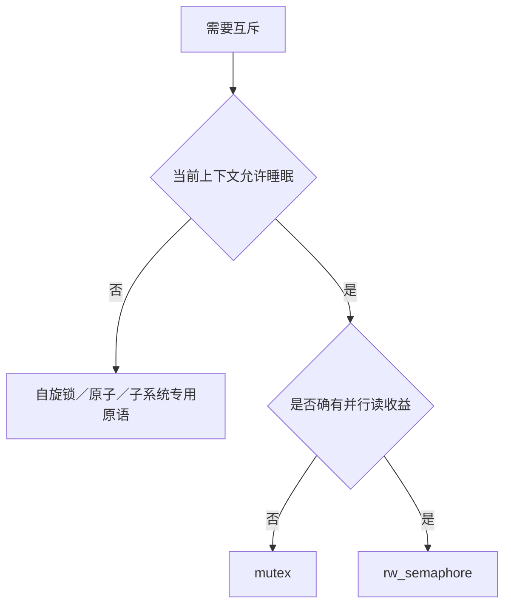
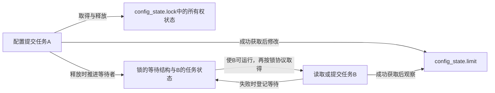
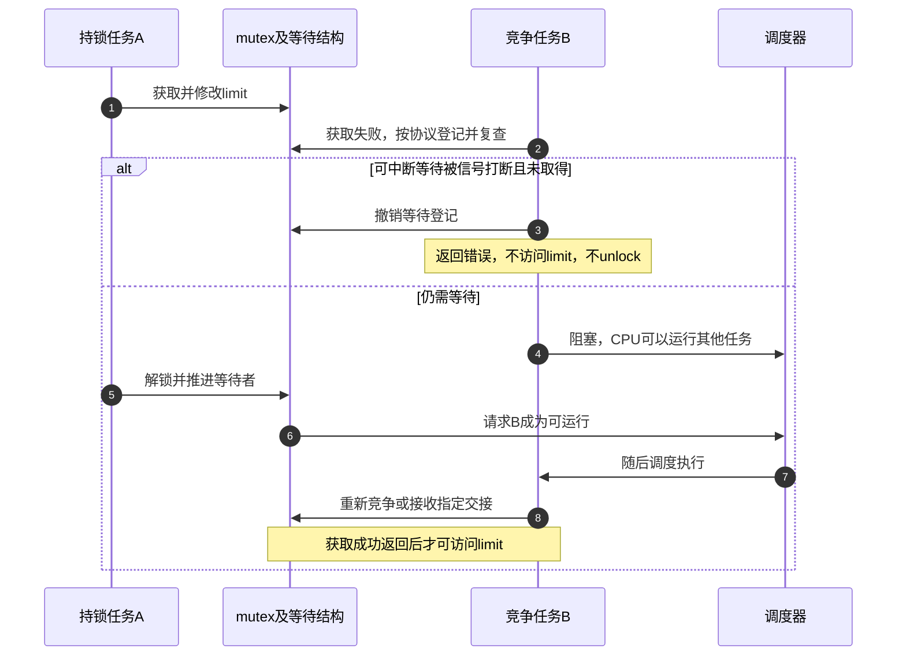

# 第2章\_互斥锁与读写信号量

## 2.1\_可睡眠锁的适用范围

上一章的采样临界区只复制或修改几个字段，自旋让这次互斥很直接。现在换成两个管理任务提交设备配置：一次操作可能等待设备响应。若竞争者一直占住 CPU 等待，设备并不会因此提前完成；我们希望等待任务暂时离开 CPU，由调度器运行其他任务，再在锁可能可用时让它回来。

`struct mutex` 提供单一任务持有的排他锁，`struct rw_semaphore` 提供多读单写的可睡眠锁。允许睡眠是调用上下文的要求，不是承诺每次获取都调度：无竞争可以直接成功，实现也可能短暂乐观自旋。它们适用于允许睡眠的任务上下文，临界区短也可以使用；不能在真正的硬中断、软中断、不可屏蔽中断、禁抢占区或严格自旋临界区取得。PREEMPT_RT 的普通自旋锁语义变化不构成任意嵌套睡眠锁的许可，嵌套还须遵守锁类别和子系统规则。

这章先解决应用契约：保护哪些状态、失败后是否持锁、读改写之间怎样重新判断。后续统一周期及慢路径再把等待与所有权落实到 Linux 字段。



## 2.2\_mutex\_基本规则

```c
#include <linux/errno.h>
#include <linux/mutex.h>

struct config_state {
    struct mutex lock;
    unsigned int limit;
};

static inline void config_init(struct config_state *state)
{
    /* 发布对象前完成初始化，此后所有访问使用同一把锁。 */
    mutex_init(&state->lock);
    state->limit = 10;
}

static inline int config_change(struct config_state *state,
                                unsigned int expected, unsigned int replacement)
{
    int ret;

    if (replacement == 0)
        return -EINVAL;
    ret = mutex_lock_interruptible(&state->lock);
    if (ret)
        return ret; /* 获取被打断，没有锁可释放。 */
    if (state->limit != expected) {
        ret = -EAGAIN; /* 旧判断失效，由调用者决定重读还是报告冲突。 */
    } else {
        state->limit = replacement;
        ret = 0;
    }
    mutex_unlock(&state->lock);
    return ret;
}

static inline unsigned int config_read(struct config_state *state)
{
    unsigned int result;

    mutex_lock(&state->lock);
    result = state->limit;
    mutex_unlock(&state->lock);
    return result;
}
```

这是完整的内核状态辅助代码，不是独立驱动；调用者须在允许睡眠的任务上下文持有有效对象地址，并保证辅助函数返回前对象不会释放。这里尚未接入硬件，先把配置提交的互斥规则讲清楚。`expected` 的含义是“当前数值仍符合本次条件”，不是历史版本号：若数值改走又改回来，本接口允许提交；需要检测任何中间变更时必须另设有明确回绕规则的版本协议。

两个任务都读到 10，分别要改成 20、30。谁先在锁内把10改走，另一个就得到 `-EAGAIN`；不会因为它较早读过10就覆盖别人刚提交的结果。这个例子也说明：一次成功的读取只保证得到那一刻的值，不预订后续写入权。

mutex 有所有者语义：由取得锁的任务释放，不能把它当跨上下文事件通知。递归获取同一 mutex 会死锁；内核 mutex 不是递归锁。

获取提供 acquire 语义，释放提供 release 语义。锁内共享字段不需要再机械添加 ONCE 或屏障。

## 2.3\_等待变体与返回值

| 接口 | 等待行为 | 返回值 |
| --- | --- | --- |
| `mutex_lock()` | 不响应普通信号，直到取得锁 | 无 |
| `mutex_lock_interruptible()` | 可被信号打断 | 0 成功，负错误码失败 |
| `mutex_lock_killable()` | 可被致命信号打断 | 0 成功，负错误码失败 |
| `mutex_trylock()` | 不睡眠，立即尝试 | 非零成功，0 失败 |

```c
ret = mutex_lock_interruptible(&m->lock);
if (ret)
    return ret;             /* 未持锁，不能 unlock */

ret = do_work(m);
mutex_unlock(&m->lock);
return ret;
```

可中断接口失败时没有取得锁。所有异常路径都必须只在确实持锁时解锁。

`mutex_trylock()` 的成功方向和可中断接口相反，不能把同一个 `if (ret)` 模板机械复制过去。立即返回也不把它变成适合中断的原语：还必须考虑解锁路径、调试配置和所有者契约。此处统一只在允许使用mutex的任务上下文尝试。





图是应用层的正常/取消分支，不规定某个配置的具体入队函数。信号与成功获取同时竞争时，以获取接口的实际返回值判断；不能根据“曾经发过信号”自行补一次解锁。

## 2.4\_锁外执行慢操作

能睡眠不代表可以无限延长临界区。固件加载、用户拷贝、设备长轮询和回调外部代码可能阻塞很久，应先判断哪些状态必须原子更新：

1. 锁内验证状态并记录“操作进行中”；
2. 锁外执行慢操作；
3. 锁内提交结果并清理状态；
4. 必要时唤醒等待者。

拆锁时必须引入明确的中间状态或引用保护，否则对象可能在锁外操作期间被 remove 路径释放。

例如管理任务先在锁内把 `busy` 设为真，第二个提交者看见它便返回忙或按另一个明确协议等待。第一任务在锁外执行设备操作，回来后再在锁内提交结果、清除busy。这里busy本身也必须由同一把锁保护；失败路径同样要清理，停机路径须知道在途操作仍存在。若允许第二任务同时修改目标配置，还需要版本或请求身份，避免第一任务的旧结果覆盖新请求。仅仅把 `unlock()` 上移几行并没有自动建立这些保证。

反过来，若事务要求其他管理操作在设备响应前都不能进入，且延迟可接受、没有相互等待的调用链，保留mutex覆盖整个可睡事务可以更简单。拆锁是更复杂的状态协议，应由实际并发需求推动。

## 2.5\_读写信号量

`struct rw_semaphore` 允许多个读者同时持锁，写者独占，并在竞争时睡眠：

```c
down_read(&m->sem);
snapshot = m->state;
up_read(&m->sem);

down_write(&m->sem);
m->state = new_state;
up_write(&m->sem);
```

| 接口 | 语义 |
| --- | --- |
| `down_read()/up_read()` | 可睡眠读锁 |
| `down_write()/up_write()` | 可睡眠写锁 |
| `down_read_interruptible()` | 可被信号打断的读锁 |
| `down_write_killable()` | 可被致命信号打断的写锁 |
| `down_read_trylock()/down_write_trylock()` | 非阻塞尝试 |
| `downgrade_write()` | 原子地把写锁降为读锁 |

rwsem 的读并发只有在读临界区足够长、读者较多且写竞争较低时才可能获益。短临界区使用 mutex 往往更简单，缓存和调度开销也可能更低。

上面的片段假定对象在发布前已用 `init_rwsem(&m->sem)` 初始化。它表达的是把同一份数据切换到读写协议，不是在原mutex外再套一个互不关联的锁。若只复制一个整数，多读并行节省的工作很少；读者取得/归还份额仍要协调共享锁状态，写者又必须等全部已有读者退出。只有并行读取的收益能抵消这些维护成本时，才值得选择rwsem。

读锁也不能递归取得：当写者已排队时，后续读获取可能必须等待写者，而该任务之前的读份额又阻止写者继续。需要跨调用共享读锁范围时，应明确由哪一层取得和释放，而不是在每个辅助函数里再取一次。

## 2.6\_为什么通常不能升级读锁

两个任务都持有读锁并等待升级为写锁时，会互相等待对方释放读锁。因此 rwsem 提供安全的写降读 `downgrade_write()`，但没有通用“读锁原地升级写锁”接口。

需要升级时通常应：

1. 在读锁下读取版本或状态；
2. 释放读锁；
3. 获取写锁；
4. 重新验证状态；
5. 再执行修改。

释放与重新获取之间存在竞争窗口，重新验证不可省略。

把上一节的10、20、30代入即可复现窗口：A在读锁下看见10；A释放读锁；B取得写锁并写20；A随后取得写锁。写锁只阻止 **现在起** 的其他访问，不能把值倒回10。A必须在写锁内重新检查当前值，如同 `config_change()` 的条件提交。若这时条件不满足，应取消或重新计算，不可沿用旧读阶段生成的覆盖操作。

写降读不同：降级过程中没有先放空再重新获取的窗口，调用者保留读保护，其他读者可以加入，写者仍须等待。降级后必须配对 `up_read()`，不能继续写共享状态，也不能再用 `up_write()` 释放。

## 2.7\_mutex\_rwsem\_与\_semaphore

| 原语 | 核心语义 | 首选场景 |
| --- | --- | --- |
| mutex | 单一任务拥有排他临界区 | 普通可睡互斥 |
| rw_semaphore | 多读单写的可睡临界区 | 确有并行读收益 |
| semaphore | 可用资源额度计数 | 资源池或并发额度 |
| completion | 工作已经完成 | 跨上下文完成通知 |

二值 semaphore 虽可形成互斥，但新代码应优先使用 mutex，因为所有者、调试和语义更清晰。

## 2.8\_生命周期与停机

锁只能保护对象仍然存在时的并发访问，不能单独证明对象不会被释放。`remove()` 路径通常需要：


文件描述符、工作队列、IRQ 和异步回调可能在锁外持有对象，需要 kref、RCU、设备核心引用或明确的 drain 协议配合。

特别注意，另一任务已经成功取得mutex，不等于前一任务的 `mutex_unlock()` 已完全返回。解锁内部发布所有权之后仍可能访问锁对象；对象必须至少存活到所有相关解锁调用返回。停机若持有某把锁等待worker退出，而worker退出也需要该锁，仍会死锁；“可以睡眠”并不消除等待依赖环。

## 2.9\_常见错误

| 错误 | 后果 |
| --- | --- |
| 在中断或自旋锁内获取 mutex/rwsem | 原子上下文睡眠 |
| 忽略 interruptible/killable 返回值 | 未持锁却访问或解锁 |
| 同一任务递归获取 mutex | 自死锁 |
| 读锁下修改共享不变量 | 其他读者并发观察不一致状态 |
| 释放读锁后直接按旧判断写入 | 检查与使用之间状态已改变，旧判断失效 |
| 为“读多”机械使用 rwsem | 更高开销且写延迟恶化 |
| 锁外慢操作不保活对象 | remove 并发导致释放后访问 |

## 2.10\_核对表

- 当前上下文是否允许睡眠？
- 临界区需要排他，还是确有多读并行收益？
- 可中断获取失败时是否立即返回且不解锁？
- 是否存在固定锁序和 lockdep 可验证的嵌套？
- 拆分慢操作后，状态和对象生命周期如何保持？
- remove/错误路径是否先阻止新用户，再等待旧用户退出？

完成本章后可以用三个修改检查理解：把 `config_change()` 的失败分支错误地解锁，会操作自己没有持有的锁；把条件比较移到锁外，会重新打开覆盖窗口；把mutex换成rwsem却在读锁内更新limit，会允许其他读者同时读写。三者分别破坏所有权、判断与提交的一体性、读写角色契约，不能靠额外加一个屏障修复。

版本化入口见[锁源码总阅读索引](../../../../../research/source_reading/locking/navigation/P01_Linux_6.12_锁源码总阅读索引.md#1.1_版本边界与阅读任务)。现在已经知道何时能返回成功、何时必须放弃；下一章把快路径、登记、等待与交接放进统一状态周期，再追到Linux的具体实现。

上一篇：[自旋锁](P01_自旋锁.md)。

下一篇：[锁的统一状态与通信周期](P03_锁的统一状态与通信周期.md)。
