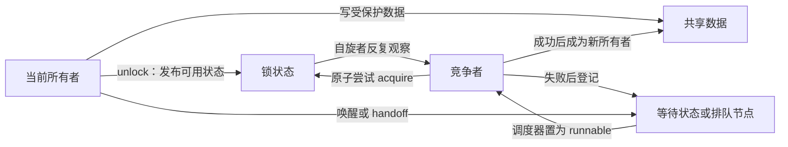
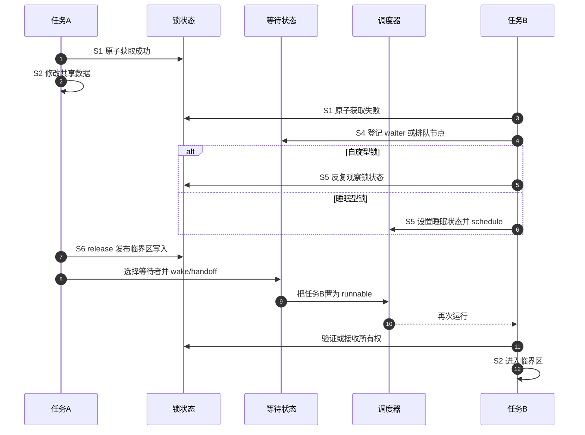

# 第3章\_锁的统一状态与通信周期

## 3.1\_上一章留下的问题

[自旋锁](P01_自旋锁.md)和[互斥锁与读写信号量](P02_互斥锁与读写信号量.md)已经说明了接口怎样选，却还不能回答一个更根本的问题：竞争失败以后，锁凭什么知道谁是所有者、谁正在等待，又由谁通知下一位继续？如果只把锁理解成一个 0/1 变量，就无法解释 mutex 的等待队列、rwsem 的读者计数，也无法解释自旋锁为什么不需要调度唤醒。

## 3.2\_它不是单一状态机

一把成熟的内核锁通常由四组正交状态共同构成：

| 状态组 | 保存的问题 | 典型位置 | 主要写入者 |
| --- | --- | --- | --- |
| 所有权/可用性 | 当前能否进入、谁拥有 | 锁字或 `owner/count` | 获取者、释放者 |
| 竞争者登记 | 谁在等待、顺序如何 | wait list、队尾或排队节点 | 竞争者、释放慢路径 |
| 执行上下文 | 当前能否睡眠、IRQ/抢占状态 | 当前 CPU/任务状态 | 调用者与锁包装层 |
| 调试与依赖 | 当前任务持有什么、形成何种锁序 | Lockdep 影子状态 | acquire/release hook |

互斥正确性取决于第一组；进展和公平性需要第二组；能否使用该原语由第三组限制；第四组只验证已接入并执行过的路径，不能替代前三组的功能状态。

## 3.3\_角色与通信关系

自旋锁把“等待状态”压缩成 CPU 本地的循环和架构锁字观察；mutex/rwsem 则把竞争者登记到共享队列，再借调度器传播“可以重新竞争或已经交接”的信息。两者都需要通信，只是通信载体不同。

## 3.4\_S0到S7的完整周期

| 阶段 | 进入触发 | 状态变化 | 写入者 → 后续读取者 | 退出条件 |
| --- | --- | --- | --- | --- |
| S0 空闲 | 上一所有者释放完毕 | 锁状态表示可用 | 释放者 → 新竞争者 | 有任务尝试获取 |
| S1 快速尝试 | `lock()` | 原子地从可用改为占有 | 竞争者 → 其他竞争者 | 成功进入 S2，失败进入 S3 |
| S2 持有 | 快速或慢速获取成功 | 所有者身份/读者份额成立 | 新所有者 → unlock 与调试路径 | 临界区结束 |
| S3 竞争分类 | 快速尝试失败 | 判断自旋、排队或返回错误 | 竞争者本地状态 → 慢路径 | 选定等待策略 |
| S4 等待登记 | 需要排队 | 建立 waiter、任务状态或队列位置 | 竞争者 → 释放者 | 已可安全阻塞/等待 |
| S5 等待推进 | 自旋或 `schedule()` | 观察锁字，或任务离开 CPU | 锁状态/调度器 → 竞争者 | 收到可用证据或被信号打断 |
| S6 所有权交接 | 释放者发现竞争者 | 清 owner、选择 waiter、wake 或 handoff | 释放者 → 指定/一组等待者 | 新任务取得锁或重新竞争 |
| S7 退出与清理 | `unlock()` 或获取中止 | 移除 waiter、恢复任务/IRQ 状态、发布数据 | 当前路径 → 后续调用者 | 回到 S0 或下一所有者 S2 |

这组阶段同时覆盖自旋与睡眠锁：差异集中在 S4～S6，而不是“一个有状态、一个没状态”。

## 3.5\_端到端竞争时序

释放者通常不是把业务数据复制给等待者，而是先用 release 语义发布写入，再改变锁状态；新所有者通过 acquire 取得同一同步对象后观察这些写入。调度唤醒只解决“任务何时重新运行”，不单独承担全部数据保护。

## 3.6\_三个容易混淆的保证

1. **互斥**：在协议范围内同时只有允许数量的所有者；rwsem 的读侧允许多个读者，因此不是简单二值互斥。
2. **顺序**：成功获取与释放为使用同一锁的临界区建立规定的内存顺序；这不意味着任意锁之间自动形成全局总序。
3. **生命周期**：锁对象和被保护对象必须仍然存在；一把已经被释放内存中的锁无法保护自身。

锁也不天然保证严格 FIFO、公平或有界等待。排队结构、乐观自旋、信号中断、优先级继承和调度策略都会改变进展属性。

## 3.7\_映射到三类Linux锁

| 抽象阶段 | spinlock | mutex | rwsem |
| --- | --- | --- | --- |
| S1 快速尝试 | 架构原子锁字 | 原子 owner | 原子 count/owner |
| S4 登记 | 常由架构排队锁节点承担 | `wait_list` 中的 waiter | `wait_list` 中的读/写 waiter |
| S5 等待 | 当前 CPU 忙等 | 可先乐观自旋，再睡眠 | 可自旋或按读写类型睡眠 |
| S6 交接 | unlock 使队首/竞争者继续 | wake、handoff/pickup | 唤醒写者或一批读者 |
| 上下文限制 | 不得主动睡眠 | 必须允许睡眠 | 必须允许睡眠 |

具体字段和函数以 Linux 6.12.20 为边界，统一从[锁源码总阅读索引](../../../../../research/source_reading/locking/navigation/P01_Linux_6.12_锁源码总阅读索引.md#1.3_三条实现分支)进入。

## 3.8\_本章结论与下一问

现在可以把任意锁获取还原为“快速占有—竞争登记—等待推进—释放交接”的周期，也能区分功能状态、执行上下文和调试影子状态。下一章把该模型落到 spinlock：它看似只有忙等，Linux 实际还要组合包装层、抢占/IRQ 状态、raw 锁和架构原子实现。

上一篇：[互斥锁与读写信号量](P02_互斥锁与读写信号量.md)。

下一篇：[spinlock 实现与上下文边界](P04_spinlock实现与上下文边界.md)。
