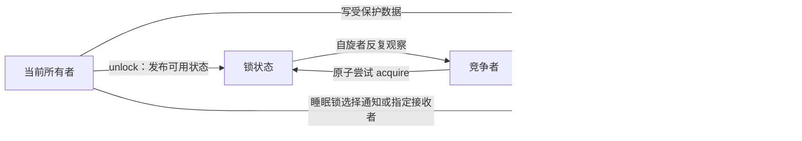
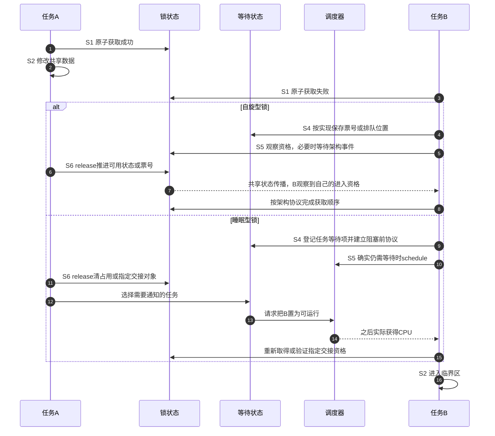

# 第3章\_锁的统一状态与通信周期

## 3.1\_上一章留下的问题

[自旋锁](P01_自旋锁.md)和[互斥锁与读写信号量](P02_互斥锁与读写信号量.md)已经说明了接口怎样选，却还不能回答一个更根本的问题：竞争失败以后，锁凭什么知道谁是所有者、谁正在等待，又由谁通知下一位继续？如果只把锁理解成一个 0/1 变量，就无法解释 mutex 的等待队列、rwsem 的读者计数，也无法解释自旋锁为什么不需要调度唤醒。

设三个任务要修改同一设备配置。A正在持锁，B到来后等待，C稍后才到。我们的目标有两层：任何时刻只能由符合协议的持有者修改配置；A退出以后，剩余任务还必须有机会取得锁。第一层需要原子争用和访问顺序，第二层还需要描述等待在哪里、释放信息怎样到达竞争者。下面先使用这个场景建立共同语言，再指出哪些阶段根本不会出现在某一类锁中。

## 3.2\_它不是单一状态机

一把成熟的内核锁通常由四组正交状态共同构成：

| 状态组 | 保存的问题 | 典型位置 | 主要写入者 |
| --- | --- | --- | --- |
| 所有权/可用性 | 当前能否进入、谁拥有 | 锁字或 `owner/count` | 获取者、释放者 |
| 竞争者登记 | 谁在等待、顺序如何 | wait list、队尾或排队节点 | 竞争者、释放慢路径 |
| 执行上下文 | 当前能否睡眠、IRQ/抢占状态 | 当前 CPU/任务状态 | 调用者与锁包装层 |
| 调试与依赖 | 当前任务持有什么、形成何种锁序 | Lockdep 影子状态 | acquire/release hook |

第一组决定谁有进入资格，但互斥正确性还依赖所有访问者遵守协议及第三组上下文约束；登记和调度规则影响进展、公平性；第四组只验证已接入并执行过的路径，不能替代功能状态。owner也不一定保存任务指针：有的锁只表达占用或票号，有的读写锁同时表达多份读者资格。不要为了统一图表给每种实现虚构一个task owner字段。

## 3.3\_角色与通信关系

原始自旋协议可以观察共享锁字、保存本地票号，或者使用排队节点；不能一律说等待状态只在CPU本地，也不能把所有自旋实现都说成有任务等待链表。mutex/rwsem的竞争路径则可能先自旋，再把任务登记到共享等待结构并调度出去。两者都需要通信，差别在状态载体和失败后的推进方式。

自旋路径的共享访问仍经过缓存一致性系统；反复原子修改同一锁字会竞争可写所有权，排队或读轮询可减少某些反复修改，却仍需传播释放状态。某些架构还用事件等待/发送降低持续轮询成本。这与调度器把一个睡眠任务置为可运行状态是两层不同动作，不能因为都有“等待、唤醒”字样就合并。

## 3.4\_S0到S7的完整周期

| 阶段 | 进入触发 | 状态变化 | 写入者 → 后续读取者 | 退出条件 |
| --- | --- | --- | --- | --- |
| S0 空闲 | 上一所有者释放完毕 | 锁状态表示可用 | 释放者 → 新竞争者 | 有任务尝试获取 |
| S1 快速尝试 | `lock()` | 原子地从可用改为占有 | 竞争者 → 其他竞争者 | 成功进入 S2，失败进入 S3 |
| S2 持有 | 快速或慢速获取成功 | 所有者身份/读者份额成立 | 新所有者 → unlock 与调试路径 | 临界区结束 |
| S3 竞争分类 | 快速尝试失败 | 判断自旋、排队或返回错误 | 竞争者本地状态 → 慢路径 | 选定等待策略 |
| S4 等待登记 | 需要排队 | 建立 waiter、任务状态或队列位置 | 竞争者 → 释放者 | 已可安全阻塞/等待 |
| S5 等待推进 | 自旋或 `schedule()` | 观察锁字，或任务离开 CPU | 锁状态/调度器 → 竞争者 | 收到可用证据或被信号打断 |
| S6 所有权交接 | 释放者发现竞争者 | 清 owner、选择 waiter、wake 或 handoff | 释放者 → 指定/一组等待者 | 新任务取得锁或重新竞争 |
| S7 退出与清理 | `unlock()` 或获取中止 | 移除 waiter、恢复任务/IRQ 状态、发布数据 | 当前路径 → 后续调用者 | 回到 S0 或下一所有者 S2 |

这些是可选阶段和分支，不是每次lock都执行的统一流水线。无竞争时S1直接进入S2，没有waiter；trylock失败可以从S3直接返回，不登记或调度。票号自旋把S4落实为领号，不必创建任务等待项；睡眠锁在阻塞前需要让登记、任务状态与再次取得尝试形成无丢失推进的协议。释放也可能直接成为可用，不一定选择等待者。

## 3.5\_端到端竞争时序

释放者通常不是把业务数据复制给等待者，而是先用 release 语义发布写入，再改变锁状态；新所有者通过 acquire 取得同一同步对象后观察这些写入。调度唤醒只解决“任务何时重新运行”，不单独承担全部数据保护。

这里release/acquire描述锁操作的顺序保证，不要求每种实现恰好有两条同名机器指令。原子锁字、屏障和体系结构事件怎样组合，由后续实现章解释。释放前的数据写不需要由调度器逐字段搬给B；B取得同步资格后，从原共享地址读取。

### 3.5.1\_为什么被唤醒还不等于已经拿锁

回到A、B、C的场景，先看一种允许醒来后重新竞争的分支：

| 动作 | 锁的资格状态 | B的执行状态 |
| --- | --- | --- |
| A释放并请求唤醒B | 可重新获取 | 从等待转为可运行，尚未实际执行 |
| C先获得CPU并成功获取 | C持有 | B可能仍排在运行队列中 |
| B随后执行获取检查 | C仍持有，B不能进入 | 必须继续按协议自旋、登记或等待 |
| C释放后B成功获取 | B持有 | B才开始访问临界区 |

这不是声称每种mutex都始终允许插队，而是说明“调度资格”和“锁资格”必须分别建模。指定交接分支可把锁状态保留给选中的接收者，限制C直接取得；B仍须按实现验证或接收交接，不能只因某次wake发生就进入。具体mutex的handoff/pickup属于后续固定版本实现。

练习把表中第二步改成“C的trylock失败立即返回”，指出哪一阶段不会创建C的等待项；再把B改为收到允许中断等待的信号，说明退出需要撤销什么登记、为什么不能代A或C解锁。最后检查图：自旋分支中没有调度唤醒箭头，睡眠分支的wake箭头也没有直接指向业务数据所有权。

## 3.6\_三个容易混淆的保证

1. **互斥**：在协议范围内同时只有允许数量的所有者；rwsem 的读侧允许多个读者，因此不是简单二值互斥。
2. **顺序**：成功获取与释放为使用同一锁的临界区建立规定的内存顺序；这不意味着任意锁之间自动形成全局总序。
3. **生命周期**：锁对象和被保护对象必须仍然存在；一把已经被释放内存中的锁无法保护自身。

锁也不天然保证严格 FIFO、公平或有界等待。排队结构、乐观自旋、信号中断、优先级继承和调度策略都会改变进展属性。

## 3.7\_映射到三类Linux锁

| 抽象阶段 | spinlock | mutex | rwsem |
| --- | --- | --- | --- |
| S1 快速尝试 | 架构原子锁字 | 原子 owner | 原子 count/owner |
| S4 登记 | 按架构为锁字、票号或排队节点；不必有任务链表 | `wait_list` 中的 waiter | `wait_list` 中的读/写 waiter |
| S5 等待 | 当前 CPU 忙等 | 可先乐观自旋，再睡眠 | 可自旋或按读写类型睡眠 |
| S6 交接 | unlock 使队首/竞争者继续 | wake、handoff/pickup | 唤醒写者或一批读者 |
| 上下文限制 | raw及非RT传统自旋路径不得主动睡眠；RT的spinlock_t另读配置边界 | 普通mutex获取须允许睡眠 | 普通rwsem获取须允许睡眠 |

具体字段和函数以 Linux 6.12.20 为边界，统一从[锁源码总阅读索引](../../../../../research/source_reading/locking/navigation/P01_Linux_6.12_锁源码总阅读索引.md#1.3_三条实现分支)进入。

固定NXP提交的ARM对称多处理（SMP，Symmetric Multiprocessing）自旋实现采用票号，以及等待事件wfe、发送事件sev相关路径，而不是把竞争者加入mutex式任务等待链。本地已核对配置未启用SMP，不能据此宣称该分支已在当前目标运行。该区别只用于校正上表的抽象边界，具体ARM代码及配置分支留在下一章；不向其他架构推广票号实现。

## 3.8\_本章结论与下一问

现在可以把任意锁获取还原为“快速占有—竞争登记—等待推进—释放交接”的周期，也能区分功能状态、执行上下文和调试影子状态。下一章把该模型落到 spinlock：它看似只有忙等，Linux 实际还要组合包装层、抢占/IRQ 状态、raw 锁和架构原子实现。

上一篇：[互斥锁与读写信号量](P02_互斥锁与读写信号量.md)。

下一篇：[spinlock 实现与上下文边界](P04_spinlock实现与上下文边界.md)。
