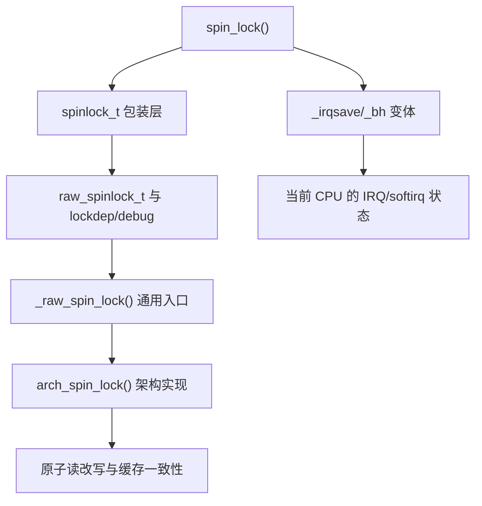
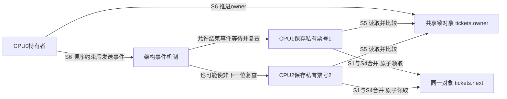
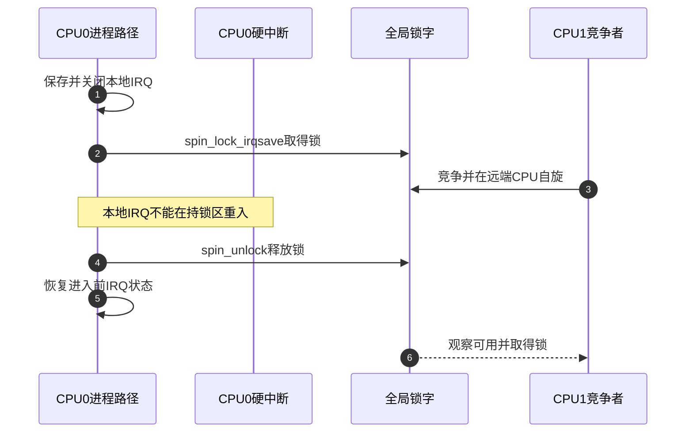

# 第4章\_spinlock实现与上下文边界

## 4.1\_从统一周期进入spinlock

本章先讨论非 PREEMPT_RT 的 `spinlock_t` 与严格自旋的 raw 分支。其 S5 不把任务交给调度器，而是让竞争 CPU 观察锁状态；架构也可能使用事件等待指令。因此它省掉了任务睡眠和唤醒切换，却仍占住这条执行路径，并带来共享状态通信和不可抢占延迟。只有临界区短、持锁者能很快继续执行时，这个交换才成立。

上一章已经把“等待者能够继续”和“取得锁”分开。现在让 CPU0 修改第一章的采样对象，CPU1、CPU2 同时要求读取：它们究竟读哪个地址，释放者又怎样让下一位继续？本章先从给等待者编号的办法推导，再用固定 ARM SMP 实现兑现。这里的 SMP 是支持多 CPU 并行的构建分支；当前用于取证的工作配置并未启用它，源码存在不等于该分支已经运行。

## 4.2\_Linux实现是多层组合



Linux 6.12.20 的非 RT 分支让普通 `spin_lock()` 进入 raw 包装，最终由体系结构实现决定锁字怎样排队和原子更新。此分支的 `_irqsave` 和 `_bh` 不是另一把锁，而是先改变当前 CPU 的可重入上下文，再操作同一个跨 CPU 锁对象。以下本地 IRQ 时序也采用此边界；RT 普通锁的 `_irqsave` 不关闭硬中断，不能沿用该时序。

## 4.3\_状态所有权与通信地址

| 状态 | 所有者 | 写入事件 | 读取者 |
| --- | --- | --- | --- |
| 锁字/排队状态 | 锁对象 | 获取和释放的原子路径 | 所有竞争 CPU |
| 本地中断使能状态 | 当前 CPU | `local_irq_save/restore` 相关包装 | 本 CPU 异常入口 |
| 抢占计数 | 当前任务/CPU | spin/raw 获取释放包装 | 调度与检查路径 |
| 受保护数据 | 业务对象 | 持锁者临界区 | 后续取得同锁者 |
| Lockdep map | 锁对象与 current 账本 | acquire/release hook | Lockdep 检查器 |

关闭本地 IRQ 只能阻止当前 CPU 被硬中断重入；其他 CPU 仍靠锁字互斥。反过来，只取得锁却不屏蔽可能在本 CPU 重入并取同锁的 IRQ，会让中断处理程序等待一个只有被它打断的路径才能释放的锁。

### 4.3.1\_从反复抢夺改为领号等待

先想一个朴素方法：竞争者反复尝试把“空闲”改成“占用”。即使锁还在别人手里，大家也反复争取修改同一内存位置的权限；释放后又一起抢，既不能由到达次序预测赢家，也会制造大量共享状态通信。领号法改变其中两步：到达时仅通过一次成功的原子更新领取独一份号码，以后等待“当前服务号”追上自己的号码。

需要两个共享值：`next` 表示下一个待发号码，`owner` 表示目前允许进入的号码。等待者保留自己的票号；它不是指向任务的 owner 指针，也没有必要为每个任务建立睡眠等待节点。初始两值相等表示无人占用。CPU0 领取 0 后，`next=1,owner=0`；CPU1 领取 1 后，`next=2`，但只有 0 号可进入。CPU0 完成后把 `owner` 加一，CPU1 才取得资格。

在固定版本的 ARM SMP 实现中，这两个值就是 `arch_spinlock_t.tickets` 内的两个 16 位字段，和 32 位 `slock` 联合存储。普通非RT锁通过内嵌 raw 对象最终访问这个地址。领取号码用 `ldrex/strex` 独占访问指令对整字尝试原子更新 `next`；失败重试直到成功，旧值中的 `next` 成为本次私有票号。因此“一次领号”指一次成功修改，不保证只执行一次指令尝试。

等待环节反复比较私有票号和共享 `owner`，不反复领取新号；释放者只推进 `owner`。字段排列还受大小端配置影响，不应把某个字节偏移写成跨架构接口。票号是有限宽度的模计数，不能把它当作永久任务身份；这里的三个参与者不讨论票号空间耗尽。



### 4.3.2\_把领号过程放回统一阶段

这是锁字、各 CPU 上下文和业务数据组成的多组状态，不是一个 `locked` 布尔值便能表达的状态机。沿用上一章阶段，观察一次 `spin_lock_irqsave()` 配对周期：

| 阶段 | 触发与修改 | 后续读取者与退出条件 |
| --- | --- | --- |
| S0 | 初始化对象和采样数据，在发布前令next与owner相等 | 调用者取得有效对象地址；锁不保护自己的外层寿命 |
| S1与S4合并 | 先保存flags并施加本地IRQ/抢占约束；原子递增共享next、保存旧票号，同时完成一次尝试与队列位置登记 | 本地执行约束不阻止远端；票号等于owner直接转S2，否则转S3 |
| S3 | 比较票号，确认本次必须按已登记顺序等待 | 选择架构等待路径进入S5，不另建任务队列 |
| S5 | 等待者读取owner，必要时使用架构事件等待 | 只有本地票号等于owner才退出；事件本身不是所有权 |
| S2 | 获取顺序约束成立后进入临界区，复制或更新采样对象 | 其他同锁调用者仍在S5；临界区完成后进入S6 |
| S6 | 持有者完成释放顺序约束，推进共享owner，再发送事件 | 下一票号者复查成功；后续票号者继续等待 |
| S7 | 释放路径恢复保存的本地上下文状态 | 调用者回到外层；原先关着的IRQ不能被无条件开启 |

统一阶段是职责标签，不是强制的数值执行顺序：这里领号合并S1与S4，未竞争时直接进入S2；有竞争时经S3、S5后再回到S2。检查器记录仍与功能动作分层，不能因为看到一次 Lockdep acquire hook 就认定架构获取已经成功。

## 4.4\_正常与本地重入时序



若进程侧只用 `spin_lock()`，中断可以在 CPU0 持锁时进入并竞争同一锁；CPU0 的原路径无法继续，形成自死锁。解决的是本地重入，而不是“中断比进程优先所以必须关中断”。

ARM 的等待中使用 `wfe`（Wait For Event，等待事件），释放中通过 `dsb_sev()` 执行顺序约束和 `sev`（Send Event，发送事件）。这不是把等待任务挂入调度器队列，也不是将 CPU1 的任务置为可运行。事件提示必须与对 `owner` 的复查结合：即使 CPU2 也结束事件等待，票号 2 仍不等于当前服务号 1，不能提前读取业务数据。获取后的 `smp_mb()` 和释放前的屏障属于这个实现兑现顺序的方式，不意味着所有架构的通用加锁接口都承诺任意全屏障效果。

### 4.4.1\_用三个票号观察一次交接

下面是可在宿主编译的顺序 C 模型。它刻意把原子领号作为不可分的一步，只观察资格规则；没有线程、ARM 指令、弱内存或真实事件，也不是可以替代内核锁的 C 实现。保存为 `ticket_model.c`：

```c
#include <assert.h>
#include <stdio.h>

struct ticket_lock {
    unsigned int next;
    unsigned int owner;
};

static unsigned int take_ticket(struct ticket_lock *lock)
{
    /* 模型一步完成；真实并发实现必须使用原子操作。 */
    return lock->next++;
}

static int can_enter(const struct ticket_lock *lock, unsigned int ticket)
{
    return lock->owner == ticket;
}

int main(void)
{
    struct ticket_lock lock = {0, 0};
    unsigned int a = take_ticket(&lock);
    unsigned int b = take_ticket(&lock);
    unsigned int c = take_ticket(&lock);

    assert(can_enter(&lock, a));
    assert(!can_enter(&lock, b) && !can_enter(&lock, c));
    /* A释放后，模拟B、C都因事件重新检查。 */
    ++lock.owner;
    printf("after A: B=%d C=%d\n", can_enter(&lock, b), can_enter(&lock, c));
    assert(can_enter(&lock, b) && !can_enter(&lock, c));
    /* B尚未执行时，C不能靠再次观察绕过它。 */
    assert(!can_enter(&lock, c));
    ++lock.owner;
    assert(can_enter(&lock, c));
    ++lock.owner;
    assert(lock.owner == lock.next);
    printf("finished: owner=%u next=%u\n", lock.owner, lock.next);
    return 0;
}
```

用 `cc -std=c11 -Wall -Wextra -Werror -O2 ticket_model.c -o ticket_model` 编译，再执行生成的程序，应输出 `after A: B=1 C=0` 和 `finished: owner=3 next=3`。预测练习：若 A 释放后 B 迟迟不能执行，C 能否继续？不能，公平的票号顺序也引入了对下一位进展的依赖。若只检查“收到了事件”就进入，B、C会同时进入，破坏互斥。模型证明的是这些状态规则，不能测量真实锁延迟或证明内存屏障充分。

## 4.5\_锁竞争如何形成硬件成本

领号前后的成本不能混成一句“缓存行迁移”。CPU1、CPU2领取号码时需要串行修改同一锁字，共享缓存行的写权限仍要协调；等待期间二者主要观察owner，CPU0释放时的写入又必须让它们以后能观察到新值。由于两个字段在同一锁对象中，新到者更新next也可能影响等待者对该缓存行的访问。票号顺序减少释放后再次争当赢家的动作，却没有使每个等待者只访问私有状态。

另一类排队设计可以让等待者更多地观察自己的节点，再由前驱交接；它改变的是高频观察地址，不等于消除领队、入队与交接通信。不能把这种节点模型反套到本章ARM票号实现，也不能声称每次ARM释放后所有等待者都会争夺锁字写权限：下一位已有票号，无须重新领号。

所以“自旋没有调度开销”不能直接推出“自旋更快”：

- 临界区短且持锁者正在运行时，自旋可能比睡眠切换便宜；
- 非RT持锁路径禁止普通任务抢占，但仍可能受未屏蔽中断或虚拟机vCPU被宿主暂停影响；慢MMIO也会拉长等待，不能用“不可抢占”推导固定完成时间；
- 在严格自旋临界区触发需要睡眠处理的缺页不是合法延迟优化问题，而是上下文使用错误；
- 高核数下，同一锁的缓存行迁移和队列交接会成为扩展性瓶颈；
- raw 锁扩大不可抢占区，会把最坏持锁时间直接写入系统尾延迟。

因此应先保留小而有界的普通临界区；如果竞争成为瓶颈，再确认是共享更新量、持锁工作量还是下一持有者进展受阻。能分拆独立数据时减少同锁参与者，需要阻塞时改用允许睡眠的协议，而不是因为看到排队算法就认为可以把慢设备等待放进锁内。

## 4.6\_UP\_SMP与PREEMPT\_RT分支

[SMP、UP 与 `CONFIG_SMP` 的公共定义](../../../../foundations/computer_architecture/cache_coherence/P01_缓存一致性问题与缓存行.md#1.1.3_Linux中的CONFIG_SMP表示构建能力)是本节的构建前提。`CONFIG_SMP=n` 时没有远端 CPU 竞争，部分锁操作会退化为抢占或上下文约束；`_irqsave` 仍需保存本地 IRQ 状态。`CONFIG_PREEMPT_RT=y` 时，普通 `spinlock_t` 的实现语义会改变，严格原子上下文职责由 `raw_spinlock_t` 保留。不能从某个配置的内联展开外推所有内核。

本轮标准工作树配置为`CONFIG_SMP`未启用、`CONFIG_PREEMPT_NONE=y`，不能用它宣称SMP或PREEMPT_RT路径已运行。本章的SMP实现依据固定提交中的条件分支阅读，配置存在与实际执行也须分别举证。实时分支在[PREEMPT_RT、生命周期与选型](P07_PREEMPT_RT生命周期与选型.md#7.2_PREEMPT_RT改变了哪段因果链)统一比较。

## 4.7\_源码入口与证据边界

- 先由[锁源码总阅读索引](../../../../../research/source_reading/locking/navigation/P01_Linux_6.12_锁源码总阅读索引.md#1.1_版本边界与阅读任务)确认固定提交，再读[spinlock 模块源码概念导读](../../../../../research/source_reading/locking/navigation/P02_Linux_6.12_spinlock模块源码概念导读.md#2.2_接口层次与状态地址)中的包装、raw锁和架构边界。
- `spin_lock()`、`do_raw_spin_lock()` 的裁剪实现与架构调用边界见[spinlock 包装与 raw 路径源码实现](../../../../../research/source_reading/locking/source_explanations/include/linux/spinlock.h.md#1.2_源码符号覆盖账本)；ARM `arch_spin_lock()` 的实际函数与操作数解释见[票号获取](../../../../../research/source_reading/locking/source_explanations/arch/arm/include/asm/spinlock.h.md#1.2_取得票号不等于已经进入)，释放及事件见[owner推进](../../../../../research/source_reading/locking/source_explanations/arch/arm/include/asm/spinlock.h.md#1.3_事件通知为何仍须复查)。结论仍限固定提交与所选架构配置。
- 锁的内存顺序不能脱离 [Linux 内存顺序专题](../memory_ordering/大纲.md)单独推导。

## 4.8\_本章结论与下一问

spinlock 用忙等替换调度等待，但没有移除通信：锁字、排队状态、IRQ/抢占状态和缓存一致性共同完成 S1～S7。下一章转向 mutex，观察当等待者允许睡眠后，Linux 如何增加 owner、wait list、乐观自旋和明确交接。

上一篇：[锁的统一状态与通信周期](P03_锁的统一状态与通信周期.md)。

下一篇：[mutex 慢路径与所有权交接](P05_mutex慢路径与所有权交接.md)。
