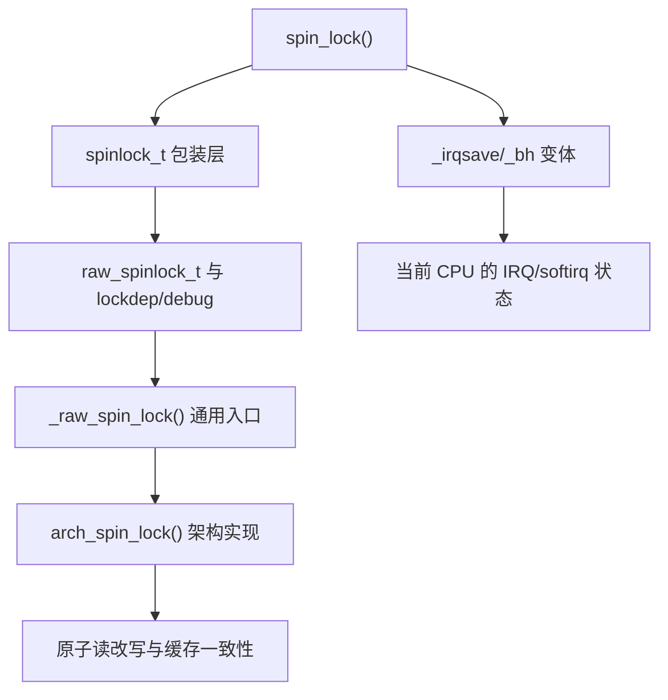
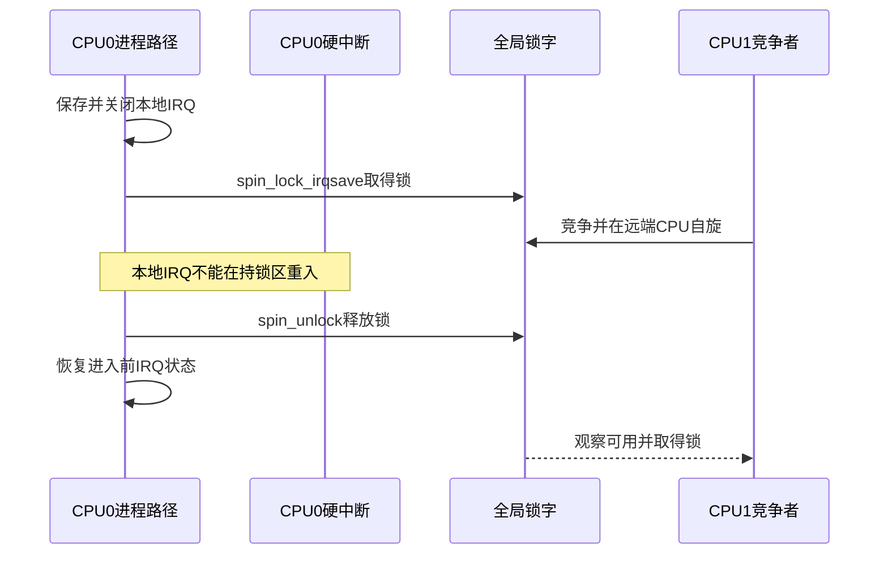

# 第4章\_spinlock实现与上下文边界

## 4.1\_从统一周期进入spinlock

spinlock 的 S5 不把任务交给调度器，而是让竞争 CPU 持续观察锁状态。因此它省掉了睡眠和唤醒切换，却把等待时间直接转化为 CPU 占用、共享缓存行通信和不可抢占延迟。只有临界区短、持锁者能很快继续执行时，这个交换才成立。

## 4.2\_Linux实现是多层组合

Linux 6.12.20 的 `include/linux/spinlock.h` 让普通 `spin_lock()` 进入 raw 包装，最终由体系结构实现决定锁字怎样排队和原子更新。`_irqsave` 和 `_bh` 不是另一把锁，而是先改变当前 CPU 的可重入上下文，再操作同一个跨 CPU 锁对象。

## 4.3\_状态所有权与通信地址

| 状态 | 所有者 | 写入事件 | 读取者 |
| --- | --- | --- | --- |
| 锁字/排队状态 | 锁对象 | 获取和释放的原子路径 | 所有竞争 CPU |
| 本地中断使能状态 | 当前 CPU | `local_irq_save/restore` 相关包装 | 本 CPU 异常入口 |
| 抢占计数 | 当前任务/CPU | spin/raw 获取释放包装 | 调度与检查路径 |
| 受保护数据 | 业务对象 | 持锁者临界区 | 后续取得同锁者 |
| Lockdep map | 锁对象与 current 账本 | acquire/release hook | Lockdep 检查器 |

关闭本地 IRQ 只能阻止当前 CPU 被硬中断重入；其他 CPU 仍靠锁字互斥。反过来，只取得锁却不屏蔽可能在本 CPU 重入并取同锁的 IRQ，会让中断处理程序等待一个只有被它打断的路径才能释放的锁。

## 4.4\_正常与本地重入时序

若进程侧只用 `spin_lock()`，中断可以在 CPU0 持锁时进入并竞争同一锁；CPU0 的原路径无法继续，形成自死锁。解决的是本地重入，而不是“中断比进程优先所以必须关中断”。

## 4.5\_锁竞争如何形成硬件成本

竞争 CPU 必须观察能被释放者修改的共享锁状态。释放导致缓存一致性协议传播新值；多个等待 CPU 随后争夺写权限。排队型自旋锁通过给等待者安排次序，减少所有 CPU 同时敲同一锁字的抖动，但排队节点和交接仍会产生跨 CPU 通信。

所以“自旋没有调度开销”不能直接推出“自旋更快”：

- 临界区短且持锁者正在运行时，自旋可能比睡眠切换便宜；
- 持锁者被抢占、访问慢 MMIO 或发生缺页式长延迟时，等待 CPU 只是在燃烧周期；
- 高核数下，同一锁的缓存行迁移和队列交接会成为扩展性瓶颈；
- raw 锁扩大不可抢占区，会把最坏持锁时间直接写入系统尾延迟。

## 4.6\_UP\_SMP与PREEMPT\_RT分支

`CONFIG_SMP=n` 时没有远端 CPU 竞争，部分锁操作会退化为抢占或上下文约束；`_irqsave` 仍需保存本地 IRQ 状态。`CONFIG_PREEMPT_RT=y` 时，普通 `spinlock_t` 的实现语义会改变，严格原子上下文职责由 `raw_spinlock_t` 保留。不能从某个配置的内联展开外推所有内核。

本仓库当前核对的开发工作树 `.config` 是 `CONFIG_SMP=y`、`CONFIG_PREEMPT` 未启用；它可以验证 SMP 普通分支，但不能当作 PREEMPT_RT 运行证据。实时分支在[PREEMPT_RT、生命周期与选型](P07_PREEMPT_RT生命周期与选型.md#7.2_PREEMPT_RT改变了哪段因果链)统一比较。

## 4.7\_源码入口与证据边界

- 包装、raw 锁和架构边界见[spinlock 模块源码概念导读](../../../../../research/source_reading/locking/navigation/P02_Linux_6.12_spinlock模块源码概念导读.md#2.2_接口层次与状态地址)。
- `spin_lock()`、`do_raw_spin_lock()` 与 `arch_spin_lock()` 的唯一裁剪实现见[spinlock 包装与 raw 路径源码实现](../../../../../research/source_reading/locking/source_explanations/P01_Linux_6.12_spinlock包装与raw路径源码实现.md#1.2_源码符号覆盖账本)。
- 锁的内存顺序不能脱离 [Linux 内存顺序专题](../memory_ordering/大纲.md)单独推导。

## 4.8\_本章结论与下一问

spinlock 用忙等替换调度等待，但没有移除通信：锁字、排队状态、IRQ/抢占状态和缓存一致性共同完成 S1～S7。下一章转向 mutex，观察当等待者允许睡眠后，Linux 如何增加 owner、wait list、乐观自旋和明确交接。

上一篇：[锁的统一状态与通信周期](P03_锁的统一状态与通信周期.md)。

下一篇：[mutex 慢路径与所有权交接](P05_mutex慢路径与所有权交接.md)。
