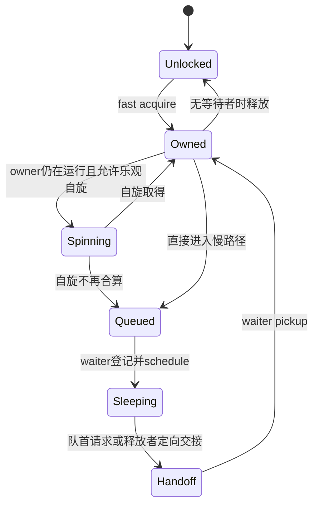
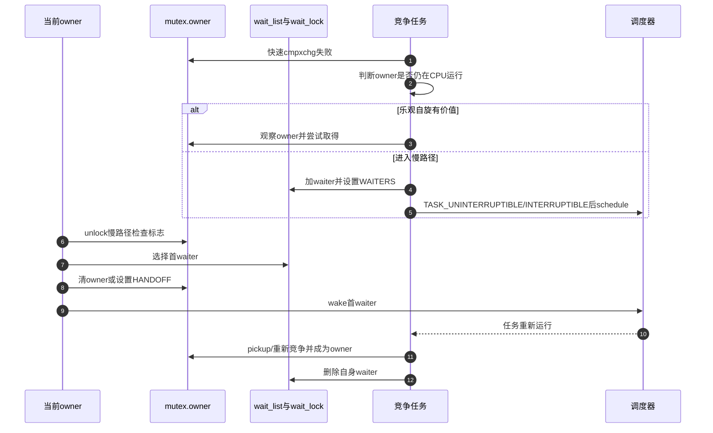

# 第5章\_mutex慢路径与所有权交接

## 5.1\_为什么不能只把竞争者睡下

朴素 mutex 可以在竞争失败后把任务加入队列并睡眠。但若释放者只把锁改成空闲再唤醒一个任务，新到达者可能在被唤醒者真正运行前抢走锁；高竞争下，老等待者反复睡醒，调度成本和尾延迟都可能恶化。Linux 因此把快速原子路径、所有者自旋、FIFO 等待队列和 handoff 标志组合起来。

## 5.2\_五类状态

| 状态 | Linux 6.12.20 位置 | 谁写 | 谁读 |
| --- | --- | --- | --- |
| owner 指针及低位标志 | `struct mutex.owner` | 获取、释放与 handoff 路径 | 快路径、竞争者、unlock |
| 等待者链表 | `struct mutex.wait_list` | `wait_lock` 下的竞争者/释放者 | 慢路径和唤醒路径 |
| 队列保护 | `struct mutex.wait_lock` | 所有慢路径 | 排队、移除、选择首 waiter |
| 乐观自旋队列 | OSQ 状态 | 可运行竞争者 | owner spinning 路径 |
| 任务调度状态 | waiter 对应任务 | 竞争者与唤醒器 | 调度器 |

`owner` 低位不只是“已锁”。Linux 6.12.20 使用 WAITERS、HANDOFF、PICKUP 等状态协调“队列存在”“把锁定向交给首 waiter”“被交接者确认接收”。

## 5.3\_从快路径到睡眠的S0到S7

状态图中的 `Owned` 不是同一个任务：handoff 后所有者身份从释放者转移到队首 waiter。信号中断或 killable 失败还会从 Queued/Sleeping 移除 waiter，并在确认未取得锁后返回错误。

## 5.4\_端到端时序

## 5.5\_乐观自旋改变了哪段因果链

原方案在一次原子失败后立即调度睡眠。乐观自旋先问“owner 是否仍在 CPU 上运行，是否可能很快释放”；若是，竞争者在有序自旋队列中短暂等待，省去睡眠和唤醒。代价是继续消耗 CPU，并读取 owner/调度状态。

它不等于 mutex 变成自旋锁：一旦 owner 不再运行、需要 reschedule、竞争条件不合适或 WW mutex 约束触发，任务仍进入可睡慢路径。当前开发工作树启用了 `CONFIG_MUTEX_SPIN_ON_OWNER=y`，只说明该优化可编入内核，不保证每次竞争都会自旋成功。

## 5.6\_handoff解决什么又付出什么

handoff 把所有权定向交给队首 waiter，抑制新到达任务长期插队。释放者在 owner 低位记录交接状态，被唤醒者以 pickup 确认自己接收。它改善高竞争下的饥饿风险，却让 owner 状态机和原子操作更复杂；并且“被选中”仍不等于已获得 CPU 时间，调度延迟依然存在。

因此 mutex 不能被描述为严格的实时 FIFO。等待队列顺序、乐观自旋、handoff 和调度策略共同决定可观察顺序。

## 5.7\_错误退出与生命周期

`mutex_lock_interruptible()` 在信号到达时必须在 `wait_lock` 保护下把 waiter 从队列移除，并确认自己没有通过 handoff 取得所有权。调用者看到负错误码时不持锁。与此同时，mutex 所在对象必须活到 waiter 完成移除；释放对象内存不能只等 owner 清零，还要封住新入口并等待所有在途调用退出。

## 5.8\_源码入口

版本化状态、`__mutex_lock_common()`、`mutex_optimistic_spin()` 和 `__mutex_unlock_slowpath()` 的协作见[mutex 与 rwsem 模块源码概念导读](../../../../../research/source_reading/locking/navigation/P03_Linux_6.12_mutex与rwsem模块源码概念导读.md#3.3_mutex完整调用链)。具体函数体只在[mutex 慢路径源码实现](../../../../../research/source_reading/locking/source_explanations/P02_Linux_6.12_mutex慢路径源码实现.md#2.2_源码符号覆盖账本)展开。

## 5.9\_本章结论与下一问

mutex 通过 owner、wait list、OSQ 和任务状态把“竞争失败”转化为可调度等待，并用 handoff 处理插队。rwsem 还要允许一批读者同时拥有临界区；下一章追踪它怎样把读者计数、写者所有权和混合等待队列汇聚成一个结论。

上一篇：[spinlock 实现与上下文边界](P04_spinlock实现与上下文边界.md)。

下一篇：[rwsem 读写汇聚与唤醒](P06_rwsem读写汇聚与唤醒.md)。
