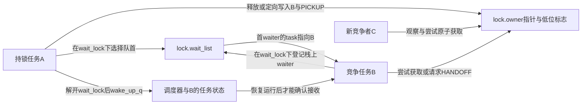
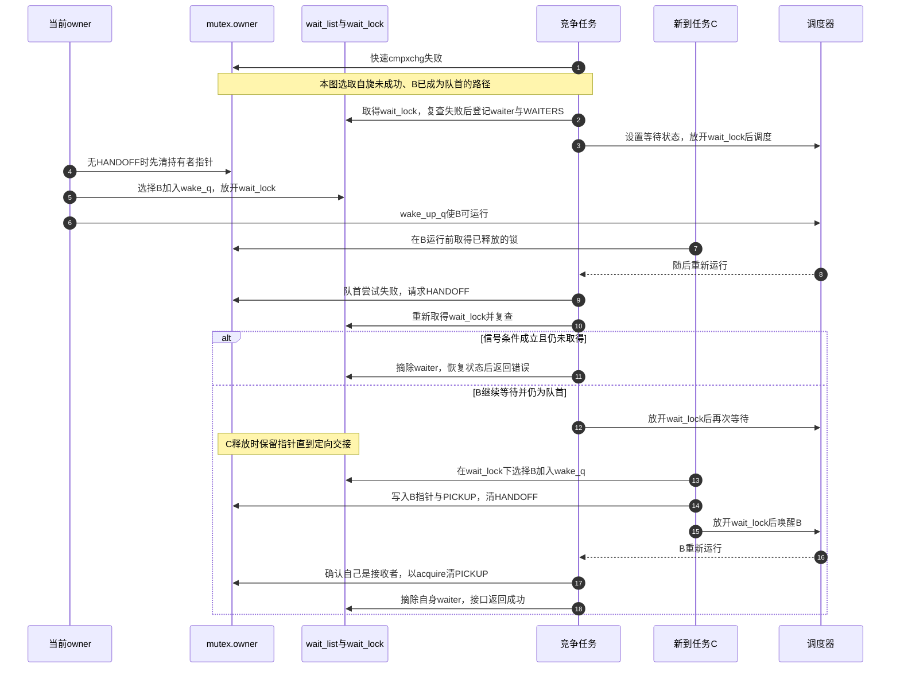

# 第5章\_mutex慢路径与所有权交接

## 5.1\_为什么不能只把竞争者睡下

朴素 mutex 可以在竞争失败后把任务加入队列并睡眠。但若释放者只把锁改成空闲再唤醒一个任务，新到达者可能在被唤醒者真正运行前抢走锁；高竞争下，老等待者反复睡醒，调度成本和尾延迟都可能恶化。Linux 因此把快速原子路径、所有者自旋、FIFO 等待队列和 handoff 标志组合起来。

沿用配置提交场景：A正在持锁修改，B已经等待，C刚到达。只唤醒B的方案并不破坏互斥——C先取得后，B再次检查失败即可；问题是B已经付出睡眠与重新调度的代价，却可能迟迟做不成一次提交。我们需要区分“给B一次竞争机会”和“保留给B”。后者就是定向交接，但它也会使其他竞争者依赖B何时真正得到CPU时间。

本章的具体字段与路径限定为固定Linux 6.12.20的 **非PREEMPT_RT普通mutex**，不把同文件中的多锁死锁处理扩展 `ww_mutex` 混进默认队列规则。普通等待者尾部入队，不代表所有取得者都严格按到达时间完成。

## 5.2\_五类状态

| 状态 | Linux 6.12.20 位置 | 谁写 | 谁读 |
| --- | --- | --- | --- |
| owner 指针及低位标志 | `struct mutex.owner` | 获取、释放与 handoff 路径 | 快路径、竞争者、unlock |
| 等待者链表 | `struct mutex.wait_list` | `wait_lock` 下的竞争者/释放者 | 慢路径和唤醒路径 |
| 队列保护 | `struct mutex.wait_lock` | 所有慢路径 | 排队、移除、选择首 waiter |
| 乐观自旋队列 | OSQ 状态 | 可运行竞争者 | owner spinning 路径 |
| 任务调度状态 | waiter 对应任务 | 竞争者与唤醒器 | 调度器 |

`owner` 低位不只是“已锁”。Linux 6.12.20 使用 WAITERS、HANDOFF、PICKUP 等状态协调“队列存在”“把锁定向交给首 waiter”“被交接者确认接收”。

三个位必须连同任务指针读：`WAITERS` 是等待者提示，不能单凭它确定哪一个任务持锁；`HANDOFF` 是队首请求当前持有者定向交接；释放者兑现请求后写入接收任务指针并置 `PICKUP`，同时清除HANDOFF。PICKUP期间其他任务看见的不是空闲锁，即便接收者还没有运行，也不能替它取得。

`wait_lock` 是保护队列操作的内部raw锁，不是应用持有的mutex：A可以在不持有wait_lock的整个业务临界区内持有mutex；B持有wait_lock时则只能做短小内部操作，必须放开它才调度。B的栈上waiter通过链表成为释放者可见的共享登记，返回前必须摘除，不能让链表留下已失效的栈地址。

## 5.3\_从快路径到睡眠的S0到S7

不能用一张把Owned、Sleeping并列的单状态图表示整个mutex：A持有时B可以同时睡眠。这里有owner字、等待链表、B的任务状态等正交状态，沿用统一周期分别记录：

| 阶段 | 具体推进 | 写入位置与后续观察 |
| --- | --- | --- |
| S0 空闲 | 无持有者且无等待标志时可走最快分支 | owner字为0；存在等待标志但任务指针为空也可被普通尝试取得 |
| S1 尝试 | 原子比较更新owner，成功转S2 | 新持有者身份供竞争者与释放路径观察 |
| S3 分类 | 可选乐观自旋，失败后取得wait_lock再尝试 | 在排队前再次检查，避免锁已释放却无谓登记 |
| S4 登记 | 栈上waiter.task指向current，尾部入wait_list，必要时置WAITERS，设置任务等待状态 | 释放者在wait_lock下找到任务；任务状态由调度器与唤醒路径观察 |
| S5 推进 | wait_lock下先尝试取得，再检查信号；仍须等待才释放内部锁并调度 | 醒后再设置等待状态并尝试；队首可请求HANDOFF，也可条件自旋 |
| S6 释放/交接 | 普通释放清任务指针；HANDOFF分支保留所有权直到写入接收者与PICKUP | wake_q保存待唤醒任务，在放开wait_lock后调用wake_up_q |
| S2 持有 | 普通竞争成功，或指定任务以acquire操作清PICKUP | 当前路径确认取得，随后清理等待登记，应用接口才返回成功 |
| S7 清理 | 成功或中止时恢复任务状态并摘除waiter；最后一个waiter移除时清标志 | 返回后不再暴露栈上waiter；中止者没有业务锁可释放 |

阶段是职责而非所有任务共用的单一时钟。A在S2时B可处于S4/S5；A的S6促成B的S2，B又须完成自己的登记清理。无竞争则不需要S4/S5。

## 5.4\_端到端时序

## 5.5\_乐观自旋改变了哪段因果链

原方案在一次原子失败后立即调度睡眠。乐观自旋先问“owner 是否仍在 CPU 上运行，是否可能很快释放”；若是，竞争者在有序自旋队列中短暂等待，省去睡眠和唤醒。代价是继续消耗 CPU，并读取 owner/调度状态。

OSQ是乐观自旋队列（Optimistic Spin Queue），让尚未进入wait_list的竞争者先在队列节点上排队，减少许多CPU同时争改owner字。节点的局部等待降低部分共享字争夺，却仍有入队、前后继交接和最终owner观察的缓存通信成本。**已经位于wait_list队首的waiter自旋者是例外**：它不再经过OSQ，可以与OSQ首位自旋者同时尝试，不能概括成“全系统只可能有一个mutex自旋者”。

它不等于mutex变成严格自旋锁：owner不再运行、当前任务需要重新调度或其他条件不合适时，应退出自旋并继续慢路径。自旋也没有固定成功时限，owner仍在CPU上运行只是值得尝试的线索，不是完成保证。当前核对的工作配置未启用SMP，也没有 `CONFIG_MUTEX_SPIN_ON_OWNER=y`；本节依据固定源码的可选分支，不声称该优化已在当前构建运行。多锁死锁处理扩展的额外限制不属于本章普通mutex协议。

## 5.6\_handoff解决什么又付出什么

把两种释放放在同一组A/B/C上比较，才能看清handoff改变了哪一个窗口：

| 时点 | 普通释放并唤醒B | 已请求HANDOFF且B仍为队首 |
| --- | --- | --- |
| A结束临界区 | 清owner任务指针，可能保留WAITERS | 不先清成可自由取得的空闲状态 |
| 选择等待者 | 在wait_lock下选B并放入wake_q | 同样选B，再以release操作把owner写成B加PICKUP |
| B尚未运行，C到达 | C可能先取得，B需要再次竞争 | C不是指定接收者，不能清PICKUP取得 |
| B真正运行 | 只有实际取得才返回成功 | B确认指针为自己，以acquire清PICKUP才完成接收 |

HANDOFF由等待路径请求，PICKUP由释放路径发布，两者不是同一个位的两个叫法。保留给B可以避免这个窗口中C再次插队，却可能让锁暂时等待B获得CPU时间；并不是发送一次唤醒便让B立刻执行。若B取消并退出队列，释放者在内部锁保护下重新选择当时的队首，而不是永远交给旧B。

因此 mutex 不能被描述为严格的实时 FIFO。等待队列顺序、乐观自旋、handoff 和调度策略共同决定可观察顺序。

## 5.7\_错误退出与生命周期

`mutex_lock_interruptible()` 在信号到达时必须在 `wait_lock` 保护下把 waiter 从队列移除，并确认自己没有通过 handoff 取得所有权。调用者看到负错误码时不持锁。与此同时，mutex 所在对象必须活到 waiter 完成移除；释放对象内存不能只等 owner 清零，还要封住新入口并等待所有在途调用退出。

具体顺序不能倒过来：循环在wait_lock下 **先尝试取得/接收，再检查信号错误**。若已被指定交接，先pickup可以保证不会把指向自己的所有权留在锁字中却以失败返回。若没有取得而信号条件成立，才移除登记并返回负错误码。这也解释了为什么调用者只能依返回值判断持锁，不能依据自己是否发过信号判断。

练习：若把“检查信号”搬到pickup前，会留下什么？可能留下B指针加PICKUP，却再没有B来接收，其他任务也不能越过。再问：新任务已经拿到锁，能否证明旧owner的unlock已返回？不能，普通解锁清owner后还可能处理队列及wake_q；对象须覆盖所有这些在途调用。

## 5.8\_源码入口

先从[锁源码总阅读索引](../../../../../research/source_reading/locking/navigation/P01_Linux_6.12_锁源码总阅读索引.md#1.1_版本边界与阅读任务)确认版本，版本化状态、`__mutex_lock_common()`、`mutex_optimistic_spin()` 和 `__mutex_unlock_slowpath()` 的协作见[mutex 与 rwsem 模块源码概念导读](../../../../../research/source_reading/locking/navigation/P03_Linux_6.12_mutex与rwsem模块源码概念导读.md#3.3_mutex完整调用链)。具体函数体只在[mutex 慢路径源码实现](../../../../../research/source_reading/locking/source_explanations/kernel/locking/mutex.c.md#1.2_源码符号覆盖账本)展开。

## 5.9\_本章结论与下一问

mutex 通过 owner、wait list、OSQ 和任务状态把“竞争失败”转化为可调度等待，并用 handoff 处理插队。rwsem 还要允许一批读者同时拥有临界区；下一章追踪它怎样把读者计数、写者所有权和混合等待队列汇聚成一个结论。

上一篇：[spinlock 实现与上下文边界](P04_spinlock实现与上下文边界.md)。

下一篇：[rwsem 读写汇聚与唤醒](P06_rwsem读写汇聚与唤醒.md)。
