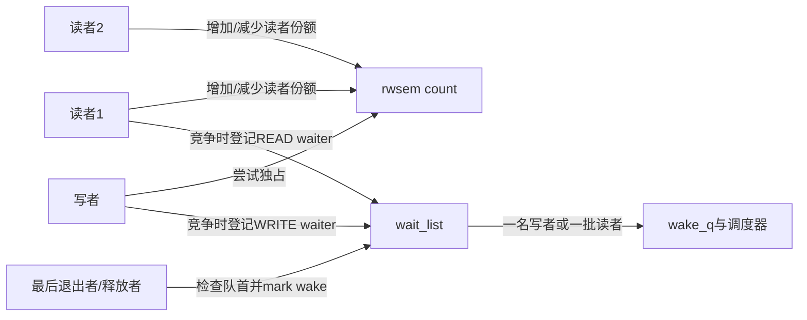
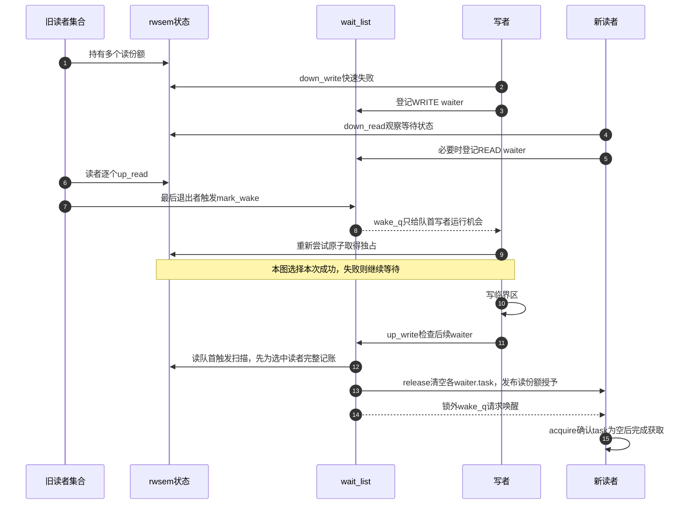

# 第6章\_rwsem读写汇聚与唤醒

## 6.1\_多读单写增加了什么难题

mutex 只需回答“唯一 owner 是谁”。rwsem 允许多个读者共享所有权，写者却要等所有旧读者退出，并阻止无限到达的新读者让写者永远等不到零。于是状态不再是单一 owner，而是读者份额、写者占有、等待者存在、首 waiter 类型和唤醒批次共同组成的分布式状态机。

设两个任务正在遍历同一份只读配置，管理任务W需要替换配置。只要任一旧读者仍在临界区，W就不能独占；而每个读者退出时又只知道自己这一份结束了。把份额集中记入一个计数，最后退出者便能观察“旧读者已全部归还”，但这还没有回答新读者是否允许加入、谁负责通知W、通知是否已经授予写权。本章逐项补齐这些缺口，具体字段与批次策略限定固定Linux 6.12.20的 **非PREEMPT_RT实现**。

## 6.2\_角色与状态地址

该分支的 `sem->count` 同时编码读份额、写持有和等待/交接标志，不是可以直接当普通整数读者数使用的变量。`sem->owner` 用于写者身份及读者状态提示，不能列举全体读者；读者是否全部退出须依据count的相应位域。`sem->wait_lock` 保护 `wait_list`，每个等待调用栈上的 `rwsem_waiter` 保存读/写类型、task、超时与handoff信息。

这里已有两种不同通信：count把许多读者的归还汇聚到同一个地址；wait_list把睡眠任务的位置暴露给唤醒路径。后者还需要任务级授权证据：读等待者观察自己的 `waiter.task` 是否被清空，写等待者则仍要成功改变共享count取得独占。不能把它们都概括成“醒来就拿锁”。

## 6.3\_统一阶段

沿用P03阶段名，避免把“某读者已持有”和“另一写者在等待”错误地当成互斥状态：

| 阶段 | 读者路径 | 写者路径与汇聚结果 |
| --- | --- | --- |
| S0 空闲 | 对象已初始化且无人持有 | count没有读/写持有，但仍须按等待标志判断是否能直接竞争 |
| S1 尝试 | 尝试增加读份额并检验状态；慢路径处理不适合快取的情况 | 原子尝试独占，成功转S2，失败转S3 |
| S2 持有 | 每个读者拥有一份保护，可以同时读取 | 写者必须排除全部读份额和其他写者 |
| S3 分类 | 依据count与排队状态进入慢路径 | 可选自旋失败后排队 |
| S4 登记 | 在wait_lock下登记READ waiter | WRITE waiter登记到同一链表，设置必要等待标志 |
| S5 推进 | 观察waiter.task；清空表示读份额已授予 | 醒后在内部锁下再次原子尝试取得，唤醒本身没有授予写权 |
| S6 释放与交付 | up_read归还份额，最后退出者按状态触发唤醒选择 | up_write清独占并检查等待者；写队首获竞争机会，读阶段批量记账 |
| S7 清理 | 授予时从等待链表转出，取消时在内部锁下移除 | 写者取得或取消时移除waiter；恢复任务状态后返回 |

S6可以让尚未调度运行的读者已经拥有份额，所以count描述的不只是“此刻正在CPU上读的任务数”。一批读者中的最后一位迟迟未运行，也可能阻止下一写者取得。

## 6.4\_为什么读者可以批量唤醒

先看队首为写者的分支：允许唤醒写者时，`rwsem_mark_wake()` 只是把首位任务加入wake_q，不在这里替它设置独占位。真正取得由写者自己的 `rwsem_try_write_lock()` 完成；在它运行前，满足条件的其他写者仍可能取得。因此“只唤醒一个写者”不同于mutex的PICKUP式指定所有权。

队首为读者时则进入读阶段。固定实现不是只放行队首的 **连续** 读者：它遍历等待链表，跳过WRITE waiter，收集READ waiter，单次最多 `MAX_READERS_WAKEUP=0x100`，即256名。这是版本内的有界批量，不是API保证。

例如等待队列为 `[R1, W1, R2, W2, R3]`，没有其他持有者抢先占用且份额检查通过时，本轮可以给R1、R2、R3授予读份额，留下W1、W2。若队首改成W1，则不会直接套用上述扫描放行所有读者。必须把 **队首决定本轮类型** 与 **读阶段扫描哪些节点** 分开理解。

### 6.4.1\_先记账再宣布授予

读批次在wait_lock下分两遍完成。先确认可以授予读权，收集读waiter到临时链表并把所需份额完整计入count；如果抢先到来的写者已占用，首次授予检查可能失败并撤销本次调整，不能硬塞读者。然后逐一保存目标task并取得任务引用，用release操作把 `waiter->task` 清为NULL，再加入安全wake队列。读者用acquire读取这个字段，发现NULL便知道份额已经交付。

为什么不能边计一个、醒一个，再回头计算总数？某个读者也许尚未真正睡下，一看到task清空就能继续，甚至立即 `up_read()`。如果对应份额尚未计入，它会先扣除一个不存在的份额，让全局count失真。先完整记账，再发布每个授权标记，阻止的正是这个交错。清空task前取得引用，则保证读者快速返回甚至退出后，延后执行的唤醒工作仍拥有合法任务引用。

wake_q把实际调度唤醒放到wait_lock之外，缩短内部raw锁临界区。它没有取代count记账或waiter授权，也不保证任务立即执行。

## 6.5\_端到端时序

## 6.6\_乐观自旋和公平边界

开启 `CONFIG_RWSEM_SPIN_ON_OWNER` 时，部分竞争者可以依据owner运行状态短暂自旋。当前核对的工作配置未启用SMP，也没有该选项的启用项；本节只解释固定源码可选分支。优化尝试减少短持锁场景的切换，但读取owner和竞争count仍有共享访问成本，也不能从一个读owner提示推断所有读者都即将退出。

rwsem 的队列策略需要在吞吐与等待上界之间折中：过度偏向读者会拖延写者，过度阻挡新读者又会降低读并发。调用者不能依赖未写入 API 契约的精确唤醒顺序来实现业务协议。

等待超时阈值和handoff标志用于限制继续插队；这里的超时不是获取接口到期失败，而是等待策略升级。写慢路径在持有者尚未退出且等待过久等条件下请求handoff，首waiter的 `handoff_set` 配合共享标志限制其他等待者越过。它仍须等旧读份额归还并成功原子取得写权，不是到阈值便强行撤销读者保护，也没有照搬mutex的owner指针加PICKUP协议。

## 6.7\_downgrade与不能原地upgrade

`downgrade_write()` 能在保持保护连续性的前提下把独占写所有权变成读份额。通用读转写会让两个升级者都持有读份额并等待对方退出，因此 Linux 不提供可普遍安全的原地 upgrade。释放读锁、取得写锁后必须重新验证数据版本和业务前置条件。

降级后自己仍有一个读份额，因此只能促进允许的读者加入，不能同时授予写者。读等待若被信号打断，也不能仅凭信号直接删除：固定读慢路径会在wait_lock下重查 `waiter.task`，如果它已经被清空，就按已经获得读权完成，而不是泄漏已记入的份额。取消成功时才移除未授予的登记，必要时推动后续队首。

练习：在 `[R1,W1,R2]` 的读阶段，R1已运行退出、R2已授予但尚未调度，W1能否独占？不能，R2的份额仍未归还。若把清空task放到记账之前，即使wake_up_q还没执行，为什么仍可能出错？因为尚未睡下的R2可以主动观察授权并继续，不依赖这次调度唤醒。两题分别检验计数含义和发布顺序。

## 6.8\_源码入口

先由[锁源码总阅读索引](../../../../../research/source_reading/locking/navigation/P01_Linux_6.12_锁源码总阅读索引.md#1.1_版本边界与阅读任务)确认固定版本，再读 `struct rw_semaphore`、`struct rwsem_waiter`、读写慢路径和 `rwsem_mark_wake()` 的[模块关系](../../../../../research/source_reading/locking/navigation/P03_Linux_6.12_mutex与rwsem模块源码概念导读.md#3.4_rwsem完整调用链)。完整类型见[rwsem.h 对象布局](../../../../../research/source_reading/locking/source_explanations/include/linux/rwsem.h.md#1.2_非RT对象的状态落点)；慢路径实现见[rwsem 慢路径源码实现](../../../../../research/source_reading/locking/source_explanations/kernel/locking/rwsem.c.md#1.2_状态地址与统一阶段)，完整分支依据固定提交的 `kernel/locking/rwsem.c`，本页只展开明确列出的完整函数，不代表整个文件全部覆盖。

## 6.9\_本章结论与下一问

rwsem 把多个读者的局部份额汇聚成“写者能否独占”的全局结论，再依据队首类型交付一个写者或一批读者。最后一章把配置、实时语义、对象拆除和验证边界放进同一张选择表。

上一篇：[mutex 慢路径与所有权交接](P05_mutex慢路径与所有权交接.md)。

下一篇：[PREEMPT_RT、生命周期与选型](P07_PREEMPT_RT生命周期与选型.md)。
