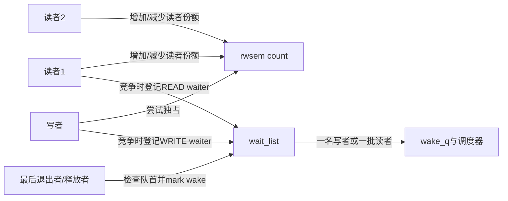
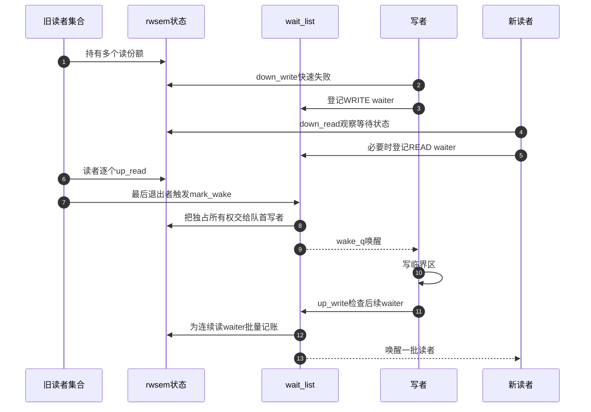

# 第6章\_rwsem读写汇聚与唤醒

## 6.1\_多读单写增加了什么难题

mutex 只需回答“唯一 owner 是谁”。rwsem 允许多个读者共享所有权，写者却要等所有旧读者退出，并阻止无限到达的新读者让写者永远等不到零。于是状态不再是单一 owner，而是读者份额、写者占有、等待者存在、首 waiter 类型和唤醒批次共同组成的分布式状态机。

## 6.2\_角色与状态地址

Linux 6.12.20 中 `struct rw_semaphore` 的原子状态编码当前持有和等待标志，`wait_lock` 保护 `wait_list`；writer owner 和非 owner 读侧信息还用于乐观自旋与调试。具体位布局属于版本化实现，不应被写成跨版本 API 契约。

## 6.3\_统一阶段

| 阶段 | 读者路径 | 写者路径 | 共享结果 |
| --- | --- | --- | --- |
| S0 空闲 | 可快速增加读份额 | 可快速取得写所有权 | 首个成功者决定占有形态 |
| S1 已有读者 | 新读者可能并发加入 | 写者登记等待 | count 记录仍有旧读者 |
| S2 写者等待 | 新读者是否绕过受队列/状态约束 | 队首等待读者归零 | 防止无界读者插队 |
| S3 写者持有 | 读者排队 | 其他写者排队 | 独占成立 |
| S4 释放判定 | 最后读者触发 wake | 写者释放触发 wake | 读取队首 waiter 类型 |
| S5 批量交付 | 连续读 waiter 可成批获得份额 | 队首写 waiter 单独获得 | wake_q 在锁外唤醒任务 |

## 6.4\_为什么读者可以批量唤醒

若队首是一组连续读 waiter，它们彼此不冲突，可以一起获得读份额，再分别成为 runnable。若队首是写 waiter，只能把独占机会交给一个写者。`rwsem_mark_wake()` 因而不是简单遍历并 `wake_up()` 全部任务，而是在 `wait_lock` 下先改变 rwsem 状态和 waiter 归属，再把待唤醒任务加入 `wake_q`，最后在锁外真正唤醒。

这一区分避免在持有 `wait_lock` 时执行较重的调度唤醒，也保证被唤醒任务看到与自己匹配的所有权状态。

## 6.5\_端到端时序

## 6.6\_乐观自旋和公平边界

开启 `CONFIG_RWSEM_SPIN_ON_OWNER` 时，部分竞争者可以依据 owner 运行状态短暂自旋。开发工作树启用了该配置，但具体路径仍取决于 owner、调度需求、等待队列和读写类型。优化减少短持锁场景的切换，不提供严格公平或确定延迟。

rwsem 的队列策略需要在吞吐与等待上界之间折中：过度偏向读者会拖延写者，过度阻挡新读者又会降低读并发。调用者不能依赖未写入 API 契约的精确唤醒顺序来实现业务协议。

## 6.7\_downgrade与不能原地upgrade

`downgrade_write()` 能在保持保护连续性的前提下把独占写所有权变成读份额。通用读转写会让两个升级者都持有读份额并等待对方退出，因此 Linux 不提供可普遍安全的原地 upgrade。释放读锁、取得写锁后必须重新验证数据版本和业务前置条件。

## 6.8\_源码入口

`struct rw_semaphore`、`struct rwsem_waiter`、读写慢路径和 `rwsem_mark_wake()` 的模块关系见[mutex 与 rwsem 模块源码概念导读](../../../../../research/source_reading/locking/navigation/P03_Linux_6.12_mutex与rwsem模块源码概念导读.md#3.4_rwsem完整调用链)。唯一函数实现见[rwsem 慢路径源码实现](../../../../../research/source_reading/locking/source_explanations/P03_Linux_6.12_rwsem慢路径源码实现.md#3.2_源码符号覆盖账本)。

## 6.9\_本章结论与下一问

rwsem 把多个读者的局部份额汇聚成“写者能否独占”的全局结论，再依据队首类型交付一个写者或一批读者。最后一章把配置、实时语义、对象拆除和验证边界放进同一张选择表。

上一篇：[mutex 慢路径与所有权交接](P05_mutex慢路径与所有权交接.md)。

下一篇：[PREEMPT_RT、生命周期与选型](P07_PREEMPT_RT生命周期与选型.md)。
