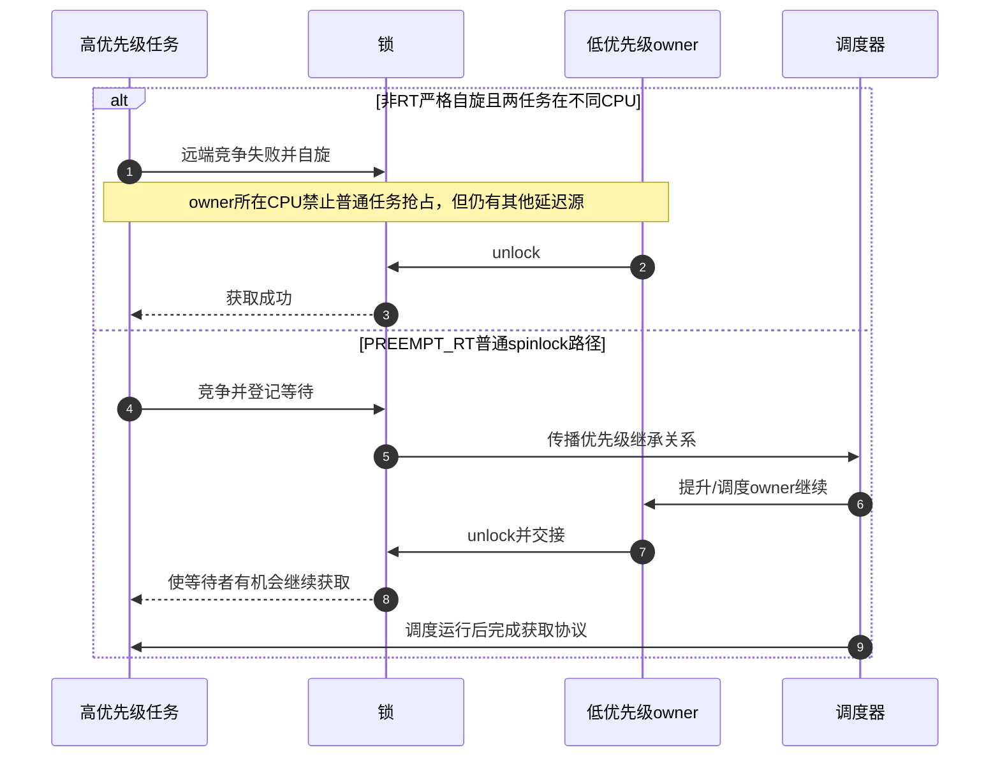
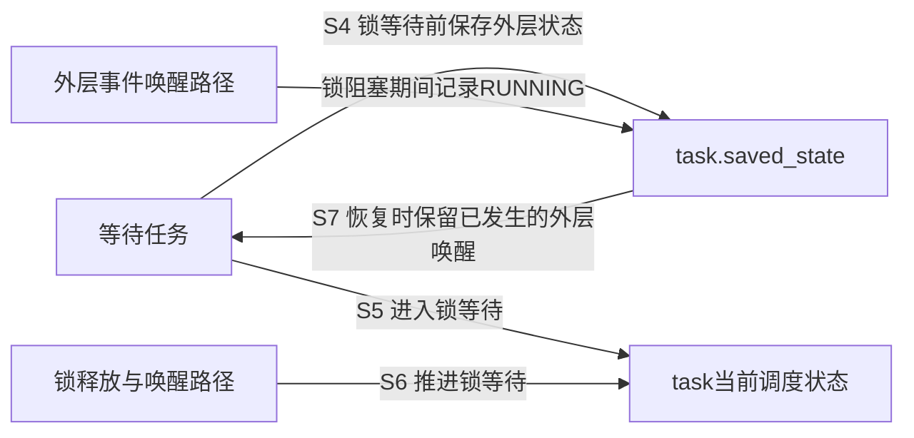

# 第7章\_PREEMPT\_RT生命周期与选型

## 7.1\_普通内核模型还缺什么

前几章默认“spinlock 忙等且不可睡、mutex/rwsem 可睡”来建立主模型。但 PREEMPT_RT 为缩短不可抢占区，会改变普通 `spinlock_t` 的实现语义；设备移除又要求锁之外的生产者停止与对象保活。若不把这两类边界纳入选择，API 在普通路径上正确，仍可能在实时配置或 teardown 中失败。

## 7.2\_PREEMPT\_RT改变了哪段因果链

先看同一CPU上的低优先级任务L、中优先级任务M和高优先级任务H。若L持有一种允许被抢占的锁，H随后请求该锁而阻塞，M又持续占用CPU，L就无法及时运行到解锁处，H反而间接等着M。这叫优先级反转。优先级继承使持有者临时承接高优先级等待者的优先级，让L更有机会越过M完成释放；它改变的是调度依赖，不是让两个任务同时访问临界区。

严格自旋路径采用另一种约束：本CPU普通任务不能在持锁期间抢占L，因此不能直接把上面的三任务交错套进去。但高优先级任务的启动也被不可抢占区推迟。PREEMPT_RT把许多这种区间改为可抢占的锁保护，并借助继承维护持有者进展；剩下的raw临界区依然构成不能被这套机制越过的延迟。

| 原语 | 普通内核核心行为 | PREEMPT_RT 重点 | 保留的代价 |
| --- | --- | --- | --- |
| `spinlock_t` | 竞争时自旋并约束抢占 | 多数路径映射为具优先级继承的 RT 锁语义，持锁任务可被调度 | 状态机更复杂，不能用于真正 raw 上下文 |
| `raw_spinlock_t` | 严格自旋 | 继续严格自旋并维持原子上下文 | 不可抢占延迟仍存在 |
| mutex | 可睡 owner/waiter | 使用 RT mutex 基础增强优先级处理 | 调度和继承链成本 |
| rwsem | 多读单写可睡 | 实时性与读并发、公平策略重新权衡 | 不能假定普通配置的时延特征 |

被移除的“长时间关闭抢占”成本由可调度等待、优先级继承和线程化执行上下文替代；真正 hardirq/NMI、调度器和极底层状态仍需 raw 锁。因而不能把 `raw_spinlock_t` 当性能升级，也不能认为 PREEMPT_RT 让任何持锁路径都可以睡眠。

“提升优先级”不保证立即得到CPU，也不能让等待硬件响应的持有者凭空完成，更不能打破锁依赖环。对真正不可睡的底层现场，先核对所处子系统允许的原语；即使用raw，NMI打断持有同锁的路径仍可能自死锁，不能把raw当作自动解决所有中断重入的答案。

普通RT `spinlock_t` 的 `_irqsave` 不关闭硬中断，`_bh` 仍约束软中断处理；持锁任务允许抢占但禁止迁移。后一个保证使本CPU数据指针不因迁移而失效，却不独自阻止其他任务在本CPU抢占访问同一数据，仍须遵守同锁协议。接口名字保留，并不意味着旧配置下依赖的所有副作用都保留。

多读者又带来不同约束：RT读写锁不能简单地把一个高优先级写者的优先级同时捐给所有读持有者；某个低优先级读者被抢占，写者仍须等它归还份额。因此不能从mutex的单owner继承推导rwsem具有相同的写等待上界。

## 7.3\_配置分支的端到端对比

RT锁内部等待还要保留调用者原来的任务状态。假设调用者已为外层条件等待设置任务状态，随后取得普通spinlock；若锁内部阻塞覆盖了该状态，外层事件又恰好到来，就可能丢失一次应被记住的唤醒。固定版本使用任务的保存状态与当前锁等待状态分开承载这两件事：

这张图只说明两层等待为何不能共用一个被任意覆盖的状态；完整RT实现与普通mutex的owner低位协议不同，不得把前章非RT字段原样移植过来。当前取证配置为非RT、非SMP，以上是固定源码文档的配置边界，不是当前目标运行结果。

## 7.4\_锁不能独自解决对象生命周期

任务在调用 `lock()` 前已经拿着锁对象地址。若另一路径可以并发释放整个对象，获取动作本身就可能 UAF。正确 teardown 通常需要：

锁负责阶段内共享状态一致性；kref、RCU、设备核心引用、completion 或 cancel/flush 协议负责证明访问者已经离开。两种证明不能互换。

把它落到第一章的采样对象：stopping字段在对象内部，只能拒绝已经安全取得对象地址的调用者，不能保护一个尚未保活的裸指针。外部入口必须先有引用或其他访问协议；撤销入口后，已经进入的用户仍要被等待或保活。IRQ、timer、work的停止方式依各自接口确定，不存在一个通用“关掉一切”调用。

特别容易遗漏的是“谁等待谁”。移除路径若拿着业务mutex调用同步取消，而worker退出前需要同一mutex，就形成移除等worker、worker等移除的环。应在锁内发布停止状态，释放该锁后执行所需同步等待，再按协议完成最终处理。此顺序还要求生产者看见停止状态后不再重排新工作；仅一次flush不能阻止未来再入队。

练习：把对象引用一直持有到 `mutex_unlock()` 返回，比等owner清空更强在哪里？因为解锁发布后仍可能处理等待者，锁对象必须覆盖整个调用。再问：若worker自己会重新排队，等待它一次退出能否立即释放对象？不能，必须先封住重新产生工作的路径。

## 7.5\_验证与可观察证据

| 工具/现象 | 能证明什么 | 不能证明什么 |
| --- | --- | --- |
| Lockdep 无告警 | 已启用、检查器仍有效、原语已接入且已执行路径未发现规则冲突 | 未执行路径与对象生命周期正确 |
| `might_sleep()`/原子睡眠告警 | 某路径在不允许调度的上下文睡眠 | 所有锁序正确 |
| lock contention trace/stat | 哪些锁、调用点和等待时间突出 | 业务不变量一定正确 |
| hung task/soft lockup | 长等待或 CPU 长时间无法推进 | 自动定位唯一根因 |
| KCSAN/KASAN | 已执行路径中的数据竞争或内存错误 | 没有报告就不存在竞态 |

Lockdep 的配置、状态生命周期和停检边界统一见 [Linux Lockdep 专题](../lockdep/大纲.md#1.1_专题定位)。

## 7.6\_选择矩阵

| 问题特征 | 首选起点 | 改选条件 |
| --- | --- | --- |
| 非RT不可睡、临界区严格短小 | 按参与上下文选择spinlock及后缀 | RT或真正raw现场先重查锁类别；不能沿用普通锁后缀的关中断假设 |
| 可睡、单一 owner 排他 | mutex | 需要并行读且临界区足够长时评估 rwsem |
| 可睡、多读单写 | rwsem | 写延迟、缓存争用或读区太短时回到 mutex/其他模型 |
| 标量一致快照、读者可重试 | seqcount | 有可释放指针或副作用时组合 RCU/引用或改用锁 |
| 读多写少、旧对象可延迟回收 | RCU | reader 必须阻止写者或需要强一致修改时用锁 |
| 等待条件或完成点 | waitqueue/completion | 它们不是共享状态互斥原语 |

## 7.7\_专题验收清单

- 锁保护的业务不变量和锁对象生命周期是否分别有证明？
- 所有调用现场的进程、softirq、hardirq、NMI 与 PREEMPT_RT 边界是否明确？
- 竞争失败后究竟自旋、睡眠、返回错误还是定向 handoff？
- 锁序是否固定，外部回调和 cancel/flush 是否会反向等待？
- 选择 rwsem 是否基于可测量的读并发收益，而非“读多”标签？
- 当前结论是跨版本契约、Linux 6.12.20 实现，还是本机 `.config` 的部署事实？

按这份清单重新检查第一章示例：普通非RT硬中断共享可以靠同锁与本地irqsave组合；迁移到RT后先确认handler是否线程化、是否仍有真实硬中断访问，再决定保护方式。重新检查第二章配置提交：若退出路径取消worker，必须确认取消发生在不会阻断worker取锁的位置。选型最终应能解释一个完整执行过程，而不只是报出一个锁名。

## 7.8\_源码与专题出口

Linux 6.12.20 的固定提交、当前开发工作树差异和配置边界见[锁源码总阅读索引](../../../../../research/source_reading/locking/navigation/P01_Linux_6.12_锁源码总阅读索引.md#1.1_版本边界与阅读任务)。继续研究锁序验证进入 [Lockdep 专题](../lockdep/大纲.md)；研究快照、等待或延迟回收分别进入[序列计数器](../sequence_counters/大纲.md)、[等待队列与完成量](../waiting_notification/大纲.md)和 [RCU](../rcu/大纲.md)。

上一篇：[rwsem 读写汇聚与唤醒](P06_rwsem读写汇聚与唤醒.md)。
