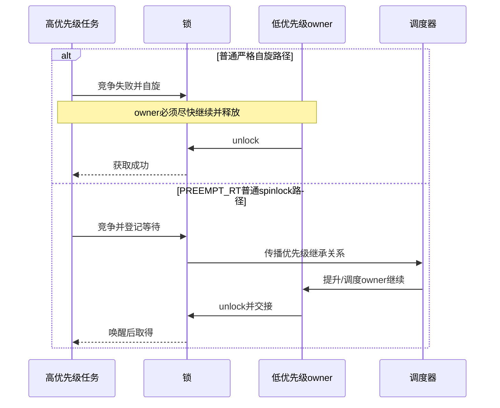

# 第7章\_PREEMPT\_RT生命周期与选型

## 7.1\_普通内核模型还缺什么

前几章默认“spinlock 忙等且不可睡、mutex/rwsem 可睡”来建立主模型。但 PREEMPT_RT 为缩短不可抢占区，会改变普通 `spinlock_t` 的实现语义；设备移除又要求锁之外的生产者停止与对象保活。若不把这两类边界纳入选择，API 在普通路径上正确，仍可能在实时配置或 teardown 中失败。

## 7.2\_PREEMPT\_RT改变了哪段因果链

| 原语 | 普通内核核心行为 | PREEMPT_RT 重点 | 保留的代价 |
| --- | --- | --- | --- |
| `spinlock_t` | 竞争时自旋并约束抢占 | 多数路径映射为具优先级继承的 RT 锁语义，持锁任务可被调度 | 状态机更复杂，不能用于真正 raw 上下文 |
| `raw_spinlock_t` | 严格自旋 | 继续严格自旋并维持原子上下文 | 不可抢占延迟仍存在 |
| mutex | 可睡 owner/waiter | 使用 RT mutex 基础增强优先级处理 | 调度和继承链成本 |
| rwsem | 多读单写可睡 | 实时性与读并发、公平策略重新权衡 | 不能假定普通配置的时延特征 |

被移除的“长时间关闭抢占”成本由可调度等待、优先级继承和线程化执行上下文替代；真正 hardirq/NMI、调度器和极底层状态仍需 raw 锁。因而不能把 `raw_spinlock_t` 当性能升级，也不能认为 PREEMPT_RT 让任何持锁路径都可以睡眠。

## 7.3\_配置分支的端到端对比

## 7.4\_锁不能独自解决对象生命周期

任务在调用 `lock()` 前已经拿着锁对象地址。若另一路径可以并发释放整个对象，获取动作本身就可能 UAF。正确 teardown 通常需要：

锁负责阶段内共享状态一致性；kref、RCU、设备核心引用、completion 或 cancel/flush 协议负责证明访问者已经离开。两种证明不能互换。

## 7.5\_验证与可观察证据

| 工具/现象 | 能证明什么 | 不能证明什么 |
| --- | --- | --- |
| Lockdep 无告警 | 已启用、已接入且已执行路径未发现规则冲突 | 未执行路径与对象生命周期正确 |
| `might_sleep()`/原子睡眠告警 | 某路径在不允许调度的上下文睡眠 | 所有锁序正确 |
| lock contention trace/stat | 哪些锁、调用点和等待时间突出 | 业务不变量一定正确 |
| hung task/soft lockup | 长等待或 CPU 长时间无法推进 | 自动定位唯一根因 |
| KCSAN/KASAN | 已执行路径中的数据竞争或内存错误 | 没有报告就不存在竞态 |

Lockdep 的配置、状态生命周期和停检边界统一见 [Linux Lockdep 专题](../lockdep/大纲.md#1.1_专题定位)。

## 7.6\_选择矩阵

| 问题特征 | 首选起点 | 改选条件 |
| --- | --- | --- |
| 不可睡、临界区严格短小 | `spinlock_t` | 真正 raw 上下文且子系统明确要求时才用 raw |
| 可睡、单一 owner 排他 | mutex | 需要并行读且临界区足够长时评估 rwsem |
| 可睡、多读单写 | rwsem | 写延迟、缓存争用或读区太短时回到 mutex/其他模型 |
| 标量一致快照、读者可重试 | seqcount | 有可释放指针或副作用时组合 RCU/引用或改用锁 |
| 读多写少、旧对象可延迟回收 | RCU | reader 必须阻止写者或需要强一致修改时用锁 |
| 等待条件或完成点 | waitqueue/completion | 它们不是共享状态互斥原语 |

## 7.7\_专题验收清单

- 锁保护的业务不变量和锁对象生命周期是否分别有证明？
- 所有调用现场的进程、softirq、hardirq、NMI 与 PREEMPT_RT 边界是否明确？
- 竞争失败后究竟自旋、睡眠、返回错误还是定向 handoff？
- 锁序是否固定，外部回调和 cancel/flush 是否会反向等待？
- 选择 rwsem 是否基于可测量的读并发收益，而非“读多”标签？
- 当前结论是跨版本契约、Linux 6.12.20 实现，还是本机 `.config` 的部署事实？

## 7.8\_源码与专题出口

Linux 6.12.20 的固定提交、当前开发工作树差异和配置边界见[锁源码总阅读索引](../../../../../research/source_reading/locking/navigation/P01_Linux_6.12_锁源码总阅读索引.md#1.1_版本边界与阅读任务)。继续研究锁序验证进入 [Lockdep 专题](../lockdep/大纲.md)；研究快照、等待或延迟回收分别进入[序列计数器](../sequence_counters/大纲.md)、[等待队列与完成量](../waiting_notification/大纲.md)和 [RCU](../rcu/大纲.md)。

上一篇：[rwsem 读写汇聚与唤醒](P06_rwsem读写汇聚与唤醒.md)。
