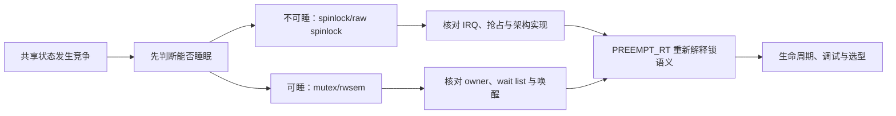

# 第1章\_Linux\_锁机制专题大纲

## 1.1\_专题定位

锁不是一个“调用 `lock()` 就安全”的 API 集合，而是一套由 **竞争状态、所有者、等待者、执行上下文和唤醒路径** 共同组成的分布式协议。本专题从不同上下文为什么需要不同等待策略出发，先建立一把锁的完整操作周期，再映射到 Linux 6.12.20 的 spinlock、mutex、rwsem 与 PREEMPT_RT 分支。

## 1.2\_因果学习链

1. [自旋锁](P01_自旋锁.md)：从不可睡上下文和本地中断递归竞争认识 spinlock。
2. [互斥锁与读写信号量](P02_互斥锁与读写信号量.md)：建立可睡互斥、读写并发和接口边界。
3. [锁的统一状态与通信周期](P03_锁的统一状态与通信周期.md)：用 S0～S7 统一解释快路径、竞争登记、阻塞/自旋、所有权交接和退出。
4. [spinlock 实现与上下文边界](P04_spinlock实现与上下文边界.md)：把包装层、raw 锁、架构原子操作、IRQ/抢占状态映射到 Linux。
5. [mutex 慢路径与所有权交接](P05_mutex慢路径与所有权交接.md)：追踪 owner、wait list、乐观自旋、睡眠和 handoff。
6. [rwsem 读写汇聚与唤醒](P06_rwsem读写汇聚与唤醒.md)：解释读者批量放行、写者独占和等待者队列怎样共同推进。
7. [PREEMPT_RT、生命周期与选型](P07_PREEMPT_RT生命周期与选型.md)：用实时配置、停机顺序、诊断证据和决策表收束专题。

每篇都回答“状态存在哪里、谁写、谁读、怎样传播”。Linux 6.12.20 的版本化入口见 [锁源码总阅读索引](../../../../../research/source_reading/locking/navigation/P01_Linux_6.12_锁源码总阅读索引.md#1.1_版本边界与阅读任务)。

## 1.3\_锁协议验证

[Linux Lockdep 专题](../lockdep/大纲.md#1.1_专题定位)解释标准锁原语怎样上报身份、取得、释放与 IRQ 状态，检查 current 持锁账本和全局锁类依赖图。锁专题负责功能语义，Lockdep 专题负责动态协议验证，两者不能互相替代。

## 1.4\_阅读完成标准

- 能从执行上下文和临界区长度解释为什么选择自旋或睡眠，而不是背 API 表。
- 能画出竞争者怎样从快速尝试进入自旋或等待队列，再由释放者交接所有权。
- 能指出 mutex 与 rwsem 的共享状态地址、写入者、读取者和唤醒方向。
- 能解释 PREEMPT_RT 为什么改变 `spinlock_t` 的调度语义，却保留 `raw_spinlock_t` 的原子上下文职责。
- 能把锁的互斥保证、对象生命周期和 Lockdep 证据分开。
