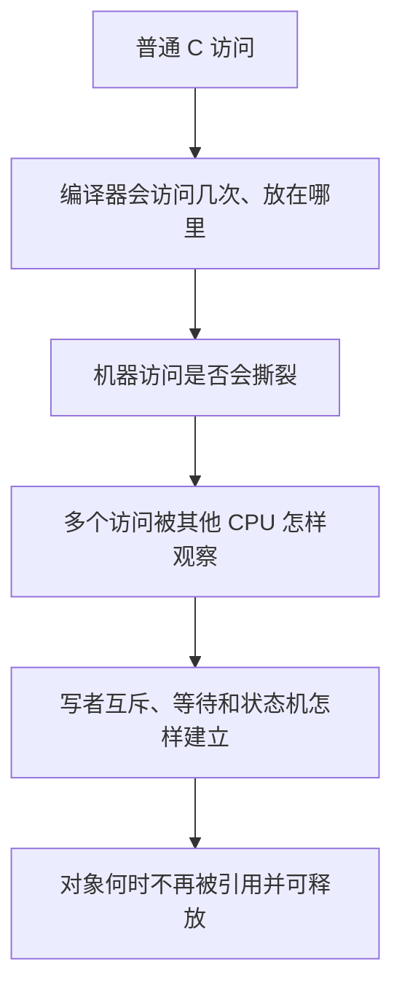
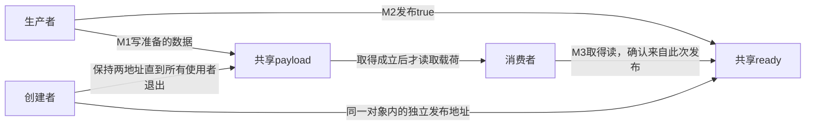
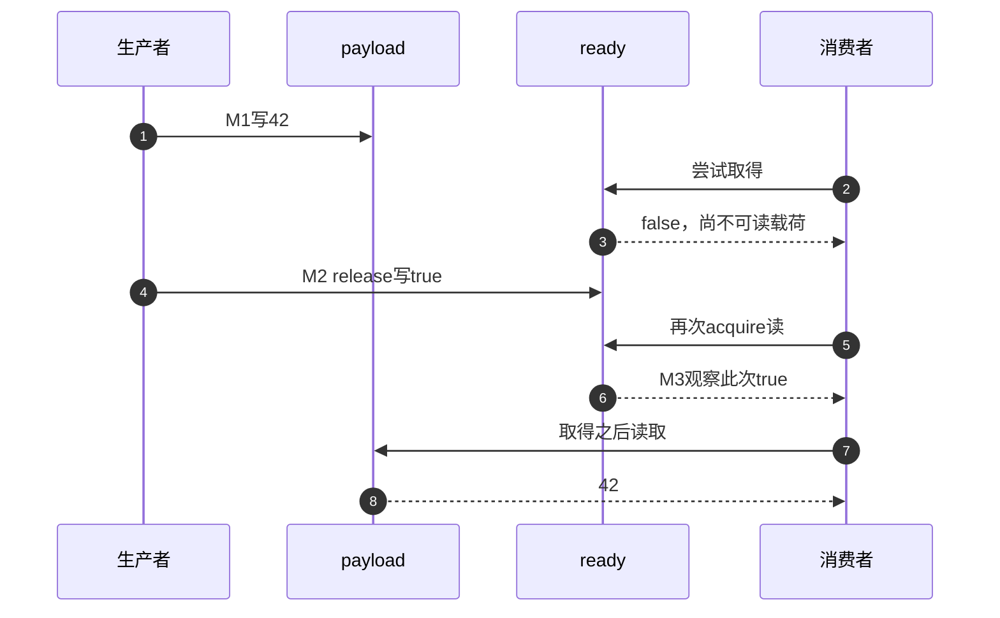
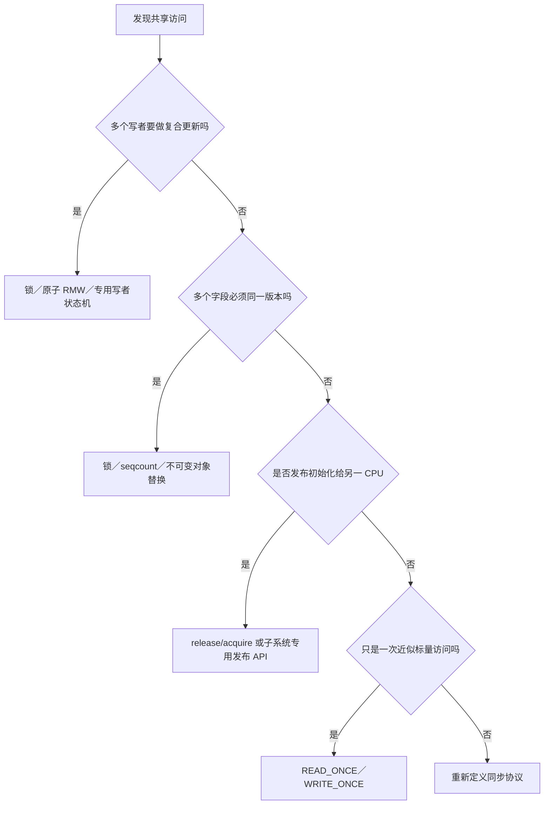

# 第1章\_READ\_WRITE\_ONCE\_与\_SMP\_内存顺序原语

在[执行路径先修](../../P01_同一对象的多条执行路径.md#1.2_运行所有允许的交错)中，我们用互斥排除了计数更新的交错窗口。现在换一个问题：生产者写入数据以后设置“准备好”，消费者看见这个标志就读取数据。这里没有两个写者争抢加一，为什么仍不能只按C源码从上到下推断结果？

本章用一次消息发布建立答案。先看到完整程序，再把它拆成访问、顺序、拥有关系和寿命四项责任。Linux接口在各自能解决的缺口出现以后再进入；完整硬件实现留在明确链接的先修与后续章节。

## 1.1\_Linux\_面对的不是一个乱序问题

本章沿用 [SMP（Symmetric Multiprocessing，对称多处理）](../../../../foundations/computer_architecture/cache_coherence/P01_缓存一致性问题与缓存行.md#1.1.1_SMP的中英文全称与系统模型)的多个逻辑 CPU 与共享内存模型，只讨论 Linux 怎样约束这些 CPU 对普通内存的访问；CPU 拓扑、缓存一致性和 `CONFIG_SMP` 的构建含义不在这里重复定义。

设消息有载荷字段payload和就绪标志ready两个地址。只保证ready本身读写完整，并不能推出观察到ready以后读到的是哪一版payload；只让消费者每次真正读取ready，也没有说明载荷写入和标志发布之间的顺序。先按这些不同缺口区分五层问题，再看工具。下文把READ_ONCE和WRITE_ONCE这组访问宏简称为ONCE：



| 层次 | 典型工具 | 不会顺带解决 |
| --- | --- | --- |
| 单次编译器访问 | `READ_ONCE()` / `WRITE_ONCE()` | 跨 CPU happens-before |
| 不撕裂访问 | 类型、宽度、对齐、架构保证 | 原子 `x++`、多字段快照 |
| 跨访问顺序 | `smp_*()`、acquire/release、锁 | 写者所有权、对象回收 |
| 原子状态转换/互斥 | 原子读改写（Read-Modify-Write，RMW）、锁 | 任意对象生命周期 |
| 生命周期 | RCU、refcount/kref、锁定所有权 | 自动维护字段不变量 |

把其中任意一个 API 说成“保证线程安全”，都会掩盖剩余责任。

## 1.2\_同一个消息传递例子怎样暴露四层缺口

下面是需要分析的错误协议片段，不是可以直接放进两个C线程运行的程序。CPU0和CPU1只是两个处理器的编号。假定对象在整个过程都有效，只有一个生产者写payload一次，消费者只在ready成立以后读取：

```c
/* CPU0 */                         /* CPU1 */
obj->payload = 42;                 if (obj->ready)
obj->ready = 1;                         use(obj->payload);
```

必须逐层追问：

1. 编译器会不会把 `ready` 缓存在寄存器、合并读取或移动访问？
2. `ready` 和 `payload` 的硬件访问宽度与对齐是否受支持？
3. CPU1 看到 `ready == 1` 时，是否已经按协议看到 `payload = 42`？
4. 若 CPU0 再次改写或释放 `obj`，CPU1 的使用期由什么保护？

消费者读到的ready和payload来自两个不同地址。在没有相应约束时，源码中先写payload、后写ready，不足以让跨CPU观察者也按这个关系使用数据。编译器可能改变实际访问，机器对不同地址的观察也有自己的规则。缓存一致性即使为单个位置维护一致顺序，也不会自动替程序建立这两个位置的发布协议。

ONCE只直接约束第一问中的访问生成。发布（release）把此前准备的数据接到发布写上；取得（acquire）把消费者随后使用数据接到取得读上。关键是取得读必须观察到这次发布，不能把不同地址上两个名字相似的操作硬配成一对。锁或单写者协议另外解决写写竞争，引用与拥有关系另外解决回收。

### 1.2.1\_从准备到使用的四个阶段

这里没有全局的“当前阶段”变量。生产者有自己的执行进度，消费者有自己的观察结果，payload和ready是共享存储；它们共同组成发布周期。为了先证明一次交接，本节禁止重复覆盖载荷和复用ready。

| 阶段 | 写入者、地址和状态变化 | 后续读取者与进入条件 |
| --- | --- | --- |
| M0建立 | 创建者初始化payload=0、ready=false | 两角色启动前对象已存在，尚不可消费 |
| M1准备 | 唯一生产者写payload=42 | 消费者此时不读payload，无并发改写 |
| M2发布 | 生产者对ready执行release写true | 消费者对同一ready执行acquire读 |
| M3取得并使用 | 消费者读到此次true，随后读payload | 可以使用已发布数据；创建者仍须等两角色退出才回收 |





这条链移除了“消费者在数据尚未按协议发布时使用它”的窗口；代价是消费者必须经过有序交接，且本例只准写一次。若要连续生产、允许多个写者或提前取消，必须增加确认、代际、队列或其他所有权协议，不能反复把ready改回false就宣称循环版本已经正确。

### 1.2.2\_先运行一个有明确语言契约的发布程序

普通用户空间程序不能直接把Linux宏贴进去。因此先用C++17标准原子（std::atomic）运行同一发布任务：ready是原子对象，payload是普通整数。release与acquire建立跨线程的先行关系（happens-before），使写payload先于消费者读payload；单写者和不再覆盖的前提同样不可少。

下面的实验重复100轮独立的一次发布，每轮先结束旧线程再结束对象寿命。它不测试连续复用协议，也不把标准C++模型等同于Linux内核内存模型（Linux Kernel Memory Model，LKMM）。

```cpp
// C++17发布实验：使用标准原子，不替代Linux内核原语或LKMM验证。
#include <atomic>
#include <exception>
#include <iostream>
#include <thread>

struct shared_record {
    int payload = 0;
    std::atomic<bool> ready{false};
};

int main()
{
    try {
        for (int trial = 0; trial < 100; ++trial) {
            shared_record record; // 每轮新对象，不重置仍被使用的发布位。
            const int expected = 42 + trial;
            std::thread producer([&record, expected] {
                record.payload = expected;
                record.ready.store(true, std::memory_order_release);
            });
            while (!record.ready.load(std::memory_order_acquire))
                std::this_thread::yield(); // 降低忙等侵占，不承担数据同步。
            const int observed = record.payload; // 在join以前读取载荷。
            producer.join(); // 结束线程寿命，然后本轮对象才可离开作用域。
            if (observed != expected) {
                std::cerr << "unexpected payload\n";
                return 1;
            }
        }
        std::cout << "100 one-shot publications passed\n";
    } catch (const std::exception &error) {
        std::cerr << "thread experiment failed: " << error.what() << '\n';
        return 1;
    }
    return 0;
}
```

在仓库根目录，用支持C++17与线程的工具链编译[同名材料](../../../../../labs/kernel/memory_ordering/materials/publication.cpp)。例如Linux用户环境中运行：

```bash
c++ -std=c++17 -Wall -Wextra -Werror -O2 -pthread \
  labs/kernel/memory_ordering/materials/publication.cpp -o /tmp/publication
/tmp/publication
```

预期打印`100 one-shot publications passed`。不访问设备、不需要内核模块，生成的程序位于临时目录。yield只是让出一次调度机会的提示，不发布数据、不保证对方立刻运行，也不是保证超时返回的机制；正确性来自同一ready上的发布和取得。如果线程不能获得运行机会，轮询也没有完成时限，生产接口通常应另选适合负载的等待机制。

注意payload在join以前已经读出。join随后保证线程结束和对象可以离开作用域；不能倒过来把本例的首次读取归功于尚未发生的join。ready第一次为false时，循环不访问payload；观察到true时，只有生产者那次release写会提供这个值，因而发布来源明确。

本批宿主严格编译运行通过，只证明这份程序在该环境成功执行；保证的依据是语言契约，不能由“跑100次没错”推导所有实现都正确。不要把acquire改成relaxed后继续用普通payload做竞态演示：这样会破坏先行关系，得到C++数据竞争与未定义行为，而不是一个有完整结果集合的弱序实验。

硬件层为什么允许反直觉结果，见[体系结构内存顺序专题](../../../../foundations/computer_architecture/memory_ordering/大纲.md)。本专题从这里开始只讨论 Linux 如何表达契约。

## 1.3\_Linux\_原语不是强弱排行榜

下面这些接口不能按“越往下越强”机械排序：

| 原语族 | 表达的主要意图 |
| --- | --- |
| ONCE | 这个共享访问必须按 Linux 认可的方式出现一次 |
| `barrier()` | 编译器不能让相关内存访问跨越此点 |
| `smp_rmb/wmb/mb()` | SMP 普通内存中的特定方向顺序 |
| `smp_load_acquire()` / `smp_store_release()` | 围绕具体取得/发布访问的单向协议 |
| `atomic_*_{relaxed,acquire,release}()` | 原子 RMW 与指定顺序组合 |
| locks | 互斥/串行化加 acquire/release 等契约 |
| RCU/seqcount/waitqueue | 把顺序嵌入更完整的子系统状态机 |

本例在Linux中对应的是发布方对共享ready使用`smp_store_release()`，消费方用`smp_load_acquire()`取得并检查同一值。它们围绕一个具体访问建立方向性约束。release/acquire不是所有方向的完整屏障；两个CPU各先写自己变量、再读对方变量的Store Buffering（存储缓冲，SB）问题需要另画事件图，不能凭本例成功就套用。该反例进入[屏障与顺序域](P03_Linux_SMP屏障与顺序域.md)。

RMW表示“读取旧值、基于旧值产生新值并提交”作为不可分操作。它可解决某个状态转换被两个写者同时完成的问题，却不自动承担上述跨地址发布。后面会分别建立这些家族；本表保留查询入口，不要求现在背完。

## 1.4\_先写参与者和状态地址

任何屏障审查都先填这张表：

| 项目 | 示例答案 |
| --- | --- |
| 生产者 | CPU0 更新线程 |
| 消费者 | CPU1 中断处理或查询线程 |
| 载荷地址 | `obj->payload` |
| 发布地址 | 本例为同一`obj->ready`；共享指针是另一种设计 |
| 发布写 | 对ready写1的release操作 |
| 取得读 | 对同一ready的acquire读观察到这次1 |
| 禁止结果 | 得到 `ready == 1` 却看到旧 payload |
| 多写者协调 | 单写者、锁或比较并交换（Compare-And-Swap，CAS）状态机 |
| 生命周期 | 静态对象、锁、RCU 或引用计数 |

如果连发布地址和禁止结果都无法指出，直接添加 `smp_mb()` 只会让代码变慢且仍可能错误。

## 1.5\_READ\_ONCE\_的准确入口

```c
u32 state = READ_ONCE(dev->state);
WRITE_ONCE(dev->state, NEW_STATE); /* NEW_STATE表示应用事先定义的新状态常量。 */
```

ONCE适合表达“这个位置会并发变化，这里需要一次受约束访问”。Linux内核内存模型（Linux Kernel Memory Model，LKMM）用事件和关系判断协议允许哪些观察结果；内核并发检查器（Kernel Concurrency Sanitizer，KCSAN）在实际运行中抽样检查相关访问。两者可以利用访问标记，但用途与证明能力不同，不能因为都没有指出问题就认为完整协议成立。

如果把本例的ready两端只换成WRITE_ONCE和READ_ONCE，它们仍没有建立载荷发布与随后取得的完整顺序。反过来，若两端已经由共同的锁协议保护，也不应为“多一重保险”机械叠加所有屏障。先指出尚缺的保证，再选择相应原语。

它不提供：

- acquire/release 或全屏障；
- 读—改—写不可分割性；
- 多字段一致快照；
- 多写者互斥；
- 任意宽度和任意对齐都不撕裂；
- 对象取消发布后的存活保证。

固定Linux证据从[源码与模型导读](../../../../../research/source_reading/memory_ordering/navigation/P01_Linux_6.12_LKMM_源码与模型导读.md#1.3_源码侧访问和屏障定义)进入，使用NXP官方dfaf2136对应6.12.20，不以本地实验提交为证据。宏实现、反汇编和KCSAN边界见下一章；硬件撕裂的完整推导见[访问粒度、对齐与撕裂](../../../../foundations/computer_architecture/memory_ordering/P02_访问粒度_对齐与撕裂.md)。这里“不提供acquire”不排除特定架构为ONCE携带额外约束，不能反过来依赖偶然更强的实现。

## 1.6\_从需求选择第一候选



随后还要单独检查等待/唤醒和生命周期。选择 `atomic_t` 只说明更新不可分割，不说明等待者会醒；选择 release/acquire 只说明发布顺序，不说明旧对象可释放。

## 1.7\_子系统接口优先

- RCU 指针使用 `rcu_assign_pointer()` / `rcu_dereference()`，因为接口还携带依赖、类型检查和读侧契约。
- 锁保护字段依赖锁 API 的完整顺序与互斥语义，锁内不要机械叠加 ONCE/屏障。
- seqcount 通过版本重试维护多字段快照，不能由多个独立 ONCE 替代。
- waitqueue/completion 同时涉及条件状态、入队、唤醒和内存顺序，不能只看一条屏障。
- MMIO 和 DMA 使用各自 accessor/API，普通 `smp_*()` 不是设备协议。

## 1.8\_阅读和验证路线

```text
P02：先证明编译器生成了协议要求的访问
P03～P05：再证明普通内存的顺序边正确
P06～P07：组合原子、锁和执行上下文语义
P08～P09：用 LKMM/Litmus 检查允许结果
P10：回到 RCU、MMIO、DMA、等待和生命周期边界
```

配套 [READ_ONCE 反汇编实验](../../../../../labs/kernel/memory_ordering/P01_READ_ONCE_编译器访问实验/README.md)验证编译器层，[LKMM Litmus 实验](../../../../../labs/kernel/memory_ordering/P02_LKMM_Litmus_消息传递与屏障/README.md)验证模型层。两者不能互相代替。

## 1.9\_本章验收

先做三个小练习。把载荷改为两个普通整数，让生产者先后写入，消费者在一次成功取得以后再读取；为什么这不需要把两个整数也都改成原子？再把载荷读取移到成功取得之前，原有ready协议还保护了那次提前读取吗？最后假设生产者发布以后马上写下一份数据，哪一个“只写一次”的前提被破坏？

第一个修改仍由同一发布写之前的准备连接到取得之后的读取，前提是之后没有并发覆盖。第二个修改把使用移出了取得保护的方向，不能用后来成功的acquire追认早先访问。第三个修改让消费者读取期间可能又有写者，发布上一版不等于对下一轮授予排他所有权；必须先建立确认或新的版本/队列协议。不要把错误版本直接改成多线程竞态测试。

用这些推导回顾本章：

1. 能把编译器访问、撕裂、跨 CPU 顺序、互斥和生命周期分层。
2. 能解释 ONCE 为什么不是 acquire/release。
3. 能为一段代码写出参与者、发布地址、取得读和禁止结果。
4. 能按需求区分 ONCE、原子 RMW、一致快照和发布协议。
5. 能说明为什么优先使用 RCU、锁、seqcount、等待队列等子系统接口。

下一篇：[编译器共享访问与 READ/WRITE_ONCE](P02_编译器共享访问与READ_WRITE_ONCE.md)。
