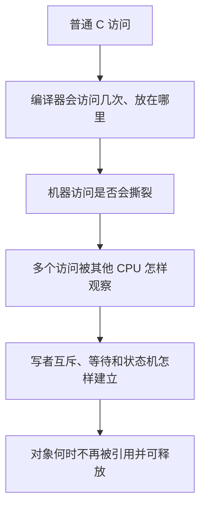
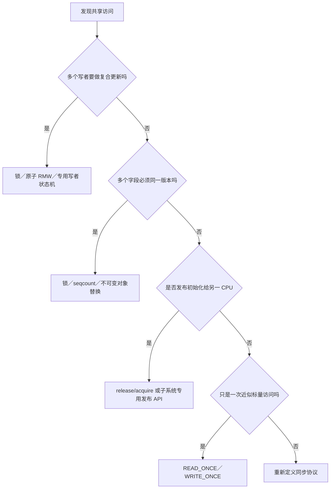

# 第1章\_READ\_WRITE\_ONCE\_与\_SMP\_内存顺序原语

## 1.1\_Linux\_面对的不是一个乱序问题

一段内核并发代码至少同时面对五层问题：



| 层次 | 典型工具 | 不会顺带解决 |
| --- | --- | --- |
| 单次编译器访问 | `READ_ONCE()` / `WRITE_ONCE()` | 跨 CPU happens-before |
| 不撕裂访问 | 类型、宽度、对齐、架构保证 | 原子 `x++`、多字段快照 |
| 跨访问顺序 | `smp_*()`、acquire/release、锁 | 写者所有权、对象回收 |
| 原子状态转换/互斥 | atomic RMW、锁 | 任意对象生命周期 |
| 生命周期 | RCU、refcount/kref、锁定所有权 | 自动维护字段不变量 |

把其中任意一个 API 说成“保证线程安全”，都会掩盖剩余责任。

## 1.2\_同一个消息传递例子怎样暴露四层缺口

```c
/* CPU0 */                         /* CPU1 */
obj->payload = 42;                 if (ready)
ready = 1;                             use(obj->payload);
```

必须逐层追问：

1. 编译器会不会把 `ready` 缓存在寄存器、合并读取或移动访问？
2. `ready` 和 `payload` 的硬件访问宽度与对齐是否受支持？
3. CPU1 看到 `ready == 1` 时，是否已经按协议看到 `payload = 42`？
4. 若 CPU0 再次改写或释放 `obj`，CPU1 的使用期由什么保护？

ONCE 只直接回答第一问中的“一次受约束访问”；release/acquire 回答第三问；锁或单写者协议回答写写竞争；RCU/refcount/锁定所有权回答第四问。

硬件层为什么允许反直觉结果，见[体系结构内存顺序专题](../../../../foundations/computer_architecture/memory_ordering/大纲.md)。本专题从这里开始只讨论 Linux 如何表达契约。

## 1.3\_Linux\_原语不是强弱排行榜

下面这些接口不能按“越往下越强”机械排序：

| 原语族 | 表达的主要意图 |
| --- | --- |
| ONCE | 这个共享访问必须按 Linux 认可的方式出现一次 |
| `barrier()` | 编译器不能让相关内存访问跨越此点 |
| `smp_rmb/wmb/mb()` | SMP 普通内存中的特定方向顺序 |
| `smp_load_acquire()` / `smp_store_release()` | 围绕具体取得/发布访问的单向协议 |
| `atomic_*_{relaxed,acquire,release}()` | 原子 RMW 与指定顺序组合 |
| locks | 互斥/串行化加 acquire/release 等契约 |
| RCU/seqcount/waitqueue | 把顺序嵌入更完整的子系统状态机 |

例如 `smp_store_release()` 在发布模式中通常比一条无差别 `smp_mb()` 更精确，但它不能解决 SB 模式所需的 Store→Load 双向顺序。正确选择来自事件图，不来自 API 名字长度。

## 1.4\_先写参与者和状态地址

任何屏障审查都先填这张表：

| 项目 | 示例答案 |
| --- | --- |
| 生产者 | CPU0 更新线程 |
| 消费者 | CPU1 中断处理或查询线程 |
| 载荷地址 | `obj->payload` |
| 发布地址 | `obj->ready` 或共享指针 |
| 发布写 | `ready = 1` |
| 取得读 | 读取 `ready` 得到 1 |
| 禁止结果 | 得到 `ready == 1` 却看到旧 payload |
| 多写者协调 | 单写者、锁或 CAS 状态机 |
| 生命周期 | 静态对象、锁、RCU 或引用计数 |

如果连发布地址和禁止结果都无法指出，直接添加 `smp_mb()` 只会让代码变慢且仍可能错误。

## 1.5\_READ\_ONCE\_的准确入口

```c
u32 state = READ_ONCE(dev->state);
WRITE_ONCE(dev->state, NEW_STATE);
```

ONCE 适合表达“这个位置会并发变化，这里需要一次受约束访问”。它防止一组破坏无锁协议的编译器优化，并让 LKMM/KCSAN 等工具识别访问意图。

它不提供：

- acquire/release 或全屏障；
- 读—改—写不可分割性；
- 多字段一致快照；
- 多写者互斥；
- 任意宽度和任意对齐都不撕裂；
- 对象取消发布后的存活保证。

宏实现、反汇编和 KCSAN 边界见下一章；硬件撕裂的完整推导见[访问粒度、对齐与撕裂](../../../../foundations/computer_architecture/memory_ordering/P02_访问粒度_对齐与撕裂.md)。

## 1.6\_从需求选择第一候选



随后还要单独检查等待/唤醒和生命周期。选择 `atomic_t` 只说明更新不可分割，不说明等待者会醒；选择 release/acquire 只说明发布顺序，不说明旧对象可释放。

## 1.7\_子系统接口优先

- RCU 指针使用 `rcu_assign_pointer()` / `rcu_dereference()`，因为接口还携带依赖、类型检查和读侧契约。
- 锁保护字段依赖锁 API 的完整顺序与互斥语义，锁内不要机械叠加 ONCE/屏障。
- seqcount 通过版本重试维护多字段快照，不能由多个独立 ONCE 替代。
- waitqueue/completion 同时涉及条件状态、入队、唤醒和内存顺序，不能只看一条屏障。
- MMIO 和 DMA 使用各自 accessor/API，普通 `smp_*()` 不是设备协议。

## 1.8\_阅读和验证路线

```text
P02：先证明编译器生成了协议要求的访问
P03～P05：再证明普通内存的顺序边正确
P06～P07：组合原子、锁和执行上下文语义
P08～P09：用 LKMM/Litmus 检查允许结果
P10：回到 RCU、MMIO、DMA、等待和生命周期边界
```

配套 [READ_ONCE 反汇编实验](../../../../../labs/kernel/memory_ordering/P01_READ_ONCE_编译器访问实验/README.md)验证编译器层，[LKMM Litmus 实验](../../../../../labs/kernel/memory_ordering/P02_LKMM_Litmus_消息传递与屏障/README.md)验证模型层。两者不能互相代替。

## 1.9\_本章验收

1. 能把编译器访问、撕裂、跨 CPU 顺序、互斥和生命周期分层。
2. 能解释 ONCE 为什么不是 acquire/release。
3. 能为一段代码写出参与者、发布地址、取得读和禁止结果。
4. 能按需求区分 ONCE、原子 RMW、一致快照和发布协议。
5. 能说明为什么优先使用 RCU、锁、seqcount、等待队列等子系统接口。

下一篇：[编译器共享访问与 READ/WRITE_ONCE](P02_编译器共享访问与READ_WRITE_ONCE.md)。
