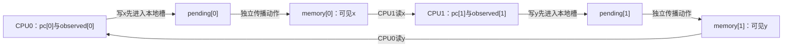
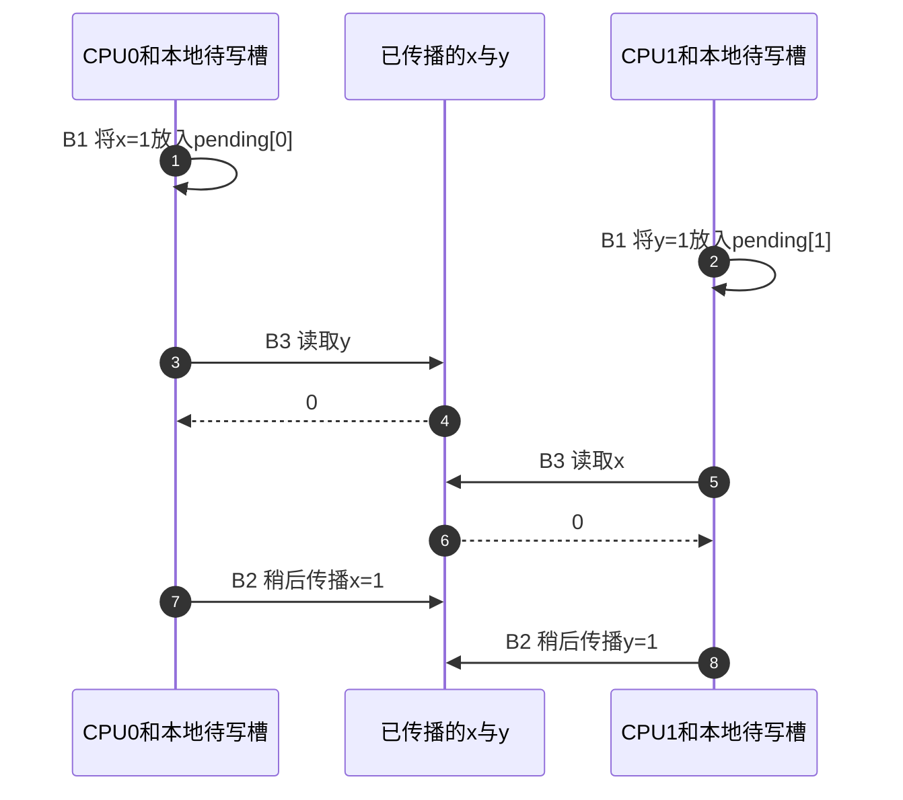

# 第3章\_Linux\_SMP屏障与顺序域

上一章已经看见：空的编译器屏障也能让普通读取留在循环里，却没有生成处理器屏障指令。现在即使编译器按要求生成每次访问，远端观察者仍可能得到不符合源码直觉的组合。本章先确定谁在观察哪块内存，再用两个处理器各写后读的实验，推导缺的是哪一个方向的顺序。

本章中的SMP沿用[对称多处理系统模型](../../../../foundations/computer_architecture/cache_coherence/P01_缓存一致性问题与缓存行.md#1.1.1_SMP的中英文全称与系统模型)：多个逻辑CPU由同一个Linux内核管理并通过共享内存协作。本章只解释普通内存顺序及`CONFIG_SMP=n`的配置边界，设备协议有各自的后续入口。

## 3.1\_先按同步域分类

先看同样一段“填数据，再写就绪标志”。接收者如果是另一个CPU，使用普通可缓存内存；如果是设备读取描述符，还会涉及直接内存访问（Direct Memory Access，DMA）的拥有和一致性规则；如果最后一步写的是设备寄存器，就进入内存映射输入输出（Memory-Mapped I/O，MMIO）的访问契约。语句长得相似，观察者和存储属性却不同。

我们把这一组参与者及受约束的存储范围称为本章的同步域。先明确域，才有资格选择接口，而不是看到barrier就认为互相可换：

| 同步域 | 参与者 | 典型接口 |
| --- | --- | --- |
| 编译器 | 当前编译单元中的优化器 | `barrier()`、ONCE 的 compiler semantics |
| SMP 普通内存 | 多 CPU 访问可缓存普通内存 | `smp_rmb()`、`smp_wmb()`、`smp_mb()` |
| 架构硬件域 | CPU 与架构定义的更广观察者 | `rmb()`、`wmb()`、`mb()` |
| DMA 共享内存 | CPU 与 DMA 设备共享描述符/数据 | `dma_rmb()`、`dma_wmb()` 加 DMA API |
| MMIO | CPU 与设备寄存器/posted write | `readl()`、`writel()`、relaxed 变体及设备协议 |

同一体系结构可能让几个接口映射到相同指令，但调用方仍应按语义域选择。这样配置和架构变化时，代码表达的对象不会改变。

## 3.2\_barrier\_只约束编译器

Linux 6.12.20的barrier定义位于include/linux/compiler.h，它把带memory clobber的空GNU内联汇编封装为编译器屏障，具体入口见[固定源码导读](../../../../../research/source_reading/memory_ordering/navigation/P01_Linux_6.12_LKMM_源码与模型导读.md#1.3.2_通用屏障)，逐句实现见[编译器barrier](../../../../../research/source_reading/memory_ordering/source_explanations/include/asm-generic/barrier.h.md#1.4_barrier怎样约束编译器)。上一章的完整C材料已经用同类空汇编观察过循环读取变化。

空内联汇编通常不生成硬件屏障指令。memory clobber是给编译器的约束，表示汇编可能影响内存，限制相关访问跨过此点；它不是“刷新所有寄存器或缓存”的运行时操作。它适合保护编译器层顺序，例如某些低层状态转换。单独用于两个CPU的消息传递时，机器仍按自己的内存顺序规则执行，编译器约束不能替代处理器需要的顺序约束。

```c
WRITE_ONCE(data, 42);
barrier();
WRITE_ONCE(flag, 1); /* 不能据此声称 CPU1 看到 flag 后一定看到 data。 */
```

## 3.3\_SMP\_屏障给普通内存增加方向

| 原语 | 最小关注方向 | 典型用途 | 不保证 |
| --- | --- | --- | --- |
| `smp_rmb()` | 屏障前相关读 → 屏障后相关读 | 两阶段读取 | 写者互斥、MMIO 完成 |
| `smp_wmb()` | 屏障前相关写 → 屏障后相关写 | 普通内存载荷/标志顺序 | 写后读顺序、设备协议 |
| `smp_mb()` | 屏障前相关读写 → 屏障后相关读写 | SB、复杂状态机 | 自动形成条件和生命周期 |

“最小关注方向”用于理解选择，不应自行假定某款架构实现恰好更强的效果可以成为通用 Linux 契约。固定配置怎样选中公共包装、检查器如何接入而不替代功能屏障，见[SMP模块导读](../../../../../research/source_reading/memory_ordering/navigation/P03_SMP屏障的配置与调用层次.md#3.3_一次公共屏障的路径)及[三种公共入口实现](../../../../../research/source_reading/memory_ordering/source_explanations/include/asm-generic/barrier.h.md#1.3_三种公共SMP屏障的配置分支)。

体系结构层为什么需要读、写和全屏障，见[屏障、Acquire/Release 与依赖顺序](../../../../foundations/computer_architecture/memory_ordering/P05_屏障_Acquire_Release与依赖顺序.md)。

## 3.4\_屏障必须成对进入一条协议

消息传递（Message Passing，MP）沿用P01的一次发布：data初始为0，flag初始为0，只有一个生产者准备data一次，再发布flag；对象在双方访问结束前不回收。消费者观察到此次flag=1，才允许使用data。这些前提不能靠屏障补出来。

Linux片段用显式写屏障和读屏障连接它：

```c
/* CPU0：生产者。 */
WRITE_ONCE(data, 42);
smp_wmb();
WRITE_ONCE(flag, 1);

/* CPU1：消费者。 */
if (READ_ONCE(flag)) {
    smp_rmb();
    use(READ_ONCE(data));
}
```

发布端写屏障排列两次写；取得端读屏障排列两次读；消费者还必须读取到发布标志，才能把两边连接起来。只在生产者加 `smp_wmb()`，不能阻止消费者提前读取载荷；只在消费者加 `smp_rmb()`，不能阻止生产者先传播 flag。

这一模式通常更适合用 `smp_store_release()` / `smp_load_acquire()` 表达，下一章会解释为什么它把顺序直接绑定到发布位置。

## 3.5\_为什么\_SB\_需要全屏障而不是写屏障

换一个约束：两路各设置自己的标志，然后查看对方是否设置。x和y初始都为0。我们想禁止两边都声称“对方尚未设置”。这不是前一节的生产者发布、消费者取得，而是两个对等参与者；通常称为存储缓冲（Store Buffering，SB）测试。

```c
/* CPU0 */                         /* CPU1 */
WRITE_ONCE(x, 1);                  WRITE_ONCE(y, 1);
smp_mb();                          smp_mb();
r0 = READ_ONCE(y);                 r1 = READ_ONCE(x);
```

要禁止 `r0 == 0 && r1 == 0`，每边都要限制 Store→Load。`smp_wmb()` 只提供写→写方向，后面却是 Load；`smp_rmb()` 只提供读→读方向，前面却是 Store。接口选择来自事件方向，不来自“越轻越好”的性能直觉。

### 3.5.1\_先用单槽待写模型重建坏结果

设每个CPU有一个自己的待写槽。写指令先把1放进该槽，稍后的传播动作才把它交到另一方可读的普通内存；读取对方变量只查已传播的值。如果不约束写后读，两个CPU都能先排入自己的写，再在各自写传播之前读取对方，于是都读到0。编译器完全按源码发出“写、读”也没有阻止这个结果。

这个模型刻意简化为两个角色、两个地址、每角色一写一读；它只展示一种坏结果怎样形成。真实处理器不一定按这组字段实现，Linux内存模型还包含其他关系，不能用这个模型的结果集合代替它。



这里也不是一个总状态变量。pc记录各角色指令走到哪里，pending记录写是否还没传播，memory保存本模型唯一的已传播值，observed保存已经发生的读取结果。解释器每次选择一个允许事件，复制整份状态后进入一个分支。

| 阶段或事件 | 由谁写什么地址 | 下一步约束 |
| --- | --- | --- |
| B0初始化 | 创建者令pc、pending、memory均为0 | 两路独立开始 |
| B1发出写 | 本CPU令pending[cpu]=true，pc变1 | 已发出不等于另一方可读 |
| B2传播 | 解释器选择传播事件，将memory[cpu]=1并清pending | 可发生在本CPU读取之前或之后 |
| B3读取 | 本CPU把memory[另一方]复制到observed，pc变2 | 加约束模式要求自己的B2先完成 |
| B4观察结束 | 两路pc都为2时收集结果 | 后来的传播不再修改旧observed |



### 3.5.2\_运行完整方向实验

下面是单线程C解释器，不制造C语言数据竞争。fence=true时，仅在自己的pending清除之后允许读取对方变量。这个规则表达本例所需的“本方写传播先于本方后续读”；它没有模拟真实屏障指令、缓存系统或所有屏障方向。

```c
/* C11顺序解释器：两份单槽待写状态，不是LKMM或处理器模拟器。 */
#include <assert.h>
#include <stdbool.h>
#include <stdio.h>

struct model {
    unsigned int pc[2], memory[2], observed[2];
    bool pending[2];
};
struct results {
    unsigned int paths, mask, counts[4];
};

static void explore(struct model state, bool fence, struct results *result)
{
    if (state.pc[0] == 2 && state.pc[1] == 2) {
        unsigned int pair = 2 * state.observed[0] + state.observed[1];
        ++result->paths;
        ++result->counts[pair];
        result->mask |= 1U << pair;
        return; /* 读取结束以后才传播的写不再改变已记录的结果。 */
    }
    for (unsigned int cpu = 0; cpu < 2; ++cpu) {
        if (state.pc[cpu] == 0) {
            struct model next = state;
            next.pending[cpu] = true; /* 自己的写先进入本地待写槽。 */
            next.pc[cpu] = 1;
            explore(next, fence, result);
        } else if (state.pc[cpu] == 1 && (!fence || !state.pending[cpu])) {
            struct model next = state;
            next.observed[cpu] = next.memory[1 - cpu];
            next.pc[cpu] = 2;
            explore(next, fence, result);
        }
        if (state.pending[cpu]) {
            struct model next = state;
            next.memory[cpu] = 1; /* 独立传播事件使另一角色能看见写。 */
            next.pending[cpu] = false;
            explore(next, fence, result);
        }
    }
}

int main(void)
{
    struct model initial = {0};
    struct results plain = {0}, fenced = {0};
    explore(initial, false, &plain);
    explore(initial, true, &fenced);
    assert(plain.mask == 15U && fenced.mask == 14U);
    for (unsigned int pair = 0; pair < 4; ++pair)
        printf("%u/%u: plain=%s fenced=%s\n", pair / 2, pair % 2,
               plain.counts[pair] ? "possible" : "absent",
               fenced.counts[pair] ? "possible" : "absent");
    printf("model paths: plain=%u fenced=%u; not a hardware result\n",
           plain.paths, fenced.paths);
    return 0;
}
```

在仓库根目录编译[同名材料](../../../../../labs/kernel/memory_ordering/materials/store_buffer_model.c)：

```bash
cc -std=c11 -Wall -Wextra -Werror -O2 \
  labs/kernel/memory_ordering/materials/store_buffer_model.c -o /tmp/store_buffer_model
/tmp/store_buffer_model
```

预期结果：

```text
0/0: plain=possible fenced=absent
0/1: plain=possible fenced=possible
1/0: plain=possible fenced=possible
1/1: plain=possible fenced=possible
model paths: plain=74 fenced=20; not a hardware result
```

74与20是这个解释器枚举的事件轨迹数，同一个观察结果可由多条轨迹得到；它们不是发生概率、吞吐量或Linux允许执行数。pc每路最多前进两次，每路最多传播一次，所以递归有限；两边都读完便停止，不把之后无关的传播排列再算一轮结果。

不用相信程序，也能检查0/0为何在加约束后不成立。CPU0必须先传播x再读y；若读y仍为0，就表示y尚未传播。CPU1也必须先传播y再读x；若读x为0，又表示x尚未传播。把这四个条件接起来会要求“x传播先于自身”，形成循环矛盾。去掉任意一边的写后读约束，这条证明就断了。

本批严格编译执行的是上述教学模型。[Linux SB无屏障材料](../../../../../labs/kernel/memory_ordering/P02_LKMM_Litmus_消息传递与屏障/tests/SB+poonceonces.litmus)和[双全屏障材料](../../../../../labs/kernel/memory_ordering/P02_LKMM_Litmus_消息传递与屏障/tests/SB+fencembonceonces.litmus)则是另一层：它们交给herd7按LKMM判定，预期分别是允许和禁止0/0。本批未运行herd7，不能把教学模型输出写成该工具的Sometimes/Never结果。

## 3.6\_CONFIG\_SMP\_n\_为什么允许退化

[`include/asm-generic/barrier.h`](../../../../../research/source_reading/linux/include/asm-generic/barrier.h) 在非 SMP 构建下允许部分 `smp_*()` 退化为 `barrier()`。原因是同一内核实例不存在另一个 CPU 与本 CPU 形成 SMP 普通内存观察关系，但编译器仍可能重排当前 CPU 与中断等上下文共享的状态。

这不是说 UP 内核中“所有内存顺序都不存在”：

- 设备和 DMA 仍是外部观察者；
- 中断/NMI 可与当前上下文交错；
- 编译器访问约束仍然必要；
- 某些架构硬件序原语面向的域不只 SMP CPU。

所以应使用 `smp_*()` 表达 CPU—CPU 普通内存协议，让配置层做合法退化，而不是在业务代码里自行用 `#ifdef CONFIG_SMP` 删除同步。

## 3.7\_ARMv7\_在本仓库基线中的映射

Linux 6.12.20的arch/arm/include/asm/barrier.h在ARMv7分支提供下面的内部映射。DMB（Data Memory Barrier，数据内存屏障）是此处使用的ARM指令；公共SMP包装还要经过配置选择：

| 内部原语 | 本分支对应动作 |
| --- | --- |
| __smp_mb | DMB，ish域 |
| __smp_rmb | 复用__smp_mb |
| __smp_wmb | DMB，ishst域 |

这里dmb是ARM的数据内存屏障指令；ish选择内部可共享域（Inner Shareable），ishst在该域只针对写方向。域由体系结构与系统配置规定，不能仅从缩写猜成“全部芯片外设”。固定版本入口见[源码侧屏障定义](../../../../../research/source_reading/memory_ordering/navigation/P01_Linux_6.12_LKMM_源码与模型导读.md#1.3.2_通用屏障)。该ARMv7分支把读屏障映射得与全屏障一样强；调用方仍应写所需的最小Linux契约，不能把这一实现强度外推到其他架构。

当前标准工作树是UP配置，公共smp_*包装按该配置选择退化路径；看到头文件里存在dmb宏定义，不等于当前内核已实际发出或执行该指令。本节比较固定提交中的分支，不作SMP运行声明。

同一文件还分别定义 `mb/rmb/wmb` 和 `dma_rmb/dma_wmb`，证明“在 ARM 上都是 DMB/DSB”这种压缩说法会丢失 shareability、访问方向、配置和 SoC heavy barrier 等边界。

## 3.8\_mb\_rmb\_wmb\_不是更保险的默认选择

非 `smp_` 原语由架构定义更广硬件域，驱动中的 MMIO 或 DMA 场景可能需要它们或对应 accessor。但对纯 CPU—CPU 可缓存普通内存协议，使用 `smp_*()` 更准确，也允许 UP 构建合法优化。

即便使用 `mb()`：

- posted MMIO write 是否到达设备仍取决于 accessor 和设备协议；
- streaming DMA 缓冲区的所有权转换仍需要 DMA API；
- 等待者不会因为屏障自动被唤醒；
- 对象不会因为屏障自动延长生命期。

P10 会把这些子系统边界放在同一检查表中。

## 3.9\_屏障和原子操作怎样组合

原子 RMW 有 relaxed/acquire/release/fully ordered 变体；还存在 `smp_mb__before_atomic()`、`smp_mb__after_atomic()` 等只在特定原子操作周围补顺序的接口。它们不是给任意代码随手加的半屏障，而是用于外围协议已经明确原子事件位置、只缺某一侧顺序的场景。

具体保证取决于原子 API 是否返回值、条件操作是否成功和后缀，详见 [P06 原子 RMW](P06_原子RMW_顺序后缀与条件成功.md)。

## 3.10\_性能成本怎样分析

回看单槽模型，加约束不是免费给结果打上“正确”标签：自己的写还没传播时，后续读就不能获准。这段等待使原本可重叠的工作必须排队。实际机器可以采用不同实现，但延迟某些观察或执行机会是顺序约束需要分析的成本；不能从模型轨迹减少的比例计算真实性能损失。

屏障开销不能只测空循环中的单条指令。完整成本可能来自：

- 屏障前 Store Buffer 中是否有未完成写；
- 前后是否有缓存 Miss 或所有权竞争；
- 屏障域覆盖多大；
- 后续 Load 是否失去推测/并行机会；
- 当前架构把该 Linux 原语映射得比最小契约更强；
- 更高层算法是否本可用锁、批处理或 per-CPU 状态减少屏障次数。

研究报告应同时给出正确性事件图和负载状态，不能把一次微基准纳秒数当成所有调用点常数。

## 3.11\_本章验收

先在纸上把模型改为只约束CPU0，然后预测0/0是否重新可能。给出一条“CPU1先排入写并读0，CPU0随后传播并读0，最后CPU1才传播”的轨迹验证预测。再把等待自己的pending清除误写成等待对方清除：这已经换成另一种握手协议，可能改变前进条件，不能仍称为同一种屏障。

最后回到MP：若只有载荷写→标志写的约束，而消费者先读了载荷再检查标志，缺的是哪条边？答案是消费者侧的观察顺序，生产者再重复加写屏障也补不上它。分别画出事件，才决定调用哪个接口。

1. 能按编译器、SMP 普通内存、架构、DMA 和 MMIO 区分顺序域。
2. 能解释 `barrier()` 为什么不能单独完成跨 CPU 发布。
3. 能为 MP 配对写/读屏障，并说明缺一侧会怎样。
4. 能解释 SB 为什么要求 Store→Load 方向。
5. 能说明 `CONFIG_SMP=n` 退化删除了什么、保留了什么。
6. 能读出 ARMv7 `ish/ishst` 映射，同时不外推当前实现强度。

上一篇：[编译器共享访问与 READ/WRITE_ONCE](P02_编译器共享访问与READ_WRITE_ONCE.md)。

下一篇：[release/acquire 发布协议](P04_release_acquire_发布协议.md)。
