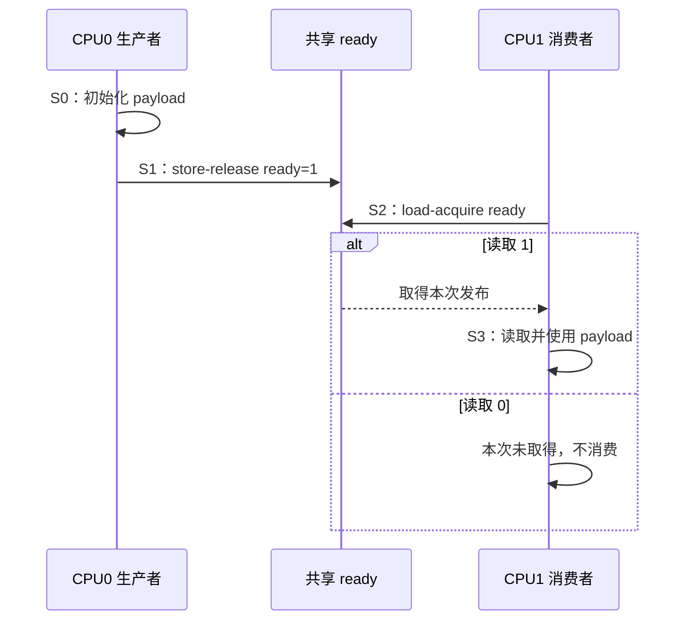

# 第4章\_release\_acquire\_发布协议

## 4.1\_从裸标志改造成有状态的交付协议

```c
/* CPU0：生产者。 */
WRITE_ONCE(obj->payload, 42);
smp_store_release(&obj->ready, 1);

/* CPU1：消费者。 */
if (smp_load_acquire(&obj->ready))
    use(READ_ONCE(obj->payload));
```

这里 `ready` 不只是一个布尔变量，而是两颗 CPU 共同约定的 **发布位置**。生产者写 1 表示“此前载荷初始化已纳入发布”；消费者 acquire 读到 1 表示“我取得了这次发布，随后可以消费载荷”。

## 4.2\_用统一阶段跟踪状态

| 阶段 | 触发 | 写入者/读取者 | 状态变化 | 退出条件 |
| --- | --- | --- | --- | --- |
| S0 构造 | 生产者获得未发布对象 | CPU0 写 `payload` | 对象仅生产者可见 | 初始化完成 |
| S1 发布 | CPU0 执行 store-release | CPU0 写 `ready=1` | 发布位置表示新代际可取 | release 写完成 |
| S2 取得 | CPU1 执行 load-acquire | CPU1 读 `ready` | 读 0：未取得；读 1：取得发布 | 根据读值分支 |
| S3 消费 | S2 取得发布值 | CPU1 读 `payload` | 后续访问位于 acquire 之后 | 使用完成 |



## 4.3\_两端各自只提供单向顺序

```text
生产者：[此前访问] → release Store    [此后访问]
消费者：[此前访问]   acquire Load → [此后访问]
```

- release 约束此前访问不越过发布，不负责把此后访问留在后面；
- acquire 约束此后访问不跑到取得之前，不负责把此前访问推到更早；
- 二者都不单独等价于 `smp_mb()`；
- acquire 必须取得协议认可的发布结果，才能连接生产者的此前访问。

这正是它们通常比全屏障保留更多实现自由度的原因，也是为什么方向选错就会出错。

## 4.4\_Linux\_公共回退怎样表达最小契约

Linux 6.12.20 的 [`include/asm-generic/barrier.h`](../../../../../research/source_reading/linux/include/asm-generic/barrier.h) 在架构未覆盖时，公共回退近似为：

```c
/* 通用说明性摘录。 */
__smp_store_release(p, v):
    compiletime_assert_atomic_type(*p);
    __smp_mb();
    WRITE_ONCE(*p, v);

__smp_load_acquire(p):
    value = READ_ONCE(*p);
    compiletime_assert_atomic_type(*p);
    __smp_mb();
    return value;
```

具体架构可以使用更精确的 release/acquire 指令或序列。公共定义还要求发布位置适合原子访问，避免把 release/acquire 误用于任意大结构体。

## 4.5\_反例一\_取得旧值不能借用新发布

若 CPU1 的 acquire 读到 `ready == 0`，它只知道当前没有取得发布。不能写成：

```c
int r = smp_load_acquire(&obj->ready);
use(obj->payload); /* 错误：无论 r 是什么都消费。 */
```

acquire 的顺序作用并不把任意旧值读取变成成功握手。业务分支必须与发布状态一致，Litmus 条件也必须明确“读取到哪个值时要求载荷可见”。

## 4.6\_反例二\_标志复用会引入代际问题

若 `ready` 在 0/1 之间循环：

```text
第 1 代：payload=A，ready 0→1→0
第 2 代：payload=B，ready 0→1→0
```

一个迟延消费者读到 1，必须知道它属于哪一代。release/acquire 只排列与实际读值连接的事件，不自动解决 ABA、环形索引回绕和缓冲槽复用。

可选方案包括：

- 使用单调序列号并处理回绕边界；
- 每个槽位拥有独立代际；
- 通过队列头尾所有权避免同一标志被并发复用；
- 使用锁或成熟 ring-buffer API。

## 4.7\_反例三\_多个生产者仍需协调

两个 CPU 同时写 `payload`，再各自 release 写 `ready=1`，消费者看到 1 并不知道载荷来自哪个生产者，也不能阻止字段互相覆盖。release 不是“发布锁”。

必须先确定：

- 只有一个生产者；或
- 生产者通过锁串行化；或
- 使用 CAS/RMW 竞争明确状态；或
- 每个生产者写独立槽位，再由有序索引发布。

原子 RMW 的顺序后缀见 P06；多写者队列还需单独验证槽位所有权和代际。

## 4.8\_反例四\_发布顺序不延长对象生命期

```c
p = smp_load_acquire(&global_ptr);
use(p);
```

即使取得了完整初始化，写者随后仍可能取消发布并释放对象。acquire 不登记 reader，也不阻止 `free(p)`。若指针可能被并发删除，需要 RCU、引用计数、锁或其他回收协议。

因此对象发布至少有两条正交轴：

```text
可见性轴：初始化 → release 发布 → acquire 取得 → 使用
生命期轴：取得引用/进入保护域 → 使用 → 退出/put → 最终回收
```

RCU 如何把发布与旧读者边界组合，见 [RCU 内存序与选择边界](../rcu/P25_RCU_内存序_误用与选择边界.md)。

## 4.9\_锁和\_RCU\_为什么不等于裸配对

常规锁把成功加锁作为 acquire、解锁作为 release，但还提供互斥、等待和 lockdep 可见关系。不能把锁缩成两条屏障后自行重写。

RCU 的 `rcu_assign_pointer()` 使用发布语义，`rcu_dereference()` 还处理依赖、单次取值、Sparse/lockdep 检查；GP 再处理旧读者生命周期。调用方应使用完整子系统接口，避免用裸 `smp_store_release()` 隐藏 RCU 指针所有权。

## 4.10\_Litmus\_成对验证

[LKMM Litmus 实验](../../../../../labs/kernel/memory_ordering/P02_LKMM_Litmus_消息传递与屏障/README.md)并列：

- `MP+poonceonces`：只有 ONCE，坏结果 `flag=1 && data=0` 为 `Sometimes`；
- `MP+pooncerelease+poacquireonce`：release/acquire 配对，坏结果为 `Never`；
- `MP+fencewmbonceonce+fencermbonceonce`：显式写/读屏障配对，坏结果也为 `Never`。

实验要求解释每一条新增边，而不是只比较输出最后一行。

## 4.11\_选择核对表

| 问题 | release/acquire 是否足够 |
| --- | --- |
| 单生产者发布已初始化载荷，消费者只在取得后读取 | 通常是 |
| 多生产者同时写同一载荷 | 否，先解决写者协调 |
| 标志循环复用且可能跨代 | 否，先解决代际 |
| 消费者需要睡眠等待 | 否，还需要 waitqueue/completion 等 |
| 指针可能被取消发布并释放 | 否，还需要生命周期机制 |
| Store→Load 双向 SB 模式 | 通常否，需要全屏障或更高层协议 |

## 4.12\_本章验收

1. 能用 S0～S3 写出发布位置的状态周期。
2. 能解释 release/acquire 的单向边和读取来源条件。
3. 能识别标志复用的代际问题。
4. 能说明多生产者为什么需要额外所有权协议。
5. 能把可见性轴和生命期轴分开。
6. 能比较 ONCE、屏障配对和 release/acquire 三个 MP Litmus。

上一篇：[Linux SMP 屏障与顺序域](P03_Linux_SMP屏障与顺序域.md)。

下一篇：[数据依赖、控制依赖与 RCU 取得](P05_数据依赖_控制依赖与RCU取得.md)。
