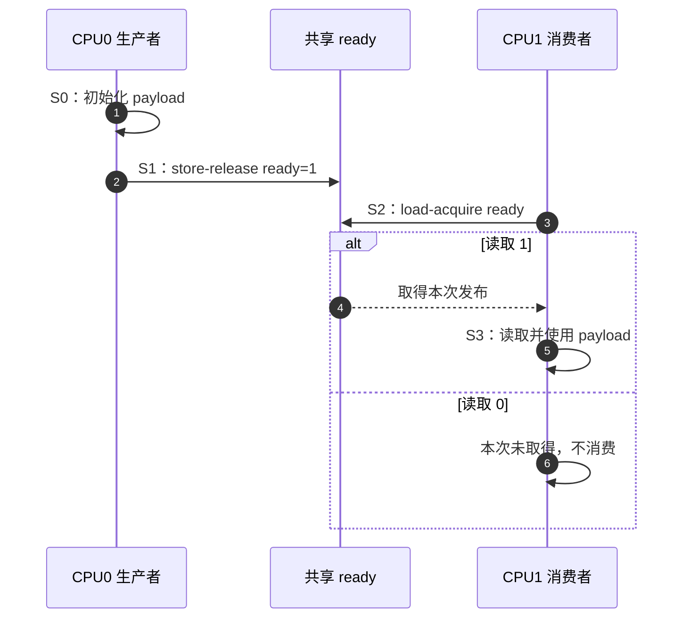
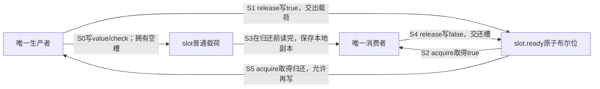
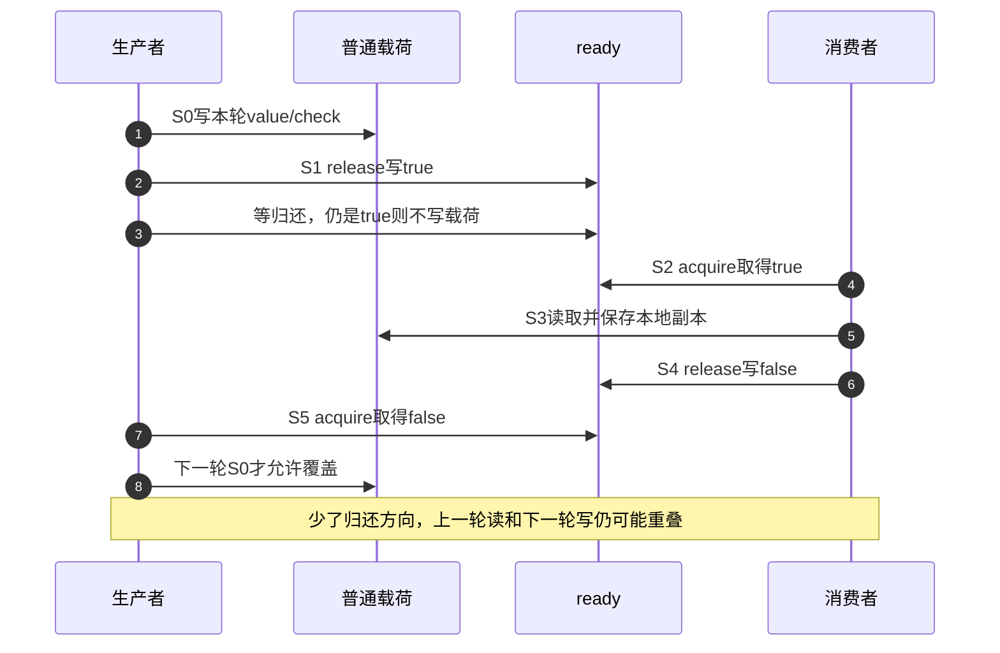

# 第4章\_release\_acquire\_发布协议

## 4.1\_从裸标志改造成有状态的交付协议

上一章用[两端显式屏障](P03_Linux_SMP屏障与顺序域.md#3.4_屏障必须成对进入一条协议)把载荷准备与消费连接起来，也区分了消息发布与双方写后读的问题。本章回到一次交付，把所需顺序直接绑定到同一个发布地址，再检查复用、多写者和回收增加的条件。

一次发布的前提先保持不变：对象已经建立，ready初始为0，只有一个生产者写载荷一次，双方完成以前对象不被回收。下面是Linux协议片段，用于说明接口位置；可运行的标准C++版本已在P01建立，本章后面继续增加缓冲区复用。

```c
/* CPU0：生产者。 */
WRITE_ONCE(obj->payload, 42);
smp_store_release(&obj->ready, 1);

/* CPU1：消费者。 */
if (smp_load_acquire(&obj->ready))
    use(READ_ONCE(obj->payload));
```

这里 `ready` 不只是一个布尔变量，而是两颗 CPU 共同约定的 **发布位置**。生产者写 1 表示“此前载荷初始化已纳入发布”；消费者 acquire 读到 1 表示“我取得了这次发布，随后可以消费载荷”。

## 4.2\_用统一阶段跟踪状态

| 阶段 | 触发 | 写入者/读取者 | 状态变化 | 退出条件 |
| --- | --- | --- | --- | --- |
| S0 构造 | 生产者获得准备载荷的资格 | CPU0 写 `payload` | 载荷尚不可消费，地址和就绪位可以已共享 | 初始化完成 |
| S1 发布 | CPU0 执行 store-release | CPU0 写 `ready=1` | 发布位置表示新代际可取 | release 写完成 |
| S2 取得 | CPU1 执行 load-acquire | CPU1 读 `ready` | 读 0：未取得；读 1：取得发布 | 根据读值分支 |
| S3 消费 | S2 取得发布值 | CPU1 读 `payload` | 后续访问位于 acquire 之后 | 使用完成 |



## 4.3\_两端各自只提供单向顺序

```text
生产者：[此前访问] → release Store    [此后访问]
消费者：[此前访问]   acquire Load → [此后访问]
```

- release 约束此前访问不越过发布，不负责把此后访问留在后面；
- acquire 约束此后访问不跑到取得之前，不负责把此前访问推到更早；
- 二者都不单独等价于 `smp_mb()`；
- acquire 必须取得协议认可的发布结果，才能连接生产者的此前访问。

这正是它们通常比全屏障保留更多实现自由度的原因，也是为什么方向选错就会出错。

## 4.4\_Linux\_公共回退怎样表达最小契约

固定版本从[源码侧屏障定义](../../../../../research/source_reading/memory_ordering/navigation/P01_Linux_6.12_LKMM_源码与模型导读.md#1.3.2_通用屏障)进入。Linux 6.12.20的include/asm-generic/barrier.h在架构未覆盖的内部回退中，用以下顺序表达最低要求：

| 方向 | 类型约束与动作关系 |
| --- | --- |
| 发布 | 检查发布位置类型；在写入新值之前执行内部屏障，再做ONCE写 |
| 取得 | 先保存ONCE读取值，核对类型，在返回取得结果前执行内部屏障 |

这是一张职责表，不是可以编译的冒号式C函数。公共包装还要结合SMP配置及检查器接入；当前UP配置不能被写成已经运行上述SMP硬件序列。

具体架构可以使用更精确的 release/acquire 指令或序列。公共定义还要求发布位置适合原子访问，避免把 release/acquire 误用于任意大结构体。

## 4.5\_反例一\_取得旧值不能借用新发布

若 CPU1 的 acquire 读到 `ready == 0`，它只知道当前没有取得发布。不能写成：

```c
int r = smp_load_acquire(&obj->ready);
use(obj->payload); /* 错误：无论 r 是什么都消费。 */
```

acquire 的顺序作用并不把任意旧值读取变成成功握手。业务分支必须与发布状态一致，Litmus 条件也必须明确“读取到哪个值时要求载荷可见”。

## 4.6\_反例二\_标志复用会引入代际问题

若 `ready` 在 0/1 之间循环：

```text
第 1 代：payload=A，ready 0→1→0
第 2 代：payload=B，ready 0→1→0
```

一个迟延消费者读到1，必须知道它属于哪一代。这里常说的ABA，是状态从A变到B又回到A，后来的观察者只看到相同表面值，未必识别中间变化。release/acquire只排列与实际读值连接的事件，不自动解决这种身份问题、环形索引回绕和缓冲槽复用。

更直接的错误是覆盖正在消费的数据：生产者发布A后立即写B，消费者刚读完A的第一个字段，后续字段却来自B。即使消费者成功取得了A的发布，它获得的也不是“阻止以后写入”的锁。要让这个槽再次使用，必须回答消费者什么时候不再读取它、生产者怎样知道这一点。

### 4.6.1\_让消费者也成为一次发布者

先不要引入环形队列，只给单生产者、单消费者的一只槽增加归还方向。初始ready=false允许生产者填写；生产者写好以后release置true，随后等待。消费者acquire取得true，读取全部需要的字段，再release置false；生产者下一次acquire取得这个false以后，才准覆盖槽。

此时ready不是由生产者任意清零的通知位，而是双方依约交替写入的交接位置。沿原S0～S3增加两步：

| 阶段 | 状态地址及动作 | 保证与下一使用者 |
| --- | --- | --- |
| S0～S1准备和发布 | 生产者独占写slot.value/check，再release写ready=true | 生产者此后不再碰普通载荷，直到归还 |
| S2～S3取得和消费 | 消费者acquire读到true，复制普通字段到本地变量 | 所有对槽内容的读取必须在归还之前完成 |
| S4归还 | 消费者release写ready=false | 发布“本轮读取已结束”，不是发出新的数据 |
| S5重获 | 生产者acquire取得归还的false | 现在才可进入下一轮S0；首次false来自启动前初始化 |





这里用一个布尔位能够复用，依靠的是严格交替的所有权规则，并非“布尔值天然携带代号”。只有一个生产者写true，只有一个消费者写false，每次交出后都等待对方归还；其他观察者不能只截取某次ready值就加入协议。语言原子对象的一致性规则也很关键：生产者在自己写true之后的读取不能倒回更早的初始false，消费者写false之后不能用更早的true重消费同一轮。取消、超时重试、多个使用者或脱离这个顺序的查找，都必须重新证明代际关系。

### 4.6.2\_运行完整单槽交还程序

下面用C++17标准原子运行一万轮，载荷是两个普通整数；检查字段用来发现混合版本，不能充当同步。发布方向保护“写完才读”，归还方向保护“读完才覆盖”。每轮计数保存在各角色自己的局部变量中，不是额外共享锁。

```cpp
// C++17单生产者/单消费者：固定轮数单槽交还协议，不是Linux环形队列。
#include <atomic>
#include <exception>
#include <iostream>
#include <thread>

struct shared_slot {
    unsigned int value = 0, check = 0;
    std::atomic<bool> ready{false};
};

int main()
{
    constexpr unsigned int rounds = 10000, mask = 0x5a5a;
    shared_slot slot;
    unsigned int errors = 0;
    try {
        std::thread producer([&slot] {
            for (unsigned int item = 1; item <= rounds; ++item) {
                while (slot.ready.load(std::memory_order_acquire))
                    std::this_thread::yield();
                slot.value = item;
                slot.check = item ^ mask;
                slot.ready.store(true, std::memory_order_release);
            }
        });
        for (unsigned int expected = 1; expected <= rounds; ++expected) {
            while (!slot.ready.load(std::memory_order_acquire))
                std::this_thread::yield();
            // 在归还以前完成所有普通字段读取，只保留本地副本。
            unsigned int value = slot.value, check = slot.check;
            slot.ready.store(false, std::memory_order_release);
            if (value != expected || check != (value ^ mask))
                ++errors;
        }
        producer.join(); // 两路都结束后，栈上的slot才可销毁。
    } catch (const std::exception &error) {
        std::cerr << "slot experiment failed: " << error.what() << '\n';
        return 1;
    }
    std::cout << rounds << " publications consumed; errors=" << errors << '\n';
    return errors ? 1 : 0;
}
```

在仓库根目录，用支持标准线程的C++17工具链编译[材料](../../../../../labs/kernel/memory_ordering/materials/reusable_slot.cpp)：

```bash
c++ -std=c++17 -Wall -Wextra -Werror -O2 -pthread \
  labs/kernel/memory_ordering/materials/reusable_slot.cpp -o /tmp/reusable_slot
/tmp/reusable_slot
```

预期为`10000 publications consumed; errors=0`。本批宿主严格编译执行通过；这不是Linux槽队列、真实内核原语或硬件内存序验收。两角色使用固定相同轮数，线程最终join后对象才销毁；若改成任意取消、某方提前退出或可睡等待，必须新增相应协议，不能靠yield保证进度或完成时限。

注意消费者先保存两个本地副本，再写false。归还以后，它仍可处理副本，却不能继续使用槽内数据。把归还挪到第二个字段读取之前，就让下一轮写者有机会与这个读取重叠；把生产者等待归还的acquire改成无序读，也会破坏普通载荷的跨轮先行关系。错误版本可能产生C++数据竞争，不以“多跑几次没错”验收。

扩展到不满足上述严格交替前提的场景时，可选方案包括：

- 使用单调序列号并处理回绕边界；
- 每个槽位拥有独立代际；
- 通过队列头尾所有权避免同一标志被并发复用；
- 使用锁或成熟 ring-buffer API。

这些是设计要素，不是单独加上就成立的完整算法。序列号可以帮助识别代际，却不会自动排除写者覆盖；还要规定槽位占用、允许的重试及各字段访问合法性。

## 4.7\_反例三\_多个生产者仍需协调

两个 CPU 同时写 `payload`，再各自 release 写 `ready=1`，消费者看到 1 并不知道载荷来自哪个生产者，也不能阻止字段互相覆盖。release 不是“发布锁”。

必须先确定：

- 只有一个生产者；或
- 生产者通过锁串行化；或
- 使用 CAS/RMW 竞争明确状态；或
- 每个生产者写独立槽位，再由有序索引发布。

原子 RMW 的顺序后缀见 P06；多写者队列还需单独验证槽位所有权和代际。

## 4.8\_反例四\_发布顺序不延长对象生命期

```c
p = smp_load_acquire(&global_ptr);
use(p);
```

即使取得了完整初始化，写者随后仍可能取消发布并释放对象。acquire不登记reader，也不阻止free(p)。还要先处理空指针及业务状态；若指针可能被并发删除，需要RCU、引用计数、锁或其他回收协议。单纯取得裸指针后再补一次kref_get仍可能来不及，首次取得引用的地址窗口必须已有保护；回顾[私有对象与查找保护](../../../object_lifetime/integration/P01_kobject_device_devres_kref_生命周期集成.md#1.6_驱动私有对象与_kref)。

因此对象发布至少有两条正交轴：

```text
可见性轴：初始化 → release 发布 → acquire 取得 → 使用
生命期轴：取得引用/进入保护域 → 使用 → 退出/put → 最终回收
```

RCU 如何把发布与旧读者边界组合，见 [RCU 内存序与选择边界](../rcu/P25_RCU_内存序_误用与选择边界.md)。

## 4.9\_锁和\_RCU\_为什么不等于裸配对

常规锁把成功加锁作为 acquire、解锁作为 release，但还提供互斥、等待和 lockdep 可见关系。不能把锁缩成两条屏障后自行重写。

RCU的rcu_assign_pointer使用发布语义，rcu_dereference还处理依赖、单次取值和类型/锁契约检查；宽限期（Grace Period，GP）再处理相应旧读者的退出边界。调用方应使用完整子系统接口，避免用裸smp_store_release隐藏RCU指针所有权。

## 4.10\_Litmus\_成对验证

[LKMM Litmus材料](../../../../../labs/kernel/memory_ordering/P02_LKMM_Litmus_消息传递与屏障/README.md)包含下面三组一次发布测试。以下是清单预期，本批未运行herd7，也没有用上面的标准线程程序替代它：

- `MP+poonceonces`：只有 ONCE，坏结果 `flag=1 && data=0` 为 `Sometimes`；
- `MP+pooncerelease+poacquireonce`：release/acquire 配对，坏结果为 `Never`；
- `MP+fencewmbonceonce+fencermbonceonce`：显式写/读屏障配对，坏结果也为 `Never`。

实验要求解释每一条新增边，而不是只比较输出最后一行。

Sometimes表示模型允许测试关注的结果，不是现实发生频率；Never表示在该测试和模型条件下被排除，不代表所有调用方或硬件都已验证。复用协议有额外事件，不能直接继承一次MP测试的结论。

## 4.11\_选择核对表

| 问题 | release/acquire 是否足够 |
| --- | --- |
| 单生产者发布已初始化载荷，消费者只在取得后读取 | 通常是 |
| 多生产者同时写同一载荷 | 否，先解决写者协调 |
| 标志循环复用却没有约束槽位交还 | 否，先解决代际与覆盖；单槽例子额外建立了反向归还协议 |
| 消费者需要睡眠等待 | 否，还需要 waitqueue/completion 等 |
| 指针可能被取消发布并释放 | 否，还需要生命周期机制 |
| Store→Load 双向 SB 模式 | 通常否，需要全屏障或更高层协议 |

## 4.12\_本章验收

先将单槽程序的消费处理移到归还之后，但只访问保存好的本地副本，解释为什么仍可安全。再设想增加第二个消费者：两者都可能同时取得true，哪个动作保证只有一个消费同一项？当前程序没有这个动作，不能只给循环次数除以二就扩展成多消费者队列。

最后把两个方向画成两条先行链：本轮准备→true发布→取得→读取；本轮读取→false归还→重获→下一轮覆盖。第一条链保证新数据可用，第二条链保护旧读取退出；生命周期还需要双方都退出后才销毁对象。能够分别指出三项责任，才完成本章的复用推导。

1. 能用 S0～S3 写出发布位置的状态周期。
2. 能解释 release/acquire 的单向边和读取来源条件。
3. 能识别标志复用的代际问题。
4. 能说明多生产者为什么需要额外所有权协议。
5. 能把可见性轴和生命期轴分开。
6. 能比较 ONCE、屏障配对和 release/acquire 三个 MP Litmus。

上一篇：[Linux SMP 屏障与顺序域](P03_Linux_SMP屏障与顺序域.md)。

下一篇：[数据依赖、控制依赖与 RCU 取得](P05_数据依赖_控制依赖与RCU取得.md)。
