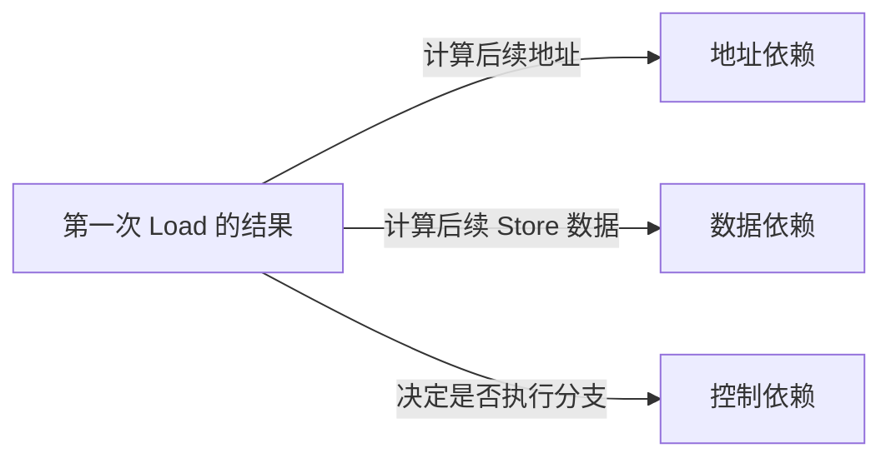
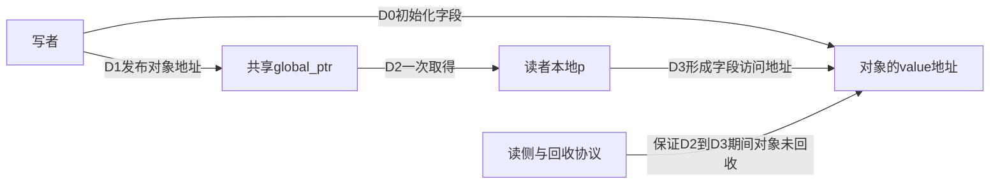
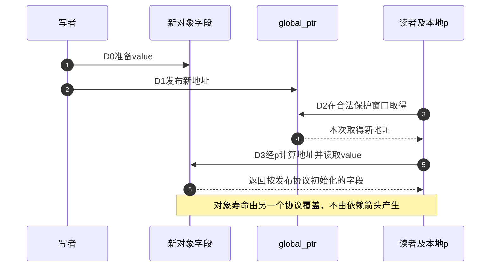

# 第5章\_数据依赖\_控制依赖与RCU取得

上一章的[发布与归还协议](P04_release_acquire_发布协议.md#4.6.1_让消费者也成为一次发布者)说明取得必须接到实际发布来源，并独立处理覆盖与寿命。本章继续检查另一种连接方式：后续地址或分支依赖读取结果时，哪些关系能够成为顺序依据，哪些只存在于源码表面。

## 5.1\_依赖是事件之间的数据流而不是源码排版

两条语句相邻，不代表存在依赖；第二条语句真正使用第一条读取结果，才可能形成地址、数据或控制依赖：



依赖顺序通常比全屏障窄，能保留更多硬件并行性，但也更容易被编译器值推导、常量传播和控制流优化破坏。Linux 只允许依赖成熟 API 和 LKMM 明确支持的模式。

本章先只问一个可观察的问题：“第二个内存访问还需要第一个读取的结果吗？”这和“内核协议是否安全”不同：即使数据流存在，也要另外证明发布来源、地址有效、访问类型及Linux契约；先丢失数据流，就更不能凭源码顺序继续推导。

## 5.2\_地址依赖怎样连接指针和对象访问

```c
p = READ_ONCE(global_ptr);
value = READ_ONCE(p->value);
```

第二次 Load 的地址由第一次读取出的 `p` 决定，形成地址依赖。体系结构和 Linux 原语可以利用这条数据流，保证通过新指针访问对象时，不把对象字段读取错误地观察在指针取得之前。

此片段先假定p非空、发布者已按适用协议初始化字段，并且使用期间对象没有回收。第一次读取的结果是地址，后一次内存读取必须据它计算位置；它不是通知、不是额外引用，也不保证其他无关地址的访问都获得acquire顺序。

把初始化和读取放在同一周期中，更容易检查这条依赖从哪里开始、在哪里结束：

| 阶段 | 参与者、状态地址与动作 | 之后需要证明什么 |
| --- | --- | --- |
| D0准备 | 写者初始化新对象的value，尚未交给共享入口 | 使用者不能提前读取未发布内容 |
| D1发布 | 写者按适用发布原语将新地址写入global_ptr | 新地址与此前初始化建立关系 |
| D2取得 | 读者在合法保护窗口从global_ptr取得地址到本地p | 确认非空；若取得旧对象，应遵守旧对象自身契约 |
| D3经地址访问 | 后续字段访问地址由D2的p计算 | 这条数据流在编译以后仍成立，对象仍存活 |





但 `READ_ONCE(global_ptr)` 仍没有表达 RCU 读侧域、Sparse 类型或 lockdep 条件。RCU 指针应写为：

```c
rcu_read_lock();
p = rcu_dereference(global_ptr);
if (p)
    value = READ_ONCE(p->value);
rcu_read_unlock();
```

`rcu_dereference()` 把单次取指针、依赖保持和 RCU 检查组合成专用契约。

普通判空不会告诉编译器非空路径中的p究竟是哪一个对象，所以与下面“已经比较为某个固定对象”的情况不同。退出读侧以后，不能凭刚取得过p继续使用它；把对象带出去还需在合法保护窗口建立独立持有。

## 5.3\_哪些变换会隐藏或破坏地址依赖

需要警惕：

- 把指针转成整数后进行复杂运算再转回；
- 根据指针比较结果选择一个编译器已知的固定地址；
- 将两个来源的指针混合，使后续地址不再唯一来自第一次读取；
- 通过容器、掩码或标签运算让编译器推导出与读取值无关的地址；
- 把读取值传给未声明正确 compiler semantics 的自制辅助函数。

并非所有整数变换都会破坏依赖，但依赖正确性极难靠代码形状审查。RCU 代码应保持“取得指针 → 直接经该指针访问”的简单路径，复杂变换应使用文档明确允许的辅助 API 或更强取得原语。

固定提交Documentation/RCU/rcu_dereference.rst还明确给出正常可保留的数据流，例如字段访问、赋值、取地址、类型转换和常量偏移；不能把上面的警惕清单误读为“任何转换都禁止”。需要重新证明的是具体变换是否让后续地址或数据摆脱了首次读值。

### 5.3.1\_完整数据流观察材料

下面仍使用P02的局部volatile访问形式，只生成汇编，不运行无初始化指针的函数。dependent_pointer经过刚读取的指针取字段；dependent_index保留索引低位；cancelled_index将索引与自身异或得到常量0；known_address在真分支中已知p就是fixed_node；data_copy把读取值用于后续写的数据。

```c
/* 只生成汇编观察数据流，不运行，不模拟Linux RCU或硬件弱序。 */
#define LAB_READ_ONCE(x) (*(volatile __typeof__(x) *)&(x))
#define LAB_WRITE_ONCE(x, value) (*(volatile __typeof__(x) *)&(x) = (value))

struct node { unsigned int value; };
struct node *shared_ptr;
struct node fixed_node;
unsigned int shared_index, values[4], copied_value;

/* 若执行，需要调用者先保证指针非空、对象存活；本实验只编译。 */
unsigned int dependent_pointer(void)
{
    struct node *p = LAB_READ_ONCE(shared_ptr);
    return LAB_READ_ONCE(p->value);
}

/* 数组地址确实需要首次读取的低两位。 */
unsigned int dependent_index(void)
{
    unsigned int index = LAB_READ_ONCE(shared_index) & 3U;
    return LAB_READ_ONCE(values[index]);
}

/* 代数抵消：读动作保留，但后续地址已不需要它的结果。 */
unsigned int cancelled_index(void)
{
    unsigned int index = LAB_READ_ONCE(shared_index);
    unsigned int offset = index ^ index;
    return LAB_READ_ONCE(values[offset]);
}

/* 真分支已知p等于固定地址，编译器可以用固定地址替代p。 */
unsigned int known_address(void)
{
    struct node *p = LAB_READ_ONCE(shared_ptr);
    if (p == &fixed_node)
        return LAB_READ_ONCE(p->value);
    return 0;
}

/* 写入的数值而非地址依赖第一次读取。 */
void data_copy(void)
{
    unsigned int value = LAB_READ_ONCE(shared_index);
    LAB_WRITE_ONCE(copied_value, value);
}
```

### 5.3.2\_观察地址到底来自哪里

在仓库根目录分别生成[材料](../../../../../labs/kernel/memory_ordering/materials/dependency_flow.c)的两份O2汇编，需要GCC与Clang的GNU C支持；文件没有main，也不应构造两个真实线程去执行未建立同步的示例。

```bash
gcc -std=gnu11 -Wall -Wextra -Werror -O2 -S \
  labs/kernel/memory_ordering/materials/dependency_flow.c -o /tmp/dependency_gcc.s
clang -std=gnu11 -Wall -Wextra -Werror -O2 -S \
  labs/kernel/memory_ordering/materials/dependency_flow.c -o /tmp/dependency_clang.s
```

先找每个函数的首个读取，再追它的结果去了哪里。dependent_pointer中，第二次读取的地址寄存器来自shared_ptr；dependent_index中，数组寻址使用读取值与3相与后的索引。cancelled_index仍然读取shared_index，但访问values[0]已经使用固定地址；保留第一次读取动作，不等于保留从它到第二个地址的数据流。

known_address保留比较和分支，但真分支可以直接使用fixed_node的地址，不再用刚读到的指针形成字段地址。它只说明编译器能够替换地址来源，不说明这份静态零初始化对象现在就有错误；如果对象内容早已由独立协议稳定建立，这种比较可以安全。危险发生在调用方还指望这条已经消失的地址依赖，替自己兑现某次并发初始化发布。

本批GCC14.2.0与Clang18.1.8的x86-64 O2输出都保留直接指针、有效索引和写数据的流向，也都把异或抵消后的地址变为values[0]。known_address则有差异：GCC仍用保存p的rdx寄存器读取字段，Clang直接读fixed_node。这正说明“允许做此变换”不等于每个编译器版本每次都这样做；不能把GCC本次保留依赖提升为未来契约。

```asm
# GCC14.2真分支，rdx来自shared_ptr
movl (%rdx), %eax
# Clang18.1真分支，直接使用固定地址
movl fixed_node(%rip), %eax
```

这是编译器数据流证据，不是ARM执行、RCU运行或硬件重排实验。读者应画两列：“源码变量关联”和“机器内存地址/写数据来源”，不要以寄存器名字相同或语句相邻替代追踪。

## 5.4\_数据依赖排序的是结果流向后续写

```c
r0 = READ_ONCE(x);
WRITE_ONCE(y, r0);
```

写入 y 的数据取自 x 的读取，形成数据依赖。它与地址依赖不同：后续访问地址 y 固定，变化的是写入数据。

在真实算法中，编译器可能推导出 `r0` 的取值范围、把表达式代数化简或让依赖变成常量。只有目标内存模型认可且访问用正确原语标记时，才能依赖这种顺序；否则使用 release/acquire 或屏障表达意图更稳妥。

## 5.5\_控制依赖为什么不能排序任意后续\_Load

```c
r0 = READ_ONCE(flag);
if (r0)
    r1 = READ_ONCE(data);
```

源码中 `r1` 只在分支成立时执行，但处理器可能推测 Load，编译器也可能把两条分支中的相同读取提升到分支之前。Linux 的控制依赖规则有严格方向和访问类型边界，不能把普通 `if` 当成 acquire。

Linux对满足条件的“读取→保留的条件→受该条件控制的写”提供相应控制依赖规则，不能把这种保证推广成“读取→if→任意后续读取”。还需核对分支是否被常量传播、公共尾部提取等变换消除，以及访问是否被正确标记。需要acquire语义时，优先直接使用smp_load_acquire；在已经严格证明的控制依赖路径中，内核也提供smp_acquire__after_ctrl_dep等补强接口。

```c
r0 = READ_ONCE(flag);
if (r0) {
    smp_acquire__after_ctrl_dep();
    r1 = READ_ONCE(data);
}
```

这不是推荐用更复杂写法替代 `smp_load_acquire()`，而是说明 Linux 为少数已有控制依赖的低层路径定义了明确补强接口。

## 5.6\_READ\_ONCE\_与历史地址依赖屏障

Linux 早期为 DEC Alpha 等极弱序架构提供显式 `smp_read_barrier_depends()`。在当前内核契约中，其必要语义已被 READ_ONCE/相关接口隐含处理，普通调用方不再手工插入历史宏。

这个历史说明两点：

1. “硬件天然尊重地址依赖”不是可跨所有历史 Linux 架构的绝对说法；
2. 调用方应依赖 Linux 公共原语，而不是根据当前 ARM/x86 经验删掉访问标记。

## 5.7\_RCU\_发布和取得怎样配合

写者：

```c
new->value = 42;
rcu_assign_pointer(global_ptr, new);
```

读者：

```c
rcu_read_lock();
p = rcu_dereference(global_ptr);
if (p)
    use(p->value);
rcu_read_unlock();
```

版本证据先进入[RCU源码总索引](../../../../../research/source_reading/rcu/navigation/P01_Linux_6.12_RCU源码总阅读索引.md#1.1_版本边界与总索引职责)，再读[发布实现](../../../../../research/source_reading/rcu/source_explanations/P01_Linux_6.12_RCU_公共接口与检查机制源码详解.md#1.3.1_rcu_assign_pointer发布实现)和[取得实现](../../../../../research/source_reading/rcu/source_explanations/P01_Linux_6.12_RCU_公共接口与检查机制源码详解.md#1.3.2_rcu_dereference取得实现)。固定Linux6.12.20的一般非空发布使用release，取得接口维护适用依赖并接入类型与锁契约检查；读者确实取得新发布指针、保持依赖且对象字段没有再次并发改写时，才能按该协议观察初始化。它不保证每个新读者立刻取得最新指针，也不把多字段原地更新变成快照。

RCU GP 是另一条轴：它等待取消发布前可能存在的旧 reader，决定旧对象何时可回收。依赖顺序不登记 reader，GP 也不代替新对象发布；完整组合见 [RCU P25](../rcu/P25_RCU_内存序_误用与选择边界.md)。

## 5.8\_rcu\_dereference\_系列怎样表达不同上下文

| 接口 | 使用前提 | 额外意图 |
| --- | --- | --- |
| `rcu_dereference()` | 建立匹配的RCU读侧保护 | 普通reader取得；其他保护条件须按相应接口明确表达 |
| `rcu_dereference_protected()` | 调用方持有更新锁等明确保护 | 更新侧在受保护上下文读取 |
| `rcu_dereference_check()` | 给出 lockdep 条件表达多种合法保护 | 复杂共享路径 |
| `rcu_access_pointer()` | 只取值/判空，不经它解引用对象 | 不提供完整 dereference 契约 |

接口差异不是编译结果微调，而是在代码中声明“谁保证当前取值合法”。当前Linux的READ_ONCE本身可以保留相应地址依赖，并承接历史依赖屏障所需语义；所以不能断言换成它就必然丢掉依赖。问题是它没有自动表达RCU读侧和类型/锁契约检查，调用者仍可能遗漏整个保护协议。固定文档允许只增加而读者活动期间不删除等特例使用READ_ONCE，也不能据此把普通RCU代码统一替换。

protected/check后面的条件表达式用于说明已有保护，并不会替你取得锁；诊断未开启或未告警更不能创造保护。rcu_access_pointer适合只观察或判空，不能取得后顺手解引用。具体受保护取得的实现边界见[唯一讲解](../../../../../research/source_reading/rcu/source_explanations/P01_Linux_6.12_RCU_公共接口与检查机制源码详解.md#1.5_rcu_dereference_protected功能与检查路径)。

## 5.9\_Litmus\_怎样验证\_RCU\_指针发布

固定版本的[指针发布Litmus材料](../../../../../labs/kernel/memory_ordering/P02_LKMM_Litmus_消息传递与屏障/tests/MP+onceassign+derefonce.litmus)先让共享指针指向旧位置y；另一对象x最初为0。抽象事件如下，这段是阅读说明，不是可以编译的C：

```text
P0：把对象x的值写为1，再把x的地址发布到共享指针
P1：进入读侧，取得共享指针到本地r0，读取*r0，再退出读侧
坏结果：读到 p 指向 x，却读到 x 的旧值 0
```

该材料预期LKMM把坏结果判为Never，本批没有运行herd7；不可用上面编译器实验代替模型判定。测试关注发布—取得顺序，不验证P1离开RCU读侧后x的生命期，也不验证写者何时能释放旧指针。

## 5.10\_选择原则

- 只是标量发布标志：优先 release/acquire。
- 指针受 RCU 管理：优先 RCU 指针 API，不手拼依赖。
- 需要任意后续 Load 都取得顺序：使用 acquire，不依赖普通控制流。
- 依赖链经过复杂计算或辅助函数：重新证明，必要时升级为明确屏障/API。
- 读侧要把对象带出 RCU 区域：在 RCU 保护内取得独立引用，依赖顺序本身不延长生命期。

## 5.11\_本章验收

先把cancelled_index的异或自身改为与3相与，比较汇编中数组地址的来源。再把known_address改为只判断p是否为空，非空分支继续经p取字段；为什么编译器这时不能从“非空”推导p一定等于fixed_node？最后在data_copy中把写入值改成常量1，哪条数据依赖消失了，而哪一次volatile读取仍然存在？

这些修改分别恢复地址来源、保留未知对象地址和切断写数据来源。它们只改变编译器层的数据流，真实协议还需要发布、适用的内存顺序规则和对象寿命；不要为了让测试“看起来有依赖”给表达式加入最终会抵消的算术。

1. 能区分地址、数据和控制依赖。
2. 能解释源码控制流为什么不等于 acquire。
3. 能列出几种会隐藏指针依赖的变换。
4. 能解释历史地址依赖屏障为何由 Linux 公共访问原语承接。
5. 能说明 `rcu_dereference()` 比裸 ONCE 多承担哪些职责。
6. 能区分 RCU 发布—取得顺序和 GP 生命周期。

上一篇：[release/acquire 发布协议](P04_release_acquire_发布协议.md)。

下一篇：[原子 RMW、顺序后缀与条件成功](P06_原子RMW_顺序后缀与条件成功.md)。
