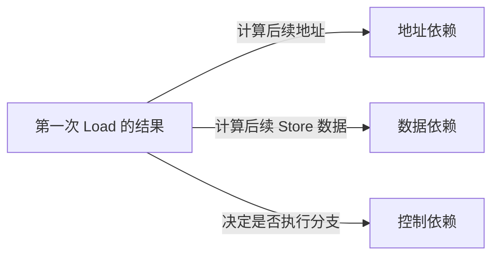

# 第5章\_数据依赖\_控制依赖与RCU取得

## 5.1\_依赖是事件之间的数据流而不是源码排版

两条语句相邻，不代表存在依赖；第二条语句真正使用第一条读取结果，才可能形成地址、数据或控制依赖：



依赖顺序通常比全屏障窄，能保留更多硬件并行性，但也更容易被编译器值推导、常量传播和控制流优化破坏。Linux 只允许依赖成熟 API 和 LKMM 明确支持的模式。

## 5.2\_地址依赖怎样连接指针和对象访问

```c
p = READ_ONCE(global_ptr);
value = READ_ONCE(p->value);
```

第二次 Load 的地址由第一次读取出的 `p` 决定，形成地址依赖。体系结构和 Linux 原语可以利用这条数据流，保证通过新指针访问对象时，不把对象字段读取错误地观察在指针取得之前。

但 `READ_ONCE(global_ptr)` 仍没有表达 RCU 读侧域、Sparse 类型或 lockdep 条件。RCU 指针应写为：

```c
rcu_read_lock();
p = rcu_dereference(global_ptr);
value = READ_ONCE(p->value);
rcu_read_unlock();
```

`rcu_dereference()` 把单次取指针、依赖保持和 RCU 检查组合成专用契约。

## 5.3\_哪些变换会隐藏或破坏地址依赖

需要警惕：

- 把指针转成整数后进行复杂运算再转回；
- 根据指针比较结果选择一个编译器已知的固定地址；
- 将两个来源的指针混合，使后续地址不再唯一来自第一次读取；
- 通过容器、掩码或标签运算让编译器推导出与读取值无关的地址；
- 把读取值传给未声明正确 compiler semantics 的自制辅助函数。

并非所有整数变换都会破坏依赖，但依赖正确性极难靠代码形状审查。RCU 代码应保持“取得指针 → 直接经该指针访问”的简单路径，复杂变换应使用文档明确允许的辅助 API 或更强取得原语。

## 5.4\_数据依赖排序的是结果流向后续写

```c
r0 = READ_ONCE(x);
WRITE_ONCE(y, r0);
```

写入 y 的数据取自 x 的读取，形成数据依赖。它与地址依赖不同：后续访问地址 y 固定，变化的是写入数据。

在真实算法中，编译器可能推导出 `r0` 的取值范围、把表达式代数化简或让依赖变成常量。只有目标内存模型认可且访问用正确原语标记时，才能依赖这种顺序；否则使用 release/acquire 或屏障表达意图更稳妥。

## 5.5\_控制依赖为什么不能排序任意后续\_Load

```c
r0 = READ_ONCE(flag);
if (r0)
    r1 = READ_ONCE(data);
```

源码中 `r1` 只在分支成立时执行，但处理器可能推测 Load，编译器也可能把两条分支中的相同读取提升到分支之前。Linux 的控制依赖规则有严格方向和访问类型边界，不能把普通 `if` 当成 acquire。

典型地，Load→条件→Store 的控制依赖比 Load→条件→Load 更容易形成所需顺序；需要 acquire 语义时，应直接使用 `smp_load_acquire()`，或在经过严格证明的控制依赖后使用内核提供的 `smp_acquire__after_ctrl_dep()` 等专用接口。

```c
r0 = READ_ONCE(flag);
if (r0) {
    smp_acquire__after_ctrl_dep();
    r1 = READ_ONCE(data);
}
```

这不是推荐用更复杂写法替代 `smp_load_acquire()`，而是说明 Linux 为少数已有控制依赖的低层路径定义了明确补强接口。

## 5.6\_READ\_ONCE\_与历史地址依赖屏障

Linux 早期为 DEC Alpha 等极弱序架构提供显式 `smp_read_barrier_depends()`。在当前内核契约中，其必要语义已被 READ_ONCE/相关接口隐含处理，普通调用方不再手工插入历史宏。

这个历史说明两点：

1. “硬件天然尊重地址依赖”不是可跨所有历史 Linux 架构的绝对说法；
2. 调用方应依赖 Linux 公共原语，而不是根据当前 ARM/x86 经验删掉访问标记。

## 5.7\_RCU\_发布和取得怎样配合

写者：

```c
new->value = 42;
rcu_assign_pointer(global_ptr, new);
```

读者：

```c
rcu_read_lock();
p = rcu_dereference(global_ptr);
if (p)
    use(p->value);
rcu_read_unlock();
```

Linux 6.12.20 的 `rcu_assign_pointer()` 对一般非 NULL 路径使用 release 发布；`rcu_dereference()` 保持指针取得到对象访问的依赖，并加入 RCU/Sparse/lockdep 语义。两者保证新 reader 取得新指针时看见初始化。

RCU GP 是另一条轴：它等待取消发布前可能存在的旧 reader，决定旧对象何时可回收。依赖顺序不登记 reader，GP 也不代替新对象发布；完整组合见 [RCU P25](../rcu/P28_RCU_内存序_误用与选择边界.md)。

## 5.8\_rcu\_dereference\_系列怎样表达不同上下文

| 接口 | 使用前提 | 额外意图 |
| --- | --- | --- |
| `rcu_dereference()` | 位于匹配 RCU 读侧或其他检查认可条件 | 普通 reader 取得 |
| `rcu_dereference_protected()` | 调用方持有更新锁等明确保护 | 更新侧在受保护上下文读取 |
| `rcu_dereference_check()` | 给出 lockdep 条件表达多种合法保护 | 复杂共享路径 |
| `rcu_access_pointer()` | 只取值/判空，不经它解引用对象 | 不提供完整 dereference 契约 |

接口差异不是编译结果微调，而是在代码中声明“谁保证当前取值合法”。用裸 ONCE 替换会同时丢失依赖和静态/动态检查信息。

## 5.9\_Litmus\_怎样验证\_RCU\_指针发布

Linux 6.12.20 自带 `MP+onceassign+derefonce.litmus`：

```text
P0：WRITE_ONCE(x, 1); rcu_assign_pointer(p, x)
P1：rcu_dereference(p); READ_ONCE(*p)
坏结果：读到 p 指向 x，却读到 x 的旧值 0
```

LKMM 将该坏结果判为 `Never`。这个测试验证发布—取得顺序，不验证 P1 离开 RCU 读侧后 x 的生命期，也不验证写者何时能释放旧指针。

## 5.10\_选择原则

- 只是标量发布标志：优先 release/acquire。
- 指针受 RCU 管理：优先 RCU 指针 API，不手拼依赖。
- 需要任意后续 Load 都取得顺序：使用 acquire，不依赖普通控制流。
- 依赖链经过复杂计算或辅助函数：重新证明，必要时升级为明确屏障/API。
- 读侧要把对象带出 RCU 区域：在 RCU 保护内取得独立引用，依赖顺序本身不延长生命期。

## 5.11\_本章验收

1. 能区分地址、数据和控制依赖。
2. 能解释源码控制流为什么不等于 acquire。
3. 能列出几种会隐藏指针依赖的变换。
4. 能解释历史地址依赖屏障为何由 Linux 公共访问原语承接。
5. 能说明 `rcu_dereference()` 比裸 ONCE 多承担哪些职责。
6. 能区分 RCU 发布—取得顺序和 GP 生命周期。

上一篇：[release/acquire 发布协议](P04_release_acquire_发布协议.md)。

下一篇：[原子 RMW、顺序后缀与条件成功](P06_原子RMW_顺序后缀与条件成功.md)。
