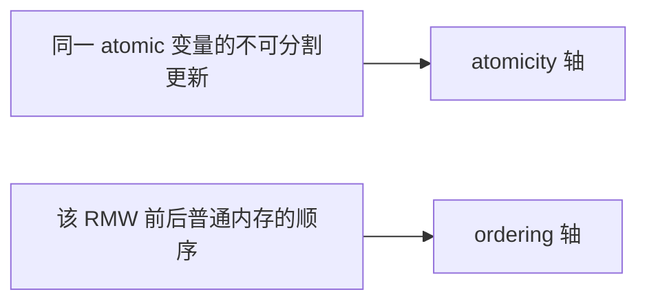
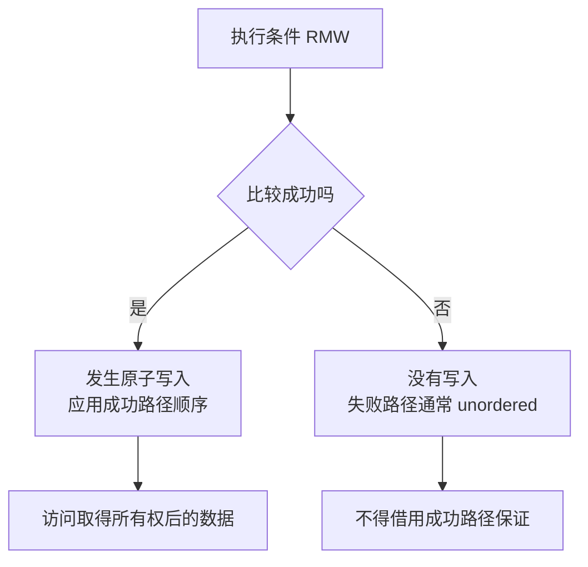
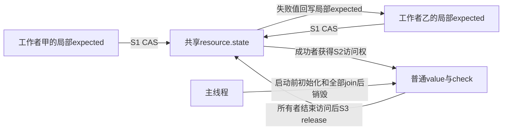
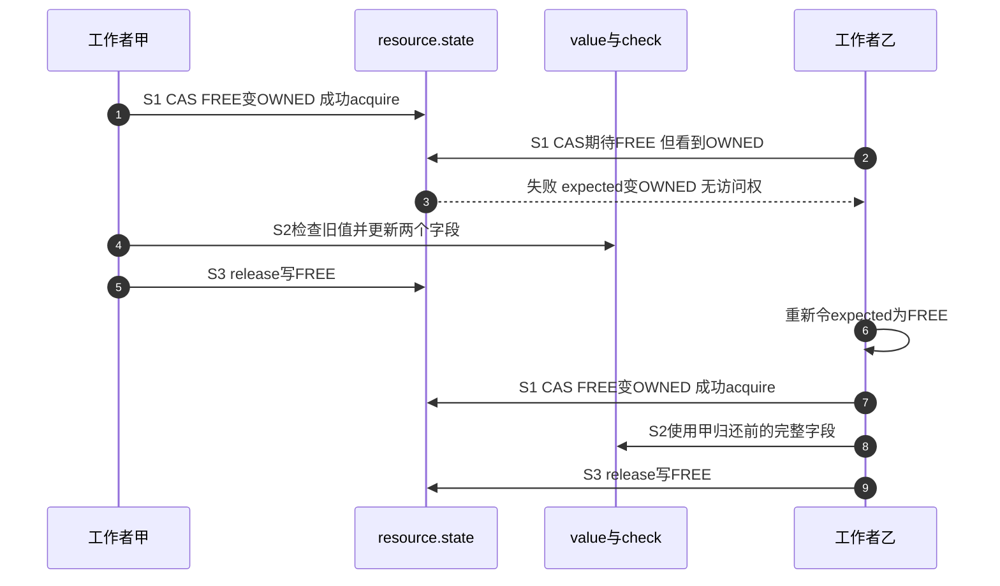

# 第6章\_原子RMW\_顺序后缀与条件成功

## 6.1\_原子更新和其他地址的顺序是两条轴

上一章的[依赖观察](P05_数据依赖_控制依赖与RCU取得.md#5.3.2_观察地址到底来自哪里)追踪一次读取结果怎样传到后续访问。本章加入另一个修改者：除了跨地址顺序，还要把对同一状态的读改写作为不可分操作，并区分尝试成功与失败后的保证。

设两个工作者都要修改一份资源。上一章让读者沿已发布指针找到字段，但没有赋予某一个工作者排他修改权。如果两人分别读取“空闲”，再各自写入“占用”，两个读取都可能先完成，随后两人都会进入资源。把这两次访问分别写成ONCE仍不能阻止这个交错：单次访问有约束，不代表两次访问之间别人不能插入。

我们需要一次不可分的 **读—改—写（Read-Modify-Write，RMW）**：只有状态仍为空闲时才把它改成占用，并向调用者报告是否完成了这个转换。这种带比较条件的操作称为 **比较交换（Compare-And-Swap，CAS）**。同一状态上的竞争操作必须能排成一个顺序，其中一个成功改变状态，另一个面对的就是改变后的值。这里的“不可分”是其他参与者可观察的语义，不要求处理器用一条指令完成。

计数也是同一问题：Linux现场片段 `atomic_inc(&counter)` 保证针对 `counter` 的读取、加一和写回不会被另一个合规更新插入而丢失一次增量。但它与 `data`、`flag` 等其他地址怎样排序，取决于具体API变体。资源例子因此还有第二个要求：接任者取得所有权后，必须能使用上一任归还前写好的普通字段。



“它是 atomic_t，所以周围代码都有序”是常见错误。

## 6.2\_非\_RMW\_操作不需要为读取包装\_atomic\_t

本章Linux契约以NXP官方固定提交、Linux 6.12.20为证据，从[版本化阅读入口](../../../../../research/source_reading/memory_ordering/navigation/P01_Linux_6.12_LKMM_源码与模型导读.md#1.11_官方文档证据)进入。该树的文档确实位于 `Documentation/atomic_t.txt`；不要拿另一个版本的目录名替换它。文档指出，`atomic_read()`、`atomic_set()` 通常分别基于READ_ONCE、WRITE_ONCE，带后缀的 `atomic_read_acquire()`、`atomic_set_release()` 才表达对应的顺序。若代码只读写一个值，从不做原子RMW，往往不需要仅为“看起来原子”而使用 `atomic_t`；应直接选择表达所需访问和顺序的原语。

但 `atomic_set()` 必须与并发 RMW 保持同一 atomic 对象的不可分割契约，不能让一个锁实现的 RMW 被普通 Store 插入并产生不可能中间结果。这是 atomic API 实现者的责任，不是调用方手加屏障能修补的。

可以用固定文档的情景检查这个要求：初值为1，甲执行“非零时加一”，乙设置为0。如果甲先完成，乙把2覆盖为0；如果乙先完成，甲看到0便不加。最终都应为0。若实现让甲读到1后被乙插入写0，再由甲写回2，就破坏了这个原子对象的契约。本章只推演该文档给出的禁止结果，没有宣称运行了对应模型。

这里讨论普通内存中的原子对象；不能把MMIO寄存器强转成 `atomic_t` 来更新设备。设备寄存器的宽度、读写副作用和总线事务要遵守I/O接口。C++标准原子还有自己的类型与内存模型，后面的宿主程序会显式标出，不把Linux类型规则直接移植过去。

## 6.3\_RMW\_接口族表达什么

| 形式 | 示例 | 返回内容 | 默认顺序概念 |
| --- | --- | --- | --- |
| 无返回值更新 | `atomic_inc()` | 无 | 不为其他地址增加顺序 |
| 返回新值 | `atomic_inc_return()` | 修改后值 | 无后缀版本fully ordered，即前后两侧排序 |
| 返回旧值 | `atomic_fetch_add()` | 修改前值 | 无后缀版本fully ordered |
| 交换 | `atomic_xchg()` | 旧值 | 无后缀版本fully ordered |
| 条件交换 | `atomic_cmpxchg()` / `atomic_try_cmpxchg()` | 前者返回旧值，后者返回布尔成败 | 无后缀成功时fully ordered，失败时不增加跨地址顺序 |

准确结论以目标 API 文档为准，不能从函数包含 `atomic` 字样一概推出全屏障。

“有返回值”描述接口契约，不取决于调用者是否接住返回值：丢弃 `atomic_fetch_add()` 的返回值不会把它改成 `atomic_add()` 的契约。`xchg/cmpxchg/try_cmpxchg` 是相应通用交换接口；本章表内统一使用atomic对象版本，避免把支持类型和宽度也混成同一件事。

## 6.4\_顺序后缀怎样选择

| 后缀 | 对其他地址的顺序 | 典型角色 |
| --- | --- | --- |
| `_relaxed` | 不增加跨地址顺序，仍保留原子更新 | 只统计数值，或所需数据顺序已由外围同步建立 |
| `_acquire` | RMW 的读取侧作为 acquire | 成功取得状态后读取受其发布的数据 |
| `_release` | RMW 的写入侧作为 release | 在放出状态前发布此前更新 |
| 无后缀 fully ordered 变体 | 原子事件前后提供更强双向顺序 | 需要两侧排序且 API 明确保证 |

使用 relaxed 的理由必须能指出顺序来自哪里，例如对象只在锁内访问、计数值只用于统计、或另一条 release/acquire 已建立协议。只因为 relaxed “更快”不足以证明正确。

回到资源：CAS解决“谁取得”，acquire解决“取得后怎样承接此前发布”，release解决“归还前怎样交出更新”。三件事缺一不可。即使relaxed CAS让两个工作者不会同时声称取得，也不能据此省掉普通字段所需的发布和取得顺序。反过来，单独的acquire读取不会把FREE改成OWNED，仍可能让两人都认为资源空闲。

## 6.5\_条件操作失败路径为什么最危险

```c
old = atomic_cmpxchg_acquire(&state, FREE, OWNED);
if (old == FREE)
    use_owned_data();
```

这是Linux现场片段，FREE和OWNED表示同一个原子状态的空闲与占用值。CAS成功时当前CPU完成FREE→OWNED，acquire排列随后对受保护数据的访问。失败时状态没有被本次尝试写入；按本章固定Linux契约，条件原子操作失败不增加跨地址顺序。失败返回的OWNED只说明本次比较没有匹配，不赋予数据访问权，也不是持有者已经结束的证据。

不能仅从“失败没有写入”推出所有语言都没有acquire：一次读取本身也可能承担acquire。这里的失败边界来自Linux API的明确规定。C++ `compare_exchange_strong` 有独立的成功和失败顺序参数；本章宿主程序显式选成功acquire、失败relaxed，不把这个选择推广成所有C++调用的默认保证。



循环 CAS 还要区分每次失败重试与最终成功；不能把函数整体当成一次 acquire/release 事件。

还有一个与屏障无关的坑。Linux `atomic_try_cmpxchg(&state, &expected, OWNED)` 失败时，会把观察到的状态写回调用者的 `expected`。如果它变成OWNED，下一轮原样复用就可能执行 **OWNED→OWNED** 并返回成功。这次CAS在数值上确实成功，却没有完成协议要求的FREE→OWNED。取得资源的每次尝试都必须重新设定期望FREE。用于“读旧值、计算新值”的累加循环则通常应保留失败更新后的值，重新计算新值；不能把两类循环的重试写法机械互换。

## 6.6\_示例一\_引用计数不是普通计数器

引用计数要求防溢出、防从零复活和最后一个 put 的释放语义，Linux 提供 `refcount_t` 而不是让调用方随意组合 `atomic_t`。即使 atomic RMW 能保证数字不丢更新，也不自动保证对象生命周期状态机安全。

最后一次 decrement 通常需要把此前对象使用有序到 release 路径，并在确认归零后执行销毁前的 acquire/屏障要求；这些细节由 refcount/kref API 封装。对象生命期场景优先使用对应权威接口，而不是根据本章手拼后缀。

它也不意味着任意 `refcount_inc()` 都能保护已经失效的地址：取得第一份或额外份额之前仍须证明当前访问合法。具体取得、归还和回调边界沿[kref专题](../../../object_lifetime/kref/大纲.md)阅读；本章保留数字更新与寿命协议的分工，不复制引用计数教程。

## 6.7\_示例二\_状态所有权的\_acquire/release\_RMW

```c
/* 尝试从 FREE 原子转换为 OWNED。 */
if (atomic_cmpxchg_acquire(&state, FREE, OWNED) == FREE) {
    use_resource();

    /* 归还前完成对资源的修改。 */
    atomic_set_release(&state, FREE);
}
```

这段模式还依赖：所有竞争者都通过同一状态协议取得资源；`FREE` 不与其他代际混淆；失败路径不会访问资源；销毁路径不会在状态可再次取得时释放对象。

原子顺序只连接状态所有权和数据访问，不替协议回答状态机完整性。

### 6.7.1\_把一次交接划成四个阶段

这是一个共享所有权状态机，加上载荷一致性与存储生命期两条约束。没有独立的全局完成计数：当前所有者通过释放状态表达“本次访问已结束”，下一任通过成功转换取得资格。它不需要向所有工作者主动发消息，但把等待成本留给反复读取/尝试共享状态的参与者。

| 阶段 | 触发、状态地址与写入者 | 下一位观察者和退出条件 |
| --- | --- | --- |
| S0 可取得 | 初始化者在启动线程前建立载荷，`resource.state=FREE`；以后由上一任release归还 | 竞争者只尝试FREE→OWNED，不凭普通快照访问载荷 |
| S1 争取所有权 | 每个竞争者在自己的栈上令 `expected=FREE`，对同一 `resource.state` 做CAS | 成功者进入S2；失败者只得到一次观察，重新进入S1 |
| S2 独占访问 | 唯一成功者读写 `resource.value/check` 普通字段 | 其他参与者仍只能重试状态，不能读取半更新载荷 |
| S3 归还 | 所有者结束全部载荷访问，对 `resource.state` release写FREE | 下一任成功acquire承接该归还，回到S2；退出线程由主线程join回收 |





注意最后一个FREE与初始FREE有相同数值，但协议依赖的是实际读到的那次归还。首次取得依赖线程启动前的初始化；后续取得承接前任的release。这里FREE反复出现可以成立，是因为资源地址一直有效、每轮只要求独占使用，不把“还是FREE”解释成对象身份或历史没变。如果需要验证某个旧指针/版本仍然对应同一资源，就要另外处理代际问题。

### 6.7.2\_运行完整的标准原子交接程序

材料位于[atomic_ownership.cpp](../../../../../labs/kernel/memory_ordering/materials/atomic_ownership.cpp)。它先在单线程里演示期望值重用错误，只打印错误的资格判定，不读取别人的载荷；再用正确协议启动四个工作者，各更新一万次。同一资源的两个普通字段必须始终满足 `check == value * 3 + 7`。每个工作者只写自己的错误计数，主线程join之后才读取汇总。

```cpp
#include <array>
#include <atomic>
#include <exception>
#include <iostream>
#include <thread>

constexpr int free_state = 0;
constexpr int owned_state = 1;
constexpr int worker_count = 4;
constexpr int rounds = 10000;

struct shared_resource {
    std::atomic<int> state{free_state};
    int value = 0;
    int check = 7;
};

bool try_acquire(shared_resource &resource)
{
    // 每次只允许 FREE -> OWNED；失败改写的期望值不能带入下一次尝试。
    int expected = free_state;
    return resource.state.compare_exchange_strong(
        expected, owned_state, std::memory_order_acquire,
        std::memory_order_relaxed);
}

int main()
{
    // 单线程反例只操作状态，不访问载荷，不制造数据竞争。
    std::atomic<int> probe{owned_state};
    int expected = free_state;
    const bool first = probe.compare_exchange_strong(
        expected, owned_state, std::memory_order_acquire,
        std::memory_order_relaxed);
    const int after_failure = expected;
    const bool false_grant = probe.compare_exchange_strong(
        expected, owned_state, std::memory_order_acquire,
        std::memory_order_relaxed);
    std::cout << "probe_first=" << first
              << " expected_after_failure=" << after_failure
              << " wrong_retry_success=" << false_grant << '\n';
    if (first || after_failure != owned_state || !false_grant)
        return 1;

    shared_resource resource;
    std::array<int, worker_count> errors{};
    std::array<std::thread, worker_count> workers;
    bool launch_failed = false;
    try {
        for (int id = 0; id < worker_count; ++id) {
            workers[id] = std::thread([&, id] {
                for (int n = 0; n < rounds; ++n) {
                    while (!try_acquire(resource))
                        std::this_thread::yield(); // 让出运行机会，不是同步边。
                    // 仅所有者访问这两个普通字段。
                    if (resource.check != resource.value * 3 + 7)
                        ++errors[id];
                    ++resource.value;
                    resource.check = resource.value * 3 + 7;
                    resource.state.store(free_state, std::memory_order_release);
                }
            });
        }
    } catch (const std::exception &error) {
        std::cerr << "thread launch failed: " << error.what() << '\n';
        launch_failed = true;
    }
    // 即使创建中途失败，也先收回已启动线程，之后才能销毁栈上资源。
    for (auto &worker : workers)
        if (worker.joinable())
            worker.join();
    if (launch_failed)
        return 2;

    int total_errors = 0;
    for (int count : errors)
        total_errors += count;
    std::cout << "updates=" << resource.value << " errors=" << total_errors
              << " check=" << resource.check << '\n';
    return resource.value == worker_count * rounds &&
                   resource.check == resource.value * 3 + 7 && total_errors == 0
               ? 0 : 1;
}
```

从仓库根目录在具有C++17线程支持的Bash环境执行：

```bash
mkdir -p .cache/atomic_ownership
g++ -std=c++17 -Wall -Wextra -Werror -O2 -pthread \
  labs/kernel/memory_ordering/materials/atomic_ownership.cpp \
  -o .cache/atomic_ownership/atomic_ownership
.cache/atomic_ownership/atomic_ownership
```

2026-09-24，GCC 14.2、x86_64-w64-mingw32宿主实际严格编译和运行得到：

```text
probe_first=0 expected_after_failure=1 wrong_retry_success=1
updates=40000 errors=0 check=120007
```

第一行故意显示错误重试能成功；它不是锁已经正确取得。第二行来自每次重新设置期望值的真实多线程执行。程序使用strong比较交换，避免把允许伪失败的weak形式也引入本章初次观察；这里不能把某个线程偶然重试次数少或多当作公平性结论。

为什么普通字段可以安全？成功的原子FREE→OWNED在同一状态上选出唯一所有者；上一任字段访问先于release归还，下一任的成功acquire读取该FREE并把后续字段访问接到同一交接链上。join负责最后的主线程观察和资源销毁，不能替运行中的工作者建立这条链。若只把CAS改成relaxed，数值资格仍可能互斥，但普通字段的线程间顺序证明消失，不能靠反复运行“没出错”接受程序。不要实际运行这种未同步版本来寻找一个可信的坏输出。

这只是教学协议，**不是建议自制生产锁**。等待者不断触碰同一状态，持有者被抢占时别人仍可能空转；`yield()` 只请求让出执行机会，不提供同步、公平、超时或取消保证。实际C++代码通常使用标准互斥量；Linux代码应按上下文选择锁接口，后者还承担调度、抢占、中断约束及检查器接入。宿主这次运行不证明Linux原子实现、ARM指令、LKMM模型、无饥饿或目标板性能。

## 6.8\_before\_after\_atomic\_屏障只补缺的一侧

`smp_mb__before_atomic()` / `smp_mb__after_atomic()` 用于原子操作本身没有提供所需一侧顺序，而协议明确要求在它之前或之后补强的场景：

```text
此前普通访问 → before_atomic → atomic event
atomic event → after_atomic → 此后普通访问
```

若原子操作已是 fully ordered，再机械叠加可能重复；若目标根本不是原子 RMW，使用这些接口则表达错域。调用前必须核对该 atomic 变体的现有保证和 LKMM 模式。

“一侧”不能误读成只给原子读或原子写贴标签。固定文档规定，before屏障把之前的访问排列到RMW及其后访问之前；after屏障把之后的访问排列到RMW及其前访问之后。它们可强于单纯release/acquire，不能任意互换。屏障与RMW之间夹入的普通访问不获得该辅助屏障的排序保证，因此尽可能紧挨对应RMW，别把它当成可以远距离摆放的装饰。沿[版本模块](../../../../../research/source_reading/memory_ordering/navigation/P05_存储后屏障与原子强化导读.md#5.3_按一条原子操作周期阅读)核对T0～T4与适用范围，再从[唯一公共实现](../../../../../research/source_reading/memory_ordering/source_explanations/include/asm-generic/barrier.h.md#1.10_存储后屏障与atomic辅助的公共路径)查看SMP检测包装和UP回退；辅助宏本身不执行原子更新。

## 6.9\_原子变量也会形成缓存行热点

正确性上不可分割，不代表性能上可扩展。多 CPU 高频 RMW 同一 `atomic_t` 会争夺同一缓存行并按最新值串行化。Store Buffer 无法消除最终所有权转移。

在常见缓存一致性多核机器上，甲更新状态需要获得该缓存行的写权限；乙随后更新同一状态，必须取得与甲更新一致的新值以及相应写权限。多个CPU密集交替时，相关副本失效、权限转移和原子指令重试会占用互联与执行时间。即使每次只改一个整数，也不能让这些修改在互不相干的副本上各自完成再随意合并。某些架构用独占读取/条件写入循环实现原子操作，竞争还可能使一次条件写入失败并重做。具体代价取决于硬件与布局，不能从本宿主运行次数推算。

如果业务允许局部近似值或低频汇总，应考虑 per-CPU counter、分片和批处理；完整因果见[缓存行所有权竞争与伪共享](../../../../foundations/computer_architecture/cache_coherence/P03_缓存行所有权竞争与伪共享.md)。

这些替代方案改变了可立即观察的全局值，可能增加归并、迁移或读端代价。本例要求任何时刻只有一个工作者修改同一份资源，不能只把state分成四份就说竞争消失，否则四人又会同时获得各自那份“空闲”。先确认业务能否拆成独立资源，再讨论分片；需要严格唯一所有权时应使用合适的锁，而不是牺牲保证换一个漂亮计数。

## 6.10\_验证顺序

1. 先证明需要原子 RMW，而不只是单次访问；
2. 写出成功和失败状态转换；
3. 分别列出成功/失败路径访问的其他地址；
4. 选择 relaxed/acquire/release/fully ordered 变体；
5. 用 LKMM Litmus 表达错误结果；
6. 检查缓存行竞争和重试前进性；
7. 若是引用计数或锁，改用专用 API。

把验证分成三层记录：本章运行检查C++实例与预期输出；Linux契约核对固定 `Documentation/atomic_t.txt`；若要证明某个Linux多地址反例被禁止，仍须写适合LKMM的Litmus并实际运行herd7。本批没有完成第三层，也没有执行ARM板上并发。固定文档还单独讨论条件交换循环的前进性：反复失败的原语或循环不会仅因名字包含atomic就自动获得无饥饿保证。

## 6.11\_本章验收

1. 能区分原子更新轴和跨地址顺序轴。
2. 能说明非 RMW 的 `atomic_read/set` 为什么不自动需要 `atomic_t`。
3. 能按返回值和后缀判断 RMW 的顺序意图。
4. 能单独审查条件原子操作的失败路径。
5. 能解释 before/after atomic 屏障补的是哪一侧。
6. 能识别 atomic 热点以及引用计数应使用专用 API。

先独立回答下面三题，再对照说明：

1. 把完整程序中的 `expected=FREE` 移到重试循环外，第一次失败看到OWNED后，第二次成功说明了什么？
2. 丢弃 `atomic_fetch_add()` 返回值，能否据此把它当作无序的 `atomic_add()`？如果只要统计值，可以怎样明确表达选择？
3. 保留CAS排他取得，把成功顺序改成relaxed，最后仍join全部线程，为什么不能由最终join证明工作者间的普通字段访问正确？

第一题只能说明OWNED与OWNED匹配并完成一次同值交换，不能说明空闲资源被取得。第二题契约不由调用者是否接返回值决定；在确认统计无需发布其他地址的前提下选择文档规定的无序更新或relaxed变体。第三题join连接工作者结束与主线程后续读取，不连接两名仍在运行的工作者，缺失的归还—接任顺序依旧缺失。

现在能够分别证明“数值转换发生了”“调用者得到访问资格”“字段更新被下一任承接”，也知道这三者不是同义词。仍未解决的是等待者该睡眠还是自旋、持有者遇到中断或抢占怎么办；下一章从成熟锁接口及其隐式顺序继续。

上一篇：[数据依赖、控制依赖与 RCU 取得](P05_数据依赖_控制依赖与RCU取得.md)。

下一篇：[锁、调度、中断与隐式顺序](P07_锁_调度_中断与隐式顺序.md)。
