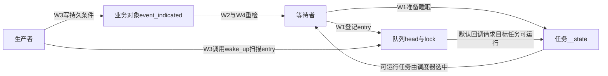
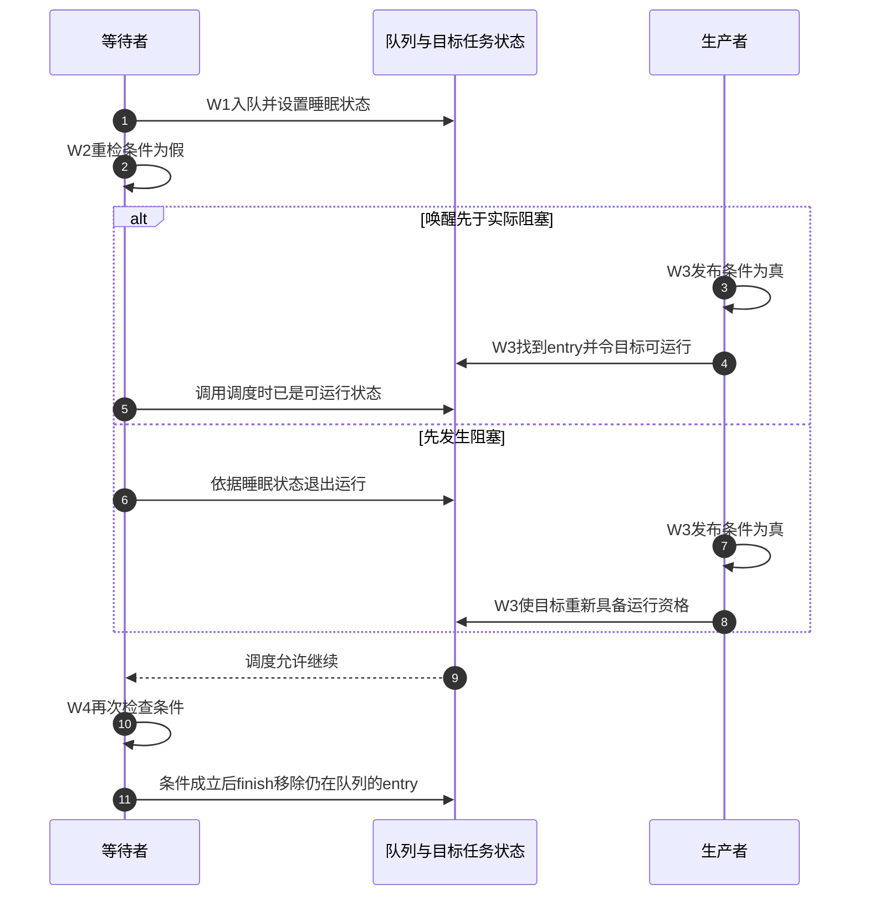

# 第7章\_锁\_调度\_中断与隐式顺序

## 7.1\_隐式顺序必须依赖完整\_API\_契约

上一章的[原子所有权程序](P06_原子RMW_顺序后缀与条件成功.md#6.7.2_运行完整的标准原子交接程序)说明了资格取得与字段交接，但其重试循环没有替持有者抢占、中断嵌套和等待公平性提供解决方案。本章转向完整的锁、等待和调度契约，不能把它们缩减成某一条屏障。

“隐式屏障”不是指内核里随便发生一次锁、调度或中断，周围访问就自动全序。它表示某个高层 API 为完成自身状态机，已经在规定位置提供了顺序边；调用方必须满足该 API 的配对和状态条件。


脱离协议只看到内部某条屏障指令，就无法证明业务访问有序。

先给“完整”一个可操作的含义。仍以共享资源为例：锁回答谁能修改、下一任怎样承接；条件回答是否已经有可用结果；等待队列回答尚无结果的任务怎样退出运行、由谁恢复。它们可能协作，但存储的不是同一个状态。我们沿一次“任务等结果、另一任务提交结果”的过程，分别检查业务字段、等待登记和任务运行状态，最后再判断屏障放在哪里。

本章Linux保证来自固定6.12.20的[内存屏障文档入口](../../../../../research/source_reading/memory_ordering/navigation/P01_Linux_6.12_LKMM_源码与模型导读.md#1.11_官方文档证据)。以下双CPU片段表示SMP契约；当前目标配置仍为UP、PREEMPT_NONE与TINY_RCU，并未运行这些双CPU场景，也不能把锁对普通内存的保证扩展为设备I/O顺序。

## 7.2\_锁取得是\_acquire\_释放是\_release

```c
/* CPU0 */                         /* CPU1 */
spin_lock(&lock);                  spin_lock(&lock);
shared->value = 42;                value = shared->value;
spin_unlock(&lock);                spin_unlock(&lock);
```

这是省略初始化与调用上下文的Linux现场片段。只有当CPU1取得的是CPU0写入并解锁之后那一轮所有权时，才能沿CPU0字段写入→release解锁→CPU1 acquire加锁→字段读取推出这次读取承接42。若CPU1先取得锁，它完全可以读到旧值；“同一把锁”不自动指定两个调用的先后。

锁还保证同一时刻只有一个持有者，并在相应配置下向Lockdep检查器暴露依赖关系。参与者必须使用同一把锁保护同一对象；如果某读者绕过锁，或者在释放后继续访问仍会被修改的字段，就不属于这条证明。复制字段到局部变量再解锁，和借出一个将在解锁后继续解引用的指针，也有不同的寿命要求。

调用方得到的是“同一锁协议中的临界区串行化”，不是单独两条可替换的屏障。把锁删掉只留下 acquire/release，会同时丢失互斥和等待语义。

## 7.3\_一次加锁再解锁不是全屏障

acquire 只约束锁后访问，release 只约束锁前访问：

```text
A = 1;
lock(M);   // acquire
unlock(M); // release
B = 1;
```

从不持有 M 的第三方观察者角度，A 可以向临界区内移动，B 也可以向临界区内移动；不能把 `lock(); unlock();` 当成 `smp_mb()`。

同理，仅依赖release/acquire的最低语义，先release一把锁再acquire另一把锁，也不天然形成全屏障。不能把这个内存访问许可理解成允许开发者交换两条锁操作的源代码顺序；那可能引入实际锁依赖和死锁。

少数算法需要更强的unlock→lock顺序。固定 `include/linux/rcupdate.h` 定义了 `smp_mb__after_unlock_lock()`：放在取得锁之后，对同一CPU执行的unlock/lock，或操作同一锁变量的unlock/lock提供相应全屏障保证；定义依据架构Kconfig配置项 `CONFIG_ARCH_WEAK_RELEASE_ACQUIRE` 选择补屏障或空操作。这里的空操作表示目标架构已有所需保证，不代表所有锁组合无需证明。它不是给任意两把锁、任意两个CPU随意拼接顺序的办法。本章只核对接口边界，具体锁链应在所属算法的版本源码中解释。

## 7.4\_失败的条件加锁没有取得顺序

非阻塞尝试加锁函数 `spin_trylock()`、可中断mutex获取等可能失败。固定屏障文档不给失败的条件加锁提供屏障保证；某条实现路径碰巧执行过更强指令，也不能借用为公共契约。下面现场片段用 `spin_trylock()` 返回0判定失败，再由调用者返回表示忙的错误码 `-EBUSY`；不可照搬为可中断mutex的判断式，后者通常以0表示成功、负值表示错误。失败意味着调用方没有取得保护对象的所有权：

```c
if (!spin_trylock(&lock)) {
    /* 不能把这里当成已经 acquire 后的观察点。 */
    return -EBUSY;
}
use_protected_state();
spin_unlock(&lock);
```

这与条件 atomic RMW 的失败路径相似：成败是状态机分支，顺序保证不能跨分支借用。

## 7.5\_关闭中断主要改变执行上下文而非\_CPU\_内存序

`local_irq_disable()` 阻止本 CPU 的普通可屏蔽中断进入，用于消除当前 CPU 与中断处理程序的交错。Linux 内存屏障文档明确指出，中断禁止/开启函数本身通常只充当编译器屏障，不提供跨 CPU 普通内存的硬件排序。

```text
local_irq_disable()：改变“本 CPU 中断能否抢入”
smp_mb()：改变“多 CPU 普通内存访问怎样排序”
```

若共享状态还被其他CPU访问，需要锁或其他明确的并发协议；单独SMP屏障只解决访问顺序，不保证复合更新互斥。在非PREEMPT_RT的普通自旋锁语义下，`spin_lock_irqsave()` 将“锁处理跨CPU竞争”和“关本地中断处理同CPU重入”组合，不能只保留其中一半。

为什么后半项必要？设任务已经持锁，本地中断此时进入并尝试同一把锁。若中断一直自旋，任务要等中断退出才有机会解锁，中断又等任务解锁才退出，就形成同CPU自我等待。进入临界区前保存并关闭相关本地中断，结束后恢复原状态，才排除这条交错。反过来，只关甲CPU中断不会阻止乙CPU同时修改。PREEMPT_RT会改变普通spinlock的实现与部分上下文语义，应到[锁专题](../locks/大纲.md)按锁类型核对，不能直接套用本段非RT过程。

## 7.6\_调度点不能被当成自制同步协议

固定文档明确规定 `schedule()` 及类似函数隐含完整内存屏障。这个保证不能被弱化成“有时才有”；但业务代码仍不能用“这里肯定发生上下文切换”替代发布/取得：

- 任务可能没有真正切走；
- 对端 CPU 不一定经过与之配对的调度事件；
- 调度器屏障可以构成特定证明中的顺序边，却不自动选择业务条件、对象和对应的发布者；
- 执行一次屏障既不把等待者登记到业务队列，也不保证它读到自己希望的那个新值。

正确做法是使用锁、completion、waitqueue、RCU等把业务状态嵌入明确协议；推导涉及调度时再使用其已声明的屏障保证。上一章宿主程序的 `std::this_thread::yield()` 不等于Linux的 `schedule()` API，不能把这份内核保证搬到C++让步调用上。

## 7.7\_等待方为什么必须先登记再检查条件

任务可能等很久；一直重试会持续占用执行机会，因此要允许它睡眠。但睡眠引入一个新问题：通知已经经过时，迟到的等待者是否会永远错过？先看简化Linux现场片段，它省略队列与等待项初始化、载荷协议、信号和超时处理，不能独立编译运行。状态常量 `TASK_UNINTERRUPTIBLE` 表示此等待不因普通信号而中断；READ_ONCE仍沿用P02的单次访问标记语义：

```c
for (;;) {
    prepare_to_wait(&wq, &wait, TASK_UNINTERRUPTIBLE);
    if (READ_ONCE(event_indicated))
        break;
    schedule();
}
finish_wait(&wq, &wait);
```

核心顺序是：

```text
等待方：写 task state/入队 → 屏障 → 读取条件
唤醒方：写条件 → 屏障/锁 → 读取等待状态并唤醒
```

若等待方先检查条件再登记，唤醒方可能在空窗内设置条件并发现“无人等待”，随后等待方睡下，形成 lost wakeup。成熟 waitqueue/completion API 把队列、任务状态和屏障放在规定顺序，调用方仍要用循环重新检查条件。

这里的要求是 **决定睡眠前完成登记并重检**，不是禁止任何提前读取。固定 `wait_event()` 宏恰好有一次快速条件检查；若条件为假，进入 `___wait_event` 后先prepare，再次检查条件，之后才可能schedule。危险的是只保留快速检查、没有登记后的那一次检查。

### 7.7.1\_把业务条件和任务状态分开

这是一组协作状态，不是一个布尔值：业务对象保存持久条件 `event_indicated`；等待队列头 `wq_head.head/lock` 保存登记链与保护锁；等待项 `entry` 把等待者接到队列，默认任务唤醒路径通过它定位任务；任务自己的 `task_struct.__state` 保存调度可运行性。生产者写业务条件，等待者登记自己并设置睡眠状态，唤醒路径改变目标任务可运行性。具体结构和版本实现从[等待与完成量源码总索引](../../../../../research/source_reading/waiting_notification/navigation/P01_Linux_6.12_等待与完成量源码总阅读索引.md#1.1_版本边界与阅读任务)进入。

| 阶段 | 谁改哪个状态 | 下一路径消费什么 |
| --- | --- | --- |
| W0 尚无结果 | 初始条件为假，等待项尚未登记，任务仍在运行 | 生产者随时可能写入结果，不能假设其一定晚到 |
| W1 登记和准备 | 等待者在队列锁下接入entry，设置自身睡眠状态；准备路径提供顺序 | 唤醒者能找到任务，等待者随后重读条件 |
| W2 决定是否睡眠 | 等待者读取条件；为真直接退出等待，否则调用调度 | 条件已真就不必等一次通知；若通知已把任务变可运行，调度不会让它因旧状态永久睡下 |
| W3 发布与唤醒 | 生产者先更新条件，再经队列路径尝试唤醒；调度侧接纳目标任务 | 已睡者获得运行资格，未实际睡下者也能保留可运行状态 |
| W4 重检和退出 | 等待者重新检查条件；成立后finish恢复运行状态并移除仍在队列的entry | 栈上等待项此后才能结束生命期，虚假或不满足条件的唤醒继续循环 |

W3不是只能排在W2之后：它可能早于W1、夹在W1和W2之间，或发生于真正阻塞以后。正是这三种位置需要同一协议覆盖。默认通知也不是“让目标立刻执行”：任务变可运行后仍由调度器决定何时获得CPU。





上述图不把等待队列锁当成业务数据锁，也不把远端唤醒简化成无条件发送处理器间中断（Inter-Processor Interrupt，IPI）。实际唤醒如何接入运行队列、何时需要跨CPU通知属于调度实现；这里依赖任务可运行性和条件重检的契约。`prepare_to_wait_event` 与 `finish_wait` 的字段/函数体分别沿[登记及信号分支](../../../../../research/source_reading/waiting_notification/source_explanations/P01_Linux_6.12_wait_c入队与唤醒源码实现.md#1.3_prepare_to_wait_event登记与信号分支)及[恢复与移除等待项](../../../../../research/source_reading/waiting_notification/source_explanations/P01_Linux_6.12_wait_c入队与唤醒源码实现.md#1.5_finish_wait恢复任务并移除栈上entry)阅读。

### 7.7.2\_用完整C模型找到登记空窗

[wakeup_window.c](../../../../../labs/kernel/memory_ordering/materials/wakeup_window.c)只枚举动作交错，所有状态都是单线程C解释器中的普通布尔值。等待方有三个动作，生产者有两个动作，每方内部顺序固定，一共十种五步排列。条件提前成立后的等待动作作为空步骤保留，因此十种不是十种不同的内核实际路径，也不是发生概率。

```c
#include <stdbool.h>
#include <stdio.h>

struct model {
    bool event;
    bool registered;
    bool runnable;
    bool observed;
    bool parked;
};

struct result {
    unsigned schedules;
    unsigned lost;
};

static void waiter_step(struct model *m, unsigned step, bool register_first)
{
    const unsigned register_step = register_first ? 0U : 1U;
    const unsigned check_step = register_first ? 1U : 0U;
    if (step == register_step) {
        // 条件已成立时，后续动作只是空步骤，保留固定枚举长度。
        if (!m->observed) {
            m->registered = true;
            m->runnable = false;
        }
    } else if (step == check_step) {
        m->observed = m->event;
    } else if (!m->observed) {
        // 唤醒先于调度时，任务已可运行，不能再把它无条件睡下。
        m->parked = !m->runnable;
    }
}

static void producer_step(struct model *m, unsigned step)
{
    if (step == 0) {
        m->event = true; // 单次持久条件，本模型不复位。
    } else if (m->registered) {
        m->runnable = true;
        m->parked = false;
    }
}

static void enumerate(struct model m, unsigned waiter_pc, unsigned producer_pc,
                      bool register_first, struct result *result)
{
    if (waiter_pc == 3 && producer_pc == 2) {
        ++result->schedules;
        if (m.event && m.parked && !m.runnable)
            ++result->lost;
        return;
    }
    if (waiter_pc < 3) {
        struct model next = m;
        waiter_step(&next, waiter_pc, register_first);
        enumerate(next, waiter_pc + 1, producer_pc, register_first, result);
    }
    if (producer_pc < 2) {
        struct model next = m;
        producer_step(&next, producer_pc);
        enumerate(next, waiter_pc, producer_pc + 1, register_first, result);
    }
}

int main(void)
{
    const struct model initial = {.runnable = true};
    struct result bad = {0}, good = {0};
    enumerate(initial, 0, 0, false, &bad);
    enumerate(initial, 0, 0, true, &good);
    printf("check_first: schedules=%u lost=%u\n", bad.schedules, bad.lost);
    printf("register_first: schedules=%u lost=%u\n", good.schedules, good.lost);
    // 单线程枚举只检查登记空窗，不模拟弱内存或真实调度器。
    return bad.schedules == 10 && bad.lost == 1 &&
                   good.schedules == 10 && good.lost == 0 ? 0 : 1;
}
```

在仓库根目录的Bash环境编译运行：

```bash
mkdir -p .cache/wakeup_window
gcc -std=c11 -Wall -Wextra -Werror -O2 \
  labs/kernel/memory_ordering/materials/wakeup_window.c \
  -o .cache/wakeup_window/wakeup_window
.cache/wakeup_window/wakeup_window
```

2026-09-24，GCC14.2、x86_64-w64-mingw32严格编译与宿主执行得到：

```text
check_first: schedules=10 lost=1
register_first: schedules=10 lost=0
```

那一条坏路径可以手工复现：等待者检查假→生产者写真→生产者通知但无人登记→等待者登记并设不可运行→等待者睡下。先登记再检查后，早到的生产者留下的持久真条件会被重检看到；晚到的生产者可以通过登记恢复任务可运行。若通知夹在检查假与调度之间，调度看到的已是可运行状态，不能再无条件睡下。

模型把登记和睡眠状态准备合成一个受保护动作，所有存储都立即可见，且只有一次永不复位的条件。它不包含弱内存、队列锁实现、信号、超时、多等待者或实际线程；因此零坏路径只消除了这份模型中的登记空窗，不能证明Linux等待队列完整正确。现实系统还要靠前面核对的锁、任务状态和屏障把这些抽象动作兑现。

## 7.8\_wake\_up\_没有唤醒对象时不能借用屏障

Linux 内存屏障文档说明，`wake_up()` 在实际唤醒任务时执行相应通用屏障；若没有任务被唤醒，则不保证调用方可以借用同样屏障效果。`wake_up_process()` 有自己的更强契约，但也只应按 API 语义使用。

在本章固定文档中，后者明确保证在访问任务状态之前执行通用屏障，不以这次是否唤醒为条件。前者可能扫描到空队列，也可能没有成功唤醒目标；不能从一次函数调用推出成功唤醒路径已经发生。队列中有entry也不自动证明某个回调成功。

因此下面思路错误：

```c
WRITE_ONCE(x, 1);
wake_up(&possibly_empty_wq); /* 不能把它当成无条件 smp_mb()。 */
WRITE_ONCE(y, 1);
```

如果业务需要无条件顺序，应显式使用匹配原语；如果需要唤醒，就遵循 waitqueue 状态机，不要把 wakeup 当成廉价屏障函数。

这不与W1～W4矛盾：如果事件在登记前已经到达，持久条件让迟到者直接通过重检，不必依赖那次无人接收的通知。通知只是促使等待者重新检查的动作，条件才是“结果已经发生”的存储。把条件设计成瞬时脉冲、马上清零，又想让迟到者必定消费一次，就需要完成量、计数或队列等有明确保留/消费规则的机制。

## 7.9\_等待唤醒屏障不自动发布多字段载荷

即使等待/唤醒正确避免 lost wakeup，下面仍需要数据发布关系：

```text
唤醒方：写 my_data → 写 event_indicated → wake_up
等待方：观察 event_indicated → 读取 my_data
```

若 API 文档没有保证业务所需的多地址顺序，调用方仍需在条件发布前后使用 release/acquire、锁或明确屏障。等待机制负责“睡下和被叫醒”，载荷发布负责“醒来后看到什么”，两者有关联但不是同一责任。

例如一次性结果交付可以让生产者先填好载荷，再release写条件；等待条件用acquire读取，观察到对应真值后再读取载荷，同时按waitqueue规则改变条件后唤醒。这是两条配合的证明：W1～W4避免丢掉运行机会，release/acquire承接字段初始化。还必须保证载荷在读取期间不被改写或释放。多轮复用应回到[P04的反向交还](P04_release_acquire_发布协议.md#4.6.1_让消费者也成为一次发布者)，不能只把条件清零就宣称新一轮安全。

## 7.10\_高层原语怎样减少手工屏障

| 需求 | 优先原语 | 隐含/附带责任 |
| --- | --- | --- |
| 互斥更新共享结构 | mutex/spinlock | 互斥、acquire/release、调试 |
| 等一个一次性事件完成 | completion | 条件、入队、唤醒、顺序 |
| 等任意条件变化 | waitqueue | 睡眠状态机和防丢唤醒模式 |
| 发布只读新版本、延迟回收旧版本 | RCU | 指针顺序、读者域、宽限期 |
| 多字段读快照 | seqcount/seqlock | 版本写序和 reader 重试 |

如果高层原语已提供完整协议，调用方在周围机械添加屏障往往说明状态机尚未理解清楚。

选择时同时核对执行上下文与状态语义：可睡眠的任务间互斥可以考虑mutex，不能睡眠的临界区须按锁类型选择；只需等待一次有记忆的完成事件时，completion通常比自建布尔值和等待循环更直接；任意业务条件才需要围绕waitqueue明确判断、更新与唤醒关系。seqcount允许读者重试，不自动保护指针生命期；RCU发布和延迟回收也不让可变字段自动互斥。抽象层次越高，省下的手工屏障越多，但调用方仍须遵守该机制保留的前提。

## 7.11\_本章验收

1. 能解释锁的 acquire/release 与互斥怎样组合。
2. 能说明 lock/unlock 为什么不等于全屏障。
3. 能单独审查 trylock 失败路径。
4. 能区分关中断的本地执行上下文作用和跨 CPU 顺序。
5. 能画出 waitqueue“先登记再检查”的防丢唤醒链。
6. 能解释为什么 `wake_up()` 不能充当无条件屏障。
7. 能区分等待唤醒与载荷发布。

先画时间线回答，再检查下面的结论：

1. 两个任务都用同一锁，能否保证读者一定得到写者这次的新值？
2. 生产者在等待者登记前就写条件并通知，为什么等待者不能仅因错过通知而睡死？
3. 把C模型的生产者通知移到条件写入之前，原来“登记优先就没有空窗”的推理还成立吗？

第一题还需要写者这一轮释放在读者取得之前；锁只提供串行化，不指定谁先。第二题依靠登记后的条件重检，不能省去它。第三题不成立：通知先遇到空队列，随后等待者登记并读到假、进入睡眠，最后生产者才写真且不再通知，仍可能丢唤醒。因此“先登记”和“先改条件再通知”是配套条件，程序枚举时也要保留生产者的正确内部顺序。

我们现在可以区分资格、可运行性、业务条件与载荷顺序，但图中每条顺序边仍需要一个精确语言来检查组合后的执行。下一章把访问和原语转换成LKMM事件与关系，而不是继续靠“这里大概有个屏障”猜测。

上一篇：[原子 RMW、顺序后缀与条件成功](P06_原子RMW_顺序后缀与条件成功.md)。

下一篇：[LKMM 事件、关系与一致性判定](P08_LKMM事件_关系与一致性判定.md)。
