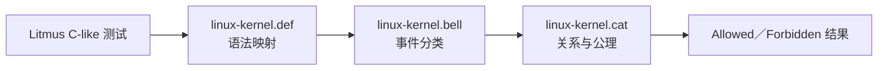
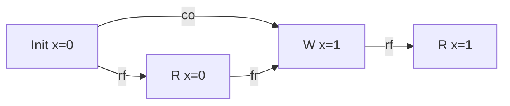

# 第8章\_LKMM事件\_关系与一致性判定

## 8.1\_LKMM\_回答的是\_Linux\_软件契约

Linux Kernel Memory Model（LKMM）把内核认可的访问、屏障、原子、锁和 RCU 原语映射为事件与关系，再判定某个抽象执行是否允许。它的目标不是模拟某颗 CPU 的流水线，而是给跨架构内核代码一个可验证的最低契约。



版本化文件职责和源码路径见 [Linux 6.12 LKMM 导读](../../../../../research/source_reading/memory_ordering/P01_Linux_6.12_LKMM_源码与模型导读.md)。

## 8.2\_先把源码压缩成事件

```c
WRITE_ONCE(*data, 1);
smp_store_release(flag, 1);
```

在 Litmus 中可抽象为：

- 一个对 `data` 的 ONCE Write 事件；
- 一个对 `flag` 的 Release Write 事件；
- 同一 CPU 内二者之间的程序顺序；
- 由 release 语义产生的顺序关系。

局部变量计算若不影响共享访问关系，通常不必保留；但条件、地址和数据依赖会影响模型，不能无脑删除。

## 8.3\_基础关系怎样读

| 关系 | 问题 | 示例 |
| --- | --- | --- |
| `po` | 同一参与者事件的程序顺序是什么 | Wdata 在 Wflag 前 |
| `rf` | 某次读取从哪次写取值 | Rflag 从 Wflag 读到 1 |
| `co` | 同一位置的写按什么一致性序排列 | Init(x=0) 在 W(x=1) 前 |
| `fr` | 读取旧写后，同址哪些新写位于其后 | R(x=0) 在 W(x=1) 前 |
| dependency | 一个读取结果怎样决定后续地址/数据/控制 | Rptr → R(*ptr) |



Litmus 的寄存器结果决定 `rf` 选择；`co/fr` 再由同址关系补出。不能只画源码 `po` 就判断执行。

## 8.4\_屏障和取得发布怎样形成更高层关系

LKMM 将 ONCE、release/acquire、fence、lock 和 dependency 等边组合成 happens-before（`hb`）等关系。若一个关注结果要求这些关系形成模型禁止的环，结果就是 `Never`。

以 MP 为例：

```text
Wdata
  → po/release
Wflag
  → rf
Rflag(acquire)
  → acquire/po
Rdata
```

若 Rdata 又从 data 的初始写取值，`fr/co` 会把 Rdata 指向 Wdata，闭合一个违反模型顺序的环。因此 release/acquire 版本禁止坏结果。

## 8.5\_传播关系为什么超出两线程\_hb

IRIW、WRC 等多 CPU 测试需要分析写入怎样在观察者间传播。`linux-kernel.cat` 中的 propagation 等规则处理全屏障、锁链和累积性；只证明本地 `po` 或一条直接 `rf` 不足以覆盖第三方。

```text
P0 的写 → P1 观察 → P1 发布 → P2 取得 → P2 后续读取
```

LKMM 要判断整条链是否把 P0 的写传播到 P2，而不是只看 P1 的两条语句有序。体系结构层的 WRC 推导见[一致性序与传播](../../../../foundations/computer_architecture/memory_ordering/P04_一致性序_传播与多副本原子性.md)。

## 8.6\_RCU\_还增加独立关系

LKMM 能识别 `rcu_read_lock()` / `rcu_read_unlock()`、`synchronize_rcu()`、RCU 指针原语等事件，并用 RCU 关系表达 GP 对读侧临界区的约束。

```text
读者：rcu_read_lock → 读取旧对象 → rcu_read_unlock
写者：取消发布 → synchronize_rcu → 回收旧对象
```

RCU 关系不是普通全屏障别名：它包含读侧区间、GP 和跨 CPU 周期关系。一个 Litmus 即使验证 RCU 顺序，也仍需真实代码保证对象确实只在 GP 后回收、读者没有把指针带出保护域。

## 8.7\_plain\_access\_和数据竞争是模型边界

LKMM 对 plain access、ONCE 和原子访问有不同处理。至少一个 plain access 参与的跨 CPU 同址并发读写可能构成数据竞争，并给编译器留下强优化空间。

形式测试若把真实 plain access 全部改成 `READ_ONCE()` / `WRITE_ONCE()`，可能验证的是一个比真实代码更受约束的程序；反之，把成熟 API 拆成 plain access 又可能制造不存在的竞态。Litmus 必须忠实表达关键访问类别。

## 8.8\_一致性判定不是枚举线程调度顺序

弱内存执行不能只通过“把线程指令交错排列”枚举，因为：

- 读取可以从尚未按直觉全局传播的写取值；
- 不同地址没有单一全序；
- 依赖、屏障和传播关系跨越简单调度顺序；
- RCU GP 是跨区间关系。

herd7 枚举的是事件关系图与读取来源，不只是 CPU0/CPU1 谁先运行。

## 8.9\_从结果反推缺边

若模型报告坏结果 `Sometimes`：

1. 查看关注结果对应的 `rf`；
2. 检查发布端是否缺 release/写屏障；
3. 检查取得端是否缺 acquire/读屏障；
4. 检查方向是否其实是 Store→Load，需要全屏障；
5. 检查第三方传播是否缺累积边；
6. 检查 plain access/依赖是否被错误表达；
7. 检查问题是否其实是生命周期或多写者状态机，超出纯顺序。

增加原语后重新运行成对测试，记录到底是哪条边使结果从 `Sometimes` 变为 `Never`。

## 8.10\_模型没有覆盖什么

Linux 6.12 `tools/memory-model/Documentation/litmus-tests.txt` 明确列出限制，包括：

- 不能准确模拟任意编译器优化；
- 不支持同一变量的多种访问宽度；
- 不建模异常和中断的一般行为；
- 不支持 MMIO/DMA I/O；
- 不覆盖所有原子 RMW 变体和动态内存分配；
- Litmus C-like 语法不是完整 C。

所以 LKMM `Never` 必须读成“在该测试表达和该版本 Linux 模型中禁止”，不能外推成所有未建模行为也安全。

## 8.11\_本章验收

1. 能说明 `.def/.bell/.cat` 各自负责什么。
2. 能从寄存器结果补出 `rf/co/fr`。
3. 能解释 MP 坏结果怎样因 release/acquire 形成禁止环。
4. 能说明多 CPU 传播为何不能只看两线程 `po`。
5. 能区分 LKMM RCU 关系与普通屏障。
6. 能列出 plain access 和 Litmus 模型的关键边界。

上一篇：[锁、调度、中断与隐式顺序](P07_锁_调度_中断与隐式顺序.md)。

下一篇：[Litmus、形式验证与硬件实验](P09_Litmus_形式验证与硬件实验.md)。
