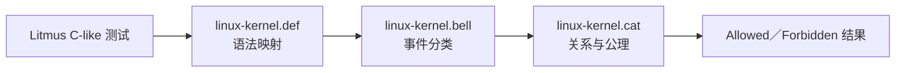
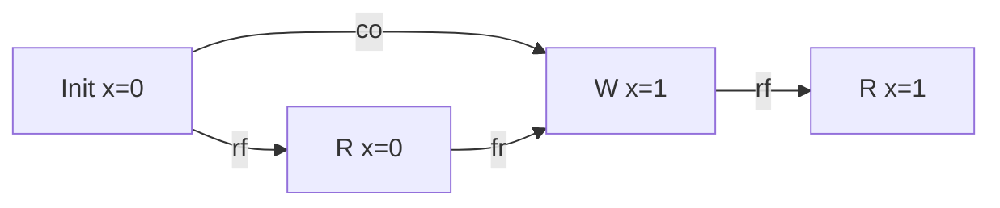
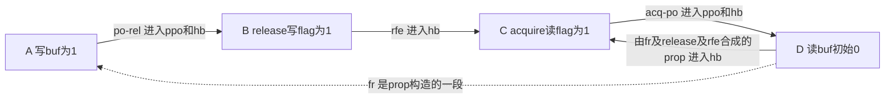

# 第8章\_LKMM事件\_关系与一致性判定

## 8.1\_LKMM\_回答的是\_Linux\_软件契约

上一章的[登记空窗模型](P07_锁_调度_中断与隐式顺序.md#7.7.2_用完整C模型找到登记空窗)只枚举立即可见状态下的交错，没有覆盖弱内存。现在需要把访问、锁和屏障转换为明确事件，才能检查一个Linux原语组合允许什么执行。

Linux Kernel Memory Model（LKMM）把内核认可的访问、屏障、原子、锁和 RCU 原语映射为事件与关系，再判定某个抽象执行是否允许。它的目标不是模拟某颗 CPU 的流水线，而是给跨架构内核代码一个可验证的最低契约。



版本化文件职责和源码路径见 [Linux 6.12 LKMM 导读](../../../../../research/source_reading/memory_ordering/navigation/P01_Linux_6.12_LKMM_源码与模型导读.md)。

我们已经能用P04的消息发布说明“准备载荷、发布条件、取得条件、读取载荷”。现在反过来问：假如读者看见条件为真，却仍读到旧载荷，要给每次读取安排怎样的来源？这些安排能否同时满足模型？这就是 **候选执行**：先描述一个可能的结果及其事件关系，再用规则筛掉自相矛盾的候选。图上的事件是被分析程序的访问；`.cat`关系是验证工具中的数学对象，不是CPU内存里另有一张同名表。

## 8.2\_先把源码压缩成事件

采用已有[MP发布取得测试](../../../../../labs/kernel/memory_ordering/P02_LKMM_Litmus_消息传递与屏障/tests/MP+pooncerelease+poacquireonce.litmus)。MP表示消息传递（Message Passing）；生产者P0独自写载荷buf和标志flag，消费者P1只读。初始两地址均为0，测试关注P1看到flag为1、buf却为0。这不是完整C应用程序，而是一份可交给herd7解析的Litmus输入；文件注释中的 `Result: Never` 是预期，不代表本批执行结果。

访问类别沿用P02和P04：READ_ONCE/WRITE_ONCE是标记单次访问的宏，下面简称ONCE访问；smp_store_release/smp_load_acquire是对应的发布/取得原语。这里关注它们如何生成事件，不重新把访问标记误当成全屏障。

```text
C MP+pooncerelease+poacquireonce

{}

P0(int *buf, int *flag)
{
    WRITE_ONCE(*buf, 1);
    smp_store_release(flag, 1);
}

P1(int *buf, int *flag)
{
    int r0;
    int r1;

    r0 = smp_load_acquire(flag);
    r1 = READ_ONCE(*buf);
}

exists (1:r0=1 /\ 1:r1=0)
```

`exists` 提出“是否存在满足该寄存器结果的执行”这一问题，`1:r0` 指参与者P1的局部寄存器r0。空初始化块使用该测试格式的默认零初值；不能把它看作普通C未初始化局部变量。给访问编号后就不用在图中反复读代码：

| 事件 | 执行者与共享地址 | 类型及候选值 | 来源/后继责任 |
| --- | --- | --- | --- |
| Ibuf、Iflag | 初始状态，各自对应buf、flag | 初始写0 | 为后续读取提供候选来源 |
| A | P0写buf | ONCE写1 | P0程序中先于B |
| B | P0写flag | release写1 | 候选中供C读取 |
| C | P1读flag | acquire读1 | P1程序中先于D |
| D | P1读buf | ONCE读0 | 候选中来自Ibuf，正是要排除的旧值 |

对象初始化、地址有效、没有复用和回收仍是该小测试之外的约束。它只把两地址一次发布的顺序压缩出来，不替生产代码建立多轮生命周期。

局部变量计算若不影响共享访问关系，通常不必保留；但条件、地址和数据依赖会影响模型，不能无脑删除。

## 8.3\_基础关系怎样读

| 关系 | 问题 | 示例 |
| --- | --- | --- |
| `po`，program order，程序顺序 | 同一参与者事件在程序中的先后 | A→B、C→D |
| `rf`，reads-from，读取来源 | 某次读取选了哪次写 | B→C、Ibuf→D |
| `co`，coherence order，同址写一致性序 | 同一位置的各次写怎样排列 | Ibuf→A；不同地址各有自己的序 |
| `fr`，from-read，从读取到后继写 | 某次读取来源之后，还有哪些同址写 | D读Ibuf且Ibuf在A之前，得到D→A |
| dependency | 一个读取结果怎样决定后续地址/数据/控制 | Rptr → R(*ptr) |



不要把 `fr` 直接念成“这次读取在墙上时钟时间里早于后来的写”。它是从读取来源和同址写序推出的关系：先沿rf反向找到来源，再沿co走到后继写。本例D读0，buf唯一的写0是Ibuf，所以来源确定，继而得到D→A。模型是否允许所有这些关系同时存在，还要继续检查。

一般情况下，寄存器值只 **限制** rf候选，不唯一决定来源。如果两个写都写1，读到1不能告诉工具来自哪一个；每种来源需要分别考虑。同址写序co也不能凭最终数值任意猜出。只看po同样不够：它写明程序顺序，但不把全部跨地址po边都升级为模型要求保留的硬件顺序。

## 8.4\_屏障和取得发布怎样形成更高层关系

LKMM将访问标签、依赖、屏障与传播规则组合为happens-before（hb，先发生关系）等待检查的关系。它有自己的精确定义，不能把C++中同名概念的定义直接抄过来。固定模型要求hb无环；但这并不表示“图里出现任意箭头组成的环就禁止”。边必须真正属于被检查的关系。

### 8.4.1\_为MP坏结果找到真实的回边

先沿固定[模型公理入口](../../../../../research/source_reading/memory_ordering/navigation/P01_Linux_6.12_LKMM_源码与模型导读.md#1.6_linux_kernel_cat_怎样组织公理)核对定义，再按本例一步一步归类。这里四个运行时访问都是Marked，即由ONCE或带顺序原语标记的访问；没有plain访问混入。

1. A→B在release之前形成 `po-rel` 边，C→D从acquire之后形成 `acq-po` 边。二者在本例属于 `ppo`（preserved program order，保留的程序顺序），继而属于hb。
2. B→C是跨参与者rf，在模型中称 `rfe`；它也属于hb。下标式后缀e表示external，即两个端点来自不同参与者；i表示internal，即同一参与者。
3. 坏结果要求D读Ibuf，故有D→A的fr；它是跨参与者的覆盖关系。A→B的release提供累积屏障边，再接B→C的rfe，可以按固定 `prop`（propagation，传播关系）构造D→C。
4. D与C同属P1且不是同一个事件。固定hb定义接纳prop中这种非自环、同参与者的边，因此D→C成为hb；它与第一步的C→D闭环。`acyclic hb` 要求不存在有向环，这个候选于是被排除。



虚线D→A不能直接标成hb；真正用于这次无环检查的回边是合成后的D→C。模型中的传播检查还不止prop本身，后文会看到包含强屏障的pb。把所有边都模糊写成“顺序”，虽然图好画，却失去了检查代码组合的能力。

在这个只写一次的MP中，坏结果对应的来源已经由唯一0/1写限定，因此上述推演足以解释它为何被禁止。更一般的测试可能有多个rf/co选择，要说结果Never必须排除所有满足目标结果的候选，不能只否定其中一张图。本批没有实际运行herd7，下面的C程序也不会替它作完整判定。

### 8.4.2\_运行四节点关系环检查

[mp_relation_cycle.c](../../../../../labs/kernel/memory_ordering/materials/mp_relation_cycle.c)把上面 **已经手工推导的** hb子图放进一个二维布尔数组；矩阵行列就是A、B、C、D。每次增加“from能到mid且mid能到to”这条可达事实，最终检查某个节点能否回到自己。模型没有解析器，也没有枚举其余读取来源；用途是让读者自己删掉一侧顺序，观察刚才指出的环是否还在。

```c
#include <stdbool.h>
#include <stdio.h>

enum event_id { write_data, write_flag, read_flag, read_data, event_count };

static bool has_cycle(bool release, bool acquire)
{
    bool reach[event_count][event_count] = {{false}};
    // 固定候选：读flag来自写1，读data来自初始0；全部为标记访问。
    reach[write_flag][read_flag] = true; // 跨线程读取来源rfe。
    if (release) {
        reach[write_data][write_flag] = true; // po-rel进入ppo。
        // fr(data) -> release -> rfe(flag)构成prop的同线程回边。
        reach[read_data][read_flag] = true;
    }
    if (acquire)
        reach[read_flag][read_data] = true; // acq-po进入ppo。

    // 求可达闭包；从任一事件重新到达自身就发现环。
    for (int mid = 0; mid < event_count; ++mid)
        for (int from = 0; from < event_count; ++from)
            for (int to = 0; to < event_count; ++to)
                reach[from][to] = reach[from][to] ||
                    (reach[from][mid] && reach[mid][to]);
    for (int event = 0; event < event_count; ++event)
        if (reach[event][event])
            return true;
    return false;
}

int main(void)
{
    for (int release = 0; release <= 1; ++release) {
        for (int acquire = 0; acquire <= 1; ++acquire) {
            const bool cycle = has_cycle(release != 0, acquire != 0);
            printf("release=%d acquire=%d hb_cycle=%d\n",
                   release, acquire, cycle);
            if (cycle != (release != 0 && acquire != 0))
                return 1;
        }
    }
    // 仅核对正文给定的四节点子图，不解析litmus/cat，不判断完整LKMM。
    return 0;
}
```

从仓库根目录的Bash环境执行：

```bash
mkdir -p .cache/mp_relation_cycle
gcc -std=c11 -Wall -Wextra -Werror -O2 \
  labs/kernel/memory_ordering/materials/mp_relation_cycle.c \
  -o .cache/mp_relation_cycle/mp_relation_cycle
.cache/mp_relation_cycle/mp_relation_cycle
```

2026-09-24，GCC14.2、x86_64-w64-mingw32严格编译并运行得到：

```text
release=0 acquire=0 hb_cycle=0
release=0 acquire=1 hb_cycle=0
release=1 acquire=0 hb_cycle=0
release=1 acquire=1 hb_cycle=1
```

两侧都在时出现刚才推导的环；删除发布侧会失去D→C合成回边，删除取得侧会失去C→D。前三行只说这份特定子图无环，**不等于完成LKMM全部公理检查后允许该结果**。程序不读取cat文件、不调用herd7、不运行被测并发程序，也不提供硬件频率；它检验的是正文图与环算法的一致性。

## 8.5\_传播关系为什么超出两线程\_hb

让生产者甲写一个值，乙先读到它再发布另一个条件，丙取得乙的条件后去读甲的值，就有了 **写—读因果（Write-to-Read Causality，WRC）** 这一类测试。若两个观察者分别读取两个独立写者的更新，则进入 **独立写的独立读取（Independent Reads of Independent Writes，IRIW）** 问题。它们不是新API名称，而是检验传播约束的不同参与者布局。

`linux-kernel.cat` 中的传播规则处理全屏障、锁链和累积性；只证明本地po或一条直接rf不足以覆盖第三方。固定模型把prop再与强屏障及后续hb路径组合为pb，并要求pb无环；因此也不能把prop与最终名为propagation的公理检查视为同一个符号。

```text
P0 的写 → P1 观察 → P1 发布 → P2 取得 → P2 后续读取
```

LKMM 要判断整条链是否把 P0 的写传播到 P2，而不是只看 P1 的两条语句有序。体系结构层的 WRC 推导见[一致性序与传播](../../../../foundations/computer_architecture/memory_ordering/P04_一致性序_传播与多副本原子性.md)。

## 8.6\_RCU\_还增加独立关系

沿用P05已建立的RCU读侧和回收前提，LKMM能识别 `rcu_read_lock()` / `rcu_read_unlock()`、`synchronize_rcu()`、RCU指针原语等事件，并用RCU关系表达宽限期（Grace Period，GP）对读侧临界区的约束。

```text
读者：rcu_read_lock → 读取旧对象 → rcu_read_unlock
写者：取消发布 → synchronize_rcu → 回收旧对象
```

RCU 关系不是普通全屏障别名：它包含读侧区间、GP 和跨 CPU 周期关系。一个 Litmus 即使验证 RCU 顺序，也仍需真实代码保证对象确实只在 GP 后回收、读者没有把指针带出保护域。

固定模型还有专门构造的rb关系及其约束；不能因为MP只用了hb，就把所有机制强行画成同一种hb环。这里的“回收”是应用协议的逻辑动作，模型不运行内存分配器，也不会替你发现每一种实际释放后访问。一次模型禁止结果更不意味着代码持有了所需kref或完成了回调排空。

## 8.7\_plain\_access\_和数据竞争是模型边界

LKMM 对 plain access、ONCE 和原子访问有不同处理。至少一个 plain access 参与的跨 CPU 同址并发读写可能构成数据竞争，并给编译器留下强优化空间。

形式测试若把真实 plain access 全部改成 `READ_ONCE()` / `WRITE_ONCE()`，可能验证的是一个比真实代码更受约束的程序；反之，把成熟 API 拆成 plain access 又可能制造不存在的竞态。Litmus 必须忠实表达关键访问类别。

plain表示未使用这些访问标记的普通访问。固定cat对其中潜在冲突另外建立一致性与竞争检查，`data-race` 是工具可报告的标记，不能只盯着最终目标结果的Never/Sometimes而忽略诊断。模型也不会自动替源代码添加ONCE；P02编译器访问实验承担的工作并未被事件图取代。

## 8.8\_一致性判定不是枚举线程调度顺序

弱内存执行不能只通过“把线程指令交错排列”枚举，因为：

- 读取可以从尚未按直觉全局传播的写取值；
- 不同地址没有单一全序；
- 依赖、屏障和传播关系跨越简单调度顺序；
- RCU GP 是跨区间关系。

herd7 枚举的是事件关系图与读取来源，不只是 CPU0/CPU1 谁先运行。

对照P07就容易区分两种实验：那里的C枚举器让每次写立即影响后续动作，所有动作排成一个全局顺序，专门找登记空窗；这里先选读从哪次写取值，再检查由此引出的所有关系。不能给P07枚举器换个程序名便称为LKMM，也不能用本章四节点环程序宣称拥有一个新的Linux内存模型。

## 8.9\_从结果反推缺边

先读懂输出对 **目标条件** 的分类：Never表示模型允许的执行中没有满足目标的结果；Sometimes表示允许的执行中既有满足目标的，也有不满足的；Always表示允许的执行都满足目标。它们不是硬件出现频率。若目标是一个坏结果，Sometimes或Always都不能算正确性通过；解析失败、工具缺失则连这层分类都没有产生。

若模型报告坏结果 `Sometimes`：

1. 查看关注结果对应的 `rf`；
2. 检查发布端是否缺 release/写屏障；
3. 检查取得端是否缺 acquire/读屏障；
4. 检查方向是否其实是 Store→Load，需要全屏障；
5. 检查第三方传播是否缺累积边；
6. 检查 plain access/依赖是否被错误表达；
7. 检查问题是否其实是生命周期或多写者状态机，超出纯顺序。

增加原语后实际重跑成对测试，记录究竟哪类关系变化排除了坏结果，同时保存模型版本、测试内容、工具版本和完整输出。在正式执行前，应把结论写作“手工推演/预期”；测试注释、manifest中的期望值、截图上的示意图，都不是本次工具运行记录。

## 8.10\_模型没有覆盖什么

Linux 6.12 `tools/memory-model/Documentation/litmus-tests.txt` 明确列出限制，包括：

- 不能准确模拟任意编译器优化；
- 不支持同一变量的多种访问宽度；
- 不建模异常和中断的一般行为；
- 不支持 MMIO/DMA I/O；
- 不覆盖所有原子 RMW 变体和动态内存分配；
- Litmus C-like 语法不是完整 C。

所以 LKMM `Never` 必须读成“在该测试表达和该版本 Linux 模型中禁止”，不能外推成所有未建模行为也安全。

## 8.11\_本章验收

1. 能说明 `.def/.bell/.cat` 各自负责什么。
2. 能从寄存器结果补出 `rf/co/fr`。
3. 能解释 MP 坏结果怎样因 release/acquire 形成禁止环。
4. 能说明多 CPU 传播为何不能只看两线程 `po`。
5. 能区分 LKMM RCU 关系与普通屏障。
6. 能列出 plain access 和 Litmus 模型的关键边界。

做三次小推导检查理解：

1. 给buf增加另一个写1的参与者，P1的r1读到1时能否唯一画出rf？
2. 在MP坏结果图上把D→A直接标hb，结论即使恰好仍说“禁止”，为什么证明不合格？
3. 四节点程序输出hb_cycle=0，能否省略coherence、atomic、pb、RCU和plain相关检查？

第一题不能：相同数值对应多个来源候选。第二题混淆基础fr与hb实际定义，不能支持换原语或换拓扑后的推导；本例应由prop构造D→C并与C→D闭环。第三题不能：只检查一个选定候选的一部分关系，既未覆盖其他约束，也未枚举所有候选。下一章把这套读图方法接到真实herd7输入、执行记录与硬件实验边界。

上一篇：[锁、调度、中断与隐式顺序](P07_锁_调度_中断与隐式顺序.md)。

下一篇：[Litmus、形式验证与硬件实验](P09_Litmus_形式验证与硬件实验.md)。
