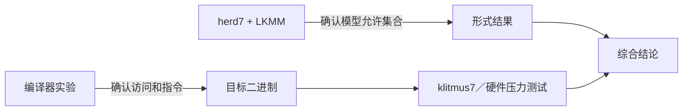
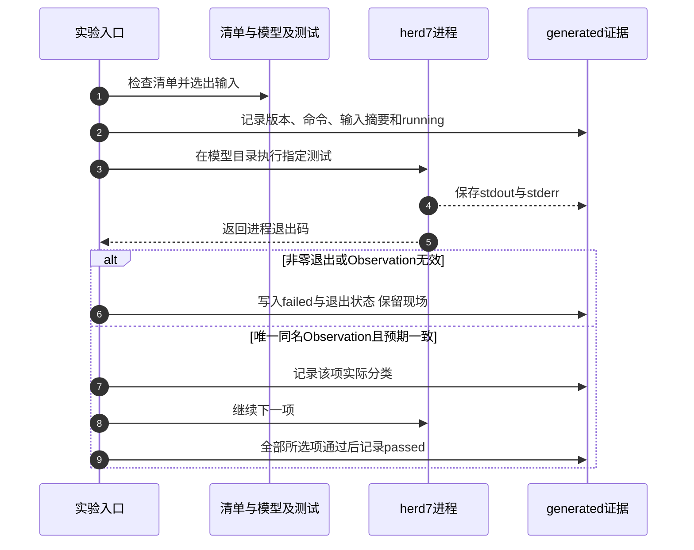

# 第9章\_Litmus\_形式验证与硬件实验

## 9.1\_一项结论需要三种互补验证

上一章的[MP关系推导](P08_LKMM事件_关系与一致性判定.md#8.4.1_为MP坏结果找到真实的回边)与C子图检查说明了一个候选为何矛盾，但没有实际执行herd7。本章把输入、模型、工具和运行输出接起来，分开预期结论与实际验证记录。



- 反汇编确认编译器实际生成什么；
- herd7 穷举 LKMM 中的小型执行；
- klitmus7 或硬件测试观察目标内核/CPU 上实际出现的结果。

任何一层都不能单独代表另外两层。

沿用P08的消息传递问题：读者看见flag为1、buf却为0。现在不再增加新的同步机制，而是把这个问题交给工具，并确保以后的人能够重做同一次提问。首先保留测试输入；其次固定模型及工具；然后保存实际命令、标准输出、错误输出和退出码；最后才解释结果。只有清单里写着Never，或者一个命令没有报错，都还不够。

## 9.2\_Linux\_6.12\_模型文件怎样准备

本仓库保存的版本化模型位于：

```text
research/source_reading/linux/tools/memory-model/
├── linux-kernel.cfg
├── linux-kernel.def
├── linux-kernel.bell
├── linux-kernel.cat
└── lock.cat
```

模型来自NXP官方Linux 6.12.20固定提交，身份以[源码基线](../../../../../research/source_reading/linux/SOURCE_BASELINE.md#1.1_当前来源)为准，不以运行机器的目录名或本地实验HEAD为准。保存的文件可以独立交给herd7，不需要先构建整个内核；头文件、C宏的实际编译则属于另一层验证。

固定版本的上游README首先提出herd7/klitmus7 7.52或以上，并提醒未来工具不绝对向后兼容；它还 **单独列出klitmus7与目标内核的兼容表**：面向5.17及之后内核的条目是7.56.1或以上。因此不能从首段推出“用klitmus7 7.52生成Linux 6.12模块就合适”。模型工具能否解释这份cat，与硬件生成器是否适配运行内核API，是两个检查。具体安装按herdtools7对应版本的上游说明进行；不要为凑成功结果静默更换本章模型。

## 9.3\_最小\_Litmus\_文件怎样写

```text
C MP-demo

{}

P0(int *data, int *flag)
{
    WRITE_ONCE(*data, 1);
    WRITE_ONCE(*flag, 1);
}

P1(int *data, int *flag)
{
    int r0 = READ_ONCE(*flag);
    int r1 = READ_ONCE(*data);
}

exists (1:r0=1 /\ 1:r1=0)
```

组成部分：

1. `C name` 指定测试和 Linux C-like 方言；
2. `{}` 给出初始状态，省略位置通常按模型默认初始化；
3. `Pn()` 表示参与者；
4. 使用模型认识的 ONCE、屏障、原子、锁或 RCU 原语；
5. `exists` 写出要询问的结果。

Litmus 语法不是完整 C：不支持任意函数、循环、动态分配和预处理器。真实代码必须先缩成最小事件协议。

这份无序例子故意把flag读到1且data读到0当作坏结果，不能写成“只看flag有没有变化”。若目标条件漏掉data，正确版本也可能满足它，就失去成对对照的意义。反过来，拼错参与者寄存器、改错变量或选择了不同模型，可能让一个本该存在的缺口消失；工具输出的状态列表正是检查这些错误的材料。

保存P08的release/acquire版本作为另一份输入，两份只改变与问题有关的顺序原语，保留同一初值、两个参与者、两地址和坏结果条件。不要同时改参与者数量、载荷或条件，再把差异全部归功于一个屏障。

## 9.4\_运行\_herd7

在保存的模型目录执行：

```bash
cd research/source_reading/linux/tools/memory-model
herd7 -conf linux-kernel.cfg \
  ../../../../../labs/kernel/memory_ordering/P02_LKMM_Litmus_消息传递与屏障/tests/MP+poonceonces.litmus
```

这条命令的当前目录用于解析cfg中的相对模型引用，最后一个相对路径从该目录回到仓库的实验输入。若从其他目录执行，先改变工作目录，或使用[实验入口](../../../../../labs/kernel/memory_ordering/P02_LKMM_Litmus_消息传递与屏障/README.md#1.4_静态检查)自动定位。实验目录没有Makefile，不能使用原先误写的 `make check`。

从仓库根目录先静态检查，再运行MP四项：

```bash
bash labs/kernel/memory_ordering/P02_LKMM_Litmus_消息传递与屏障/run.sh --check
bash labs/kernel/memory_ordering/P02_LKMM_Litmus_消息传递与屏障/run.sh --filter MP
```

`--check` 只检查清单、模型和输入；找到工具时查询版本，找不到时明确说明未运行模型并返回静态检查成功。第二条才调用herd7；工具缺失返回2，不会把“检查过文件”说成“模型通过”。可用 `--herd /path/to/herd7` 指定已安装工具，不需要改脚本或全局环境。

实际运行的输出重点如下；这是字段说明，不是本批捕获的工具输出：

```text
Test ... Allowed
States ...
Witnesses
Positive: ... Negative: ...
Condition exists (...)
Observation ... Sometimes|Never|Always ...
```

对这里的exists坏结果，Positive是满足目标的允许执行计数，Negative是不满足的计数。Never表示没有满足目标的结果；Sometimes表示两类都有；Always表示允许执行全部满足目标。后两者都不能当作坏结果被排除。计数是模型见证，不是CPU压力测试的出现频率。解析失败或进程非零退出时，不应再从半截输出里抽一个Never当成成功。

### 9.4.1\_一次运行怎样留下可复查证据

实验入口使用[manifest.tsv](../../../../../labs/kernel/memory_ordering/P02_LKMM_Litmus_消息传递与屏障/manifest.tsv)作为唯一测试清单，第一列文件名、第二列预期分类；使用制表符使Bash可以直接解析，无需为八行数据额外依赖Python或JSON解析器。下面是已落地的完整测试集合，版本头部仍在清单中维护：

```text
MP+poonceonces.litmus                                  Sometimes
MP+pooncerelease+poacquireonce.litmus                    Never
MP+fencewmbonceonce+fencermbonceonce.litmus               Never
SB+poonceonces.litmus                                  Sometimes
SB+fencembonceonces.litmus                              Never
IRIW+poonceonces+OnceOnce.litmus                        Sometimes
IRIW+fencembonceonces+OnceOnce.litmus                    Never
MP+onceassign+derefonce.litmus                          Never
```

上表为便于阅读而对齐；编辑文件时须保留真正的制表符。脚本拒绝重复项、路径穿越、非法预期、缺失输入、输入内C名称与文件名不符，以及没有匹配项的筛选。模型五文件的存在检查不等于完整解析；包含文件或工具内部库不兼容，仍可能到实际执行时才暴露。



输出位于实验的generated目录：`run.txt` 保存仓库HEAD、实际模型目录、工具路径、命令和各项退出/分类；`herd_version.txt` 保存工具版本；`inputs.sha256` 保存清单、五份模型和全部测试的内容摘要；每项的 `.stdout.txt`、`.stderr.txt` 分别保留两种输出。HEAD只标识仓库提交，输入摘要才定位本次使用的工作文件，不能用HEAD掩盖未提交变更。

脚本要求每项恰好一条同名Observation，并核对分类、计数形态及预期；零允许执行会被拒绝，防止把空集合上的Never当成有效对照。它仍不能替人解释见证图，也不保证其他警告都可以忽略。下一次实际执行前会清除脚本已知的旧输出，避免筛选后遗留未执行测试的旧成功记录；若依赖或静态检查提前失败，本轮尚未创建日志，应以终端失败为准，不能借旧run.txt声称成功。需要长期保留时，应先将完整结果和解释存入独立结果文档及其证据位置。`--clean` 只删除已知生成文件，保留其他手工文件，也不会卸载任何内核模块。

## 9.5\_必须运行成对反例

只运行“正确版本”容易把语法、模型选择或结果条件写错。每个结论至少包含：

| 模式 | 无序测试 | 加序测试 | 预期变化 |
| --- | --- | --- | --- |
| MP | 两端 ONCE | release/acquire | 坏结果 Sometimes → Never |
| MP | 两端 ONCE | wmb/rmb 配对 | 坏结果 Sometimes → Never |
| SB | Store/Load ONCE | 两边 `smp_mb()` | 0/0 Sometimes → Never |
| IRIW | reader 连续两读 | reader 两读间 `smp_mb()` | 相反观察 Sometimes → Never |

无序测试验证模型确实能表达要修的缺口；有序测试验证新增原语确实关闭该缺口。

读表时给“预期变化”加一个条件：两份输入都已被真实工具成功解析并执行。修改清单把期望改成刚看到的结果，不是修复失败；应先解释为什么原推理或工具配置发生了变化。新增Always或其他异常结果同样要保留现场，而不是删掉失败项后报告其余通过。

## 9.6\_怎样解释一次\_Sometimes

以 MP 无序结果为例：

1. P1 的 flag Load 从 P0 的新 flag Store 读取；
2. P1 的 data Load 从 data 初始写读取；
3. 两次写、两次读各自有程序顺序；
4. 没有 release/acquire 或屏障把 Wdata 连接到 Rdata；
5. 同址一致性允许每个 Load 所选来源；
6. 因此坏结果存在。

解释必须落到事件关系，而不是只写“弱内存会乱序”。

同时保持P08的精确性：没有某一条hb环，只排除了一个禁止原因，完整允许结论仍需要全部公理。实际Sometimes给出的见证图能帮助定位读取来源；删除某个屏障后允许集合怎样改变，才是成对实验要解释的增量。不要把屏障简称写在任意两点之间，就认为模型一定存在对应关系。

## 9.7\_从\_Litmus\_转换到内核硬件测试

`klitmus7`可以把支持的Litmus转成内核测试模块。下面是 **目标Linux实验步骤，未在本批执行**；从仓库根目录先进入实验目录，生成位置必须尚不存在，避免覆盖前次运行证据：

```bash
cd labs/kernel/memory_ordering/P02_LKMM_Litmus_消息传递与屏障
test ! -L generated || exit 1
mkdir -p generated
test ! -e generated/klitmus_sb || exit 1
klitmus7 -o generated/klitmus_sb tests/SB+fencembonceonces.litmus
cd generated/klitmus_sb
make
# 先检查生成的run.sh、目标内核及模块加载/卸载过程，再决定执行。
# sudo sh run.sh
```

生成成功只表示产出了代码，make成功只表示完成了对应构建，两者都不等于模块已在目标机运行。读取生成的构建文件，核对其实际使用的内核构建目录；若运行内核不同于取证用6.12.20，必须分别记录模型身份与运行身份。硬件执行才可能给出各结果的次数分布。运行前必须：

- 只在可恢复测试机/虚拟机或明确授权环境加载模块；
- 核对生成模块面向当前内核构建；
- 保存内核版本、配置、CPU、herdtools7 和编译器版本；
- 阅读生成代码，确认 CPU 绑定、迭代次数和退出路径；
- 清理已加载模块和生成产物。

本仓库不会在 Windows 编辑环境中假装完成内核模块运行；实验 README 会明确区分已验证的静态结构和待在 Linux 目标机执行的步骤。

klitmus7是另一个执行后端，不是把herd7的输出翻译成硬件事实。当前外部内核工作树用于固定提交取证，不在知识整理过程中修改或构建它；目标实验应使用已准备好的匹配运行环境。完成后核对生成运行脚本是否已卸载模块，必要时按实际模块名清理，再归档产物；不能删目录后便假定内核中不再运行代码。

## 9.8\_硬件未观察到为什么不能推翻模型

若模型说 `Sometimes`，硬件测试未出现，可能因为：

- 当前 CPU 比 LKMM 最低保证更强；
- 结果概率很低，迭代不足；
- 测试调度/同步框架意外加入顺序；
- 两线程未真正并行或未跨合适核心；
- 编译器生成的访问与假设不同；
- cache 拓扑和负载不利于触发。

因此结论只能写“在该配置和样本中未观察到”，不能改写成 `Never`。

## 9.9\_模型禁止但硬件出现时怎样排查

1. 检查 Litmus 和硬件代码是否真是同一事件协议；
2. 检查 C 代码是否存在 plain data race、撕裂或越界；
3. 检查编译器是否保留 ONCE/atomic 访问；
4. 检查目标内存类型是否为普通可缓存内存；
5. 检查模型版本、工具版本和命令行配置；
6. 检查 CPU/内核是否存在已知缺陷；
7. 将最小复现、汇编、结果分布和版本信息提交给对应维护者。

不要通过继续添加随机屏障掩盖模型与观察不一致。

## 9.10\_实验局限必须写进结论

LKMM Litmus 当前不完整模拟：

- 任意编译器优化；
- 多访问宽度和撕裂；
- 通用异常/中断交错；
- MMIO、DMA 和设备缓存；
- 动态内存分配与完整对象生命周期；
- 所有可能的原子 API 细节。

所以形式结果要与 P02 的反汇编、体系结构手册、子系统契约和真实对象状态机共同审查。

本批实际边界是：八份输入及模型清单静态检查通过，Bash驱动在隔离目录用明确标记的工具替身完成16项协议检查；替身只检验工作目录、参数、日志和解析拒绝分支，不解释cat。当前宿主PATH没有herd7，没有产生真实Observation；也未生成、构建或加载klitmus模块。实验装置通过检查，是以后产生证据的前提，不是被测并发机制已经通过。

## 9.11\_实验记录模板

```text
测试文件：
关注结果：
预期模型结果及推理：
Linux 模型版本：
herd7/klitmus7 版本：
完整命令：
完整输出路径：
硬件/内核/编译器：
迭代数和结果分布：
与预期差异：
结论的适用边界：
清理结果：
```

## 9.12\_本章验收

1. 能写出包含初始状态、参与者和 `exists` 的 Litmus。
2. 能解释 `Sometimes/Never`，而不是只抄输出。
3. 能设计无序/有序成对测试。
4. 能区分 herd7 模型验证与 klitmus7 硬件观察。
5. 能解释硬件未观察到允许结果为什么不是证明。
6. 能记录版本、输出、结果分布和模型边界。

先独立判断三份记录：甲只保存清单中的Never；乙保存工具非零退出前的一行Never；丙保存固定输入摘要、模型/工具版本、零退出、完整输出与匹配的唯一Observation。只有丙具备解释本次模型结果的基础，仍须阅读其诊断和对应关系图。甲是预期，乙是失败现场，都不能当作通过。

再做两个修改练习：把筛选文本换成一个不存在的名字，确认驱动拒绝“零项通过”；在独立副本中把某个预期改错，保留实际输出并解释为何应失败，切勿修改权威清单来迎合测试。最后用P08的A～D编号说明MP两份输入各少了或增加了什么边。下一章把这些证据带回实际子系统，判断错误属于CPU顺序、设备访问还是对象寿命。

上一篇：[LKMM 事件、关系与一致性判定](P08_LKMM事件_关系与一致性判定.md)。

下一篇：[子系统边界、误用诊断与选型](P10_子系统边界_误用诊断与选型.md)。
