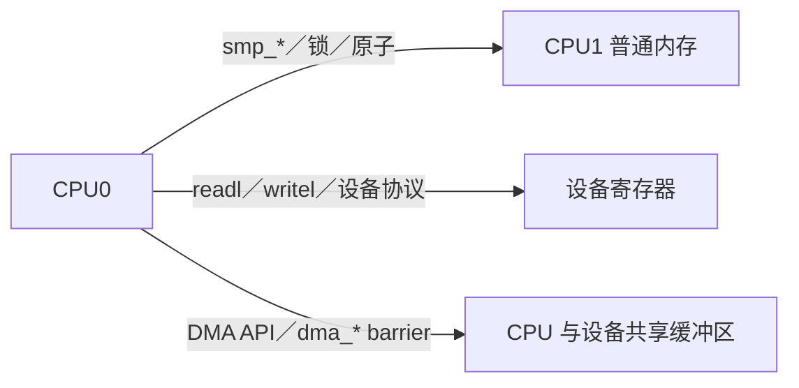

# 第10章\_子系统边界\_误用诊断与选型

## 10.1\_先判断当前问题属于哪条轴

| 现象或需求 | 首要问题轴 | 内存屏障是否单独足够 |
| --- | --- | --- |
| 轮询值被编译器只读一次 | 编译器访问 | 使用 ONCE/正确 API，不需要凭空全屏障 |
| 多 CPU `counter++` 丢更新 | 原子 RMW/互斥 | 否 |
| 读到新 flag 却读到旧 payload | 发布—取得顺序 | 需要配对原语 |
| 多字段来自不同版本 | 一致快照 | 否，使用锁/seqcount/不可变对象 |
| 等待方永久睡眠 | 条件登记与唤醒 | 否，使用 waitqueue/completion 协议 |
| 指针取消发布后 UAF | 对象生命周期 | 否，使用 RCU/refcount/锁 |
| 设备门铃早于描述符可见 | DMA/MMIO 顺序和所有权 | 普通 `smp_*()` 不足 |

先分类能避免把所有并发缺陷都诊断成“缺 barrier”。

## 10.2\_普通内存\_MMIO\_DMA\_三种域



- CPU—CPU 普通可缓存内存：使用 ONCE、`smp_*()`、原子、锁和子系统 API。
- CPU—设备寄存器：使用 MMIO accessor，按设备手册处理 relaxed 访问和 posted write。
- CPU—DMA 内存：先用 DMA API 建立映射、所有权和缓存维护，再按描述符协议选择 `dma_rmb/wmb` 或相关接口。

`smp_wmb()` 不能保证设备已经收到 `writel()`；`wmb()` 也不能替代 streaming DMA 的 `dma_sync_*()` 所有权转换。

## 10.3\_RCU\_边界

RCU 同时组合：

```text
新对象：rcu_assign_pointer → rcu_dereference 发布/取得
旧对象：取消发布 → GP → 回收
读侧域：rcu_read_lock/unlock 或对应变体
写写竞争：额外更新锁或单写者协议
```

常见误用：

- 用 `READ_ONCE()` 替代 `rcu_dereference()`；
- 以为 `synchronize_rcu()` 会补齐新对象发布；
- 在 RCU 外长期保存裸指针；
- reader 修改共享多字段却没有锁/原子；
- 以为 GP 能等待 kref 或业务引用自动归零。

完整生命周期在 [RCU 专题](../rcu/大纲.md)，本专题只维护其中使用的顺序契约。

## 10.4\_锁与原子边界

锁适合同时需要互斥和顺序的复合状态；atomic RMW 适合单个状态字的不可分割转换。两者都可能形成缓存行热点，选择不能只看“是否睡眠”：

- 临界区是否包含多个字段和错误路径；
- 竞争频率和持有时间；
- 调用上下文是否允许睡眠；
- 是否需要 lockdep；
- 无锁状态机是否能证明前进性、ABA 和生命周期。

用几条 barrier 不能替代锁的所有权；用 `atomic_t` 包装字段也不能自动把复合对象变成原子。

## 10.5\_waitqueue\_与完成事件边界

等待/唤醒要同时保护：条件状态、等待者登记、任务状态和唤醒动作。若场景是一项一次性工作完成，completion 通常比自制 flag+barrier 更清楚；若是任意条件，使用 waitqueue 宏并在循环中重检条件。

屏障只排序内存事件，不会把任务加入队列、不会避免唤醒落在登记空窗，也不会处理信号、超时和销毁等待队列。

## 10.6\_常见错误语句逐句改写

| 错误表述 | 可审查表述 |
| --- | --- |
| “加 `volatile` 就能看到最新值” | 指定 ONCE 访问以及建立可见性顺序的配对原语 |
| “原子变量自带内存屏障” | 指定 RMW 变体、成功/失败路径及对其他地址的顺序 |
| “`smp_mb()` 会刷新所有 cache” | 它建立指定普通内存访问的顺序，缓存由一致性协议维护 |
| “关中断等于内存屏障” | 它消除本 CPU 某类中断交错，跨 CPU 顺序需另行建立 |
| “发生调度所以数据一定可见” | 使用锁/等待/RCU 等规定配对状态的 API |
| “看到新指针就可释放旧指针” | 发布可见性与旧对象生命期分开设计 |
| “测试没复现就说明安全” | 未观察到不是模型禁止的证明 |

## 10.7\_诊断一段可疑代码的固定步骤

```text
S0：列参与者和执行上下文
S1：列共享地址、所有者和访问类型
S2：写初始状态与禁止结果
S3：检查编译器访问是否用 ONCE/atomic/API 正确标记
S4：检查访问宽度与对齐
S5：标出 po/rf/co/fr 和依赖
S6：加入锁、屏障、release/acquire、RCU 等已有边
S7：用 Litmus 验证最小顺序核心
S8：恢复多写者、等待、错误路径和生命周期
S9：核对 MMIO/DMA/架构/配置边界
S10：用反汇编、KCSAN/lockdep 和目标机实验验证
```

任何一步发现问题，都应回到对应权威专题修复，而不是继续向代码叠加最强屏障。

## 10.8\_性能取舍

| 方案 | 高频成本 | 低频/隐藏成本 | 适用边界 |
| --- | --- | --- | --- |
| 全局锁 | 获取/释放、竞争和缓存行迁移 | 阻塞、调度、尾延迟 | 复合状态、竞争可控 |
| 全局 atomic RMW | 每次所有权争夺 | 重试、串行化热点 | 单状态字、更新较少 |
| release/acquire | 单向顺序约束 | 协议证明、代际/多写者复杂度 | 明确发布—取得 |
| 全屏障 | 失去访存重叠 | 架构差异、难归因 | 确实需要双向顺序 |
| per-CPU/分片 | 本地快路径 | 汇总延迟、内存占用 | 可延迟形成全局视图 |
| RCU | 极轻 reader | GP、回调积压、旧版本内存 | 读多写少、可版本化对象 |

“更弱原语更快”不是选择依据；必须先证明它表达了完整协议，再用目标负载测成本。

## 10.9\_最终选型问题

1. 这是单次访问、原子状态转换还是多字段不变量？
2. 是否有明确发布位置和取得条件？
3. 是否存在多个写者、循环代际或 ABA？
4. 读者是否可能睡眠、迁移或把指针带出保护域？
5. 对象何时释放，谁持有最后一个所有权？
6. 是否涉及设备寄存器、DMA 或非普通内存？
7. 当前 API 是否已提供锁、等待、RCU 或 refcount 的完整契约？
8. LKMM Litmus 能表达哪部分，哪些部分必须靠其他证据？
9. 正常、特殊和超时路径分别付出什么成本？

## 10.10\_专题验收

完成本专题后，应能拿到一段真实代码：不用“CPU 乱序”一句话收尾，而是定位编译器访问、硬件事件、Linux 顺序边、状态所有权、等待通信和生命周期的具体缺口；能写出最小 Litmus 验证顺序核心，并知道何时必须返回锁、RCU、MMIO、DMA 或对象生命周期专题继续分析。

上一篇：[Litmus、形式验证与硬件实验](P09_Litmus_形式验证与硬件实验.md)。

返回：[Linux 内存顺序专题大纲](大纲.md)。
