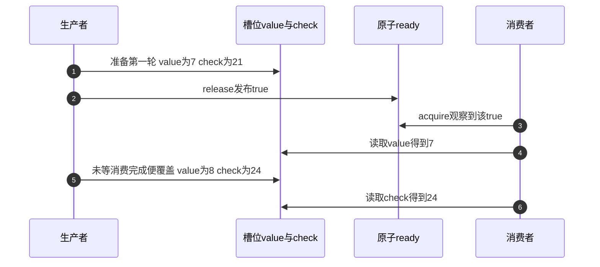
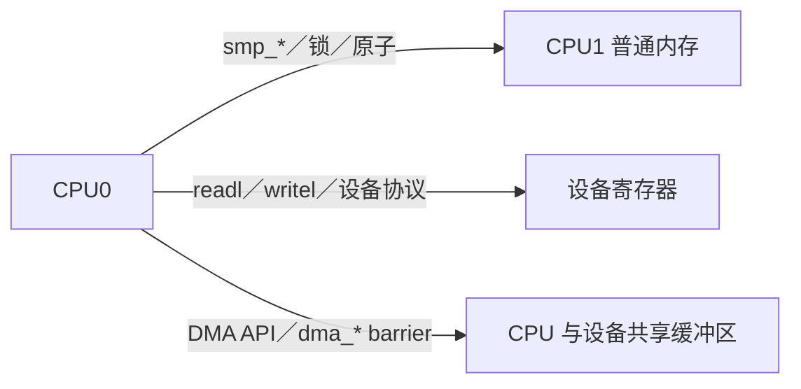

# 第10章\_子系统边界\_误用诊断与选型

## 10.1\_先判断当前问题属于哪条轴

上一章的[实验流程](P09_Litmus_形式验证与硬件实验.md#9.4.1_一次运行怎样留下可复查证据)把预期、实际工具输出和硬件观察分开。本章回到真实子系统：即使某个普通内存Litmus排除了坏结果，也要检查问题是否还涉及设备访问、载荷复用或对象寿命。

本章是完成前九章后的诊断参考页：用一个共享槽位回看保证之间的缝隙，再按问题返回权威专题，不另造一套同步框架。假设槽位的普通字段 `value/check` 应来自同一轮，原子标志 `ready` 表示生产者已经提交。release/acquire能说明读者承接了哪次发布；它不能单独回答“读者读完了吗”“下一位写者是谁”“存储还能活多久”。

| 现象或需求 | 首要问题轴 | 内存屏障是否单独足够 |
| --- | --- | --- |
| 轮询值被编译器只读一次 | 编译器访问 | 使用 ONCE/正确 API，不需要凭空全屏障 |
| 多 CPU `counter++` 丢更新 | 原子 RMW/互斥 | 否 |
| 单次发布中读到新flag却读到旧payload | 发布—取得顺序 | 需证明匹配的发布取得；多轮复用还要查所有权 |
| 多字段来自不同版本 | 一致快照 | 否，使用锁/seqcount/不可变对象 |
| 等待方永久睡眠 | 条件登记与唤醒 | 否，使用 waitqueue/completion 协议 |
| 指针取消发布后仍被解引用 | 对象生命周期 | 否，需完整的查找、持有、撤下与回收协议 |
| 设备门铃早于描述符可见 | DMA/MMIO 顺序和所有权 | 普通 `smp_*()` 不足 |

先分类能避免把所有并发缺陷都诊断成“缺 barrier”。

### 10.1.1\_有发布取得为什么仍会拼出两轮字段

先只画协议轨迹，不把下面错误过程写成可运行的C++数据竞争程序：



第一轮准备在取得之后可见，并没有被这个例子推翻。缺的是消费者从第一次字段读取到最后一次字段读取之间的保护：生产者仍能进入下一轮。再加一个全屏障不会让生产者等待消费结束，也不会把两个普通字段的读取变成同一个不可分动作。

修复要从业务保证选：如果必须消费每一轮，回到[P04完整单槽交还程序](P04_release_acquire_发布协议.md#4.6.2_运行完整单槽交还程序)，由消费者release归还、生产者acquire确认后才覆盖；若只需某一时刻的一致快照，可以用同一把锁保护整个读写区间，或在满足写侧序列化与重试前提时使用序列计数器；若允许旧版本长期读取，可以发布不可变对象并另行管理回收。它们分别付出等待、锁竞争、重试或旧版本存储成本，不是随手替换几个函数名。

把场景再改两次，就会发现新的责任。两个生产者同时看到空闲，会需要排他取得或队列协议，P06的CAS只是在其明确前提下选择一个所有者；消费者拿到槽位地址后异步交给另一任务，即使字段当时一致，也要证明第二个任务结束前存储仍有效。与单槽的两条顺序边相比，这些新增责任不会由“更强的内存序”自动生成。

## 10.2\_普通内存\_MMIO\_DMA\_三种域



- CPU—CPU 普通可缓存内存：使用 ONCE、`smp_*()`、原子、锁和子系统 API。
- CPU—设备寄存器：使用 MMIO accessor，按设备手册处理 relaxed 访问和 posted write。
- CPU—DMA内存：先区分一致性分配与流式映射，按DMA API建立地址、方向和访问所有权；需要时完成映射/同步引起的缓存维护，再按描述符协议选择dma_rmb/wmb或相关接口。

`smp_wmb()` 不能保证设备已经收到 `writel()`；`wmb()` 也不能替代 streaming DMA 的 `dma_sync_*()` 所有权转换。

考虑一致性DMA内存中的描述符：字段地址、长度与所有权位放在共享内存，门铃则是设备寄存器，二者不在同一个域。CPU填写字段，按协议在交出所有权前安排DMA写顺序，再经适当MMIO接口通知设备；设备完成后交还描述符，CPU确认归属并安排相应读取顺序，再消费字段。`dma_alloc_coherent()` 免除了这类一致性分配所需的显式缓存维护，却不取消描述符字段与所有权位之间的顺序要求。流式映射则还要遵守map/unmap或sync的方向和使用阶段，不能用屏障假装完成缓存与所有权转换。

固定Linux屏障文档的示例用dma_wmb排列字段与所有权位，再用正常writel通知门铃；它明确说dma屏障不提供MMIO区域的排序保证。正常readl/writel在默认I/O映射属性下有针对同一外设、锁交接及普通内存的约定，换成relaxed接口会减弱其中部分保证。不要只因为名称里都含write就互换，也不能说所有设备通知都额外需要同一条屏障。

**到达顺序、写事务完成、设备工作完成** 还应分开。门铃写可能被总线暂存；是否需要通过设备允许的安全读回确认此前写已到达，应查总线与设备协议，不能随便读一个有清状态副作用的寄存器。即使门铃已到达，也不表示设备已经执行完DMA，完成条件仍由设备状态或中断协议给出。具体I/O结论以[固定证据入口](../../../../../research/source_reading/memory_ordering/navigation/P09_LKMM公理_锁关系与验证边界.md#9.5_官方文档证据)和[MMIO](../../../io_model/mmio/大纲.md)、[DMA](../../../io_model/dma/大纲.md)权威专题为准；本章没有执行设备实验。

## 10.3\_RCU\_边界

RCU 同时组合：

```text
新对象：rcu_assign_pointer → rcu_dereference 发布/取得
旧对象：取消发布 → GP → 回收
读侧域：rcu_read_lock/unlock 或对应变体
写写竞争：额外更新锁或单写者协议
```

常见误用：

- 在需要RCU读侧、类型与检查契约的地方直接用READ_ONCE替代rcu_dereference，却没有核对P05介绍的适用特例；现代READ_ONCE并不必然破坏地址依赖，但也不自动补齐RCU协议；
- 以为 `synchronize_rcu()` 会补齐新对象发布；
- 在 RCU 外长期保存裸指针；
- reader 修改共享多字段却没有锁/原子；
- 以为 GP 能等待 kref 或业务引用自动归零。

完整生命周期在 [RCU 专题](../rcu/大纲.md)，本专题只维护其中使用的顺序契约。

回到共享槽位的地址：取消发布只让后续正常查找不再选到旧对象，已经取得地址的读者并不会被撤销。宽限期等待相关旧读侧区间越过边界，引用计数则记录另一类长期持有责任；两者不会互相自动“知道已经结束”。若协议允许读者在保护区内取得长期引用，退出保护区后的使用由那份引用负责，最终回收必须同时满足整个协议规定的条件。裸地址加一次acquire读取不创造引用份额。

## 10.4\_锁与原子边界

锁适合同时需要互斥和顺序的复合状态；atomic RMW 适合单个状态字的不可分割转换。两者都可能形成缓存行热点，选择不能只看“是否睡眠”：

- 临界区是否包含多个字段和错误路径；
- 竞争频率和持有时间；
- 调用上下文是否允许睡眠；
- 是否需要 lockdep；
- 无锁状态机是否能证明前进性、ABA 和生命周期。

用几条 barrier 不能替代锁的所有权；用 `atomic_t` 包装字段也不能自动把复合对象变成原子。

P06的完整程序可以作为核对点：必须每次重新以FREE为期望值进行条件交换，失败回写为OWNED后原样重试可能在OWNED→OWNED上“成功”，却没有取得资源。这个错误即便把CAS加强到完整顺序也不会消失，因为错误发生在允许的状态转换集合，而非字段传播上。

反过来，已有合适锁保护的短临界区不必为追求“无锁”而拆散。只有能说明锁等待在目标负载中确实是问题，并能承担替代方案的重试、对象寿命与进展证明，才有理由改用更复杂的状态协议。原子指令是否无锁实现、整套算法是否保证系统前进、某个参与者是否会饥饿，是三个不同问题。

## 10.5\_waitqueue\_与完成事件边界

等待/唤醒要同时保护：条件状态、等待者登记、任务状态和唤醒动作。若场景是一项一次性工作完成，completion 通常比自制 flag+barrier 更清楚；若是任意条件，使用 waitqueue 宏并在循环中重检条件。

屏障只排序内存事件，不会把任务加入队列、不会避免唤醒落在登记空窗，也不会处理信号、超时和销毁等待队列。

应当保存的是业务条件，而不是“刚才调用过一次wake”这个瞬时动作。用P07的W0～W4检查：早到的生产者留下可重检条件；晚到的生产者能找到已登记的等待者；唤醒夹在检查和调度之间时，任务可运行状态保留通知效果。若对象可能关闭，关闭路径还需使等待者退出、排空相关执行路径，最后才销毁队列及条件所在存储。超时返回只结束这次等待，不自动取消生产者或替调用者收回异步对象。

## 10.6\_常见错误语句逐句改写

| 错误表述 | 可审查表述 |
| --- | --- |
| “加 `volatile` 就能看到最新值” | 明确访问标记与协议；ONCE不保证立刻看见最新写，发布取得也要核对所读来源 |
| “原子变量自带内存屏障” | 指定 RMW 变体、成功/失败路径及对其他地址的顺序 |
| “`smp_mb()` 会刷新所有 cache” | 它建立指定普通内存访问的顺序，缓存由一致性协议维护 |
| “关中断等于内存屏障” | 它排除本CPU相关可屏蔽中断交错；编译器约束与跨CPU/设备排序分别核对 |
| “发生调度所以数据一定可见” | schedule有内核规定的屏障保证，但不自动选择业务发布者和读取来源，不能等同用户态yield |
| “看到新指针就可释放旧指针” | 发布可见性与旧对象生命期分开设计 |
| “测试没复现就说明安全” | 未观察到不是模型禁止的证明 |

## 10.7\_诊断一段可疑代码的固定步骤

```text
S0：列参与者和执行上下文
S1：列共享地址、所有者和访问类型
S2：写初始状态与禁止结果
S3：检查编译器访问是否用 ONCE/atomic/API 正确标记
S4：检查访问宽度与对齐
S5：标出 po/rf/co/fr 和依赖
S6：加入锁、屏障、release/acquire、RCU 等已有边
S7：用 Litmus 验证最小顺序核心
S8：恢复多写者、等待、错误路径和生命周期
S9：核对 MMIO/DMA/架构/配置边界
S10：用反汇编、KCSAN/lockdep 和目标机实验验证
```

任何一步发现问题，都应回到对应权威专题修复，而不是继续向代码叠加最强屏障。

这里S0～S10是审查步骤，不是被测程序的一套运行状态。把10.1的覆盖轨迹走一遍：参与者是一个生产者和一个消费者，共享地址为ready与两个普通字段；禁止结果是拼接两轮，第一轮发布取得本身成立，但S8恢复循环后发现生产者未经归还就覆盖。于是应修交还/快照协议，不能在S7只证明一次性MP后停止。若载荷改为DMA缓冲区，S9又要求重新核对映射与设备所有权，CPU消息测试并不覆盖它。

验证也按问题选工具：编译器访问缺口去看生成代码；最小CPU顺序核心可以进入LKMM；实际数据竞争可由正确配置和覆盖路径下的KCSAN提供线索；锁依赖由Lockdep检查。某个检测器未报告，只能说明该配置、接入与实际覆盖范围内未发现相应问题，不能替未执行路径或另一类缺陷出具保证。

## 10.8\_性能取舍

| 方案 | 高频成本 | 低频/隐藏成本 | 适用边界 |
| --- | --- | --- | --- |
| 全局锁 | 获取/释放、竞争和缓存行迁移 | 阻塞、调度、尾延迟 | 复合状态、竞争可控 |
| 全局 atomic RMW | 每次所有权争夺 | 重试、串行化热点 | 单状态字、更新较少 |
| release/acquire | 单向顺序约束 | 协议证明、代际/多写者复杂度 | 明确发布—取得 |
| 全屏障 | 对受约束访问施加更强顺序，可能减少重叠 | 具体指令/架构代价、难归因 | 确实需要相应方向的顺序 |
| per-CPU/分片 | 本地快路径 | 汇总延迟、内存占用 | 可延迟形成全局视图 |
| RCU | 依变体和配置而不同的读侧状态/访问成本 | 宽限期推进、回调积压、旧版本内存 | 读多写少、可版本化且回收协议完整 |

“更弱原语更快”不是选择依据；必须先证明它表达了完整协议，再用目标负载测成本。

例如将全局计数改为每CPU计数，快路径减少了对同一缓存行写权限的争用，却让“此刻全局精确值是多少”变成汇聚问题；将锁保护的对象替换成RCU版本，读侧可能不再争同一把锁，但更新者要等待相关旧读者退出，积压版本仍占内存。成本不是消失，而是转移到不同参与者和时间点。选择应写明读写比例、更新频率、允许的陈旧程度和内存上界，不能只写“读多写少更快”。

## 10.9\_最终选型问题

1. 这是单次访问、原子状态转换还是多字段不变量？
2. 是否有明确发布位置和取得条件？
3. 是否存在多个写者、循环代际或 ABA？
4. 读者是否可能睡眠、迁移或把指针带出保护域？
5. 对象何时释放，谁持有最后一个所有权？
6. 是否涉及设备寄存器、DMA 或非普通内存？
7. 当前 API 是否已提供锁、等待、RCU 或 refcount 的完整契约？
8. LKMM Litmus 能表达哪部分，哪些部分必须靠其他证据？
9. 正常、特殊和超时路径分别付出什么成本？

## 10.10\_专题验收

完成本专题后，应能拿到一段真实代码：不用“CPU 乱序”一句话收尾，而是定位编译器访问、硬件事件、Linux 顺序边、状态所有权、等待通信和生命周期的具体缺口；能写出最小 Litmus 验证顺序核心，并知道何时必须返回锁、RCU、MMIO、DMA 或对象生命周期专题继续分析。

用三个小场景自测，不需要运行故意错误的并发代码：

1. 已有正确release/acquire，消费者仍拼出两轮字段。先查屏障强度还是下一轮覆盖资格？
2. 设备门铃写入后CPU马上释放DMA缓冲区。确认门铃到达是否已经足够？
3. 等待者超时返回，生产者稍后才访问其中的等待队列。给超时路径加全屏障能否解决？

第一题先查覆盖资格和快照边界；完整交还程序是对应正例。第二题门铃到达不等于设备使用结束，缓冲区的DMA所有权和生命期必须延续到设备协议允许收回。第三题需要取消、排空或独立持有等寿命协议，屏障不能让仍要访问的存储继续存在。能分别给出这三种原因，才说明已经把内存顺序放回系统设计中。

上一篇：[Litmus、形式验证与硬件实验](P09_Litmus_形式验证与硬件实验.md)。

返回：[Linux 内存顺序专题大纲](大纲.md)。
