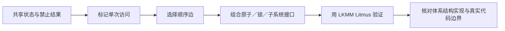

# 第1章\_Linux\_内存顺序专题大纲

## 1.1\_专题定位

本专题站在 Linux 内核开发者视角，回答编译器访问标记、SMP 屏障、acquire/release、依赖、原子 RMW、锁和 LKMM 怎样组成可验证的软件契约。硬件为什么需要弱序、Store Buffer 怎样形成反直觉结果、多观察者传播为何需要累积性，已经由[体系结构内存顺序专题](../../../../foundations/computer_architecture/memory_ordering/大纲.md)独立推导；本专题不复制那套教程，而把硬件能力映射成 Linux 公共 API、配置差异和形式模型。

## 1.2\_递进阅读路线

1. [READ/WRITE_ONCE 与 SMP 内存顺序原语](P01_READ_WRITE_ONCE_与_SMP_内存顺序原语.md)：建立 Linux 原语地图，先分开编译器访问、访问原子性、顺序和生命周期。
2. [编译器共享访问与 READ/WRITE_ONCE](P02_编译器共享访问与READ_WRITE_ONCE.md)：从优化反例、宏实现、KCSAN 和反汇编解释 ONCE 的准确职责。
3. [Linux SMP 屏障与顺序域](P03_Linux_SMP屏障与顺序域.md)：比较 `barrier()`、`smp_*()`、`mb/rmb/wmb` 和 `CONFIG_SMP=n`，并核对 ARM 映射。
4. [release/acquire 发布协议](P04_release_acquire_发布协议.md)：以消息传递为主线推导配对、代际、多写者与生命周期边界。
5. [数据依赖、控制依赖与 RCU 取得](P05_数据依赖_控制依赖与RCU取得.md)：解释依赖怎样被编译器保留或破坏，以及 RCU 为什么提供专用取得接口。
6. [原子 RMW、顺序后缀与条件成功](P06_原子RMW_顺序后缀与条件成功.md)：区分原子更新和内存顺序，比较 relaxed/acquire/release/fully ordered 变体。
7. [锁、调度、中断与隐式顺序](P07_锁_调度_中断与隐式顺序.md)：说明哪些高层原语已经携带顺序、哪些事件不能被误当成屏障。
8. [LKMM 事件、关系与一致性判定](P08_LKMM事件_关系与一致性判定.md)：沿 `po/rf/co/fr/hb/prop/rcu` 建立 Linux 形式模型读图方法。
9. [Litmus、形式验证与硬件实验](P09_Litmus_形式验证与硬件实验.md)：写、运行和解释 herd7/klitmus7 测试，并区分模型结果与硬件观测。
10. [子系统边界、误用诊断与选型](P10_子系统边界_误用诊断与选型.md)：把普通内存、RCU、锁、MMIO、DMA、等待与对象生命周期放回各自接口域。

## 1.3\_配套实验与源码研究

- [READ_ONCE 编译器访问实验](../../../../../labs/kernel/memory_ordering/P01_READ_ONCE_编译器访问实验/README.md)：用 GCC/Clang 的 `-O0/-O2` 反汇编比较访问合并、重复读取和 ONCE 形式。
- [Linux LKMM Litmus 实验](../../../../../labs/kernel/memory_ordering/P02_LKMM_Litmus_消息传递与屏障/README.md)：运行 MP、SB、IRIW 的无序和有序版本，保存模型输出。
- [Linux 6.12 LKMM 源码与模型导读](../../../../../research/source_reading/memory_ordering/P01_Linux_6.12_LKMM_源码与模型导读.md)：解释 `linux-kernel.def/.bell/.cat/.cfg`、源码屏障定义和版本边界。

## 1.4\_权威边界

| 领域 | 权威专题 |
| --- | --- |
| 缓存行副本、所有权、伪共享 | [缓存一致性](../../../../foundations/computer_architecture/cache_coherence/大纲.md) |
| 硬件弱序、传播、Litmus 基本模式 | [体系结构内存顺序](../../../../foundations/computer_architecture/memory_ordering/大纲.md) |
| RCU 指针发布、GP 与回收 | [RCU](../rcu/大纲.md) |
| MMIO posted write 与 accessor | [MMIO](../../../io_model/mmio/大纲.md) |
| DMA 所有权、缓存维护与描述符顺序 | [DMA](../../../io_model/dma/大纲.md) |

本专题只解释这些领域怎样消费 Linux 内存顺序原语，不在这里复制完整子系统教程。

## 1.5\_完成后的验收能力

完成后应能从一段内核并发代码回答：共享状态在哪里、谁写谁读、访问是否需要 ONCE、原子 RMW 解决了哪一层、顺序边由哪个原语建立、在 `CONFIG_SMP=n` 和目标架构下怎样映射、LKMM 是否允许错误结果，以及对象生命周期、等待唤醒或 I/O 顺序是否还缺少另一套机制。
