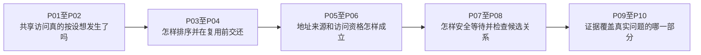

# 第1章\_Linux\_内存顺序专题大纲

## 1.1\_专题定位

先完成[执行路径先修](../../P01_同一对象的多条执行路径.md#1.2_运行所有允许的交错)，再运行P01的一次消息发布：互斥解决更新交错，但共享载荷与就绪标志还需要明确观察顺序。由这个缺口进入本专题。

本专题站在 Linux 内核开发者视角，回答编译器访问标记、SMP 屏障、acquire/release、依赖、原子 RMW、锁和 LKMM 怎样组成可验证的软件契约。这里的 [SMP（Symmetric Multiprocessing，对称多处理）](../../../../foundations/computer_architecture/cache_coherence/P01_缓存一致性问题与缓存行.md#1.1.1_SMP的中英文全称与系统模型)先由体系结构正文统一定义；硬件为什么需要弱序、Store Buffer 怎样形成反直觉结果、多观察者传播为何需要累积性，则由[体系结构内存顺序专题](../../../../foundations/computer_architecture/memory_ordering/大纲.md)独立推导。本专题不复制两套基础教程，只把硬件能力映射成 Linux 公共 API、配置差异和形式模型。

## 1.2\_递进阅读路线

1. [READ/WRITE_ONCE 与 SMP 内存顺序原语](P01_READ_WRITE_ONCE_与_SMP_内存顺序原语.md)：先运行[完整C++发布程序](P01_READ_WRITE_ONCE_与_SMP_内存顺序原语.md#1.2.2_先运行一个有明确语言契约的发布程序)，用M0～M3区分访问、发布取得、单写者与寿命；标准原子运行结果不冒充Linux模型验证。
2. [编译器共享访问与 READ/WRITE_ONCE](P02_编译器共享访问与READ_WRITE_ONCE.md)：从[完整七函数C实验](P02_编译器共享访问与READ_WRITE_ONCE.md#2.3.1_完整编译材料)比较空循环、局部访问标记和编译器屏障，再解释ONCE、类型检查与检查器边界。
3. [Linux SMP 屏障与顺序域](P03_Linux_SMP屏障与顺序域.md)：先确定观察者与同步域，用[单槽待写C模型](P03_Linux_SMP屏障与顺序域.md#3.5.2_运行完整方向实验)推导写后读方向，再比较编译器/SMP/设备边界、UP退化与ARM映射。
4. [release/acquire 发布协议](P04_release_acquire_发布协议.md)：承接一次发布，增加[单槽交还完整C++程序](P04_release_acquire_发布协议.md#4.6.2_运行完整单槽交还程序)，沿S0～S5推导消费完成怎样保护下一轮覆盖，再区分多写者、取消与生命期。
5. [数据依赖、控制依赖与 RCU 取得](P05_数据依赖_控制依赖与RCU取得.md)：沿D0～D3追踪发布指针与后续地址，运行[五函数编译观察](P05_数据依赖_控制依赖与RCU取得.md#5.3.1_完整数据流观察材料)，分别判断数据流、RCU保护、静态检查和寿命。
6. [原子 RMW、顺序后缀与条件成功](P06_原子RMW_顺序后缀与条件成功.md)：用[四工作者完整C++程序](P06_原子RMW_顺序后缀与条件成功.md#6.7.2_运行完整的标准原子交接程序)区分更新、资格与字段交接，推导条件失败、期望值重试和顺序后缀；留下等待与上下文问题进入P07。
7. [锁、调度、中断与隐式顺序](P07_锁_调度_中断与隐式顺序.md)：沿W0～W4区分条件、等待项与任务状态，用[完整C交错模型](P07_锁_调度_中断与隐式顺序.md#7.7.2_用完整C模型找到登记空窗)观察登记空窗，再核对锁、调度、唤醒与载荷发布各自的顺序契约。
8. [LKMM 事件、关系与一致性判定](P08_LKMM事件_关系与一致性判定.md)：从完整MP输入与A～D事件表推导rf/co/fr，按固定模型构造真正的hb回边，再运行[四节点C图检查](P08_LKMM事件_关系与一致性判定.md#8.4.2_运行四节点关系环检查)，区分子图推演、全部公理与实际工具记录。
9. [Litmus、形式验证与硬件实验](P09_Litmus_形式验证与硬件实验.md)：从[完整输入与运行证据](P09_Litmus_形式验证与硬件实验.md#9.4.1_一次运行怎样留下可复查证据)学习成对测试，使用Bash实验入口保存身份、摘要与失败输出，区分静态检查、herd7模型结果和klitmus硬件观察。
10. [子系统边界、误用诊断与选型](P10_子系统边界_误用诊断与选型.md)：作为结尾参考页，从[跨轮覆盖反例](P10_子系统边界_误用诊断与选型.md#10.1.1_有发布取得为什么仍会拼出两轮字段)区分顺序、资格与寿命，再分别返回RCU、锁、等待、MMIO和DMA权威机制。

每一步解决上一阶段仍未回答的问题：P02不能替真实多CPU访问排序，P03的屏障也不能替P04保存每轮所有权；P05的指针取得不能替P06选择唯一修改者，P06的重试又不能替P07安排睡眠。P08把这些原语的最小顺序核心交给形式关系，P09建立实际运行记录，P10再恢复被小测试裁掉的对象和设备边界。已经掌握先修结论时可以从当前缺口跳入，不必重复读整条路线。

## 1.3\_配套实验与源码研究

- [READ_ONCE 编译器访问实验](../../../../../labs/kernel/memory_ordering/P01_READ_ONCE_编译器访问实验/README.md)：用 GCC/Clang 的 `-O0/-O2` 反汇编比较访问合并、重复读取和 ONCE 形式。
- [Linux LKMM Litmus 实验](../../../../../labs/kernel/memory_ordering/P02_LKMM_Litmus_消息传递与屏障/README.md)：运行 MP、SB、IRIW 的无序和有序版本，保存模型输出。
- [Linux 6.12 LKMM 源码与模型导读](../../../../../research/source_reading/memory_ordering/navigation/P01_Linux_6.12_LKMM_源码与模型导读.md)：组织 `linux-kernel.def/.bell/.cat/.cfg`、源码屏障定义和版本边界；[单次访问模块](../../../../../research/source_reading/memory_ordering/navigation/P02_单次访问与类型边界导读.md#2.1_从一个读取现场进入头文件)追踪对象地址、类型门槛与唯一实现，[SMP屏障配置模块](../../../../../research/source_reading/memory_ordering/navigation/P03_SMP屏障的配置与调用层次.md#3.1_同一个调用为什么走两条路径)区分公共包装、检测事件和底层功能，[发布取得模块](../../../../../research/source_reading/memory_ordering/navigation/P04_发布取得的访问与配置导读.md#4.1_把屏障绑定到一次访问)沿一次共享访问解释类型、配置与保存值，[原子强化模块](../../../../../research/source_reading/memory_ordering/navigation/P05_存储后屏障与原子强化导读.md#5.1_屏障位于写前还是写后)再区分存储后屏障和RMW配对范围，[条件加载模块](../../../../../research/source_reading/memory_ordering/navigation/P06_条件加载与控制依赖导读.md#6.1_一次取得还不能等待条件成立)最后追踪主动轮询、样本与退出后的补强。

## 1.4\_权威边界

| 领域 | 权威专题 |
| --- | --- |
| 缓存行副本、所有权、伪共享 | [缓存一致性](../../../../foundations/computer_architecture/cache_coherence/大纲.md) |
| 硬件弱序、传播、Litmus 基本模式 | [体系结构内存顺序](../../../../foundations/computer_architecture/memory_ordering/大纲.md) |
| RCU 指针发布、GP 与回收 | [RCU](../rcu/大纲.md) |
| MMIO posted write 与 accessor | [MMIO](../../../io_model/mmio/大纲.md) |
| DMA 所有权、缓存维护与描述符顺序 | [DMA](../../../io_model/dma/大纲.md) |

本专题只解释这些领域怎样消费 Linux 内存顺序原语，不在这里复制完整子系统教程。

前九章的完整材料分别承担不同证明：编译器C只生成汇编，标准C++程序依赖语言线程契约，单线程C解释器只检查声明过的有限模型，Bash驱动只编排herd7；它们不能相互冒充。每章的实际验证边界就地保存，尤其不能从清单中的Never推断本机已经运行过herd7。

## 1.5\_完成后的验收能力

完成后应能从一段内核并发代码回答：共享状态在哪里、谁写谁读、访问是否需要 ONCE、原子 RMW 解决了哪一层、顺序边由哪个原语建立、在 `CONFIG_SMP=n` 和目标架构下怎样映射、LKMM 是否允许错误结果，以及对象生命周期、等待唤醒或 I/O 顺序是否还缺少另一套机制。
