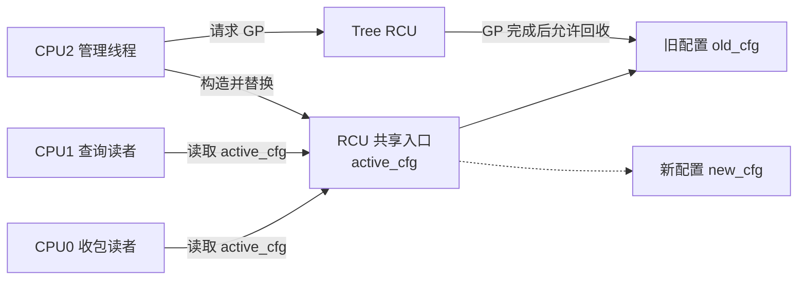
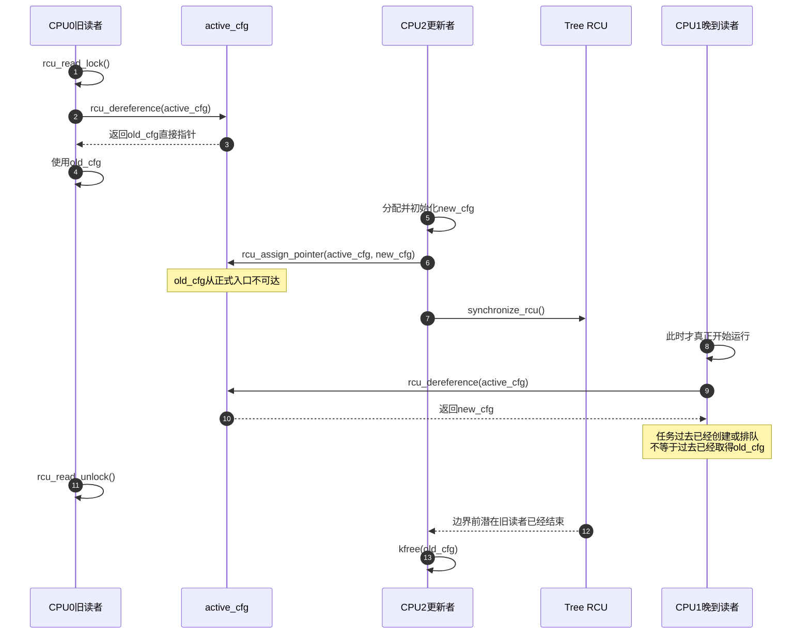

# 第3章\_RCU\_通用API与最小使用闭环


## 3.1\_先把四个动作还原成一条应用闭环

前两章已经推出 RCU 的四个动作：**构造新版本、发布新入口、等待边界前读者、回收旧版本**。本章先把它们组成一段能运行的代码，再解释接口。这样后文看到 `gp_seq`、`qsmask` 和被抢占任务链表时，读者始终知道这些状态在替哪一行应用代码工作。

## 3.2\_场景\_高频查询服务配置\_低频整体替换

假设内核模块维护一份服务配置：网络收包和状态查询路径每秒读取几十万次，管理线程偶尔替换整份配置。读者允许继续使用旧配置完成当前操作，但不能看到只初始化一半的新配置，也不能访问已经释放的旧配置。

参与对象如下：



问题约束是：

1. 多个更新者必须由模块自己的锁串行化。
2. 新对象全部初始化后才能发布。
3. reader 取得的是共享对象的 **直接指针**，不是自动复制的副本。
4. reader 只能在 RCU 读侧临界区内借用这块内存。
5. 旧入口被替换后，旧对象仍须保留到 GP 结束。

## 3.3\_完整同步实现

下面按“定义共享入口 → reader 借用 → writer 替换 → 等待旧 reader → 释放旧对象”的顺序闭合一次同步更新。先观察每个接口替哪一段生命周期负责，再讨论接口名和配置分支。

### 3.3.1\_对象与共享入口

```c
struct service_cfg {
	struct rcu_head rcu;
	u32 generation;
	u32 timeout_ms;
	bool enabled;
};

static struct service_cfg __rcu *active_cfg;
static DEFINE_MUTEX(cfg_update_lock);
```

`active_cfg` 是唯一正式查找入口。`__rcu` 让 Sparse 能检查部分错误用法，但它不是运行时锁，也不会扫描系统中是否还有别的裸指针。

### 3.3.2\_读者\_直接借用当前对象

```c
static int service_fast_path(void)
{
	struct service_cfg *cfg;
	u32 timeout;
	bool enabled;

	rcu_read_lock();
	cfg = rcu_dereference(active_cfg);
	if (!cfg) {
		rcu_read_unlock();
		return -ENOENT;
	}

	/* cfg 是共享对象本身的地址，不是副本。 */
	timeout = READ_ONCE(cfg->timeout_ms);
	enabled = READ_ONCE(cfg->enabled);
	rcu_read_unlock();

	/* 这里只使用已经复制到栈上的标量，不再解引用 cfg。 */
	return enabled ? timeout : 0;
}
```

`rcu_dereference(active_cfg)` 返回当前指针值。它没有调用 `kmemdup()`，也没有隐式增加引用计数。退出 `rcu_read_unlock()` 后，`cfg` 这个数值仍可能留在寄存器或栈上，但调用者已经失去继续解引用它的生命期保证。

### 3.3.3\_同步更新者\_替换后等待并释放

```c
static int service_cfg_replace(u32 timeout_ms, bool enabled)
{
	struct service_cfg *new_cfg;
	struct service_cfg *old_cfg;

	new_cfg = kzalloc(sizeof(*new_cfg), GFP_KERNEL);
	if (!new_cfg)
		return -ENOMEM;

	/* 发布以前完成 reader 可见字段初始化。 */
	new_cfg->timeout_ms = timeout_ms;
	new_cfg->enabled = enabled;

	mutex_lock(&cfg_update_lock);
	old_cfg = rcu_dereference_protected(
		active_cfg, lockdep_is_held(&cfg_update_lock));
	new_cfg->generation = old_cfg ? old_cfg->generation + 1 : 1;
	rcu_assign_pointer(active_cfg, new_cfg);
	mutex_unlock(&cfg_update_lock);

	/* 这里允许睡眠，而且已经不持有更新锁。 */
	synchronize_rcu();
	kfree(old_cfg);
	return 0;
}
```

这段代码的安全性来自明确顺序：

```text
初始化 new_cfg
    -> 发布 new_cfg 并切断 old_cfg 的正式共享可达性
        -> 等待更新前可能取得 old_cfg 的读侧现场结束
            -> 释放 old_cfg
```

把 `synchronize_rcu()` 放在更新锁外不是 RCU 的硬性语法要求，而是常见的锁设计：等待 GP 可能很久，持锁等待会无谓阻塞其他更新者；同时还必须检查锁顺序，避免 GP 所等待的 reader 又需要这把锁才能退出。

### 3.3.4\_异步更新者\_区分私有析构与固定释放

不允许阻塞的更新路径可以把回收责任交给普通 RCU 的异步管线，但必须先区分两种不同需求：`call_rcu()` 接收调用者提供的 callback，可以在 GP 后执行对象私有析构；`kfree_rcu(ptr, rcu_member)` 不接收私有函数，只能在 GP 后通过内核通用释放管线销毁整个对象。二者共享“先取消发布，再等待边界前 reader”的生命期契约，回收动作和实现管线却不相同。

#### (1)\_需要私有析构时使用call\_rcu

本例先使用通用的 `call_rcu()`：

```c
static void service_cfg_free_rcu(struct rcu_head *head)
{
	struct service_cfg *cfg;

	cfg = container_of(head, struct service_cfg, rcu);
	kfree(cfg);
}

static int service_cfg_replace_async(struct service_cfg *new_cfg)
{
	struct service_cfg *old_cfg;

	mutex_lock(&cfg_update_lock);
	old_cfg = rcu_replace_pointer(
		active_cfg, new_cfg,
		lockdep_is_held(&cfg_update_lock));
	mutex_unlock(&cfg_update_lock);

	if (old_cfg)
		call_rcu(&old_cfg->rcu, service_cfg_free_rcu);
	return 0;
}
```

`call_rcu()` 只取得内嵌 `rcu_head` 的地址和 callback 函数地址。callback 以后收到的也是 `struct rcu_head *`，所以 `service_cfg_free_rcu()` 必须用 `container_of()` 找回 `service_cfg` 基地址，再执行私有清理。若对象还要归还引用、释放嵌套资源或调用专用 allocator，这些动作都应由该 callback 明确完成，并遵守普通 RCU callback 的执行上下文约束。

这里的唯一回收出口是 `service_cfg_free_rcu()`。同一对象不能有时直接 `kfree()`，有时又登记 RCU 回调，否则调用者无法证明哪条路径拥有最终销毁权。

#### (2)\_只需释放整个对象时使用kfree\_rcu

如果 `service_cfg_free_rcu()` 唯一要做的事就是 `kfree(cfg)`，可以删除这个私有 callback，改用 Linux 普通 RCU 的公共便利宏：

```c
mutex_lock(&cfg_update_lock);
old_cfg = rcu_replace_pointer(
	active_cfg, new_cfg,
	lockdep_is_held(&cfg_update_lock));
mutex_unlock(&cfg_update_lock);

if (old_cfg)
	kfree_rcu(old_cfg, rcu);
```

这不是驱动私有接口，也不是适用于所有 RCU flavor 的抽象标准。它是声明在 Linux 公共内核头文件中的普通 RCU 固定动作回收接口，但仍属于内核内部源码 API，不是用户态稳定 ABI 或跨操作系统标准。真实签名是 `kfree_rcu(ptr, rcu_member)`：

- `ptr` 是待释放对象的基地址，本例为 `old_cfg`；
- `rcu_member` 是该对象内嵌 `struct rcu_head` 的 **成员名**，本例为 `rcu`，不是函数指针；
- `ptr` 必须是能够由通用 `kfree()` / `kvfree()` 语义释放的完整分配对象，不能是某个更大分配中的子对象，也不能依赖私有析构协议；
- 调用者仍须先从 `active_cfg` 等全部正式入口摘除对象；该宏不会寻找或取消发布入口；
- 该宏不会调用 `service_cfg_free_rcu()` 或其他私有 release，最终动作固定为内核通用内存释放。需要私有析构时必须回到 `call_rcu()`。

`kfree_rcu(old_cfg, rcu)` 不需要业务侧 `container_of()`：调用宏时已经同时具有对象基地址和成员名，可以直接得到 `old_cfg` 与 `&old_cfg->rcu`。这两个参数怎样进入 Linux 6.12 的通用释放管线，见 3.5.1 节。

## 3.4\_用同步路径时序固定GP边界



这条时序给出后续所有实现章节的观察目标：Tree RCU 不需要知道 R0 取得了哪个对象，也不等待 R1 将来执行一次。它只需证明：**在入口切换和 GP 边界以前可能已经进入的读侧执行现场，不能继续越过 GP 完成点使用旧对象。**

## 3.5\_接口放回生命周期链

| 阶段 | 常用接口 | 提供的保证 | 不提供的保证 |
| --- | --- | --- | --- |
| 进入读区 | `rcu_read_lock()` | 建立当前 RCU 类型的读侧执行约束 | 不登记对象地址，不取得长期所有权 |
| 取得指针 | `rcu_dereference()` | 单次读取、依赖/取得顺序与检查语义 | 不复制对象，不增加 kref |
| 发布 | `rcu_assign_pointer()` | release 发布已初始化对象 | 不串行化多个写者 |
| 更新侧替换 | `rcu_replace_pointer()` | 在指定更新保护条件下取旧值并发布新值 | 不等待 GP |
| 同步等待 | `synchronize_rcu()` | 返回时已跨过一个满足调用边界的 GP | 不保证所有已排队回调已经执行 |
| 异步等待 | `call_rcu(head, callback)` | 普通 RCU 的目标 GP 后调用私有 callback | 调用者不能立即释放承载 `rcu_head` 的内存 |
| 固定动作延迟释放 | `kfree_rcu(ptr, rcu_member)` | 通过普通 RCU 的通用管线在目标 GP 后释放整个对象 | 不调用私有 release，不替调用者取消发布入口 |
| 等待回调 | `rcu_barrier()` | 等待调用前排队的普通 RCU 回调执行完成 | 不是普通对象删除的 GP 替代品 |

### 3.5.1\_kfree\_rcu参数怎样进入通用释放管线

在本专题的 Linux 6.12.20 源码基线中，代入本例参数后的关键宏展开等价于：

```c
typeof(old_cfg) ___p = old_cfg;
if (___p) {
	BUILD_BUG_ON(offsetof(typeof(*old_cfg), rcu) >= 4096);
	kvfree_call_rcu(&___p->rcu, (void *)___p);
}
```

`BUILD_BUG_ON()` 要求 `rcu_head` 成员位于对象起始地址后的前 4096 字节内；`kvfree_call_rcu()` 同时取得成员地址和对象基地址，所以不需要从成员反推业务对象，也没有私有 release 可以调用。

Linux 6.12 的常见路径把对象基地址直接记录进 per-CPU 批次，取得 GP 快照，随后由 `rcu_work` 在 GP 后进入 workqueue，并使用 `kfree_bulk()` 或 `vfree()` 批量释放。批量记录不可用时，回退路径把基地址暂存在 `rcu_head.func`，GP 后再取出并调用 `kvfree()`。源码中的另一个 `container_of()` 只用于从内部 `rcu_work` 找回 `kfree_rcu_cpu_work`，与业务对象无关。

这段版本化实现可以从 [Linux 6.12 RCU 源码总阅读索引](../../../../../research/source_reading/rcu/navigation/P01_Linux_6.12_RCU源码总阅读索引.md#1.1_版本边界与总索引职责)进入核对；公共宏定义位于 [`include/linux/rcupdate.h`](../../../../../research/source_reading/linux/include/linux/rcupdate.h)，底层 `kvfree_call_rcu()` 在 [`kernel/rcu/tree.c`](../../../../../research/source_reading/linux/kernel/rcu/tree.c) 中通过 `EXPORT_SYMBOL_GPL` 导出，批处理、GP 快照和最终释放也位于该文件。这个声明与导出边界证明它不是某个驱动的私有封装；应用代码可以依赖“普通 RCU GP 后释放”的契约，不应依赖当前批次数量、延迟定时器或 workqueue 布局。

发布/取得的通用内存顺序见[Linux 内存顺序专题](../memory_ordering/大纲.md)。本专题后文只解释这些原语怎样与 GP 和对象生命期组合，不重复维护体系结构屏障教程。

## 3.6\_同步与异步回收怎样选择

同步与异步两类路径共享发布、旧 reader 边界和对象摘除契约，差别只在 **由当前调用者等待并回收，还是把回收责任交给普通 RCU 的异步 callback 或批量释放管线**。选择前同时核对调用上下文、可接受延迟、积压预算和模块退出方式。

### 3.6.1\_使用\_synchronize\_rcu()

适合以下情况：

- 当前上下文允许睡眠。
- GP 后还要同步释放多个资源或执行允许睡眠的收尾。
- 更新频率低，调用者愿意承担等待延迟。

禁止在普通 RCU 读侧临界区内调用；源码中的 lockdep 检查会诊断这种自等待风险。

### 3.6.2\_使用\_call\_rcu()或\_kfree\_rcu()

两者都适合更新路径不能等待的场景，但不能只因为“都是异步回收”就互换：

- GP 后需要对象私有析构时，使用 `call_rcu(head, callback)`；callback 用 `container_of()` 找回对象并完成唯一销毁协议。
- GP 后只需通用释放整个对象时，使用 `kfree_rcu(ptr, rcu_member)`；它不登记模块私有函数地址，Linux 6.12 还会把多个请求放进独立批处理管线。

共同代价是旧对象会在一段时间内积压。`kfree_rcu()` 的批处理还可能让实际释放晚于“刚好跨过一个 GP”的最早时刻，因此内存峰值和释放时延必须按更新速率与回收积压共同评估。

### 3.6.3\_模块卸载时到底等待哪条异步管线

`synchronize_rcu()` 只保证一个 GP 完成，不保证此前排队的每个 callback 函数体都已经运行。若使用 `call_rcu()`，而 callback 位于即将卸载的模块文本中，退出路径通常要先停止新回调来源，再用 `rcu_barrier()` 等待已有普通 RCU callback 执行完毕。

沿用本章配置对象，模块退出的最小闭环可以写成：

```c
static void service_cfg_shutdown(void)
{
	struct service_cfg *old_cfg;

	/* 调用者此前必须停止所有查询入口和配置更新来源。 */
	mutex_lock(&cfg_update_lock);
	old_cfg = rcu_replace_pointer(
		active_cfg, NULL,
		lockdep_is_held(&cfg_update_lock));
	mutex_unlock(&cfg_update_lock);

	/* 保护刚从入口摘除、尚未交给回调的最后一个对象。 */
	synchronize_rcu();
	kfree(old_cfg);

	/* 等待更早的异步更新所登记的回调函数体执行完毕。 */
	rcu_barrier();
}
```

这里有两个不同等待条件：`synchronize_rcu()` 让最后一个 `old_cfg` 跨过读者边界；`rcu_barrier()` 防止更早登记的 `service_cfg_free_rcu()` 在模块文本卸载后才执行。前提“已经停止所有新更新来源”不可省略，否则 `rcu_barrier()` 返回后仍可能有人登记新回调。

若异步更新全部使用 `kfree_rcu()`，请求中没有模块私有 callback 函数地址，因此“防止模块文本被卸载”这一理由不再要求 `rcu_barrier()`。但如果模块退出时还要销毁对象来源的私有 slab cache，或者必须确认通用批处理释放已经完成，Linux 6.12 Tree RCU 应等待 `kvfree_rcu_barrier()` 所覆盖的释放管线；不能假定 `rcu_barrier()` 会替它排空 `kfree_rcu()` 的独立批次。

## 3.7\_两个必须在基础章就识别的错误

前面的最小闭环只覆盖从 `active_cfg` 进入、在读区内借用、从同一入口摘除的对象。下面两个反例分别破坏 **使用期边界** 和 **入口完整性**；任何一个存在，等待 GP 都不足以推出可以释放。

### 3.7.1\_把旧指针带出读区

```c
static struct service_cfg *saved;

rcu_read_lock();
saved = rcu_dereference(active_cfg);
rcu_read_unlock();

/* 错误：这里已经没有任何机制保证 saved 指向的内存仍存在。 */
queue_work(system_wq, &work_using_saved);
```

GP 只覆盖受协议约束的读侧区间。跨区间长期保存对象要取得独立引用、转移所有权或改用能覆盖完整使用期的锁。

### 3.7.2\_仍有另一个入口指向旧对象

如果模块更新了 `active_cfg`，却还允许某个无锁缓存、全局数组或 work item 用裸指针取得 `old_cfg`，Tree RCU 不会扫描这些地址。调用者必须把全部正式入口纳入同一取消发布和生命期协议。

## 3.8\_本章留下的问题

现在已经会正确调用接口，但还不知道 `synchronize_rcu()` 如何完成证明：

1. 写者不知道实际有哪些 reader，怎样决定等待谁？
2. 一个任务已经排队但尚未运行，为什么不需要等待？
3. `rcu_read_lock()` 是否登记 reader？
4. `rcu_read_unlock()` 是否直接清 `qsmask`？
5. 非抢占式和抢占式构建为何需要两种不同的状态承载方式？

下一章先处理 RCU 与 kref 的对象生命期组合，随后以这五个问题分别推导非抢占式和抢占式 Tree RCU。

上一篇：[RCU 抽象机制推演](P02_RCU_抽象机制推演.md)。

下一篇：[RCU 分类坐标与内核配置](P04_RCU_分类坐标与内核配置.md)。
