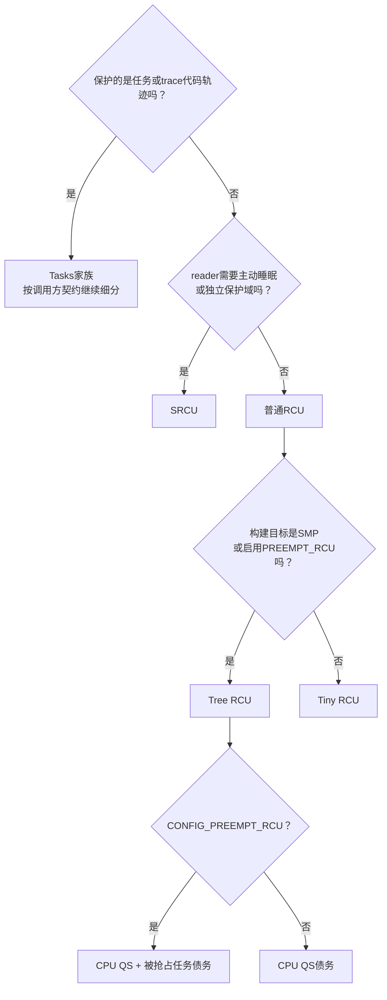

# 第4章\_RCU\_分类坐标与内核配置

P03 已经建立了普通 RCU 的最小接口闭环，但这些接口故意隐藏了大量实现选择：同一段 `rcu_read_lock()` / `synchronize_rcu()` 代码，在 SMP 内核中通常落到 Tree RCU；在单 CPU 构建中可以落到 Tiny RCU；Tree RCU 又会因为 `CONFIG_PREEMPT_RCU` 改变读者被抢占时的证明方式。

如果不先建立分类坐标，后面看到 `Tree`、`Tiny`、`SRCU`、`Tasks`、`PREEMPT_RCU`、`NOCB` 和 `expedited` 时，很容易把 **保护域、底层实现、执行模型和优化策略** 混成一串互相排斥的“RCU 类型”。本章先把这些名字放回各自坐标轴，再选择后续阅读分支。

## 4.1\_先看一个名字混乱会造成什么错误

下面四段代码都属于 RCU，但它们保护的读者并不相同：

```c
/* A：通过普通共享入口完成短读侧访问。 */
rcu_read_lock();
p = rcu_dereference(table[id]);
if (p)
	consume(p);
rcu_read_unlock();

/* B：监听器属于一个私有域，并且可能等待 mutex 或 I/O。 */
idx = srcu_read_lock(&notify_srcu);
invoke_sleepable_listeners();
srcu_read_unlock(&notify_srcu, idx);

/* C：更新者要等待旧的 tracing/BPF 执行轨迹。 */
synchronize_rcu_tasks_trace();

/* D：普通 RCU 调用点被编译进单 CPU 内核。 */
call_rcu(&obj->rcu, obj_free_rcu);
```

| 场景 | “旧读者”到底是谁 | 应进入的语义分支 |
| --- | --- | --- |
| A | 在普通 RCU 读侧内取得旧入口的执行 | 普通 RCU |
| B | 在指定 `srcu_struct` 域中尚未退出的读者 | SRCU |
| C | 仍可能执行旧代码位置的任务或 trace reader | Tasks RCU 家族 |
| D | 与 A 相同，只是底层部署为单 CPU | 普通 RCU；底层可能是 Tiny RCU |

因此，“哪个 RCU 更快”不是第一个问题。第一个问题应是：**谁被定义为读者，读者允许做什么，更新者需要等待哪一种证据。**

## 4.2\_七条正交坐标轴

RCU 名称至少分布在下面七条轴上。横向比较时只能比较同一轴上的选项，不能把一条轴的名字当成另一条轴的替代品。

| 坐标轴 | 它回答的问题 | 代表选项 |
| --- | --- | --- |
| 公共契约 | 调用者怎样发布、取得、等待和回收 | `rcu_dereference()`、`synchronize_rcu()`、`call_rcu()` |
| 保护域 / flavor | 哪些执行属于同一批旧读者 | 普通 RCU、SRCU、Tasks、Tasks Trace |
| 底层实现家族 | 状态按什么规模和拓扑组织 | Tree RCU、Tiny RCU、Tree SRCU |
| 普通 Tree 读侧执行模型 | reader 被抢占后，债务留在 CPU 还是转到任务 | `!CONFIG_PREEMPT_RCU`、`CONFIG_PREEMPT_RCU` |
| GP 策略 | 更新者接受普通推进还是主动施加更高扰动 | normal、expedited |
| callback 执行策略 | 成熟回调在哪些 CPU 或线程上执行 | 普通 per-CPU、NOCB offload |
| 检查与诊断 | 怎样发现协议或活性问题 | Sparse、Lockdep/PROVE_RCU、trace、stall detector |

例如，“抢占式 Tree RCU + expedited GP + NOCB”并不矛盾：三个名字分别说明 **读侧模型、GP 策略和 callback 执行策略**。它们是同一个普通 RCU 系统上的三个选择，不是三套互斥 API。


这张图表达的是选择顺序，不表示每条轴都由应用代码直接选择。保护域通常由 API 决定，Tree/Tiny 和 PREEMPT_RCU 通常由整份内核的 Kconfig 决定，normal/expedited 与 NOCB 则分别影响等待路径和回调执行位置。

## 4.3\_公共接口为什么会隐藏配置

普通 RCU 的接口契约要跨配置保持稳定：

- reader 在读侧内取得的对象，在本次读侧结束前不能被回收；
- `synchronize_rcu()` 等待调用前已经存在的普通 RCU reader；
- `call_rcu()` 把回收工作延后到相应 GP 之后；
- 晚于 GP 边界才取得新入口的 reader 不属于旧集合。

实现可以改变 **怎样证明这些条件**，不能改变调用者看到的基本保证。于是公共头文件和构建配置会把同一组接口映射到不同实现：

```text
普通RCU调用点
    ├─ SMP / PREEMPT_RCU构建 → Tree RCU
    │      ├─ 非抢占读侧 → CPU QS债务
    │      └─ 抢占读侧   → CPU QS债务 + 被抢占任务债务
    └─ 单CPU非抢占构建   → Tiny RCU
```

调用者通常不应根据 `CONFIG_TREE_RCU` 在业务代码中复制两套对象生命周期。真正需要因配置变化而重新审查的是：读侧能否被抢占、某些上下文包装是否成立、诊断能力是否启用，以及延迟和吞吐是否满足目标。

## 4.4\_普通RCU的公共骨架与Tree内部差异

在本仓库的 Linux 6.12.20 证据基线中，普通 Tree RCU 的公共骨架包括：

1. `rcu_state` 保存全局 GP 序列、请求与长期 GP 执行者状态；
2. 每 CPU `rcu_data` 保存本地 GP 观察、QS 债务和 callback 队列；
3. `rcu_node` 树把分散 CPU 的证明逐层汇聚到根；
4. `rcu_segcblist` 按目标代际组织 callback；
5. GP 完成以后，成熟 callback 由 softirq、`rcuc` 或 NOCB 线程执行。

`CONFIG_PREEMPT_RCU` 不会创建第二棵 GP 树，也不会复制 callback 和同步等待系统。它主要改变 **读者在临界区内被换出时，证明债务保存在哪里**：

| 模块 | 非抢占式 Tree RCU | 抢占式 Tree RCU | 公共部分 |
| --- | --- | --- | --- |
| 读侧进入/退出 | 临界区内禁止普通抢占，不登记任务 | 记录任务嵌套；最外层退出清债 | 对调用者仍是同一组普通 RCU API |
| context switch | 合法切换本身可形成 CPU QS | 先把旧 reader 登记到叶节点，再允许 CPU 报 QS | CPU 本地状态仍由 `rcu_data` 承接 |
| 节点完成条件 | 当前 CPU 位清零 | CPU 位清零且旧 `gp_tasks` 为空 | 都在同一棵 `rcu_node` 树中向根传播 |
| GP / callback / 等待 | 无独立副本 | 无独立副本 | 共用全局代际、回调队列和完成交付链 |

所以后文不会再按“非抢占完整系统”和“抢占完整系统”各讲一遍。P05 先建立公共完整周期，P06 只放大读侧进入/退出及任务债务差异；P07～P17 再按功能模块展开共享实现，并在需要处补充配置分支。

## 4.5\_SRCU改变保护域和读者记账

每个 `struct srcu_struct` 定义一个显式私有域。读者进入和退出时更新该域的计数，更新者据此判断旧 index 的读者是否全部离开。因此 SRCU 可以支持主动阻塞和迁移的 reader，但读侧需要比普通 RCU 更多的记账。

它不是“抢占式 RCU 的更强版本”：

- PREEMPT_RCU 允许的是 **非自愿抢占**，普通读侧仍不因此获得任意睡眠许可；
- SRCU 通过显式域和进入/退出记账支持可阻塞 reader；
- `synchronize_srcu(&domain_a)` 不等待 `domain_b` 或普通 RCU 域中的读者。

P18 将独立推演 SRCU 的双 index 状态机，因为它的 reader 证明与普通 Tree RCU 不同；但发布、取得、等待、回调和生命周期边界仍会与 P03 的公共问题对应。

## 4.6\_Tasks家族改变等待对象

Tasks RCU 保护的不是普通对象查找临界区，而是任务执行轨迹或显式 trace 读侧。Linux 6.12.20 的 Tasks、Tasks Rude 和 Tasks Trace 共享部分控制骨架，但产生完成证据的方式不同：

| flavor | 主要等待对象 | 代表性证据 | 典型使用边界 |
| --- | --- | --- | --- |
| Tasks | 可能仍在旧代码轨迹中的既有任务 | 自愿切换、用户态、idle 等边界 | ftrace 等代码更新路径 |
| Tasks Rude | 在线 CPU 上可能存在的旧执行 | 强制跨 CPU 调度边界 | 少数内部强制等待路径 |
| Tasks Trace | 显式 trace reader | 每任务 trace 嵌套、扫描和必要探测 | sleepable BPF / tracing |

一个普通 RCU GP 完成，不能据此推出 Tasks Trace GP 也完成；反过来也一样。P19 会把三种 Tasks flavor 放在同一任务轨迹问题下比较，不再与 Tiny RCU 混在一章。

## 4.7\_Tiny是部署实现而不是新的保护域

Tiny RCU 在单 CPU、非 PREEMPT_RCU 构建中实现普通 RCU 语义。应用仍调用 `rcu_read_lock()`、`call_rcu()` 等普通接口，不会在运行时为某个对象“选择 Tiny”。

单 CPU 消除了跨 CPU 汇聚，所以 Tiny 不需要 `rcu_node` 树；但它仍然要回答：

- 当前 callback 是否还需要等待一个 QS；
- 哪些 callback 已经可以执行；
- 同步等待怎样观察到唯一 CPU 已跨过所需边界。

因此 Tiny 是 **同一公共契约的部署实现**，不是 Tasks RCU 的一种 flavor。P20 会独立讲它的单 CPU 状态和边界。

## 4.8\_bh与sched包装不是独立GP引擎

`rcu_read_lock_bh()` 附加本地 softirq 约束，`rcu_read_lock_sched()` 表达禁止抢占的调用上下文。在 Linux 5.0 以后，普通 RCU GP 已覆盖先前 RCU-bh 与 RCU-sched 的读侧语义；Linux 6.12 中不应把它们画成三棵彼此独立的 GP 树。

这类名字属于 **接口包装轴**：它们告诉检查器和维护者调用点处于什么执行约束中，而不是要求读者重新学习一套完整 GP、callback 和树形汇聚实现。

## 4.9\_先按约束选择再看Kconfig



这条选择链先确定语义，再解释构建如何兑现语义。不要倒过来看到一个 Kconfig 名字，就猜调用点应该换 API。

在目标内核上应核对真实配置，而不是根据发行版或板卡名称推断：

```bash
grep -E '^(CONFIG_(TREE|TINY|PREEMPT)_RCU|CONFIG_(TREE|TINY)_SRCU|CONFIG_TASKS(_TRACE|_RUDE)?_RCU)=' .config
```

仓库保存的既有 RCU 研究快照已确认 `CONFIG_TREE_RCU=y` 与 `CONFIG_PREEMPT_RCU=y`。这足以限定后续抢占式 Tree RCU 源码证据，但不能据此宣称所有部署都启用了同样配置。固定源码身份、配置快照差异和证据范围见 [Linux 源码阅读基线](../../../../../research/source_reading/linux/SOURCE_BASELINE.md#1.1_当前来源)。

## 4.10\_分类完成后的阅读矩阵

| 读者当前问题 | 下一站 | 暂时不要展开的内容 |
| --- | --- | --- |
| 普通 Tree RCU 怎样从请求走到回收 | P05 公共骨架 | 不先钻某个配置分支的宏体 |
| reader 被抢占后为什么不能只看 CPU QS | P06 读侧执行模型 | 不复制 GP 和 callback 公共链 |
| GP、QS、汇聚、callback 各模块怎样协作 | P07～P17 | 不把字段表当成端到端过程 |
| reader 需要主动睡眠或私有域 | P18 SRCU | 不套用普通 Tree 的 CPU QS 证明 |
| 保护任务 / trace 执行轨迹 | P19 Tasks | 不把普通对象 reader 当成 Tasks reader |
| 单 CPU 构建怎样实现普通契约 | P20 Tiny | 不把 Tiny 当应用可选 flavor |
| 怎样组合对象生命周期与工程检查 | P21～P25 | 不让应用案例打断主机制链 |

进入版本化源码时，从 [Linux 6.12 RCU 源码总阅读索引](../../../../../research/source_reading/rcu/navigation/P01_Linux_6.12_RCU源码总阅读索引.md#1.2_先建立源码分类坐标)选择模块入口。源码索引负责定位版本化状态和函数协作，本章负责保持跨版本稳定的分类坐标；两者不是互相替代的链接目录。

## 4.11\_本章验收

读完后应能明确回答：

1. 普通 RCU、SRCU 与 Tasks RCU 为什么不是性能档位；
2. Tree/Tiny 与 PREEMPT_RCU 分别位于哪条轴；
3. 为什么抢占式 Tree RCU 不应复制一整套 GP、callback 和等待章节；
4. normal/expedited、普通 callback/NOCB 为什么可以与读侧模型自由组合；
5. 为什么实验和源码结论必须标明保护域、实现家族、配置和观察路径。

上一篇：[RCU 通用 API 与最小使用闭环](P03_RCU_通用API与最小使用闭环.md)。

下一篇：[Tree RCU 公共骨架与完整周期](P05_Tree_RCU_公共骨架与完整周期.md)。
