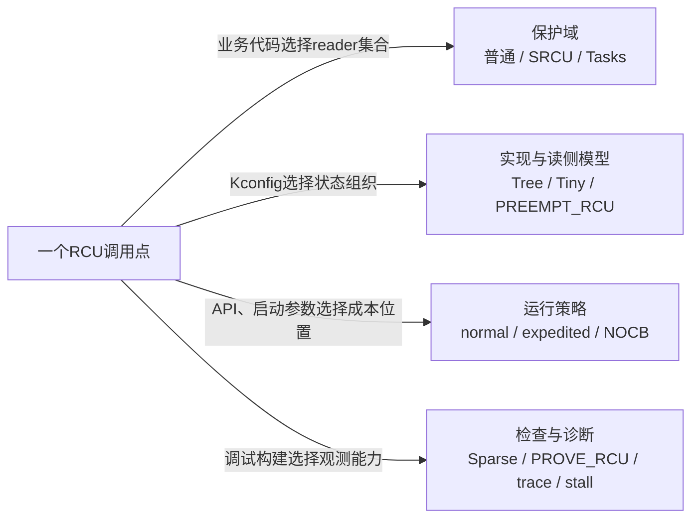
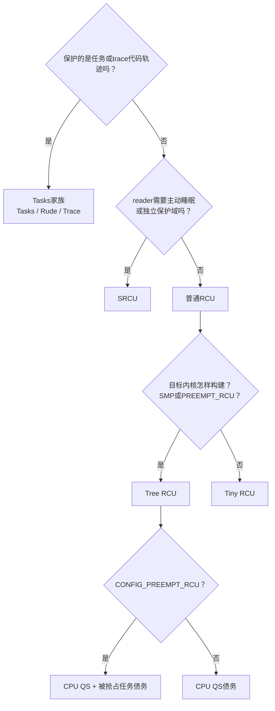

# 第4章\_RCU\_分类坐标与内核配置

P03 已经建立了普通 **RCU（Read-Copy Update，读-复制-更新）** 的最小接口闭环：发布新入口、读者取得对象、等待旧读者离场、最后回收旧对象。但只会写这组接口，还不能读懂 Linux 中的 RCU 名称。原因是源码把几类完全不同的问题都放在了名字附近：有的名称定义 **谁是读者**，有的名称说明 **内核怎样实现同一契约**，有的只是 **等待或回调的运行策略**，还有的仅仅打开 **检查与观测能力**。机制为什么会从对象删除问题推演到这四步，见 [为什么需要 RCU](P01_为什么需要_RCU.md#1.1_先把问题说完整)。

本章不是给熟悉源码的人罗列缩写，而是为第一次接触这些名称的读者建立入口。读完任何一个名称时，都应能立即回答五个问题：

1. 这个名称的中英文含义是什么；
2. 它在分类“保护对象、底层实现、读侧模型、运行策略”中的哪一项；
3. 它由业务代码、内核构建者还是启动参数选择；
4. 它对应哪个 API（Application Programming Interface，应用程序编程接口）、Kconfig 配置或运行参数；
5. 选择它以后，哪些 RCU 正确性契约仍然不变。

这里的 **Kconfig** 是 Linux 内核的构建期配置系统；`CONFIG_TREE_RCU` 这类名字是配置符号，最终取值记录在目标内核的 `.config` 中。它们不是业务代码每调用一次 RCU 就重新选择的运行时开关。

## 4.1\_先建立术语和选择责任

本节先建立公共术语，再让四个调用点只改变一个条件，最后标明业务作者、构建者、部署者和调试者各自拥有哪一类选择权。这样后面的分类表不会要求读者边猜缩写边比较机制。

### 4.1.1\_先解释后文反复使用的基础词

下面这些词不是某一种 RCU 的专属字段，而是理解所有分支都要使用的公共语言：

| 名称 | 中英文与本章含义 | 不能误解成什么 | 继续阅读 |
| --- | --- | --- | --- |
| reader | **读者**；正在某种 RCU 读侧规则内访问受保护对象或执行轨迹的执行 | 不是固定某个线程类型；“谁算 reader”由保护域定义 | [旧 reader 集合怎样封闭](P02_RCU_抽象机制推演.md#2.6_第四步_定义宽限期要等待的集合) |
| updater / writer | **更新者 / 写者**；切换正式入口并发起等待或延迟回收的一方 | RCU 不自动串行化多个更新者，写者仍可能需要锁 | [同步更新者的完整闭环](P03_RCU_通用API与最小使用闭环.md#3.3.3_同步更新者_替换后等待并释放) |
| read-side critical section | **读侧临界区**；由一对读侧 API 或 flavor 认可的执行边界限定的生命期借用区间 | 不是传统互斥锁临界区，也不等于可以把裸指针带到区间外 | [读者怎样直接借用当前对象](P03_RCU_通用API与最小使用闭环.md#3.3.2_读者_直接借用当前对象) |
| GP | **Grace Period，宽限期**；等待调用边界前已存在的目标 reader 全部经过安全边界的一段逻辑时期 | 不是固定时长的定时器，也不保证异步 callback 已经执行 | [GP 要等待哪一批 reader](P02_RCU_抽象机制推演.md#2.6_第四步_定义宽限期要等待的集合) |
| QS | **Quiescent State，静止态**；某个参与者到达后，足以证明它不再保持本轮旧 reader 身份的状态或事件 | 不是“CPU 暂时没运行”，不同 flavor 认可的 QS 也不相同 | [把 GP 证明交给退休执行者](P02_RCU_抽象机制推演.md#2.7_第五步_把GP证明交给退休执行者) |
| callback | **回调**；调用者预先登记、在目标 GP 之后才有资格被执行的函数 | GP 完成只产生执行资格，callback 还要经过排队、成熟和实际执行 | [同步与异步回收怎样选择](P03_RCU_通用API与最小使用闭环.md#3.6_同步与异步回收怎样选择) |
| protection domain | **保护域**；一组读侧入口、读者记账与对应 GP 共同承认的 reader 集合 | 一个域的 GP 不会自动替另一个域清债 | 本章 [4.5](#4.5_SRCU改变保护域和读者记账) 与 [4.6](#4.6_Tasks家族改变等待对象) |
| flavor | Linux RCU 文档常用的 **语义变体 / 保护域类型**；它改变 reader 的定义和完成证据 | 不是“快、中、慢”性能档位，也不是 Tree/Tiny 的别名 | [七条坐标轴](#4.2_七条正交坐标轴) |
| implementation / backend | **实现 / 后端**；在契约不变时，状态怎样按 CPU 数量和拓扑组织 | 不能因为实现不同就让业务代码复制两套生命周期 | 本章 [4.3](#4.3_公共接口为什么会隐藏配置) |
| preemption | **抢占**；调度器在任务未主动阻塞时暂停它并换入其他任务 | “允许被抢占”不等于“允许主动睡眠” | [普通 Tree RCU 的两种读侧模型](P06_Tree_RCU_读侧执行模型与配置差异.md#6.1_共同契约不随配置改变) |
| per-CPU | **每 CPU**；CPU 是 Central Processing Unit（中央处理器），per-CPU 表示每个逻辑 CPU 拥有一份本地状态或队列，常用于减少所有 CPU 对同一缓存行的争用 | 不表示该状态永不被远端观察或迁移 | [Tree RCU 的四层状态地址](P05_Tree_RCU_公共骨架与完整周期.md#5.3_四层状态地址和一个对象队列) |
| SMP / UP | **SMP（Symmetric Multiprocessing，对称多处理）** 表示一个内核构建支持多个处理器并行；**UP（Uniprocessor，单处理器）** 表示单处理器构建 | 当前只有一个 CPU online（已上线并可参与运行），不等于内核就是 UP 构建 | [SMP、UP 与 `CONFIG_SMP`](../../../../foundations/computer_architecture/cache_coherence/P01_缓存一致性问题与缓存行.md#1.1.1_SMP的中英文全称与系统模型) |

### 4.1.2\_四个调用点到底改变了哪项条件

下面四段代码都与 RCU 有关。第一次阅读时不必先记住 API 名字，只观察 **读者集合、读者能否主动阻塞、目标内核怎样构建** 是否发生变化：

代码中的 `mutex` 是可能使任务睡眠的互斥锁，**I/O（Input/Output，输入 / 输出）** 表示设备或数据传输等待；**tracing** 指内核跟踪设施，**BPF** 名称源自 Berkeley Packet Filter（伯克利包过滤器），现代 Linux 中也用于受验证程序在内核事件上的执行。这里列出它们，只为说明某些 reader 可能阻塞或执行旧代码轨迹，不要求先掌握这些子系统。

```c
/* A：通过普通共享入口完成短读侧访问。 */
rcu_read_lock();
p = rcu_dereference(table[id]);
if (p)
	consume(p);
rcu_read_unlock();

/* B：监听器属于一个私有域，并且可能等待 mutex 或 I/O。 */
idx = srcu_read_lock(&notify_srcu);
invoke_sleepable_listeners();
srcu_read_unlock(&notify_srcu, idx);

/* C：更新者要等待旧的 tracing/BPF 执行轨迹。 */
synchronize_rcu_tasks_trace();

/* D：普通 RCU 调用点被编译进单 CPU 内核。 */
call_rcu(&obj->rcu, obj_free_rcu);
```

| 场景 | 变化的条件 | “旧读者”到底是谁 | 正确分类 |
| --- | --- | --- | --- |
| A | 普通短读侧，无私有域参数 | 在普通 RCU 读侧内取得旧入口的执行 | [普通 RCU](#4.3_公共接口为什么会隐藏配置) |
| B | 调用者传入一个 `srcu_struct`，读者可能等待 mutex 或 I/O | 在这个指定私有域中尚未退出的读者 | [SRCU](#4.5_SRCU改变保护域和读者记账) |
| C | 等待目标是旧 tracing/BPF 代码轨迹 | 仍可能执行旧 trace 读侧的任务 | [Tasks Trace RCU](#4.6_Tasks家族改变等待对象) |
| D | 保护语义与 A 相同，只有目标内核变成 UP 构建 | 仍是普通 RCU reader | 普通 RCU；后端可能由 [Tiny RCU](#4.7_Tiny是部署实现而不是新的保护域) 实现 |

因此，“哪个 RCU 更快”不是第一个问题。第一个问题应是：**谁被定义为读者，读者允许做什么，更新者需要等待哪一种证据。**

### 4.1.3\_四类选择者不能互相越权

| 谁在选择 | 它能够选择什么 | 代表入口 | 它不能单独决定什么 |
| --- | --- | --- | --- |
| 业务代码作者 | 保护域和同步 / 异步接口 | 普通 RCU、SRCU、Tasks API，`synchronize_*()`、`call_*()` | 不能在单个调用点动态选择 Tree 或 Tiny |
| 内核构建者 | 编译进内核的实现家族和读侧模型 | `.config` 中的 `CONFIG_TREE_RCU`、`CONFIG_TINY_RCU`、`CONFIG_PREEMPT_RCU` | 不能用配置替业务代码选择正确的保护域 |
| 系统部署者 | 已编译能力中的 CPU 集合与运行策略 | `rcu_nocbs=` 等启动参数 | 不能借启动参数改变 reader 的基本定义 |
| 调试者 / 测试构建 | 静态检查、运行时校验、trace 与 stall 报告 | Sparse、Lockdep/PROVE_RCU、RCU trace、stall detector | 不能把“没有告警”当成协议必然正确 |

## 4.2\_七条正交坐标轴

上一节已经区分“谁是 reader”和“谁在选择”。本节再把内核中的具体名称逐个放回七条轴；先解释名称，再给总表和关系图，避免让表格本身承担术语教学。

### 4.2.1\_正交坐标不是七步选择流程

“正交”表示同一个 RCU 调用点可以同时在每条轴上各有一个取值，而这些取值回答不同问题。例如：

```text
普通RCU保护域
+ Tree RCU实现
+ CONFIG_PREEMPT_RCU=y的可抢占读侧模型
+ synchronize_rcu_expedited()的低延迟等待策略
+ 指定CPU启用NOCB回调卸载
+ PROVE_RCU运行时检查
```

这五项可以同时成立，因为它们不是五套互斥的 RCU。相反，把 `SRCU` 与 `Tiny` 比“谁更快”，或者用 `NOCB` 代替 `PREEMPT_RCU`，都是跨坐标轴比较。

### 4.2.2\_机制实现与策略名称先逐个落位

| 名称 | 全称或名称来源 | 它真正改变什么 | 它不是什么 |
| --- | --- | --- | --- |
| [普通 RCU](#4.3_公共接口为什么会隐藏配置) | 也常被文档称为 normal / vanilla RCU；使用 `rcu_read_lock()` 等核心 API | 普通对象 reader 的保护域与公共生命周期契约 | 这里的“普通”不是 normal GP 策略 |
| [Tree RCU](#4.4_普通RCU的公共骨架与Tree内部差异) | **树形 RCU 实现**；用 `rcu_node` 层次汇聚多个 CPU 的 QS 证明 | 普通 RCU 在可扩展 SMP 构建中的底层状态组织 | 不是应用代码可传入的 flavor 参数 |
| [Tiny RCU](#4.7_Tiny是部署实现而不是新的保护域) | **精简 RCU 实现**；`Tiny` 是描述“体积小”的英文名称，不是首字母缩写 | 普通 RCU 在 UP、非抢占构建中的底层组织 | 不是保护域，也不是“更弱的应用 API” |
| [PREEMPT_RCU](#4.4.3_PREEMPT_RCU只替换读者债务分支) | **Preemptible RCU，可抢占 RCU** 的配置名 | 普通 Tree RCU reader 被抢占时，债务从 CPU 转存到任务 / 节点的证明分支 | 不允许普通读侧任意主动睡眠，也不新建第二棵 GP 树 |
| [SRCU](#4.5_SRCU改变保护域和读者记账) | **Sleepable Read-Copy Update，可睡眠的读-复制-更新** | 由 `struct srcu_struct` 定义私有域，读者显式记账并可主动阻塞 | 不是 PREEMPT_RCU 的“增强档”，也不与普通域共用 GP |
| [Tree SRCU / Tiny SRCU](#4.5_SRCU改变保护域和读者记账) | SRCU 契约的完整树形后端 / UP 精简后端 | 同一 SRCU API 在不同构建条件下的实现 | 不是普通 Tree RCU / Tiny RCU 的同一个状态机 |
| [Tasks RCU](#4.6_Tasks家族改变等待对象) | **面向任务执行轨迹的 RCU**；`Tasks` 直接表示任务 | 等待边界前的任务离开旧代码轨迹 | 不保护普通对象读侧，除非调用方另有普通 RCU 协议 |
| [Tasks Rude RCU](#4.6_Tasks家族改变等待对象) | `Rude` 是内核对“粗暴打扰各 CPU”方式的昵称，不是缩写 | 通过对在线 CPU 施加调度动作取得更强制的执行边界 | 不是 Tasks RCU 的性能升级档 |
| [Tasks Trace RCU](#4.6_Tasks家族改变等待对象) | **面向显式 trace reader 的 Tasks RCU** | 用 trace 读侧标记和任务状态保护可阻塞 tracing/BPF 轨迹 | 不是普通 RCU tracepoint 开关 |
| [normal GP](P15_Tree_RCU_Expedited_GP.md#15.2_它不是普通GP的超时开关) | **普通推进的宽限期**；主要等待参与者按正常事件提供 QS | GP 的推进和等待成本 | 这里的 `normal` 不等于“普通 RCU 保护域” |
| [expedited GP](P15_Tree_RCU_Expedited_GP.md#15.1_场景_控制路径愿意用系统扰动换更短等待) | **加速宽限期**；`expedited` 意为加急 | 主动检查、必要时通过 [IPI（Inter-Processor Interrupt，处理器间中断）](../../asynchrony/interrupts/P10_SMP_与中断亲和性_IPI_机制.md#10.4.1_IPI_是什么)探测，用更高扰动争取更短同步等待 | 不是普通 GP 超时后的自动强制成功，也不改变安全边界 |
| [NOCB](P16_Tree_RCU_NOCB回调卸载.md#16.2_卸载前后责任对比) | 内核常称 **no-CBs CPU / no-callbacks-on-this-CPU**；即从指定 CPU 卸载 callback 处理 | callback 的 GP 管理与实际执行位置 | 不是“没有 callback”，也不取消该 CPU 的 reader / QS 责任 |

### 4.2.3\_检查与观测名称也不是新的RCU类型

| 名称 | 它是什么 | 它观察或检查什么 | 关闭以后什么仍然存在 |
| --- | --- | --- | --- |
| [Sparse](P23_RCU_类型语义_Sparse与Lockdep.md#23.5_Sparse具体检查什么) | Linux 构建可调用的 C 静态分析器 | `__rcu` 指针的类型语义和不合规访问 | RCU 发布、取得与生命周期契约仍然必须遵守 |
| [Lockdep](P23_RCU_类型语义_Sparse与Lockdep.md#23.6_Lockdep检查的是哪一个运行时条件) | **lock dependency validator，锁依赖验证器**；内核运行时影子状态系统 | 锁依赖，以及任务当前是否处于对应 RCU 逻辑读侧 | 功能读侧仍然运行，只是少了这层动态证明 |
| [PROVE_RCU](P23_RCU_类型语义_Sparse与Lockdep.md#23.6.2_配置决定rcu_lock_map是否进入运行时) | RCU 使用 Lockdep 状态进行 API 条件检查的配置能力 | 例如 `rcu_dereference()` 是否处于合法读侧或满足替代锁条件 | 不会因为关闭检查就允许非法解引用 |
| [trace](P24_RCU_调试验证与集成误用.md#24.5.4_D3_按本机available_events选择tracepoint) | 内核 **tracepoint（跟踪点）** 事件观测；跟踪点是源码预埋的结构化记录入口 | GP、QS、callback、NOCB 等已经发生的状态变化 | 不负责建立或推进 GP |
| [stall detector](P24_RCU_调试验证与集成误用.md#24.5.3_D2_用stall输出定位欠债者) | **停滞检测器**；对过长 GP 发出诊断报告 | 哪个 CPU、任务或执行上下文可能长期欠缺进展 | 超时报告不等于跳过旧 reader 后强制完成 |

Sparse、Lockdep 和 PROVE_RCU 的完整区别见 [RCU 类型语义、Sparse 与 Lockdep](P23_RCU_类型语义_Sparse与Lockdep.md#23.1_同一段错误代码需要三种不同证明)，trace 与 stall 的实际诊断路径见 [RCU 调试验证与集成误用](P24_RCU_调试验证与集成误用.md#24.5_端到端诊断流程)。

### 4.2.4\_七条轴分别回答什么问题

| 坐标轴 | 它回答的问题 | 代表选项 | 主要选择者 |
| --- | --- | --- | --- |
| 公共契约 | 调用者怎样发布、取得、等待和回收 | `rcu_dereference()`、`synchronize_rcu()`、`call_rcu()` | 业务代码按生命周期选择 API |
| 保护域 / flavor | 哪些执行属于同一批旧 reader | 普通 RCU、SRCU、Tasks、Tasks Trace | 业务代码与子系统契约选择 API 家族 |
| 底层实现家族 | 状态按什么 CPU 规模和拓扑组织 | Tree RCU、Tiny RCU、Tree SRCU、Tiny SRCU | Kconfig 构建期选择 |
| 普通 Tree 读侧执行模型 | reader 被抢占后，证明债务留在 CPU 还是转存到任务 | `CONFIG_PREEMPT_RCU=n/y` | Kconfig 构建期选择 |
| GP 策略 | 等待者接受正常推进还是主动施加更高系统扰动 | normal、expedited | 具体同步 API 和少量全局策略选择 |
| callback 执行策略 | callback 的 GP 管理与成熟回调在哪里执行 | 普通 per-CPU、NOCB offload | Kconfig 提供能力，启动参数 / CPU 集合部署 |
| 检查与诊断 | 怎样发现类型、上下文或活性问题 | Sparse、Lockdep/PROVE_RCU、trace、stall detector | 构建和调试环境选择 |

### 4.2.5\_同一调用点上的四条选择链



四条箭头从同一个调用点并列展开，表示它们可以组合；它们不是“先选 flavor，再顺序升级到 NOCB 和诊断”的七步流水线。

## 4.3\_公共接口为什么会隐藏配置

普通 RCU 的接口契约要跨配置保持稳定：

- reader 在读侧内取得的对象，在本次读侧结束前不能被回收；
- `synchronize_rcu()` 等待调用前已经存在的普通 RCU reader；
- `call_rcu()` 把回收工作延后到相应 GP 之后；
- 晚于 GP 边界才取得新入口的 reader 不属于旧集合。

实现可以改变 **怎样证明这些条件**，不能改变调用者看到的基本保证。于是公共头文件和构建配置会把同一组接口映射到不同实现：

下图中的“QS 债务”是教学简称：某个 CPU 位或任务登记仍未清除，表示当前 GP 还欠这个参与者一份“已离开旧 reader”的证明。它不是调度器负债，也不是对象引用计数。

```text
普通RCU调用点
    └─ 构建期选择一个普通RCU实现
           ├─ CONFIG_TREE_RCU=y
           │      ├─ CONFIG_PREEMPT_RCU=n → 非抢占读侧 → CPU QS债务
           │      └─ CONFIG_PREEMPT_RCU=y → 抢占读侧   → CPU QS债务 + 被抢占任务债务
           └─ CONFIG_TINY_RCU=y
                  └─ 单CPU非抢占实现，无rcu_node汇聚树
```

这是一条 **构建期选择链**，不是三种实现同时存在、再由每次调用动态挑选。以本仓库固定的 [Linux 6.12 RCU 源码阅读基线](../../../../../research/source_reading/rcu/navigation/P01_Linux_6.12_RCU源码总阅读索引.md#1.1_版本边界与总索引职责)及其 [`kernel/rcu/Kconfig`](../../../../../research/source_reading/linux/kernel/rcu/Kconfig) 为例：`CONFIG_SMP=y` 默认选择 `TREE_RCU`，`CONFIG_PREEMPT_RCU=y` 也会 `select TREE_RCU`；只有 `!CONFIG_SMP && !CONFIG_PREEMPT_RCU` 时才默认选择 `TINY_RCU`。

从 **分类依赖** 上，应先问普通 RCU 由 Tree 还是 Tiny 实现，再在 Tree 内部问 reader 使用非抢占还是抢占证明；这不是在描述 Kconfig 解析器的求值先后。实际依赖允许 `CONFIG_PREEMPT_RCU=y` 反过来强制 `TREE_RCU=y`，因为 Tiny 后端根本不提供这套被抢占任务债务模型。

同一个内核映像不会同时运行 `CONFIG_PREEMPT_RCU=y` 和 `CONFIG_PREEMPT_RCU=n` 两套普通 Tree 读侧模型。它们是 `tree_plugin.h` 的两个条件编译分支，不是可以在运行时混用的两种模式；这个配置也不决定 `rcu_node` 汇聚树的数量。

调用者通常不应根据 `CONFIG_TREE_RCU` 在业务代码中复制两套对象生命周期。真正需要因配置变化而重新审查的是：读侧能否被抢占、某些上下文包装是否成立、诊断能力是否启用，以及延迟和吞吐是否满足目标。

## 4.4\_普通RCU的公共骨架与Tree内部差异

4.3 已经确定 Tree/Tiny 是构建期后端选择。本节只在 `CONFIG_TREE_RCU=y` 的范围内回答两个新问题：所谓“一棵树”属于哪个保护域，以及 `CONFIG_PREEMPT_RCU` 究竟替换公共骨架中的哪一段状态和通信路径。

### 4.4.1\_这里的一棵树到底属于谁

本节已经把讨论范围限定为 **普通 RCU + Tree RCU**。这里说的“一棵树”不是“一轮 GP 临时创建一棵树”，也不是“所有 RCU flavor 共用一棵树”，而是普通 Tree RCU 长期持有的 `rcu_node` 证明汇聚拓扑：多轮 normal GP 在同一拓扑上更新代际和等待位；expedited GP 有自己的推进状态和路径，但仍复用这套拓扑。SRCU 的每个私有域和 Tasks RCU 家族拥有各自的 GP 状态，不属于这棵普通 RCU 树；Tiny RCU 则根本没有 `rcu_node` 汇聚树。

版本化源码先分别从 [GP 全局生命周期模块导读](../../../../../research/source_reading/rcu/navigation/P03_Linux_6.12_Tree_RCU_GP全局生命周期模块源码概念导读.md#3.1_模块问题与版本边界)和 [Tree RCU 拓扑模块导读](../../../../../research/source_reading/rcu/navigation/P04_Linux_6.12_Tree_RCU_拓扑与CPU热插拔模块源码概念导读.md#4.1_本模块究竟解决什么问题)进入。在本仓库固定的 Linux 6.12.20 实现中，[`tree.c` 只定义一个 `static struct rcu_state rcu_state`](../../../../../research/source_reading/rcu/source_explanations/P05_Linux_6.12_Tree_RCU_GP全局生命周期源码实现.md#5.3.4_唯一全局实例怎样给各子机制建立初值)，其 `node[]` 成员保存这套固定汇聚拓扑。拓扑怎样在启动期建立并绑定每 CPU 叶节点，见 [`rcu_init_one()` 建立固定汇聚树](../../../../../research/source_reading/rcu/source_explanations/P06_Linux_6.12_Tree_RCU_拓扑与CPU热插拔源码实现.md#6.4_rcu_init_one建立固定汇聚树并绑定每CPU叶节点)。

### 4.4.2\_五类状态载体和三个执行上下文

先认识名称承担的职责，不需要在本章背字段：

| 名称 | 类型与所有权 | 在完整周期中的职责 | 深入入口 |
| --- | --- | --- | --- |
| `rcu_state` | 普通 Tree RCU 的唯一全局状态 | 保存普通 GP 代际、请求、根状态和长期 GP 执行者信息 | [全局实例与初始化](../../../../../research/source_reading/rcu/source_explanations/P05_Linux_6.12_Tree_RCU_GP全局生命周期源码实现.md#5.3.4_唯一全局实例怎样给各子机制建立初值) |
| `rcu_data` | 每个逻辑 CPU 一份的本地状态 | 保存本 CPU 观察到的 GP、QS 债务和 callback 队列 | [四层状态地址](P05_Tree_RCU_公共骨架与完整周期.md#5.3_四层状态地址和一个对象队列) |
| `rcu_node` | 多个 CPU 共享一个叶节点，上层节点继续汇聚 | 用位图和任务债务把局部完成证据逐层传到根 | [`rcu_node` 树与分层汇聚](P10_Tree_RCU_rcu_node树与分层汇聚.md#10.1_问题_为什么不让所有CPU清一个全局位图) |
| `rcu_segcblist` | 主要嵌在每 CPU `rcu_data` 中的分段 callback 列表 | 按目标 GP 代际区分尚未绑定、等待中和已经成熟的 callback | [四段保存的是代际状态](P11_Tree_RCU_rcu_segcblist回调状态机.md#11.2_四段不是四条链表) |
| `gp_tasks` | 抢占式分支中，节点指向本轮仍阻塞 GP 的任务区段 | 表示 CPU 即使已经能够报告 QS，仍有哪些边界前 reader 被抢占在临界区内 | [抢占读者债务落点](P06_Tree_RCU_读侧执行模型与配置差异.md#6.5_抢占分支的状态保存在哪里) |

GP 完成后，callback 获得成熟资格，但还需要执行上下文真正调用它：

- **softirq（software interrupt，软中断）** 是内核的延迟执行上下文；RCU 可以通过 `RCU_SOFTIRQ` 运行本地核心工作。软中断与下半部背景见 [中断下半部机制](../../asynchrony/interrupts/P07_中断下半部机制与驱动中的选择.md#7.5_tasklet_/_softirq_老一代的下半部)；
- **`rcuc` kthread** 中的 kthread 是 **kernel thread（内核线程）**；`rcuc` 是可承担本 CPU `rcu_core()` 工作的每 CPU 内核线程路径，它与 softirq 是执行上下文差异，不是第二套 RCU 语义；
- **NOCB kthread** 管理指定 offload（卸载，即把执行责任转移出去）CPU 的 callback 等待与执行；它复用普通 Tree RCU 发布的 GP 完成事实。

softirq、`rcuc` 与 NOCB 的职责对比见 [五类执行者和状态通信](P07_Tree_RCU_初始化_拓扑与执行上下文.md#7.7_五类执行者和状态通信)。

### 4.4.3\_PREEMPT_RCU只替换读者债务分支

因此正确的因果关系是：**先有一套普通 Tree RCU 骨架，再由 `CONFIG_PREEMPT_RCU` 选择读侧证明分支**；不是“因为启用了 `CONFIG_PREEMPT_RCU`，所以系统才只有一棵树”。无论该配置取 `y` 还是 `n`，具体构建中都只有这一套普通 Tree RCU 的 `rcu_state`、`rcu_node` 拓扑、callback 代际和同步等待主链。取 `y` 时，内核在同一批叶节点上启用被抢占任务的登记和清债路径，主要改变的是 **读者在临界区内被换出时，证明债务保存在哪里**：

| 模块 | 非抢占式 Tree RCU | 抢占式 Tree RCU | 公共部分 |
| --- | --- | --- | --- |
| 读侧进入/退出 | 临界区内禁止普通抢占，不登记任务 | 记录任务嵌套；最外层退出清债 | 对调用者仍是同一组普通 RCU API |
| context switch | 合法切换本身可形成 CPU QS | 先把旧 reader 登记到叶节点，再允许 CPU 报 QS | CPU 本地状态仍由 `rcu_data` 承接 |
| 节点完成条件 | 当前 CPU 位清零 | CPU 位清零且旧 `gp_tasks` 为空 | 都在同一棵 `rcu_node` 树中向根传播 |
| GP / callback / 等待 | 沿公共 Tree 主链推进 | 沿公共 Tree 主链推进 | 共用普通 RCU 的全局代际、回调队列和完成交付链 |

所以后文不会再按“非抢占完整系统”和“抢占完整系统”各讲一遍：

- [P05](P05_Tree_RCU_公共骨架与完整周期.md#5.1_固定问题现场) 先建立公共完整周期；
- [P06](P06_Tree_RCU_读侧执行模型与配置差异.md#6.1_共同契约不随配置改变) 只放大读侧进入 / 退出及任务债务差异；
- [P07～P17 的阅读入口](大纲.md#1.5_阶段二_Tree_RCU公共骨架与证明链) 再按功能模块展开共享实现，并在需要处补充配置分支。

## 4.5\_SRCU改变保护域和读者记账

**SRCU（Sleepable Read-Copy Update，可睡眠的读-复制-更新）** 首先改变的是保护域和 reader 契约。每个 `struct srcu_struct` 对象定义一个显式私有域；它不是把普通 RCU 的唯一全局域改个名字，而是让调用者明确指出“这次进入、退出和等待属于哪一个域”。

```c
struct srcu_struct domain_a;
struct srcu_struct domain_b;

idx = srcu_read_lock(&domain_a);   /* 进入 domain_a，并取得本次进入的 index。 */
use_object_and_maybe_sleep();
srcu_read_unlock(&domain_a, idx);  /* 必须把同一域和原 index 交还。 */

synchronize_srcu(&domain_a);       /* 只等待 domain_a 的旧 reader。 */
```

`idx` 是进入时返回的 **index / cookie（索引令牌）**。它告诉退出路径本次读者记在域内哪组计数中；它不是 CPU 编号、对象下标，也不能由调用者重新计算。读者进入和退出时更新该域的计数，更新者翻转进入 index 并扫描旧组，由此只等待边界前已经存在的 reader。

这套显式记账使 SRCU reader 能够主动阻塞并在恢复后迁移到另一个 CPU，但代价是：读侧要传入域、保存 index、更新每 CPU 计数，域本身也必须正确初始化和销毁。完整因果链见 [SRCU 读者为什么能睡眠和迁移](P18_SRCU_私有域与双_index_状态机.md#18.3_读者为什么能睡眠和迁移) 与 [为什么需要双 index](P18_SRCU_私有域与双_index_状态机.md#18.4_为什么一组计数不够)。

它不是“抢占式 RCU 的更强版本”：

- PREEMPT_RCU 允许的是 **非自愿抢占**，普通读侧仍不因此获得任意睡眠许可；
- SRCU 通过显式域和进入/退出记账支持可阻塞 reader；
- `synchronize_srcu(&domain_a)` 不等待 `domain_b` 或普通 RCU 域中的读者。

业务代码先通过 `srcu_*()` API 选择 SRCU 语义，Kconfig 再为这套语义选择后端：

| 构建符号 | Linux 6.12.20 的选择条件 | 实现含义 | 不影响什么 |
| --- | --- | --- | --- |
| `CONFIG_TREE_SRCU=y` | `!CONFIG_TINY_RCU` 时默认 | 完整 Tree SRCU 后端 | 不会把 SRCU 域并入普通 `rcu_state` |
| `CONFIG_TINY_SRCU=y` | `CONFIG_TINY_RCU=y` 时默认 | 单 CPU、非抢占条件下的精简 SRCU 后端 | 业务代码仍传同一个 `srcu_struct` 和 index |

这些关系来自固定基线的 [`kernel/rcu/Kconfig`](../../../../../research/source_reading/linux/kernel/rcu/Kconfig)。[P18](P18_SRCU_私有域与双_index_状态机.md#18.1_问题场景_注销监听器时不能释放正在睡眠的回调对象) 将独立推演 SRCU 的双 index 状态机；本章只负责先把名称、保护域、API 和配置落到正确坐标轴。

## 4.6\_Tasks家族改变等待对象

**Tasks RCU 家族** 保护的不是普通对象查找临界区，而是任务是否仍可能沿着更新前的旧代码轨迹执行。典型问题是 **ftrace（function tracer，函数跟踪器）** 或 BPF 替换 **trampoline（跳板代码，即把执行转接到跟踪程序的一小段入口 / 返回代码）**：任务可能在更新前已经进入旧指令路径，但那段路径不一定被普通 `rcu_read_lock()` 包围，所以普通对象 GP 无法自动证明旧代码已经无人执行。

Linux 6.12.20 的 Tasks、Tasks Rude 和 Tasks Trace 共享一部分“收集请求、启动 GP、扫描参与者、交付 callback”的控制骨架，但它们定义的 reader 和完成证据不同：

| flavor | 名称含义 | 代表 API | 配置符号 | 等待对象与完成证据 |
| --- | --- | --- | --- | --- |
| Tasks RCU | `Tasks` 表示任务执行轨迹 | `synchronize_rcu_tasks()`、`call_rcu_tasks()` | `CONFIG_TASKS_RCU` | 等待边界前可能仍在旧轨迹的任务经过自愿切换、用户态、idle 等认可边界 |
| Tasks Rude RCU | `Rude` 是“会粗暴打扰 CPU”的昵称 | `synchronize_rcu_tasks_rude()` | `CONFIG_TASKS_RUDE_RCU` | 对在线 CPU 施加调度动作，取得更强制但扰动更大的边界 |
| Tasks Trace RCU | 面向显式 trace reader | `rcu_read_lock_trace()`、`synchronize_rcu_tasks_trace()` | `CONFIG_TASKS_TRACE_RCU` | 扫描每任务 trace 读侧状态，等待旧 trace reader 退出，必要时探测 |

这三个配置通常由真正需要它们的 tracing/BPF 等内核功能选择；`CONFIG_TASKS_RCU_GENERIC` 只是三者共享基础设施的派生配置，不是第四种 Tasks flavor。`CONFIG_RCU_EXPERT` 用来显示和允许调整专家级 RCU 配置；其下的 `FORCE_TASKS_RCU`、`FORCE_TASKS_RUDE_RCU`、`FORCE_TASKS_TRACE_RCU` 用于强制启用对应实现，通常不是业务驱动作者的第一选择。

固定 Linux 6.12.20 基线还有一个容易漏掉的接口映射：当 `CONFIG_TASKS_RCU` 没有编译进来时，公共头文件把 `call_rcu_tasks()` 和 `synchronize_rcu_tasks()` 分别映射到普通 `call_rcu()` 和 `synchronize_rcu()`；在需要单独追踪可抢占旧任务轨迹的构建中，才使用独立 Tasks RCU 实现。这个映射可在 [`include/linux/rcupdate.h`](../../../../../research/source_reading/linux/include/linux/rcupdate.h) 中核对。它是构建条件证明“普通 GP 已足够”后的后端复用，不能外推成所有配置下普通 GP 都能替代 Tasks GP。

一个普通 RCU GP 完成，不能据此推出 Tasks Trace GP 也完成；反过来也一样。如果同一对象既通过普通 RCU 指针被查找，又承载正在被 Tasks Trace reader 执行的代码，释放条件可能需要两个保护域分别完成。三种 flavor 的完整任务轨迹推演见 [为什么普通对象 GP 不能证明旧代码轨迹消失](P19_Tasks_RCU_任务轨迹宽限期.md#19.1_为什么普通对象GP不能直接证明旧代码轨迹消失) 和 [三种 flavor 的模块差异](P19_Tasks_RCU_任务轨迹宽限期.md#19.6_三种flavor的模块差异)。

## 4.7\_Tiny是部署实现而不是新的保护域

**Tiny RCU** 是普通 RCU 面向 **UP（Uniprocessor，单处理器）且非 PREEMPT_RCU 构建** 的精简实现。`Tiny` 只是“体积小、状态精简”的英文名称，不是技术词组的首字母缩写。应用仍调用 `rcu_read_lock()`、`call_rcu()` 等普通接口，不会在运行时为某个对象“选择 Tiny”。

最容易误判的边界是：

```text
CONFIG_SMP=y，但启动后只让一个CPU online
    → 仍然是按SMP构建的Tree RCU

CONFIG_SMP=n && CONFIG_PREEMPT_RCU=n
    → 才满足Kconfig默认选择Tiny RCU的构建条件
```

所以 Tree/Tiny 取决于 **内核映像怎样编译**，不是当前机器一瞬间有几个 online CPU。

单 CPU 消除了跨 CPU 汇聚，所以 Tiny 不需要 `rcu_node` 树；但它仍然要回答：

- 当前 callback 是否还需要等待一个 QS；
- 哪些 callback 已经可以执行；
- 同步等待怎样观察到唯一 CPU 已跨过所需边界。

因此 Tiny 是 **同一公共契约的部署实现**，不是 Tasks RCU 的一种 flavor，也不是“单 CPU 下可以省略生命周期协议”。[P20](P20_Tiny_RCU_单CPU实现.md#20.1_单CPU删除了什么问题) 会独立讲它删除了哪些跨 CPU 状态、又保留了哪些时间边界。

## 4.8\_bh与sched包装不是独立GP引擎

`bh` 与 `sched` 是历史接口名称，但它们在 Linux 6.12 中仍有具体执行作用：

| 接口 | 名称含义 | 进入时额外做什么 | 退出时做什么 | GP 归属 |
| --- | --- | --- | --- | --- |
| `rcu_read_lock_bh()` | `bh` 来自 **Bottom Half，下半部**；这里主要对应本地 softirq 约束 | 调用 `local_bh_disable()`，禁止本地 softirq，并登记 `RCU_BH` 的 Lockdep 状态 | 释放检查状态并 `local_bh_enable()` | Linux 5.0+ 由普通 RCU GP 覆盖 |
| `rcu_read_lock_sched()` | `sched` 来自 **scheduler，调度器**；表示调度 / 禁抢占读侧 | 调用 `preempt_disable()`，并登记 `RCU_SCHED` 的 Lockdep 状态 | 释放检查状态并 `preempt_enable()` | Linux 5.0+ 由普通 RCU GP 覆盖 |

因此它们既不是“只给人看的空包装”，也不是独立 GP 引擎。它们主动改变本 CPU 的执行约束，并让检查器区分调用上下文；但普通 `synchronize_rcu()` / `call_rcu()` 已覆盖这些读侧语义，Linux 6.12 中没有三棵分别属于普通 RCU、RCU-bh、RCU-sched 的 GP 树。

在本章七条轴中，这两个名字落在 **公共契约的接口包装子类**，不是第八种保护域：业务代码用它们表达额外执行约束，内核仍把完成证明交给普通 RCU GP。

这里的 **Bottom Half（下半部）** 是把中断后续工作延后执行的历史分类，**softirq（软件中断）** 是其中一种内核机制；完整背景见 [tasklet / softirq 下半部](../../asynchrony/interrupts/P07_中断下半部机制与驱动中的选择.md#7.5_tasklet_/_softirq_老一代的下半部)。版本化接口证据见固定基线的 [`include/linux/rcupdate.h`](../../../../../research/source_reading/linux/include/linux/rcupdate.h)：`rcu_read_lock_bh()` 与 `rcu_read_lock_sched()` 分别兑现上述本地约束，而不是选择新的全局 GP 状态。

## 4.9\_先按约束选择再看Kconfig

前文已经分别解释每个名称。本节把它们重新收敛成可执行的选择顺序和核对表：业务代码先选 reader 集合，构建配置再选实现，启动参数最后部署可选策略，诊断配置只增加证据来源。

### 4.9.1\_业务代码先选择正确的reader集合



这条图故意分成两段：A～E 是业务代码根据 reader 语义选择 API 家族；F～K 是目标内核根据构建配置兑现普通 RCU。不要倒过来看到一个 Kconfig 名字，就猜调用点应该换 API。

### 4.9.2\_本章名称到API配置和启动参数的完整映射

下表覆盖本章实际出现的分类名称。它不是 `kernel/rcu/Kconfig` 中所有专家调优项的清单，而是为了保证每个进入正文的名称都有明确选择入口：

| 要决定的事项 | 选择入口 | 主要配置 / 参数 | 精确影响 |
| --- | --- | --- | --- |
| 普通 RCU 使用 Tree 还是 Tiny 后端 | 内核构建 | `CONFIG_TREE_RCU`、`CONFIG_TINY_RCU`；`CONFIG_SMP` 参与默认选择 | 改变普通 RCU 的状态组织，不改变 `rcu_read_lock()` / `synchronize_rcu()` 契约 |
| 普通 Tree reader 能否被普通抢占 | 内核构建 | `CONFIG_PREEMPT_RCU`；固定基线中的 `CONFIG_PREEMPTION` 表示内核通用抢占能力，并会使前者默认启用 | 启用被抢占任务登记和清债分支；不允许任意主动睡眠 |
| SRCU 使用完整还是 UP 精简后端 | 内核构建 | `CONFIG_TREE_SRCU`、`CONFIG_TINY_SRCU` | 改变 SRCU 域的底层实现，不取消 `srcu_struct` 与 index 配对 |
| 是否编译 Tasks 三种 flavor | 需要它们的内核功能 / 专家构建 | `CONFIG_TASKS_RCU`、`CONFIG_TASKS_RUDE_RCU`、`CONFIG_TASKS_TRACE_RCU` | 分别提供三种任务轨迹 GP；`CONFIG_TASKS_RCU_GENERIC` 只汇总共享基础设施 |
| 普通同步等待走 normal 还是 expedited | 业务调用点 | `synchronize_rcu()` / `synchronize_rcu_expedited()` | 每次调用选择推进策略；没有一个 `CONFIG_EXPEDITED_RCU` 用来把所有等待自动变成 expedited |
| expedited 是否使用特定实时 kthread 调优 | 内核构建 | `CONFIG_RCU_EXP_KTHREAD` | 只调整 expedited 工作的执行方式，不创建新的 reader flavor |
| 是否允许 callback 从指定 CPU 卸载 | 构建能力 + 启动部署 | `CONFIG_RCU_NOCB_CPU`，启动参数 `rcu_nocbs=<cpulist>` | 把指定 CPU 的 callback GP 管理 / 执行交给 NOCB kthread，reader 与 QS 责任不变 |
| 是否默认卸载所有 CPU 的 callback | 内核构建 | `CONFIG_RCU_NOCB_CPU_DEFAULT_ALL` | 没有 `rcu_nocbs=` / `nohz_full=` 时默认全 CPU offload；仍不是“没有 callback” |
| 是否运行 `__rcu` 指针静态检查 | 构建命令 | Sparse 与 `make C=1` / `make C=2` | 静态分析源码；它没有一个用来打开 RCU 功能语义的 Kconfig 开关 |
| 是否启用 RCU Lockdep 条件检查 | 调试构建 | `CONFIG_PROVE_LOCKING` 派生 `CONFIG_PROVE_RCU` | 检查读侧 / 替代锁条件；关闭后功能 API 仍运行 |
| 是否增加 RCU tracepoint | 调试构建 | `CONFIG_RCU_TRACE` | 提供 ftrace 风格事件观测；不推进 GP |
| 是否提供 / 调整 CPU stall 报告 | 调试与目标构建 | Tree RCU 派生 `CONFIG_RCU_STALL_COMMON`；`CONFIG_RCU_CPU_STALL_TIMEOUT` 调整阈值 | 报告过长 GP；不会绕过 reader 或强制安全完成 |

normal 与 expedited 的成本和安全边界见 [它不是普通 GP 的超时开关](P15_Tree_RCU_Expedited_GP.md#15.2_它不是普通GP的超时开关)；NOCB 的配置、CPU 集合和线程观察见 [NOCB 配置与观察](P16_Tree_RCU_NOCB回调卸载.md#16.8_配置与观察)。

上述构建关系以本仓库固定 Linux 6.12.20 基线中的 [`kernel/rcu/Kconfig`](../../../../../research/source_reading/linux/kernel/rcu/Kconfig) 与 [`kernel/rcu/Kconfig.debug`](../../../../../research/source_reading/linux/kernel/rcu/Kconfig.debug) 为证据。配置名随内核版本可能演进，所以实验报告必须同时写明内核提交与 `.config`，不能只写“Linux 开了 RCU”。

### 4.9.3\_怎样核对目标内核而不是凭名字猜测

在目标内核上应核对真实配置，而不是根据发行版或板卡名称推断：

```bash
rcu_config_pattern='CONFIG_(SMP|PREEMPTION|TREE_RCU|TINY_RCU|PREEMPT_RCU|TREE_SRCU|TINY_SRCU|TASKS_RCU_GENERIC|TASKS_RCU|TASKS_RUDE_RCU|TASKS_TRACE_RCU|RCU_EXPERT|RCU_EXP_KTHREAD|RCU_NOCB_CPU|RCU_NOCB_CPU_DEFAULT_ALL|PROVE_LOCKING|PROVE_RCU|RCU_TRACE|RCU_STALL_COMMON|RCU_CPU_STALL_TIMEOUT)'
grep -E "^(${rcu_config_pattern})=" .config
grep -E "^# (${rcu_config_pattern}) is not set$" .config
```

第一条查看已启用或有数值的配置，第二条把显式关闭项也显示出来；否则只看到 `CONFIG_TREE_RCU=y`，却不知道 `CONFIG_TINY_RCU` 和 NOCB 是否关闭，仍可能作出错误推断。运行中的系统还应结合 `/proc/cmdline` 核对 `rcu_nocbs=` 等启动参数，因为 `.config` 只说明能力已经编译进去，不说明最终选择了哪些 CPU。

仓库保存的既有 RCU 研究快照已确认 `CONFIG_TREE_RCU=y` 与 `CONFIG_PREEMPT_RCU=y`。这足以限定后续抢占式 Tree RCU 源码证据，但不能据此宣称所有部署都启用了同样配置。固定源码身份、配置快照差异和证据范围见 [Linux 源码阅读基线](../../../../../research/source_reading/linux/SOURCE_BASELINE.md#1.1_当前来源)。

## 4.10\_分类完成后的阅读矩阵

| 读者当前问题 | 下一站 | 暂时不要展开的内容 |
| --- | --- | --- |
| 普通接口怎样完成一次对象生命周期 | [P03 通用 API 与最小使用闭环](P03_RCU_通用API与最小使用闭环.md#3.1_先把四个动作还原成一条应用闭环) | 不先钻 Tree/Tiny 的内部字段 |
| 普通 Tree RCU 怎样从请求走到回收 | [P05 公共骨架与完整周期](P05_Tree_RCU_公共骨架与完整周期.md#5.1_固定问题现场) | 不先钻某个配置分支的宏体 |
| reader 被抢占后为什么不能只看 CPU QS | [P06 读侧执行模型与配置差异](P06_Tree_RCU_读侧执行模型与配置差异.md#6.2_非抢占模型为什么可以把任务问题压缩成CPU问题) | 不复制 GP 和 callback 公共链 |
| GP、QS、汇聚、callback 各模块怎样协作 | [P07～P17 的模块阅读入口](大纲.md#1.5_阶段二_Tree_RCU公共骨架与证明链) | 不把字段表当成端到端过程 |
| normal 与 expedited 为什么不是快慢档位 | [P15 Expedited GP](P15_Tree_RCU_Expedited_GP.md#15.1_场景_控制路径愿意用系统扰动换更短等待) | 不把 expedited 当成超时强制成功 |
| NOCB 到底卸载了哪一段责任 | [P16 NOCB 回调卸载](P16_Tree_RCU_NOCB回调卸载.md#16.2_卸载前后责任对比) | 不把 callback offload 当成 reader/QS offload |
| reader 需要主动睡眠或私有域 | [P18 SRCU 私有域与双 index](P18_SRCU_私有域与双_index_状态机.md#18.1_问题场景_注销监听器时不能释放正在睡眠的回调对象) | 不套用普通 Tree 的 CPU QS 证明 |
| 保护任务 / trace 执行轨迹 | [P19 Tasks RCU](P19_Tasks_RCU_任务轨迹宽限期.md#19.1_为什么普通对象GP不能直接证明旧代码轨迹消失) | 不把普通对象 reader 当成 Tasks reader |
| UP 构建怎样实现普通契约 | [P20 Tiny RCU](P20_Tiny_RCU_单CPU实现.md#20.1_单CPU删除了什么问题) | 不把 Tiny 当应用可选 flavor |
| Sparse、Lockdep 与 PROVE_RCU 各证明什么 | [P23 类型语义与检查器](P23_RCU_类型语义_Sparse与Lockdep.md#23.7_三类检查不能互相替代) | 不把检查器状态当成功能状态 |
| trace 与 stall 输出怎样落回真实故障 | [P24 调试验证与集成误用](P24_RCU_调试验证与集成误用.md#24.5_端到端诊断流程) | 不把“没有告警”当完整正确性证明 |

进入版本化源码时，从 [Linux 6.12 RCU 源码总阅读索引](../../../../../research/source_reading/rcu/navigation/P01_Linux_6.12_RCU源码总阅读索引.md#1.2_先建立源码分类坐标)选择模块入口。源码索引负责定位版本化状态和函数协作，本章负责保持跨版本稳定的分类坐标；两者不是互相替代的链接目录。

## 4.11\_本章验收

读完后应能明确回答：

1. GP、QS、callback、保护域、flavor、实现后端分别是什么意思；
2. 普通 RCU、SRCU 与 Tasks RCU 为什么不是性能档位；
3. Tree/Tiny、Tree SRCU/Tiny SRCU 与 PREEMPT_RCU 分别位于哪条轴，由谁选择；
4. 为什么 `CONFIG_PREEMPT_RCU` 只选择 Tree RCU 的读侧证明分支，既不决定汇聚树数量，也不要求复制一整套 GP、callback 和等待系统；
5. normal/expedited、普通 callback/NOCB 为什么可以与读侧模型组合；
6. `bh`、`sched` 包装为什么有本地执行作用，却没有独立 GP 引擎；
7. Sparse、Lockdep/PROVE_RCU、trace、stall detector 分别能提供什么有限证据；
8. 为什么实验和源码结论必须标明保护域、实现家族、配置、启动参数与观察路径。

上一篇：[RCU 通用 API 与最小使用闭环](P03_RCU_通用API与最小使用闭环.md)。

下一篇：[Tree RCU 公共骨架与完整周期](P05_Tree_RCU_公共骨架与完整周期.md)。
