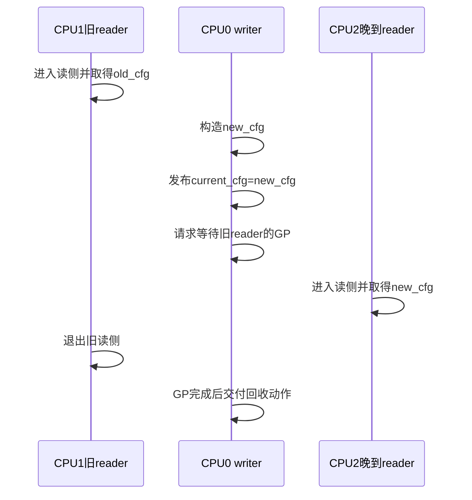
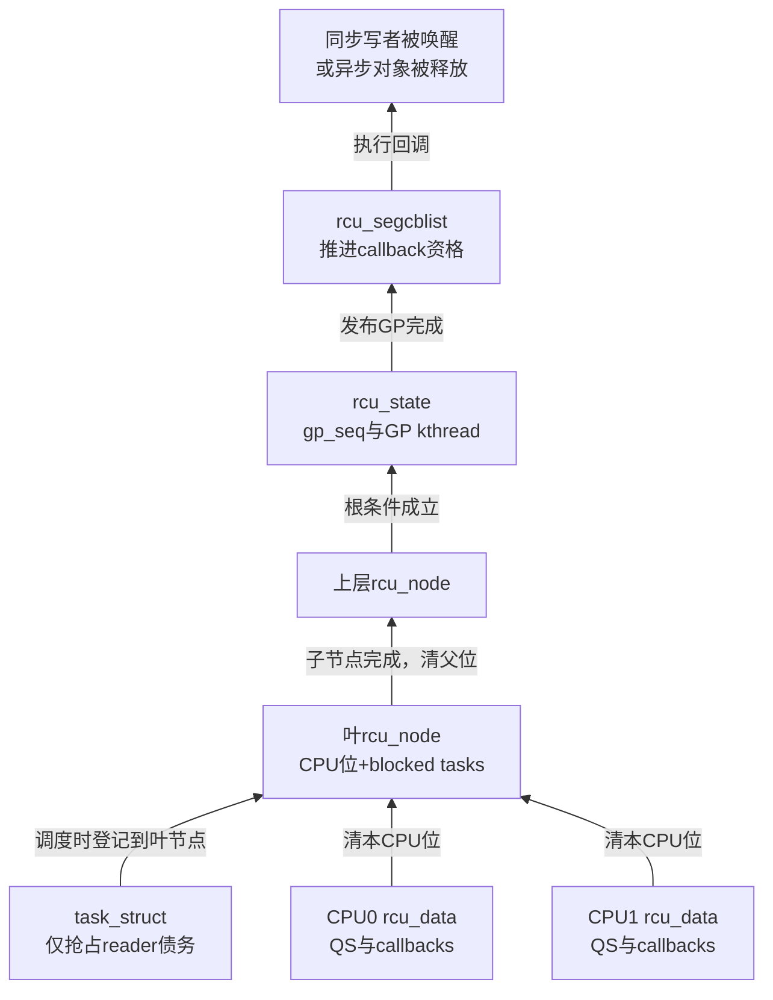
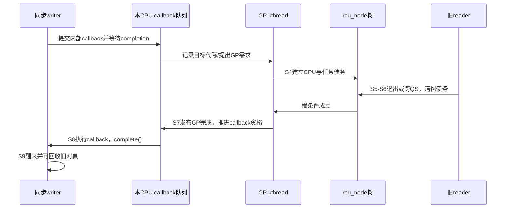

# 第5章\_Tree\_RCU\_公共骨架与完整周期

P04 已经把普通 RCU、SRCU、Tasks、Tree/Tiny 和 PREEMPT_RCU 放回不同坐标轴。本章只讨论 **普通 RCU 在 SMP 上的 Tree RCU 公共骨架**：无论普通 reader 能否被抢占，GP 请求、分层证明、callback 代际和完成交付都共用这条主线。

本章不会从字段列表开始，也不会把链接当作解释。先固定一次对象替换，沿 S0～S9 走完“发布新对象 → 建立旧读者债务 → 收集 QS → 根节点完成 → callback 成熟并执行 → 写者继续”的周期；后续 P06～P17 只是逐个放大这条周期中的模块。

## 5.1\_固定问题现场

设共享入口 `current_cfg` 指向 `old_cfg`：

```c
struct demo_cfg {
	int generation;
	struct rcu_head rcu;
};

static struct demo_cfg __rcu *current_cfg;
```

三类执行同时发生：

- CPU1 上的 reader 已进入读侧并取得 `old_cfg`；
- CPU0 上的 writer 构造 `new_cfg`，发布新入口，并要求旧对象最终可回收；
- CPU2 上的 reader 在发布以后才进入，只会沿正式入口取得 `new_cfg`。

Tree RCU 不需要证明“系统里没有任何 reader”。它只需要证明：**在本轮 GP 边界之前可能取得 `old_cfg` 的 reader 都已经跨过安全边界。** CPU2 的晚到 reader 不在旧集合中，因此可以与本轮 GP 并行。



接下来所有数据结构都必须能回答这条时间线中的一个具体问题，而不是凭字段名字自行成章。

## 5.2\_先把九个概念与C类型分开

| 概念 | 它表示什么 | 常见 Linux 6.12 承载位置 |
| --- | --- | --- |
| 对象版本 | 发布前后的 `old_cfg` / `new_cfg` | 子系统自己的结构体和 `__rcu` 指针 |
| GP 请求 | “至少推进到某个代际”的需求 | callback 目标序列、节点请求序列、全局命令状态 |
| 物理 GP | GP 执行者实际启动并完成的一轮证明 | `rcu_state.gp_seq` 与 GP kthread 周期 |
| QS | 某 CPU 已跨过可排除旧普通 reader 的边界 | `rcu_data` 本地标志和节点等待位 |
| EQS | CPU 在 user/idle/offline 等不观察内核 RCU 对象的状态 | context tracking / watching 状态 |
| CPU 债务 | 当前 GP 仍需这个 CPU 给出证据 | 叶 `rcu_node.qsmask` 中对应位 |
| 任务债务 | 抢占式配置下，旧 reader 已离开 CPU 但尚未退出 | `task_struct` 与叶节点 blocked-task 状态 |
| callback 资格 | 回收动作依赖的 GP 是否已经完成 | 每 CPU `rcu_segcblist` 的分段与目标代际 |
| 等待完成 | 同步调用者怎样得知目标条件成立 | 栈上 `completion`、哨兵 callback 或全局 barrier 状态 |

这里最容易出现三种类型错误：

1. 把 `struct rcu_state` 误认为“一个 GP 对象”。它是长期全局控制状态，一轮物理 GP 只是其中一次状态变化。
2. 把 `struct rcu_head` 误认为受保护对象本身。它是嵌入对象中的 callback 节点，负责延后执行，不提供 reader 引用计数。
3. 把 `struct rcu_node` 误认为 reader 计数树。普通 Tree RCU 主要汇聚的是 **保守证明债务和被抢占任务边界**，不是每个 reader 的逐次进入退出计数。

## 5.3\_四层状态地址和一个对象队列

Tree RCU 把状态按写入频率和所有权分层，而不是放进一个全局大锁：

| 层级 | 代表对象 | 谁主要写 | 谁随后读 | 本章中的职责 |
| --- | --- | --- | --- | --- |
| 每任务 | `task_struct` 的 RCU 读侧字段 | 当前任务、调度路径、最外层 unlock | 叶节点检查和任务清债路径 | 仅在抢占式读侧中保存离开 CPU 的旧 reader 债务 |
| 每 CPU | `struct rcu_data` | 本 CPU 的调度、tick、idle、callback 路径 | 节点上报、GP/FQS、callback 执行者 | 感知 GP、记录本地 QS、保存回调队列 |
| 每节点 | `struct rcu_node` | 节点锁保护下的 CPU 报告、GP 初始化、任务登记 | 父节点汇聚、根完成判断 | 保存局部 CPU 位图和抢占任务边界 |
| 全局 | `struct rcu_state` | GP 请求者与长期 GP kthread | callback、poll、同步等待和诊断路径 | 合并请求、推进 GP 序列、发布完成 |
| 回调队列 | `rcu_head` + `rcu_segcblist` | `call_rcu()` 生产者和本地/NOCB 管理路径 | callback 执行上下文 | 绑定目标代际、成熟、批量执行 |



箭头表示状态流。reader 本身不会沿图逐层发送“我进入了”的消息；高频读侧成本之所以低，是因为更新侧先建立保守等待集合，再利用调度、EQS 和任务退出等已有事件逐步排除旧 reader 的可能性。

## 5.4\_它不是一台状态机而是五台正交状态机

同一轮 RCU 操作至少包含五组相互交接、但不能互相替代的状态：

1. **对象发布状态机**：新对象何时完成构造，正式入口何时从 old 切到 new。
2. **GP 请求与全局状态机**：多个请求怎样合并，一轮物理 GP 何时开始和完成。
3. **证明债务状态机**：每 CPU / 被抢占任务怎样从“可能包含旧 reader”变成“已排除”。
4. **callback 状态机**：回收动作怎样从 NEXT 绑定目标代际，再推进到 DONE。
5. **等待者状态机**：同步调用者或 `rcu_barrier()` 怎样收到最终完成信号。

只看其中一台会得到错误结论。例如：

- 根节点完成只说明 GP 证明成立，不等于所有成熟 callback 已经执行；
- callback 进入队列只说明异步动作被接纳，不等于 GP 已开始；
- `synchronize_rcu()` 返回只证明目标旧 reader 已结束，不证明系统此前排队的所有 callback 都执行完；
- 发布新入口只改变后续 reader 的选择，不会自动使旧地址安全可释放。

## 5.5\_S0到S9的一次完整周期

下面统一使用同一组阶段。后续章节的数据结构、时序和异常分支都回指它，不再要求读者把不同章节自行拼起来。

| 阶段 | 进入触发 | 谁写什么地址 | 后续谁读取 | 退出条件 |
| --- | --- | --- | --- | --- |
| S0 稳态 | `current_cfg=old_cfg` | reader 只读取正式入口 | 子系统使用对象 | 尚无替换 |
| S1 构造 | writer 分配新版本 | writer 私有内存 | 只有 writer | `new_cfg` 完整可发布 |
| S2 发布 | `rcu_assign_pointer()` / replace | 子系统 `__rcu` 入口 | 之后进入的 reader | 正式入口指向 new |
| S3 提交回收需求 | `call_rcu()` 或同步等待内部桥接 | 每 CPU callback 队列 / GP 请求状态 | callback 管理和 GP 请求漏斗 | 目标代际被记录 |
| S4 GP 开始建债 | GP kthread 接受请求 | `gp_seq`、节点等待位、每 CPU 观察状态 | 各 CPU 与节点报告路径 | 本轮旧集合边界固定 |
| S5 本地产生证据 | 调度、user/idle、读者退出等事件 | `rcu_data`；抢占分支还写任务/叶节点状态 | 本地上报和节点检查 | 本地条件可清债 |
| S6 分层汇聚 | CPU 或任务清债 | 叶到根的 `qsmask` / blocked-task 条件 | 父节点和 GP kthread | 根完成条件成立 |
| S7 发布GP完成 | GP cleanup | 节点序列与全局 `gp_seq` | callback、poll、等待路径 | 完成代际全局可见 |
| S8 callback成熟并执行 | 本地 core、softirq、`rcuc` 或 NOCB 线程运行 | `rcu_segcblist` 分段和对象状态 | 回调函数 / 同步等待桥 | 目标 callback 真正执行 |
| S9 生命周期关闭 | `kfree()`、completion、barrier 返回 | 子系统对象或等待状态 | 模块退出 / 后续业务 | 旧资源不再被引用或排队 |

注意 S2 与 S4 的先后含义：writer 先让未来 reader 看到新版本，再等待旧 reader。GP 不是给所有 reader 加一堵全局门，而是关闭旧版本的回收窗口。

## 5.6\_从synchronize\_rcu看完整交接

`synchronize_rcu()` 的公共语义是同步等待旧普通 reader。Linux 6.12 的默认实现路径可以借助一个归属于调用者的等待对象和一个内部 callback，把同步等待接到异步 GP 交付链上。可以把它理解为：

```text
调用者提交“GP后执行”的内部callback
    → callback进入本地分段队列并提出GP需求
    → GP建立并清偿证明债务
    → callback获得执行资格并被执行
    → callback完成调用者的completion
    → 调用者醒来并返回
```

这里有三个不同对象：

- **GP** 给出旧 reader 已跨界的证明；
- **内部 callback** 把这个证明送到异步完成路径；
- **completion** 只负责让当前同步调用者睡眠和被唤醒。

因此不能说“`synchronize_rcu()` 一直轮询所有 CPU”，也不能说“callback 就是 GP”。等待者通常睡眠；证据由 CPU/任务事件和节点树汇聚；callback 是完成结果的交付载体之一。



## 5.7\_功能模块矩阵

后续章节以功能模块为主轴，每行先解释共同职责，再在该模块内部比较配置差异：

| 模块 | 输入 | 公共输出 | 非抢占 / 抢占差异 | 详细章节 |
| --- | --- | --- | --- | --- |
| 读侧进入/退出 | 普通 RCU 临界区 | 维持旧对象可用窗口 | 是否需要任务嵌套与 blocked-task 债务 | P06 |
| 初始化与执行者 | CPU 拓扑、启动与 softirq/kthread 环境 | 建立状态所有权和执行上下文 | 读侧插件分支不同，公共拓扑相同 | P07 |
| GP 请求与全局周期 | callback、同步者、poll 目标 | 合并需求并推进一轮物理 GP | 基本共用 | P08 |
| QS/EQS | 调度、user、idle、watching 事件 | 本 CPU 可报告证据 | 抢占分支先转移任务债务 | P09 |
| 节点汇聚 | 本地 CPU 位和 blocked-task 条件 | 根完成结论 | 抢占分支增加 `gp_tasks` 条件 | P10 |
| callback 分段 | 新 callback 与目标代际 | NEXT→WAIT→READY→DONE | 共用 | P11 |
| callback 执行 | DONE 批次 | 真正调用回调函数 | 共用 | P12 |
| 同步与 barrier | 等旧 reader / 等历史 callback | 唤醒等待者 | 共用 | P13 |
| FQS 与 stall | 长时间未清债 | 观察、催促、诊断 | 抢占任务可成为额外阻塞源 | P14 |
| expedited | 低延迟 GP 请求 | 更主动的完成路径 | 遇到抢占 reader 时仍等任务债务 | P15 |
| NOCB | callback 生产压力与隔离需求 | 转移等待/执行负载 | 不改变 reader 证明 | P16 |
| hotplug | CPU 上下线 | 更新参与集合并迁移 callback | 保留 blocked task 和当前轮债务 | P17 |

这张矩阵也是去重门禁：同一行的公共链只在对应章节展开一次，配置差异只解释“新增了什么状态、由谁写、怎样重新接回公共出口”。

## 5.8\_正常路径特殊事件与慢路径

Tree RCU 的“读侧很轻”并不等于系统没有通信。成本被转移到不同频率的路径：

| 频率层级 | 典型动作 | 通信方式 | 成本承担者 |
| --- | --- | --- | --- |
| 高频 reader | 进入、取得、使用、退出 | 通常不逐 reader 向全局上报 | 当前任务 / CPU 的极小本地状态 |
| 调度或EQS事件 | 记录 QS、watching 变化 | 写每 CPU 状态，必要时进入节点锁 | 调度、tick、idle/context tracking 路径 |
| 每轮 GP | 建债、扫描、节点汇聚、cleanup | 共享状态、节点锁、唤醒 | GP kthread 与参与 CPU |
| callback 批次 | 推进分段、抽取并执行 | 每 CPU 队列或 NOCB 线程交接 | core/softirq/线程 |
| 慢路径 | FQS、resched、IPI、boost、stall 报告 | 远端观察或主动催促 | 迟延 CPU、GP 执行者和诊断路径 |

正常 GP 首先利用已有事件和共享状态推进。只有进展不足或调用者明确选择 expedited 时，系统才增加扫描、resched、IPI 等扰动；这些动作改善活性或延迟，但不能凭超时猜测安全。

## 5.9\_源码证据怎样对应公共骨架

本章只建立稳定机制模型；具体函数体在版本化源码材料中唯一展开：

| 机制问题 | Linux 6.12 位置 | 对应源码阅读任务 |
| --- | --- | --- |
| 全局状态、GP kthread 与请求漏斗 | `kernel/rcu/tree.c`、`tree.h` | [Tree RCU GP 全局生命周期模块导读](../../../../../research/source_reading/rcu/navigation/P03_Linux_6.12_Tree_RCU_GP全局生命周期模块源码概念导读.md#3.1_模块问题与版本边界) |
| 非抢占/抢占读侧和任务债务 | `kernel/rcu/tree_plugin.h`、`include/linux/sched.h` | [公共接口与读侧模型模块导读](../../../../../research/source_reading/rcu/navigation/P02_Linux_6.12_RCU公共接口与读侧模型模块源码概念导读.md#2.1_模块问题与配置边界) |
| callback 与 NOCB | `tree.c`、`tree_nocb.h`、`rcu_segcblist.c` | [回调与 NOCB 模块导读](../../../../../research/source_reading/rcu/navigation/P07_Linux_6.12_Tree_RCU_回调与NOCB模块源码概念导读.md#7.1_GP完成为什么还不等于callback执行) |
| 同步等待与 barrier | `kernel/rcu/update.c`、`tree.c` | [同步等待与 rcu_barrier 模块导读](../../../../../research/source_reading/rcu/navigation/P08_Linux_6.12_Tree_RCU_同步等待与rcu_barrier模块源码概念导读.md#8.1_等RCU至少有三种不同对象) |

这些链接不是本章内容的替代物。即使暂时不打开源码，读者也应能说清 S0～S9、五组状态机、四层状态所有权和完成交付方向；进入源码只是把抽象角色落实到固定版本的字段与函数。

## 5.10\_五个常见误读

1. **“Tree RCU 是一把树形读写锁。”** 错。树主要汇聚证明债务，reader 不在根上取得共享读锁。
2. **“每个 reader 进入时都在 `rcu_node` 登记。”** 错。普通快路径不逐 reader 登记；抢占 reader 只有在临界区内被换出时才转入共享 blocked-task 状态。
3. **“根节点完成后对象立即被释放。”** 错。GP 完成和 callback 实际执行是两个阶段；同步等待还需要结果交付和唤醒。
4. **“没有 IPI 就没有跨 CPU 通信。”** 错。正常路径可通过每 CPU 状态、节点锁、共享序列和缓存一致性传播；IPI 是特定慢路径之一。
5. **“PREEMPT_RCU 有另一套 GP 和 callback 系统。”** 错。它在读侧和节点完成条件上增加任务债务，随后重新接回同一公共主线。

## 5.11\_本章验收与下一问

读完本章，应能从对象入口开始，依次指出：

- 新对象在哪里发布，旧对象为何暂时保留；
- GP 请求、物理 GP、QS、callback 和 completion 为什么是不同对象；
- 每任务、每 CPU、每节点、全局状态分别由谁写、谁读；
- 证明结果怎样从本地事件进入节点树，再到 GP 完成和 callback 交付；
- 高频快路径、每轮 GP 路径和强制慢路径分别承担什么成本。

现在还剩一个关键缺口：如果 reader 能在临界区内被调度器抢占，CPU 已经切换上下文是否足以证明旧 reader 消失？P06 将只处理这个读侧模块差异，不再重复 GP、callback 和同步等待。

上一篇：[RCU 分类坐标与内核配置](P04_RCU_分类坐标与内核配置.md)。

下一篇：[Tree RCU 读侧执行模型与配置差异](P06_Tree_RCU_读侧执行模型与配置差异.md)。
