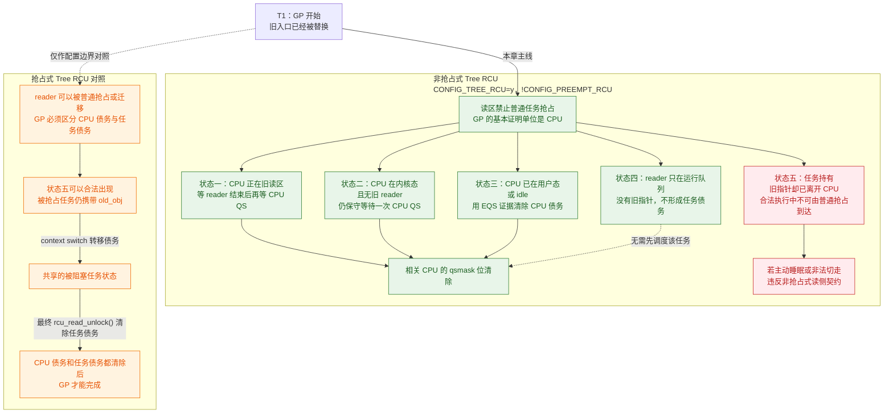
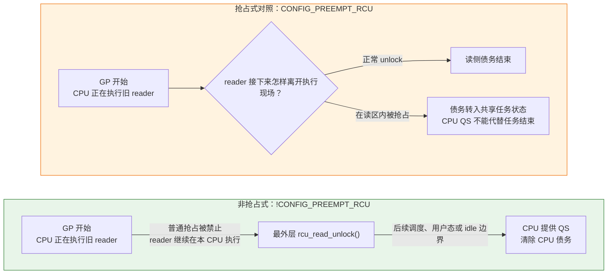
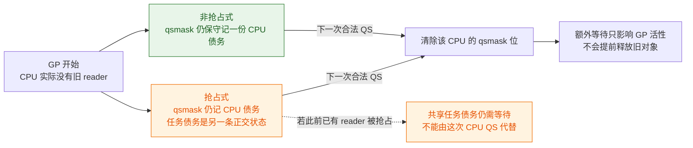
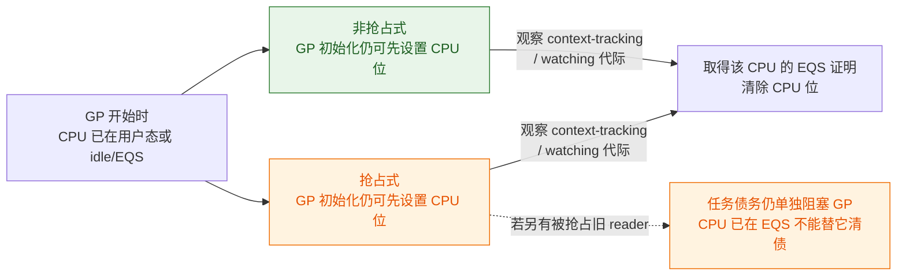
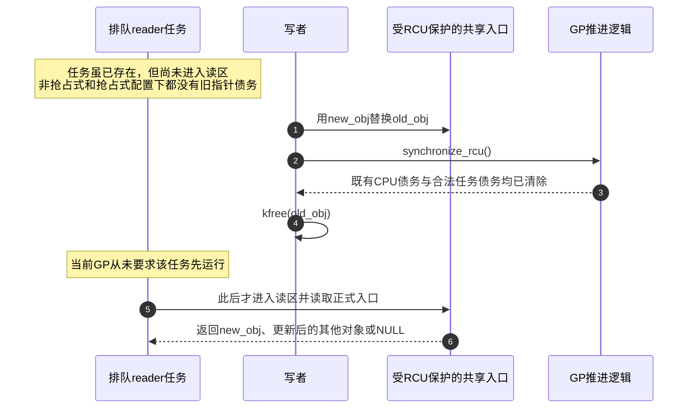
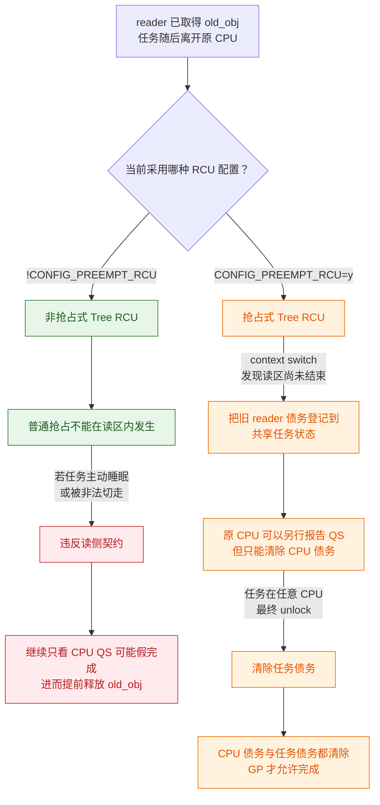
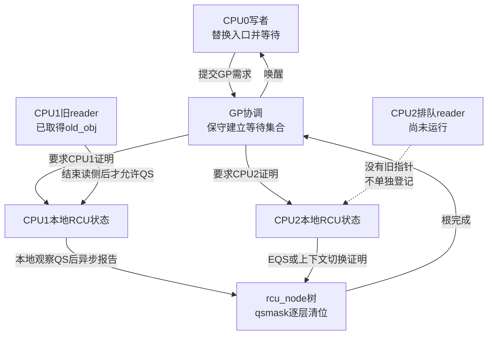
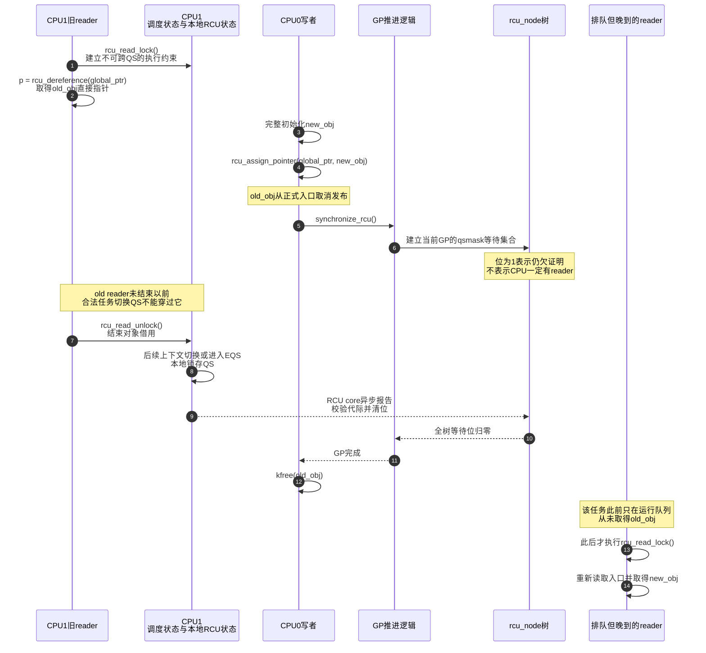

# 第5章\_非抢占式\_Tree\_RCU\_问题与证明模型

## 5.1\_本章不是从字段开始

### 5.1.1\_标题里的两个限定不是同义关系

“非抢占式 Tree RCU”不是把“非抢占式 RCU”和“Tree RCU”画等号，而是同时限定了 **底层实现** 和 **读侧运行方式**：`Tree RCU` 是普通 RCU 的一种底层实现家族，`非抢占式` 则表示本章选择 `!CONFIG_PREEMPT_RCU`，普通 reader 不能被调度器在读侧临界区内正常抢占。因此本章的研究对象可以写成：

```text
普通 RCU 读者语义 + Tree RCU 底层实现 + !CONFIG_PREEMPT_RCU 读侧方式
```

Tree RCU 还可以在 `CONFIG_PREEMPT_RCU=y` 时支持可被抢占的 reader；单 CPU、小内存构建也可以用 Tiny RCU 实现非抢占式的普通 RCU。因此，“典型 SMP 内核的非抢占式普通 RCU 通常由 Tree RCU 实现”只有在确认配置后才成立，不能扩大成“Linux 所有非抢占式 RCU 都只有 Tree RCU 一种实现”。SRCU 和 Tasks RCU 则改变了 reader 定义或保护域，不属于这里的同一配置分支。

完整分类统一放在 [RCU 实现家族与内核配置](P22_RCU_实现家族与内核配置.md#22.2_三个正交维度)，Tiny RCU 的单 CPU 证明放在 [Tasks RCU 与 Tiny RCU 实现边界](P24_Tasks_RCU与Tiny_RCU实现边界.md#24.1_Tasks_RCU与_Tiny_RCU实现边界)。本章只证明上式所限定的这一种组合为什么能够把旧 reader 问题折叠成 CPU 的 QS 债务。

### 5.1.2\_再固定本章要证明的现场

先固定一个能把争议暴露出来的场景：

1. CPU0 上的管理线程替换对象；
2. CPU1 上已有一个 reader 正在使用旧对象；
3. CPU2 的运行队列里早已存在另一个 reader 任务，但它还没有执行读侧代码；
4. 写者不知道任何 reader 的任务 ID，也不知道谁读到了 `old_obj`。

本章回答的是：在 `CONFIG_TREE_RCU=y && !CONFIG_PREEMPT_RCU` 的模型中，只按 CPU 等待一个 QS，为什么足以保护真正的旧 reader，又为什么不必等待未来才运行的 reader。

> **配置边界：** 本仓库的 i.MX6ULL Linux 6.12.20 当前 `.config` 实际启用了 `CONFIG_PREEMPT_RCU=y`。本章研究的是同一份 6.12.20 `tree_plugin.h` 在 `#else /* CONFIG_PREEMPT_RCU */` 中保留的非抢占实现。不能把当前镜像的运行结果冒充非抢占构建结果。

## 5.2\_先运行一段具体代码

下面的 `late_reader` 在更新以前就被创建，但先睡在 completion 上。它是一个真实存在的任务，却还没有执行 `rcu_dereference()`：

```c
struct demo_obj {
	int generation;
	int value;
};

static struct demo_obj __rcu *demo_current;
static DECLARE_COMPLETION(late_reader_ready);
static DECLARE_COMPLETION(start_late_reader);

static int late_reader_fn(void *unused)
{
	struct demo_obj *obj;
	int generation;
	int value;

	/* 任务已经创建，但尚未进入 RCU 读侧。 */
	complete(&late_reader_ready);
	wait_for_completion(&start_late_reader);

	rcu_read_lock();
	obj = rcu_dereference(demo_current);
	generation = obj ? obj->generation : -1;
	value = obj ? obj->value : -1;
	rcu_read_unlock();

	pr_info("late reader: generation=%d value=%d\n",
		generation, value);
	return 0;
}
```

更新线程先确认任务已经创建并停在读区外，然后替换、等待、释放，最后才允许它进入读区：

```c
static int replace_and_start_late_reader(struct demo_obj *new_obj)
{
	struct demo_obj *old_obj;

	wait_for_completion(&late_reader_ready);

	/* 取消发布旧对象，新 reader 此后从正式入口取得新对象。 */
	old_obj = rcu_replace_pointer(demo_current, new_obj, true);
	/* 等待调用前已经存在的合法读侧临界区结束。 */
	synchronize_rcu();
	kfree(old_obj);

	/* old_obj 已经释放；晚到 reader 此后才真正读取入口。 */
	complete(&start_late_reader);
	return 0;
}
```

这个实验故意把“任务存在”和“旧引用存在”拆开：

```text
task_struct 已存在
    != 任务已进入 RCU 读侧
    != 任务已执行 rcu_dereference()
    != 任务持有 old_obj
```

只有最后一种事实与 `old_obj` 的回收直接相关。完整可构建实验见[晚到读者与抢占读者的对象回收实验](../../../../../labs/kernel/rcu/P01_晚到读者与抢占读者/README.md)。在本例中，写者只有在 GP 结束并释放 `old_obj` 后才执行 `complete(&start_late_reader)`；晚到 reader 随后从正式入口取得的是 `new_obj`，而不是已经回收的旧对象。

## 5.3\_先区分读侧临界区与静止状态

```c
rcu_read_lock();
obj = rcu_dereference(demo_current);
use_obj(obj);
rcu_read_unlock();
```

这段区间是 **RCU 读侧临界区**，不是 QS。

QS 是当前 RCU 类型认可的证明边界。对非抢占式普通 RCU，典型证据包括：

- 一次合法上下文切换；
- 返回用户态；
- 进入 idle/EQS；
- CPU offline；
- 该版本实现认可的其他边界。

它们共同证明的是：

```text
这个 CPU 上在本轮 GP 边界以前可能存在的普通 RCU 读侧区间
不可能继续跨越该 QS 执行。
```

QS 不是“此刻没有执行任意 reader 函数”，也不是“读者计数等于零”。后来的新 reader 完全可以在 QS 之后立即开始；它只会从已经更新的正式入口重新取得对象。

## 5.4\_三个时间边界封闭旧读者集合

接下来用 T0～T2 分阶段展开这段代码的时间边界。

### 5.4.1\_T0\_取消发布旧对象

```c
old_obj = rcu_replace_pointer(demo_current, new_obj, true);
```

`old_obj` 从正式共享入口取消发布。此刻形成两类现场：

| 现场 | 能否仍持有 `old_obj` | 原因 |
| --- | --- | --- |
| T0 前已经读过入口的 reader | 可能 | **它已经取得直接指针**，可继续完成当前读区 |
| T0 后才通过受控入口读取的 reader | 不应成为需要此旧对象等待的 reader | **它读取更新后的入口**；若与发布边界并发而仍落入旧观察，也会被随后开始的 GP 保守覆盖 |
| 尚未执行读侧代码的排队任务 | 否 | 它没有执行任何指针读取 |

程序若还保留第二个不受控制的 `old_obj` 入口，这张表立即失效；RCU 不扫描任意裸指针。

### 5.4.2\_T1\_GP建立保守等待集合

写者调用 `synchronize_rcu()`。Tree RCU 不查找实际 reader，而是保守地要求本轮相关 CPU 提供证明：

```text
qsmask 中的一位为 1
    = 该 CPU 或子树对当前 GP 仍欠 QS 证明
    != 该 CPU 当前一定正在执行 reader
```

这种保守性允许 RCU 不在每次读操作上维护一个全局读者登记表。一个实际上没有旧 reader 的相关 CPU 也可能先被记入等待集合；它的位表达 CPU/子树证明债务，不表达该 CPU 是否真的持有旧对象。这是把高频读侧写共享状态的成本转移到按 GP 发生的证明收集。

### 5.4.3\_T2\_全部证明汇聚后回收

`synchronize_rcu()` 等待的是普通 RCU 的全局 GP，而不是某个对象地址上的条件。只有当前代际中所有相关 CPU/子树债务都被合法 QS 或 EQS 证据清除，GP 才能结束。于是 T0 前可能取得旧对象的合法 reader 已不可能继续使用它，写者才能 `kfree(old_obj)`。

## 5.5\_非抢占式模型最关键的不变量

Linux 6.12.20 非 PREEMPT_RCU 分支把：

```c
__rcu_read_lock()   -> preempt_disable()
__rcu_read_unlock() -> preempt_enable()
```

作为公共读侧实现。严格地说，具体机器码和计数成本还受 `CONFIG_PREEMPT_COUNT` 等配置影响，但源码契约非常明确：**普通 reader 不能被一次合法任务切换从 CPU 上移走，并在以后继续带着旧指针运行。**

因此成立如下蕴含：

```text
CPU 在 GP 开始后发生一次有效任务切换 QS
    -> 切换前占用该 CPU 的任务已经离开 CPU
    -> 合法的非抢占 RCU reader 不可能跨越这次切换
    -> 该 CPU 上 GP 开始前的旧 reader 已全部结束
```

这就是“一个有效 QS 足够”的含义。它不是：

```text
调度一次，让运行队列中的所有 reader 函数都运行一遍。
```

运行队列可以有一千个未来 reader；只要它们此前没有取得旧指针，就不是本轮需要排空的旧 reader。

## 5.6\_五种\_GP开始瞬间的CPU状态

本节的五种结论默认都位于 `CONFIG_TREE_RCU=y && !CONFIG_PREEMPT_RCU`：读侧临界区禁止普通任务抢占，因此证明单位可以收敛为 CPU。图中右侧的 `CONFIG_PREEMPT_RCU=y` 只用于对照边界，说明一旦允许持有旧指针的 reader 被抢占，为什么还要增加独立的任务债务。

五种情形也不是同一枚举变量的五个互斥取值。状态一至状态三检查 **CPU 当时正在执行什么上下文**，状态四与状态五检查 **reader 任务是否已经取得旧指针**。



图中的 `qsmask` 位只表达 **CPU 证明债务**。在非抢占式配置里，状态五被读侧约束排除，所以不需要为普通 reader 登记任务身份；在抢占式配置里，状态五成为合法状态，CPU 位与被抢占任务状态必须共同参与证明。状态四则可以与状态二或状态三同时成立：运行队列里虽然已有未来 reader，但它尚未读入口，两种配置都不需要让它先运行。

### 5.6.1\_状态一\_CPU正在旧读侧临界区内

reader 已经取得 `old_obj`。因为读侧禁用抢占且不得主动阻塞，普通任务切换不能合法穿过该区间。CPU 只有在 reader 最外层 unlock 以后，才可能通过后续调度或 EQS 边界交付一个有效 QS。

所以 Tree RCU 不必读取这个 reader 的任务字段：等待 CPU 的一个后续 QS，就间接等待了旧 reader 结束。



### 5.6.2\_状态二\_CPU在内核态但没有旧reader

RCU 并不知道这个事实，仍可能把它放进等待集合。该 CPU 经过一次有效 QS 就完成证明。多等待它一次降低的是 GP 活性，不破坏安全性。



### 5.6.3\_状态三\_CPU已经在用户态或idle

用户态和 idle 属于扩展静止状态 EQS：普通内核 RCU reader 不应跨入该区间。Tree RCU 可以观察 context-tracking/watching 代际，证明 CPU 在 GP 期间已经处于或经过 EQS，从而代表该 CPU 报告 QS。

在 Linux 6.12.20 中，GP 初始化仍先用 `qsmask = qsmaskinit` 建立保守集合；后续 force-QS/context-tracking 路径可以很快为已经在 EQS 的 CPU 提供隐式证明。不能把它简化成“GP 初始化一定直接跳过所有 idle CPU”。具体字段和函数在下一章展开。



### 5.6.4\_状态四\_reader任务排队但尚未执行

它没有进入读区、没有读共享入口，也没有获得 `old_obj`。当前 GP 不需要让它先运行。GP 后它若被调度，只能重新读取当前入口，并在新读区内使用 `new_obj` 或 `NULL`。



### 5.6.5\_状态五\_任务已取得旧指针却挂在运行队列

对合法的非抢占式普通 RCU reader，这个状态不能由普通抢占产生。若任务主动睡眠或以其他方式非法切走，程序已经违反读侧契约。

同一个“任务持有 `old_obj` 却离开原 CPU”的现场，在两种配置下含义完全不同：非抢占式配置把它排除在合法普通抢占路径之外；抢占式配置允许它发生，但必须把证明债务从正在执行的 CPU 现场转入共享任务状态。第七章将从这条分叉推出 PREEMPT_RCU 的任务跟踪。



因此，非抢占式模型通过 **禁止债务离开 CPU 执行现场** 来维持 CPU 证明；抢占式模型则通过 **显式转移并跟踪任务债务** 来维持同一安全结论。不能把其中一种配置的 QS 推理直接套到另一种配置。

## 5.7\_完整角色关系



图中没有从 `rcu_read_lock()` 到 `rcu_node.qsmask` 的登记箭头，因为非抢占快路径不执行这类远端登记。通信被放到 GP 和 QS 路径：GP 建立 CPU 债务，CPU 在后续边界形成证据，RCU core 再异步汇聚。

## 5.8\_完整双CPU时序



## 5.9\_unlock为什么通常不是报告动作

普通非抢占分支的 `rcu_read_unlock()` 首先结束执行约束并恢复抢占能力。它使 **后续** 上下文切换成为可能，但通常不等于立即向 `rcu_node` 清位：

```text
rcu_read_unlock()
    -> 旧指针使用区间结束
    -> 后续发生上下文切换/用户态/idle等QS
    -> 本 CPU 将 cpu_no_qs.norm 清为 false
    -> 后续 rcu_core() 调用 rcu_check_quiescent_state()
    -> rcu_report_qs_rdp() 才进入节点树清位
```

Linux 6.12.20 的例外是 `CONFIG_RCU_STRICT_GRACE_PERIOD=y`：非抢占分支的 `__rcu_read_unlock()` 会调用 `rcu_read_unlock_strict()`，后者可直接设置本地 QS 并调用 `rcu_report_qs_rdp()`。这是用于严格 GP 的特殊配置，不能倒推普通构建中每次 unlock 都直接报告。

## 5.10\_RCU不等待固定时间或固定调度次数

GP 的完成条件是证据谓词，不是计时器：

```text
当前GP的相关CPU/子树等待位全部清除
    = 可以完成普通非抢占GP
```

force-QS、调度时钟、超时检查和 stall warning 都服务于 **推动或诊断证据产生**。它们不会在证据缺失时用“已经等了足够久”替代安全证明。

写者触发 GP 推进时，旧对象已经从正式入口取消发布。接下来需要闭合的是一条保守证明链：

1. GP 为相关 CPU/子树建立证明债务，而不是登记对象地址或 reader 身份；
2. 每份债务必须由发生在当前 GP 边界之后的合法 QS、EQS 或等价状态证据清除；
3. 尚未读取入口的未来 reader 不属于旧 reader 集合，它以后只会从正式入口取得更新后的对象。

从单 CPU 证明角度，一次位于当前 GP 内的有效 QS 就够；从系统角度，需要多少调度、IPI 或等待时间完全取决于最后一个欠证明的 CPU 何时跨过合法边界，没有固定 N。

## 5.11\_两个生命周期错误

### 5.11.1\_旧指针逃出读侧临界区

```c
rcu_read_lock();
saved = rcu_dereference(demo_current);
rcu_read_unlock();

/* 错误：saved 没有独立生命期保护。 */
queue_work(system_wq, &saved_work);
```

工作真正运行前，写者可能已经完成 GP 并释放对象。解决方法是在 RCU 内取得 refcount/kref、转移所有权，或让另一把锁覆盖完整使用期。

### 5.11.2\_第二个入口仍能取得旧对象

如果 `demo_current` 已替换，但另一个数组仍公开 `old_obj`，未来 reader 仍能取得旧地址。GP 不理解业务对象图，无法发现这个漏掉的入口。必须先取消发布全部正式入口，再选择覆盖它们的 GP 与回收协议。

## 5.12\_安全性与活性分开判断

| 性质 | Tree RCU 的选择 | 可观察结果 |
| --- | --- | --- |
| 安全性 | 证据不足就不完成 GP | 不提前释放旧对象 |
| 活性 | 依赖 CPU/reader 最终提供进展 | 长 reader 或不响应 CPU 会拖长 GP |
| 异步压力 | callback 继续排队但不能执行 | `call_rcu()` 回调和旧对象积压 |
| 诊断 | force-QS 逐级催促，过久触发 stall warning | 暴露未调度、关中断、死循环或非法长读区 |

RCU stall warning 是“证明链长时间没有进展”的诊断，不是超时释放信号。

## 5.13\_本章结论

完整的非抢占证明链是：

```text
写者先切断旧对象的正式共享可达性
    + 未来reader必须重新读取更新后的入口
    + 合法旧reader不能跨越当前RCU类型认可的QS
    + GP保守等待所有相关CPU各自提供证明
    = old_obj可以安全释放
```

RCU 不等待所有“未来可能运行 reader 函数”的任务。它等待的是在 GP 边界前已经可能处于受保护读侧执行现场的那部分历史。非抢占模型用“reader 不可被切走”把任务问题折叠成 CPU 的一个 QS 债务；下一章把这条证明映射到 Linux 6.12.20 的实际字段和函数。

上一篇：[RCU、kref 与复合对象生命周期](P04_RCU_kref与复合对象生命周期.md)。

下一篇：[非抢占式 Tree RCU 源码同步机制](P06_非抢占式_Tree_RCU_源码同步机制.md)。
