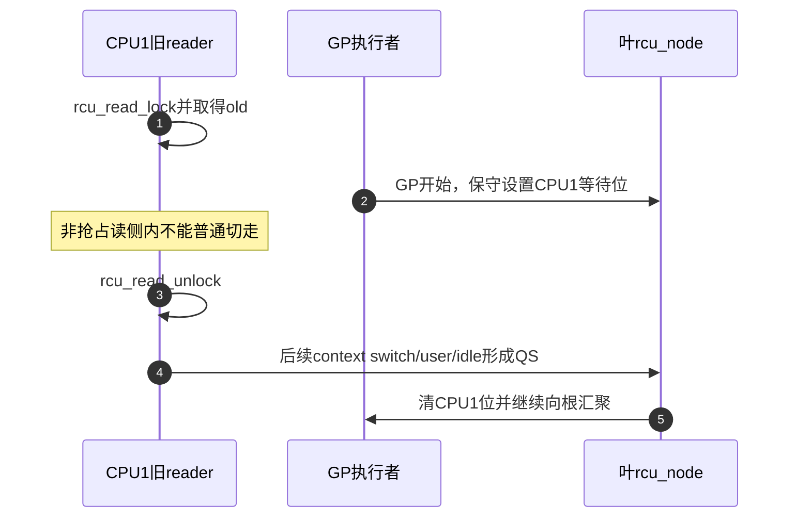
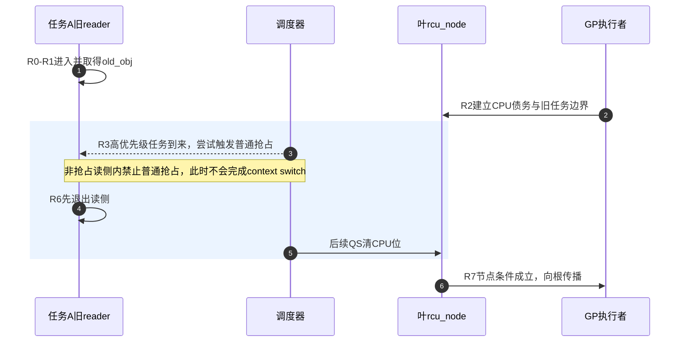
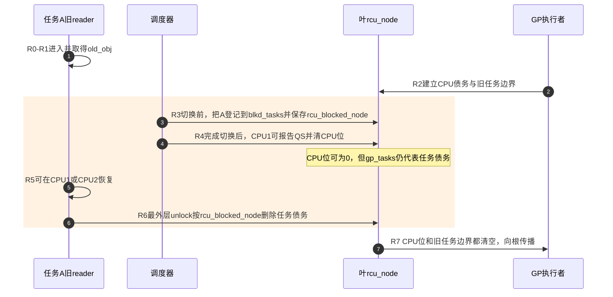

# 第6章\_Tree\_RCU\_读侧执行模型与配置差异

先对齐本章的本地语言。

1. 中央处理器（Central Processing Unit，CPU）执行普通 RCU 读侧；
2. 读侧参与者称为 reader；
3. 静止状态（Quiescent State，QS）是 CPU 可用于排除旧 reader 的证据；
4. 宽限期（Grace Period，GP）是收集这类证据并证明边界前旧 reader 已结束的周期；
5. 上下文切换（context switch）是调度器把 CPU 从一个任务交给另一个任务的事件；
6. callback 是 GP 完成后才获得执行资格的回调函数。
7. `PREEMPT_RCU` 是 `CONFIG_PREEMPT_RCU` 配置分支的简称，表示普通 reader 可以被调度器非自愿抢占；
8. `rcu_node` 则是 Tree RCU 汇聚 CPU 与任务证明债务的 C 结构体标识符。

P05 已经建立 Tree RCU 的公共完整周期。本章只放大其中的 **读侧进入/退出、context switch 与节点完成条件**：先说明非抢占式配置为什么可以依赖 CPU QS，再用一个被抢占旧 reader 击穿该证明，最后观察 PREEMPT_RCU 增加的任务债务怎样重新接回公共 `rcu_node` 汇聚链。

这是一组模块内部差异，不是两套完整 RCU 系统。GP 请求、全局代际、callback 队列、同步等待和大部分节点拓扑不会在本章复制。

本章的 R0～R7 是读侧模块内部的放大镜。它不取代 P05 的 S0～S9：R0～R1 位于 [P05 S0～S2 对象构造与入口发布](P05_Tree_RCU_公共骨架与完整周期.md#5.5.1_S0到S2_对象构造与入口发布)，R2～R7 位于 [P05 S3～S7 GP 请求、证明与根完成](P05_Tree_RCU_公共骨架与完整周期.md#5.5.2_S3到S7_GP请求证明与根完成)。6.6 节会把每个 R 阶段精确映射回公共 S 阶段，读者可在两章之间往返而不需要重建时间线。

## 6.1\_共同契约不随配置改变

先固定同一段调用代码：

```c
rcu_read_lock();
obj = rcu_dereference(current_obj);
use(obj);
rcu_read_unlock();
```

无论 `CONFIG_PREEMPT_RCU` 是否启用，调用者依赖的都是同一条保证：只要 `obj` 没有逃出本次读侧，更新者就不能在 reader 退出前回收它。配置改变的是 **内核怎样证明 reader 已退出**，不是让调用者获得两套生命周期语义。

两种配置还共享三个边界：

- 读侧只保护临时访问，不自动把裸指针变成长引用；
- “允许被调度器非自愿抢占”不等于允许主动等待 mutex、输入与输出（Input and Output，I/O）或 completion；
- 晚于 GP 边界才进入的 reader 属于新集合，不需要阻塞旧对象回收。

## 6.2\_非抢占模型为什么可以把任务问题压缩成CPU问题

先不枚举 CPU 可能处于的所有状态，而是让同一组代码真正跑过一条非抢占时间线。下面是结构完整的教学片段：CPU0、CPU1 是教学时间线中的处理器编号标识符；CPU1 上的任务 A 借用旧对象，CPU0 上的 writer 发布新对象并同步等待。

```c
struct demo_obj {
	int generation;
};

static struct demo_obj __rcu *current_obj;

static void reader_a(void)
{
	struct demo_obj *obj;

	rcu_read_lock();
	obj = rcu_dereference(current_obj);
	consume(obj); /* 在本次读侧内借用当前对象。 */
	rcu_read_unlock();
}

static void replace_obj(struct demo_obj *new_obj)
{
	struct demo_obj *old_obj;

	old_obj = rcu_replace_pointer(current_obj, new_obj, true);
	synchronize_rcu(); /* 等待边界前可能取得 old_obj 的 reader。 */
	kfree(old_obj);
}
```

在 `!CONFIG_PREEMPT_RCU` 下，这段代码的关键时间线是：

| 时刻 | 正在变化的对象类型 | 运行事件 | 状态地址与证明含义 |
| --- | --- | --- | --- |
| T0 | 任务 A | CPU1 执行 `rcu_read_lock()` 并取得 `old_obj` | A 正处于普通读侧，这段执行不能被普通抢占静默换出 |
| T1 | 正式入口 | CPU0 发布 `new_obj` 并进入 `synchronize_rcu()` | 未来 reader 只会取得新对象；旧对象仍不能释放 |
| T2 | CPU1 债务 | GP 开始，叶 `rcu_node.qsmask` 为 CPU1 保守设位 | 位为 1 表示“尚未获得排除旧 reader 的 CPU 证据”，不是 reader 计数 |
| T3 | 调度事件 | 高优先级任务 B 变为可运行 | A 仍在读侧，普通抢占切换不能在此时完成；CPU1 位不能被这个“想要切换”清除 |
| T4 | 任务 A | A 执行最外层 `rcu_read_unlock()` | A 不再借用 `old_obj`，但 CPU1 债务还要由后续合法 QS 清除 |
| T5 | CPU1 与叶节点 | 调度器现在可以完成 context switch，CPU1 产生 QS 并上报 | `rcu_data` 锁存本地证据，叶节点清 CPU1 位；这才能反推 T2 前的旧 reader 已结束 |

这条时间线先固定了任务、CPU、正式入口和节点位图四种不同类型的对象。之后再看其他 QS/EQS 来源，才不会把“CPU 当前状态”、“已锁存的历史证据”和“节点尚未清偿的债务”混成一张静态表。

非抢占式普通读侧的关键不变量是：

> 如果任务在 RCU 读侧内持有旧指针，普通抢占不会把它静默换出；因此该 CPU 在任务退出读侧之前不能经过一个被本轮认可的普通 QS。

更新者不需要记录 CPU1 上每一个 reader 的身份。GP 开始时先保守地给 CPU1 建立一位债务；只要后来观察到 CPU1 的合法 QS，就可反推：在 GP 边界前可能存在的旧 reader 已经结束。



图中第 1～2 步固定旧 reader 和 CPU 债务，第 3 步必须先退出读侧，第 4～5 步才允许后续 QS 清除 CPU 位并向 GP 执行者传播结果。

这里的顺序不能反过来。合法 QS 之所以有证明力，正是因为旧 reader 不可能跨过它仍保持读侧临界区。

用户态、idle/EQS 和 CPU 离线不是三种“reader 类型”，而是三类 **CPU 执行环境或参与集合转换**。下表链接中的 `CPU2`、`CPU3` 是教学参与者编号标识符，IRQ 是 Interrupt Request（中断请求）的缩写。它们在本章只用来说明“合法证据不只有 context switch”：

| 类型 | 状态的朴素含义 | 为什么可排除旧普通 reader | 独立讲解 |
| --- | --- | --- | --- |
| CPU 进入用户态 | 当前 CPU 不再执行内核普通 reader | 进入前的内核读侧必须已离开执行边界 | [P09 CPU2 返回用户态为何可以成为 EQS](P09_Tree_RCU_QS_EQS与Context_Tracking.md#9.6_CPU2_返回用户态为何可以成为EQS) |
| CPU 进入 idle/EQS | CPU 处于不观察普通内核 RCU 对象的扩展静止状态 | watching 代际快照可证明该 CPU 在整个观察窗口中没有重新进入旧 reader | [P09 CPU3 idle 与 IRQ 嵌套](P09_Tree_RCU_QS_EQS与Context_Tracking.md#9.7_CPU3_idle与IRQ嵌套为什么不能压成一个布尔值) |
| CPU 离线 | CPU 退出当前运行集合，并不再为未来 GP 执行 reader | hotplug 路径必须先归还当前轮债务，才能把 CPU 移出未来参与集合 | [P17 当前 GP 与下一轮参与集合必须分开](P17_Tree_RCU_CPU热插拔与回调迁移.md#17.2_当前GP与下一轮参与集合必须分开) |

## 6.3\_一次context\_switch不是永远等价于QS

如果启用可抢占普通 reader，下面时序会击穿上一节的不变量：

```text
T0：任务A在CPU1进入读侧并取得old_obj
T1：高优先级任务B抢占A，CPU1发生context switch
T2：CPU1运行B以及其他任务
T3：任务A以后甚至可能在CPU2恢复
T4：A才执行最外层rcu_read_unlock()
```

若系统仅凭 T1 的 CPU context switch 清除 CPU1 债务，GP 可能在 T2～T3 之间完成并释放 `old_obj`，而任务 A 手里仍保存旧地址。这不是“QS 定义写错一点”，而是 **状态所有权发生了变化**：证明债务不再只属于 CPU1，已经跟随被换出的任务 A。

因此抢占式实现必须新增三件事：

1. 任务本地状态：A 是否位于最外层普通 RCU 读侧；
2. 共享登记位置：A 被换出后，这笔债务存在哪个叶 `rcu_node`；
3. 清债路径：A 在任意 CPU 恢复并退出时，怎样找到原登记节点并恢复节点传播。

## 6.4\_配置差异矩阵

| 比较项 | `!CONFIG_PREEMPT_RCU` | `CONFIG_PREEMPT_RCU` |
| --- | --- | --- |
| 临界区内普通抢占 | 被读侧包装阻止 | 允许非自愿抢占 |
| 高频进入/退出状态 | 不需要维护共享 reader 身份 | 维护当前任务读侧嵌套与特殊退出状态 |
| context switch 的前置动作 | 可直接按非抢占不变量判断 QS | 若切出旧 reader，先转移任务债务 |
| 任务债务地址 | 不存在 | [`task_struct` 读侧字段 + 叶节点 `blkd_tasks/gp_tasks` 边界](../../../../../research/source_reading/rcu/source_explanations/P03_Linux_6.12_Tree_RCU_抢占读者债务关键函数源码实现.md#3.2_任务与节点的共享状态实现) |
| CPU 债务 | 叶 `qsmask` 对应位 | 同样存在，可先于任务债务清除 |
| 节点完成条件 | `qsmask == 0` | `qsmask == 0` 且本轮旧任务集合为空 |
| 最外层 unlock | 结束临界区，之后 CPU 可报告 QS | 必要时从登记节点移除任务并恢复向上传播 |
| GP/callback/等待主线 | 公共 | 公共 |

这张表解释了为什么不能按配置复制完整系统：真正不同的行集中在 reader、调度钩子和节点完成条件，其余模块沿 P05 的公共出口继续运行。

表格中的数据结构名现在同时承担两种入口：本章紧接着说明它们在当前交接中做什么，链接则进入可独立阅读的结构与实现讲解：

| 数据结构 | 类型与本地职责 | 稳定机制入口 | Linux 6.12 实现入口 |
| --- | --- | --- | --- |
| `task_struct` 的 RCU 字段 | 每任务状态；保存嵌套、特殊退出条件、链表节点和登记叶节点 | [6.5 抢占分支的状态保存位置](#6.5_抢占分支的状态保存在哪里) | [任务与节点的共享状态实现](../../../../../research/source_reading/rcu/source_explanations/P03_Linux_6.12_Tree_RCU_抢占读者债务关键函数源码实现.md#3.2_任务与节点的共享状态实现) |
| `struct rcu_node` | 每节点共享状态；同时保存 CPU 等待位和被抢占旧 reader 边界 | [P10 抢占式任务债务怎样进入同一棵树](P10_Tree_RCU_rcu_node树与分层汇聚.md#10.7_抢占式任务债务怎样进入同一棵树) | [任务与节点的共享状态实现](../../../../../research/source_reading/rcu/source_explanations/P03_Linux_6.12_Tree_RCU_抢占读者债务关键函数源码实现.md#3.2_任务与节点的共享状态实现) |

## 6.5\_抢占分支的状态保存在哪里

Linux 6.12.20 的抢占式 Tree RCU 主要使用下面三层状态：

| 状态 | 所有者 / 地址 | 主要写入事件 | 后续读取者 |
| --- | --- | --- | --- |
| 读侧嵌套 | [当前 `task_struct` 的 RCU 读侧字段](../../../../../research/source_reading/rcu/source_explanations/P03_Linux_6.12_Tree_RCU_抢占读者债务关键函数源码实现.md#3.3___rcu_read_lock与__rcu_read_unlock实现) | 进入、嵌套进入、退出 | 调度钩子和最外层 unlock |
| 登记节点与链表位置 | [当前任务字段 + `rcu_node.blkd_tasks`](../../../../../research/source_reading/rcu/source_explanations/P03_Linux_6.12_Tree_RCU_抢占读者债务关键函数源码实现.md#3.4_rcu_note_context_switch转移读侧债务) | 任务在读侧内被换出 | GP 初始化、节点完成检查、unlock 清债 |
| 本轮旧任务边界 | [`rcu_node.gp_tasks` 等边界指针](../../../../../research/source_reading/rcu/source_explanations/P03_Linux_6.12_Tree_RCU_抢占读者债务关键函数源码实现.md#3.5_rcu_preempt_ctxt_queue建立任务等待边界) | GP 开始或任务入队决策 | CPU 报告和根完成判断 |

共享链表并不是“所有正在读的任务表”。只有在临界区内失去 CPU 所有权、无法再由 CPU QS 单独代表的任务，才需要进入共享登记。未被抢占的短 reader 仍可在本 CPU 上快速完成。

任务迁移也不会丢债务。`rcu_blocked_node` 是 `task_struct` 中保存登记叶节点地址的 C 字段标识符。这里不是依赖“任务必须回到原 CPU”，而是依赖一条更直接的数据结构关系：调度钩子在任务 A 被换出时，把当时的叶节点写入 `A->rcu_blocked_node`；最外层 unlock 之后从任务字段取回这个指针，而不是使用当前 CPU 的 `rcu_data.mynode`。因此“运行位置”可以改变，“债务登记位置”仍保持稳定。具体写读路径见 [`rcu_note_context_switch()` 转移读侧债务](../../../../../research/source_reading/rcu/source_explanations/P03_Linux_6.12_Tree_RCU_抢占读者债务关键函数源码实现.md#3.4_rcu_note_context_switch转移读侧债务) 和 [最外层退出删除任务并恢复传播](../../../../../research/source_reading/rcu/source_explanations/P03_Linux_6.12_Tree_RCU_抢占读者债务关键函数源码实现.md#3.8_最外层退出删除任务并恢复传播)：

```text
CPU1上被抢占
    → 任务A记录原叶节点N1并进入N1.blkd_tasks
    → A迁移到CPU2恢复
    → 最外层unlock读取A保存的N1
    → 在N1锁保护下删除A并检查gp_tasks边界
    → 若CPU位也已清空，继续向父节点传播
```

## 6.6\_一组统一阶段怎样覆盖两种配置

R0～R7 只编号读侧模块内部动作；最后一列把它们映射回 P05 的全局 S0～S9，避免两套编号变成两条割裂时间线。

| 本地阶段 | 公共动作 | 非抢占分支 | 抢占分支 | P05 公共阶段 |
| --- | --- | --- | --- | --- |
| R0 进入 | reader 建立临界区边界 | 禁止普通抢占 | 增加任务嵌套状态 | [S0～S2：对象仍由正式入口借用](P05_Tree_RCU_公共骨架与完整周期.md#5.5.1_S0到S2_对象构造与入口发布) |
| R1 取得 | `rcu_dereference()` 取得当前对象 | 相同 | 相同 | [S0～S2：发布边界决定取得版本](P05_Tree_RCU_公共骨架与完整周期.md#5.5.1_S0到S2_对象构造与入口发布) |
| R2 GP开始 | 节点为参与 CPU 建立债务 | 只需 CPU 位 | 还要划定本轮旧 blocked-task 边界 | [S4：GP 开始建债](P05_Tree_RCU_公共骨架与完整周期.md#5.5.2_S3到S7_GP请求证明与根完成) |
| R3 发生调度 | 当前任务离开 CPU | 读侧内不会走普通抢占切出 | 若为旧 reader，先登记任务债务 | [S5：本地事件产生证据或转移债务](P05_Tree_RCU_公共骨架与完整周期.md#5.5.2_S3到S7_GP请求证明与根完成) |
| R4 CPU报告 | CPU 跨过 QS | 可清 CPU 位并决定节点完成 | 只清 CPU 位；任务债务可能仍在 | [S5～S6：本地证据进入节点汇聚](P05_Tree_RCU_公共骨架与完整周期.md#5.5.2_S3到S7_GP请求证明与根完成) |
| R5 reader恢复 | 原任务继续执行 | 无跨 CPU 任务债务 | 可在任意 CPU 恢复；债务仍归 `rcu_blocked_node` 记录的原叶节点 | [S5：证据还未足以清除任务债务](P05_Tree_RCU_公共骨架与完整周期.md#5.5.2_S3到S7_GP请求证明与根完成) |
| R6 最外层退出 | reader 不再使用旧指针 | 之后的 QS 完成证明 | 清任务债务，必要时恢复节点传播 | [S5～S6：任务清债后恢复分层汇聚](P05_Tree_RCU_公共骨架与完整周期.md#5.5.2_S3到S7_GP请求证明与根完成) |
| R7 接回公共出口 | 节点条件成立 | 向根传播 | CPU 位和旧任务集合都为空后向根传播 | [S6～S7：根完成并发布 GP 完成](P05_Tree_RCU_公共骨架与完整周期.md#5.5.2_S3到S7_GP请求证明与根完成) |

两种配置最终都交给 P10 的树形汇聚和 P08 的全局 GP 完成逻辑。差异止于 R7，不会再生出一条独立 callback 链。

## 6.7\_端到端对比时序

两种配置的共同输入都是“任务 A 已取得 `old_obj`，GP 为 CPU1 建债”。它们在调度事件上改变了状态所有者，因此分成两张独立时序图，避免一条 `alt` 分支把“切换被阻止”和“切换已发生”压在同一个时间轴上。

**非抢占式读侧：任务债务不离开 CPU 执行现场。**



图 A 中的第 3～5 步是非抢占模型的核心：第 3 步只是产生调度压力，不是已经把 A 换出；第 4 步 A 先退出读侧；第 5 步之后的 context switch 才具有 QS 证明力。

**抢占式读侧：切换允许发生，但债务必须先转入任务登记。**



图 B 中的第 3～6 步展示了债务载体的完整交接：第 3 步先从 CPU 执行现场转到 `task_struct` 与原叶节点；第 4 步才允许 CPU 单独清债；第 5 步的迁移不改变登记归属；第 6 步最外层 unlock 找回原叶节点并删除任务债务。

两张图的关键不是“是否看到 context switch 这个词”，而是 context switch 前后谁拥有旧 reader 债务。

1. 非抢占分支阻止所有权转移；
2. 抢占分支显式记录并在 unlock 时交还。

## 6.8\_CPU\_QS与任务清债不能互相替代

在抢占式配置下，两个条件是正交的：

```text
CPU位仍为1，任务债务为空
    → 仍需该CPU提供QS

CPU位已为0，gp_tasks仍非空
    → CPU已经跨界，但被抢占旧reader仍未退出

CPU位为0，gp_tasks也为空
    → 该叶节点才可能向父节点报告完成
```

这也解释一个常见日志误读：看到某 CPU 已发生多次切换，不等于被抢占 reader 已退出；看到任务已经 unlock，也不等于同一节点上的所有 CPU 位都清空。诊断必须同时观察两组状态。

## 6.9\_主动睡眠为什么仍不属于普通读侧契约

PREEMPT_RCU 解决的是调度器在任意点 **非自愿** 换出 reader 后如何保留债务。它没有把普通 RCU 读侧改造成可任意阻塞的私有域协议。

主动调用可能睡眠的操作会引入额外问题：

- reader 自己把临界区拉长，可能造成不可控 GP 延迟；
- 调用上下文和 lockdep 契约可能直接不允许该阻塞；
- 普通 RCU 没有按子系统私有域隔离这类长 reader；
- 维护者无法仅凭“内核支持抢占”推断任意等待都安全。

若业务语义确实要求读侧等待 mutex、I/O 或其他阻塞操作，应先审查 P18 的可睡眠读-复制-更新（Sleepable Read-Copy Update，SRCU）私有域，而不是把“可抢占”翻译成“可睡眠”。

## 6.10\_源码证据只展开差异点

稳定模型映射到 Linux 6.12.20 时，先从 [RCU 公共接口与读侧模型模块源码概念导读](../../../../../research/source_reading/rcu/navigation/P02_Linux_6.12_RCU公共接口与读侧模型模块源码概念导读.md#2.1_模块问题与配置边界) 建立文件和状态位置，再按具体问题进入唯一实现：

| 要核对的问题 | 版本化位置 | 唯一实现讲解 |
| --- | --- | --- |
| 非抢占配置怎样把调度事件转成 CPU QS | `kernel/rcu/tree_plugin.h`、`tree.c` | [`rcu_note_context_switch` 与 `rcu_qs` 记录静止态](../../../../../research/source_reading/rcu/source_explanations/P02_Linux_6.12_Tree_RCU_等待桥_QS与节点汇聚关键函数源码实现.md#2.5_rcu_note_context_switch与rcu_qs记录静止态) |
| 读侧嵌套怎样保存在任务中 | `tree_plugin.h`、`include/linux/sched.h` | [`__rcu_read_lock` 与 `__rcu_read_unlock` 实现](../../../../../research/source_reading/rcu/source_explanations/P03_Linux_6.12_Tree_RCU_抢占读者债务关键函数源码实现.md#3.3___rcu_read_lock与__rcu_read_unlock实现) |
| context switch 怎样登记 blocked task | `rcu_note_context_switch()` 及其插件分支 | [`rcu_note_context_switch` 转移读侧债务](../../../../../research/source_reading/rcu/source_explanations/P03_Linux_6.12_Tree_RCU_抢占读者债务关键函数源码实现.md#3.4_rcu_note_context_switch转移读侧债务) |
| 最外层 unlock 怎样删除任务并恢复传播 | `rcu_read_unlock_special()` 等路径 | [最外层退出删除任务并恢复传播](../../../../../research/source_reading/rcu/source_explanations/P03_Linux_6.12_Tree_RCU_抢占读者债务关键函数源码实现.md#3.8_最外层退出删除任务并恢复传播) |

知识正文只解释为什么需要这些差异、状态如何交接；实现文档才展开具体宏体和函数体。这样既能在本章闭合概念，也不会把同一版本源码复制成两套完整系统。

## 6.11\_实验与结论一一配对

[晚到读者与抢占读者的对象回收实验](../../../../../labs/kernel/rcu/P01_晚到读者与抢占读者/README.md#1.1_实验要回答的两个问题)同时验证两个容易混淆、但证明对象不同的结论：

| 实验场景 | 控制变量 | 预期观察 | 能支持的结论 | 不能推出的结论 |
| --- | --- | --- | --- | --- |
| 晚到 reader | 任务已创建，但在旧对象释放后才进入读侧 | 只取得新代际 | “任务存在”不等于属于旧 reader 集合 | 不能证明抢占任务债务 |
| 被抢占旧 reader | 先取得旧对象，再被同 CPU FIFO 任务非自愿抢占 | GP 等到最外层 unlock 后返回 | CPU context switch 不能越过未清任务债务 | 不能把耗时当固定 RCU 延迟契约 |

`CONFIG_TREE_RCU` 与 `CONFIG_PREEMPT_RCU` 都是 Linux Kconfig 配置符号。实验要求二者取值为 `y`，并且至少有两个在线 CPU，才能运行第二阶段。缺少这些前提时，实验跳过不等于机制结论被否定。

## 6.12\_误读检查与下一问

读完本章应能否定以下说法：

- “非抢占式 RCU 和 Tree RCU 是同义词”；
- “抢占式 RCU 另有一整套 GP、callback 和 barrier”；
- “看到 context switch 就能清除一切旧 reader”；
- “被抢占任务迁移后，原叶节点一定找不到它”；
- “PREEMPT_RCU 表示普通读侧可以主动睡眠”。

本章解释了 reader 债务怎样产生和转移，但尚未说明整棵 `rcu_node` 拓扑何时建立、`rcu_data` 怎样绑定叶节点，以及 GP kthread、core、softirq 分别在哪些执行上下文工作。内核内部标识符 `rcuc` 专指每 CPU 的 RCU core kthread；下一章会把它与其余执行者的角色和地址一起摆稳。

上一篇：[Tree RCU 公共骨架与完整周期](P05_Tree_RCU_公共骨架与完整周期.md)。

下一篇：[Tree RCU 初始化、拓扑与执行上下文](P07_Tree_RCU_初始化_拓扑与执行上下文.md)。
