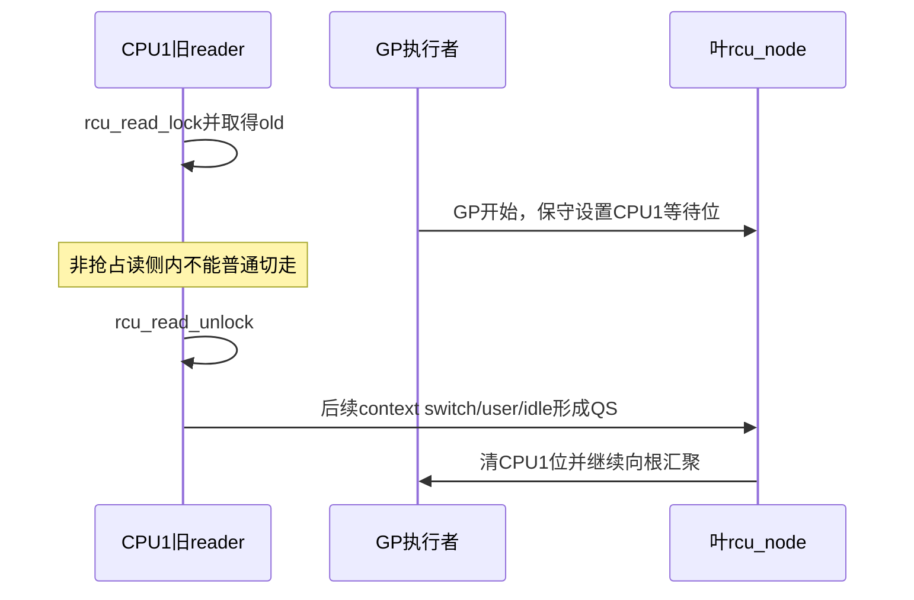
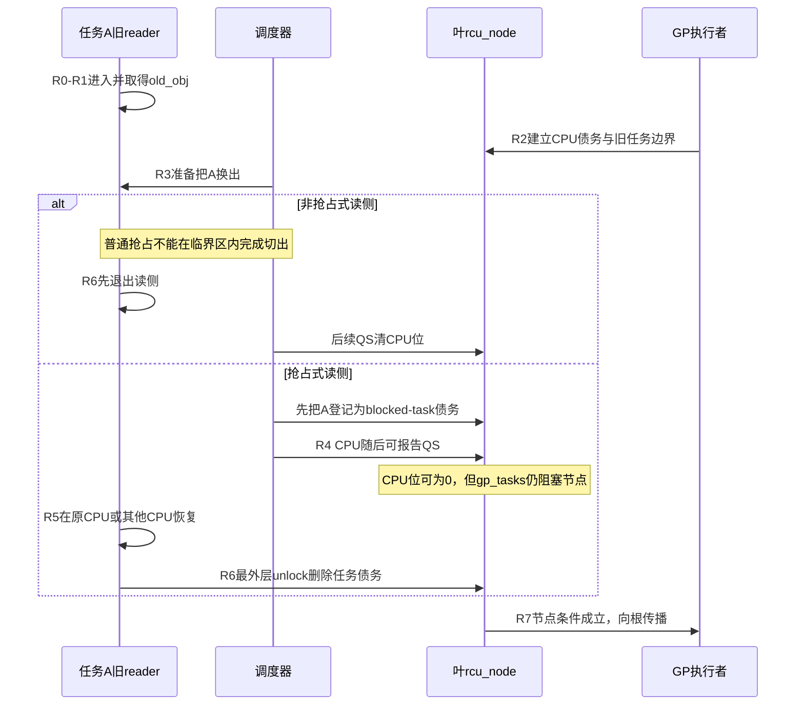

# 第6章\_Tree\_RCU\_读侧执行模型与配置差异

P05 已经建立 Tree RCU 的公共完整周期。本章只放大其中的 **读侧进入/退出、context switch 与节点完成条件**：先说明非抢占式配置为什么可以依赖 CPU QS，再用一个被抢占旧 reader 击穿该证明，最后观察 PREEMPT_RCU 增加的任务债务怎样重新接回公共 `rcu_node` 汇聚链。

这是一组模块内部差异，不是两套完整 RCU 系统。GP 请求、全局代际、callback 队列、同步等待和大部分节点拓扑不会在本章复制。

## 6.1\_共同契约不随配置改变

先固定同一段调用代码：

```c
rcu_read_lock();
obj = rcu_dereference(current_obj);
use(obj);
rcu_read_unlock();
```

无论 `CONFIG_PREEMPT_RCU` 是否启用，调用者依赖的都是同一条保证：只要 `obj` 没有逃出本次读侧，更新者就不能在 reader 退出前回收它。配置改变的是 **内核怎样证明 reader 已退出**，不是让调用者获得两套生命周期语义。

两种配置还共享三个边界：

- 读侧只保护临时访问，不自动把裸指针变成长引用；
- “允许被调度器非自愿抢占”不等于允许主动等待 mutex、I/O 或 completion；
- 晚于 GP 边界才进入的 reader 属于新集合，不需要阻塞旧对象回收。

## 6.2\_非抢占模型为什么可以把任务问题压缩成CPU问题

设 GP 开始时 CPU1 可能处于五种状态：

| CPU1 在 GP 边界处的状态 | 它可能持有旧指针吗 | 哪个后续事件足以排除旧 reader |
| --- | --- | --- |
| 正在普通 RCU 读侧内 | 可能 | 必须等本次读侧退出后才能发生的合法 QS |
| 正在内核态但不在读侧 | 不会因当前执行持有读侧裸指针 | 后续 context switch / user / idle 边界 |
| 已在用户态 | 不观察内核普通 RCU 对象 | 当前或后续 EQS 证据 |
| 已在 idle/EQS | 不观察普通内核 RCU 对象 | watching 快照可形成隐式证据 |
| 已离线 | 不继续执行本轮普通 reader | hotplug 路径清偿当前债务并移出未来集合 |

非抢占式普通读侧的关键不变量是：

> 如果任务在 RCU 读侧内持有旧指针，普通抢占不会把它静默换出；因此该 CPU 在任务退出读侧之前不能经过一个被本轮认可的普通 QS。

更新者不需要记录 CPU1 上每一个 reader 的身份。GP 开始时先保守地给 CPU1 建立一位债务；只要后来观察到 CPU1 的合法 QS，就可反推：在 GP 边界前可能存在的旧 reader 已经结束。



这里的顺序不能反过来。合法 QS 之所以有证明力，正是因为旧 reader 不可能跨过它仍保持读侧临界区。

## 6.3\_一次context\_switch不是永远等价于QS

如果启用可抢占普通 reader，下面时序会击穿上一节的不变量：

```text
T0：任务A在CPU1进入读侧并取得old_obj
T1：高优先级任务B抢占A，CPU1发生context switch
T2：CPU1运行B以及其他任务
T3：任务A以后甚至可能在CPU2恢复
T4：A才执行最外层rcu_read_unlock()
```

若系统仅凭 T1 的 CPU context switch 清除 CPU1 债务，GP 可能在 T2～T3 之间完成并释放 `old_obj`，而任务 A 手里仍保存旧地址。这不是“QS 定义写错一点”，而是 **状态所有权发生了变化**：证明债务不再只属于 CPU1，已经跟随被换出的任务 A。

因此抢占式实现必须新增三件事：

1. 任务本地状态：A 是否位于最外层普通 RCU 读侧；
2. 共享登记位置：A 被换出后，这笔债务存在哪个叶 `rcu_node`；
3. 清债路径：A 在任意 CPU 恢复并退出时，怎样找到原登记节点并恢复节点传播。

## 6.4\_配置差异矩阵

| 比较项 | `!CONFIG_PREEMPT_RCU` | `CONFIG_PREEMPT_RCU` |
| --- | --- | --- |
| 临界区内普通抢占 | 被读侧包装阻止 | 允许非自愿抢占 |
| 高频进入/退出状态 | 不需要维护共享 reader 身份 | 维护当前任务读侧嵌套与特殊退出状态 |
| context switch 的前置动作 | 可直接按非抢占不变量判断 QS | 若切出旧 reader，先转移任务债务 |
| 任务债务地址 | 不存在 | `task_struct` 字段 + 叶节点 `blkd_tasks/gp_tasks` 边界 |
| CPU 债务 | 叶 `qsmask` 对应位 | 同样存在，可先于任务债务清除 |
| 节点完成条件 | `qsmask == 0` | `qsmask == 0` 且本轮旧任务集合为空 |
| 最外层 unlock | 结束临界区，之后 CPU 可报告 QS | 必要时从登记节点移除任务并恢复向上传播 |
| GP/callback/等待主线 | 公共 | 公共 |

这张表解释了为什么不能按配置复制完整系统：真正不同的行集中在 reader、调度钩子和节点完成条件，其余模块沿 P05 的公共出口继续运行。

## 6.5\_抢占分支的状态保存在哪里

Linux 6.12.20 的抢占式 Tree RCU 主要使用下面三层状态：

| 状态 | 所有者 / 地址 | 主要写入事件 | 后续读取者 |
| --- | --- | --- | --- |
| 读侧嵌套 | 当前 `task_struct` 的 RCU 读侧字段 | 进入、嵌套进入、退出 | 调度钩子和最外层 unlock |
| 登记节点与链表位置 | 当前任务字段 + `rcu_node.blkd_tasks` | 任务在读侧内被换出 | GP 初始化、节点完成检查、unlock 清债 |
| 本轮旧任务边界 | `rcu_node.gp_tasks` 等边界指针 | GP 开始或任务入队决策 | CPU 报告和根完成判断 |

共享链表并不是“所有正在读的任务表”。只有在临界区内失去 CPU 所有权、无法再由 CPU QS 单独代表的任务，才需要进入共享登记。未被抢占的短 reader 仍可在本 CPU 上快速完成。

任务迁移也不会丢债务，因为清债依据的是任务保存的登记节点，而不是假设 `rcu_read_unlock()` 必须在原 CPU 执行：

```text
CPU1上被抢占
    → 任务A记录原叶节点N1并进入N1.blkd_tasks
    → A迁移到CPU2恢复
    → 最外层unlock读取A保存的N1
    → 在N1锁保护下删除A并检查gp_tasks边界
    → 若CPU位也已清空，继续向父节点传播
```

## 6.6\_一组统一阶段怎样覆盖两种配置

| 阶段 | 公共动作 | 非抢占分支 | 抢占分支 |
| --- | --- | --- | --- |
| R0 进入 | reader 建立临界区边界 | 禁止普通抢占 | 增加任务嵌套状态 |
| R1 取得 | `rcu_dereference()` 取得当前对象 | 相同 | 相同 |
| R2 GP开始 | 节点为参与 CPU 建立债务 | 只需 CPU 位 | 还要划定本轮旧 blocked-task 边界 |
| R3 发生调度 | 当前任务离开 CPU | 读侧内不会走普通抢占切出 | 若为旧 reader，先登记任务债务 |
| R4 CPU报告 | CPU 跨过 QS | 可清 CPU 位并决定节点完成 | 只清 CPU 位；任务债务可能仍在 |
| R5 reader恢复 | 原任务继续执行 | 无跨 CPU 任务债务 | 可在任意 CPU 恢复，登记仍归原叶节点 |
| R6 最外层退出 | reader 不再使用旧指针 | 之后的 QS 完成证明 | 清任务债务，必要时恢复节点传播 |
| R7 接回公共出口 | 节点条件成立 | 向根传播 | CPU 位和旧任务集合都为空后向根传播 |

两种配置最终都交给 P10 的树形汇聚和 P08 的全局 GP 完成逻辑。差异止于 R7，不会再生出一条独立 callback 链。

## 6.7\_端到端对比时序



图中的关键不是“是否发生 context switch”，而是 context switch 前后谁拥有旧 reader 债务。非抢占分支阻止所有权转移；抢占分支显式记录并在 unlock 时交还。

## 6.8\_CPU\_QS与任务清债不能互相替代

在抢占式配置下，两个条件是正交的：

```text
CPU位仍为1，任务债务为空
    → 仍需该CPU提供QS

CPU位已为0，gp_tasks仍非空
    → CPU已经跨界，但被抢占旧reader仍未退出

CPU位为0，gp_tasks也为空
    → 该叶节点才可能向父节点报告完成
```

这也解释一个常见日志误读：看到某 CPU 已发生多次切换，不等于被抢占 reader 已退出；看到任务已经 unlock，也不等于同一节点上的所有 CPU 位都清空。诊断必须同时观察两组状态。

## 6.9\_主动睡眠为什么仍不属于普通读侧契约

PREEMPT_RCU 解决的是调度器在任意点 **非自愿** 换出 reader 后如何保留债务。它没有把普通 RCU 读侧改造成可任意阻塞的私有域协议。

主动调用可能睡眠的操作会引入额外问题：

- reader 自己把临界区拉长，可能造成不可控 GP 延迟；
- 调用上下文和 lockdep 契约可能直接不允许该阻塞；
- 普通 RCU 没有按子系统私有域隔离这类长 reader；
- 维护者无法仅凭“内核支持抢占”推断任意等待都安全。

若业务语义确实要求读侧等待 mutex、I/O 或其他阻塞操作，应先审查 P18 的 SRCU 私有域，而不是把“可抢占”翻译成“可睡眠”。

## 6.10\_源码证据只展开差异点

稳定模型映射到 Linux 6.12.20 时，先从 [RCU 公共接口与读侧模型模块源码概念导读](../../../../../research/source_reading/rcu/navigation/P02_Linux_6.12_RCU公共接口与读侧模型模块源码概念导读.md#2.1_模块问题与配置边界)建立文件和状态位置，再按具体问题进入唯一实现：

| 要核对的问题 | 版本化位置 | 唯一实现讲解 |
| --- | --- | --- |
| 非抢占配置怎样把调度事件转成 CPU QS | `kernel/rcu/tree_plugin.h`、`tree.c` | [Tree RCU CPU QS 与节点上报关键函数](../../../../../research/source_reading/rcu/source_explanations/P02_Linux_6.12_Tree_RCU_等待桥_QS与节点汇聚关键函数源码实现.md#2.1_实现讲解边界与入口) |
| 读侧嵌套怎样保存在任务中 | `tree_plugin.h`、`include/linux/sched.h` | [Tree RCU 抢占读者债务关键函数](../../../../../research/source_reading/rcu/source_explanations/P03_Linux_6.12_Tree_RCU_抢占读者债务关键函数源码实现.md#3.1_实现讲解边界与入口) |
| context switch 怎样登记 blocked task | `rcu_note_context_switch()` 及其插件分支 | 同上“转移读侧债务”标题 |
| 最外层 unlock 怎样删除任务并恢复传播 | `rcu_read_unlock_special()` 等路径 | 同上“最外层退出”标题 |

知识正文只解释为什么需要这些差异、状态如何交接；实现文档才展开具体宏体和函数体。这样既能在本章闭合概念，也不会把同一版本源码复制成两套完整系统。

## 6.11\_实验与结论一一配对

[晚到读者与抢占读者的对象回收实验](../../../../../labs/kernel/rcu/P01_晚到读者与抢占读者/README.md#1.1_实验要回答的两个问题)同时验证两个容易混淆、但证明对象不同的结论：

| 实验场景 | 控制变量 | 预期观察 | 能支持的结论 | 不能推出的结论 |
| --- | --- | --- | --- | --- |
| 晚到 reader | 任务已创建，但在旧对象释放后才进入读侧 | 只取得新代际 | “任务存在”不等于属于旧 reader 集合 | 不能证明抢占任务债务 |
| 被抢占旧 reader | 先取得旧对象，再被同 CPU FIFO 任务非自愿抢占 | GP 等到最外层 unlock 后返回 | CPU context switch 不能越过未清任务债务 | 不能把耗时当固定 RCU 延迟契约 |

实验要求 `CONFIG_TREE_RCU=y`、`CONFIG_PREEMPT_RCU=y` 和至少两个在线 CPU 才能运行第二阶段。缺少这些前提时，实验跳过不等于机制结论被否定。

## 6.12\_误读检查与下一问

读完本章应能否定以下说法：

- “非抢占式 RCU 和 Tree RCU 是同义词”；
- “抢占式 RCU 另有一整套 GP、callback 和 barrier”；
- “看到 context switch 就能清除一切旧 reader”；
- “被抢占任务迁移后，原叶节点一定找不到它”；
- “PREEMPT_RCU 表示普通读侧可以主动睡眠”。

本章解释了 reader 债务怎样产生和转移，但尚未说明整棵 `rcu_node` 拓扑何时建立、`rcu_data` 怎样绑定叶节点，以及 GP kthread、core、softirq、`rcuc` 分别在哪些执行上下文工作。下一章先把这些角色和地址摆稳。

上一篇：[Tree RCU 公共骨架与完整周期](P05_Tree_RCU_公共骨架与完整周期.md)。

下一篇：[Tree RCU 初始化、拓扑与执行上下文](P07_Tree_RCU_初始化_拓扑与执行上下文.md)。
