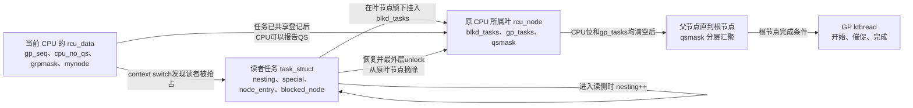
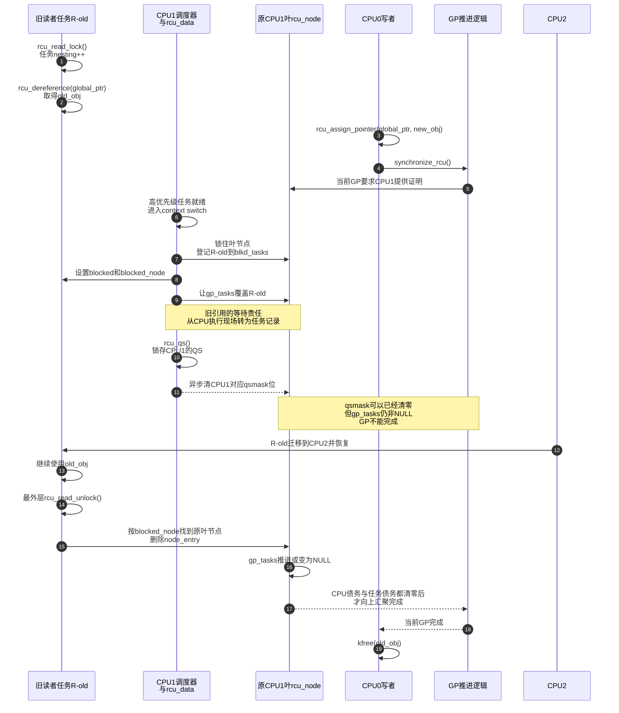

# 第7章\_抢占式\_Tree\_RCU\_问题与任务跟踪模型

## 7.1\_先制造非抢占模型无法解释的现场

仍使用[第 5 章已经限定的普通 Tree RCU 现场](P05_非抢占式_Tree_RCU_问题与证明模型.md#5.1.2_再固定本章要证明的现场)，但这次内核启用了 `CONFIG_PREEMPT_RCU=y`。这不是换成另一种底层实现家族，而是在 Tree RCU 中切换普通 reader 的运行方式；两层关系统一见 [RCU 实现家族与内核配置](P22_RCU_实现家族与内核配置.md#22.2_三个正交维度)。CPU1 上的普通优先级任务 `R-old` 已经取得 `old_obj`，还没执行 `rcu_read_unlock()`；此时一个更高优先级任务被唤醒，调度器把 `R-old` 换出。`R-old` 甚至可能稍后迁移到 CPU2 才继续运行。

```c
static int old_reader_fn(void *unused)
{
	struct demo_obj *obj;
	unsigned long checksum = 0;

	rcu_read_lock();
	obj = rcu_dereference(demo_current);
	complete(&reader_has_old_pointer);

	/*
	 * 这里只做计算，不主动 schedule()，但抢占式内核仍可在这里
	 * 因高优先级任务就绪而把当前任务换出。
	 */
	while (!atomic_read(&allow_reader_exit)) {
		checksum ^= READ_ONCE(obj->value);
		cpu_relax();
	}

	rcu_read_unlock();
	pr_info("old reader checksum=%lu\n", checksum);
	return 0;
}
```

CPU0 上的写者与高优先级干扰任务形成如下交错：

```c
wait_for_completion(&reader_has_old_pointer);

old_obj = rcu_replace_pointer(demo_current, new_obj, true);

/* 测试编排器让 CPU1 上的高优先级任务就绪，R-old 被换出。 */
wake_up_process(high_priority_disturber);

/* 此处必须等到 R-old 恢复并退出最外层读侧。 */
synchronize_rcu();
kfree(old_obj);
```

这段代码只把关键竞争写出来；高优先级、CPU 绑定和 trace 的完整方法见[晚到读者与抢占读者的对象回收实验](../../../../../labs/kernel/rcu/P01_晚到读者与抢占读者/README.md)。生产代码不应为了等待某个条件，在 RCU 读侧内无限自旋。

若仍沿用非抢占式证明：

```text
CPU1发生上下文切换
    → CPU1已经经过QS
    → 清除CPU1等待位
    → GP可以结束
```

就会得出错误结论。上下文切换只能证明 **CPU1 当前不再执行那个旧读者**，不能证明 **被换出的任务已经停止持有 `old_obj`**。任务的地址引用跟着 `task_struct` 存活，不会因 CPU 换了当前任务而消失。

## 7.2\_抢占式模型增加的是第二类债务

非抢占模型只需要追踪 CPU 证据：

```text
CPU债务：这个CPU是否已经为当前GP提供QS
```

抢占模型必须同时追踪两类正交状态：

```text
CPU债务：这个CPU是否已经提供QS
任务债务：这个被抢占任务是否仍在旧读侧临界区内
```

二者不能合并成一个布尔值：

| 现场 | CPU 债务 | 任务债务 | GP 能否据此完成 |
| --- | --- | --- | --- |
| 旧读者仍在 CPU1 上运行 | 仍欠 | 尚未转为共享任务记录 | 不能 |
| 旧读者在 context switch 时被登记 | CPU1 随后可清债 | `R-old` 仍欠 | 不能 |
| CPU1 已报告，`R-old` 尚未恢复 | 已清 | 仍欠 | 不能 |
| `R-old` 最外层 unlock | 已清 | 清除 | 若其他债务也清零则可以 |

抢占式 Tree RCU 的关键变化不是“等待更多 CPU”，而是：**当对象引用的状态归属从正在运行的 CPU 转移到被挂起任务时，也把 RCU 的等待证据从 CPU 本地状态转移到共享的任务记录。**

## 7.3\_三个角色以及状态保存位置



状态所有权必须分清：

| 状态 | 所在位置 | 主要写入者 | 证明的事实 |
| --- | --- | --- | --- |
| 读侧嵌套深度 | `task_struct.rcu_read_lock_nesting` | 当前读者任务 | 任务是否仍处在一个或多层读侧内 |
| 需要特殊退出 | `task_struct.rcu_read_unlock_special` | 调度路径、RCU 慢路径、读者退出路径 | 最外层 unlock 不能只减计数，还需清共享登记或报告延迟 QS |
| 任务链表节点 | `task_struct.rcu_node_entry` | 调度路径加入，最终退出路径删除 | 任务已从 CPU 本地执行现场转为共享跟踪对象 |
| 原叶节点地址 | `task_struct.rcu_blocked_node` | 抢占登记和退出清理路径 | 任务迁移后仍能找到最初登记的叶节点 |
| 被抢占任务集合 | `rcu_node.blkd_tasks` | 各 CPU 调度路径与任务退出路径，受 `rnp->lock` 保护 | 此叶节点上存在在读侧内被换出的任务 |
| 当前普通 GP 的任务边界 | `rcu_node.gp_tasks` | GP 初始化、抢占入队、退出路径 | 从该指针起哪些链表项会阻塞当前普通 GP |
| CPU/子节点债务 | `rcu_node.qsmask` | GP 初始化置位，QS 汇聚路径清位 | CPU 或下级节点是否还欠当前 GP 证据 |

`blkd_tasks` 不能简单等同于“当前 GP 的旧读者”。链表里可能还有当前 GP 开始以后才形成的被抢占读者；`gp_tasks` 才给出当前普通 GP 应等待的边界。

## 7.4\_状态归属转移必须先于CPU报告

被抢占旧读者的安全链必须保持这个顺序：

```text
R-old仍在读侧
    ↓
调度器进入context switch
    ↓
把R-old登记到叶rcu_node.blkd_tasks
并让gp_tasks覆盖它
    ↓
此后才允许原CPU记录QS
```

如果顺序反过来，存在如下漏洞：

```text
CPU位先被清除
    ↓
树误以为该分支没有旧读者
    ↓
任务记录尚未对GP可见
    ↓
GP可能结束并释放old_obj
```

所以抢占式实现的调度钩子不是附加统计，而是完成 **本地状态到共享状态的原子性交接**：在关中断并持有叶节点锁的路径中先登记任务，再让 CPU 进入 QS 证明路径。

## 7.5\_完整双CPU加迁移时序



这里最容易忽略的是迁移：任务在 CPU2 上退出，却必须操作它在 CPU1 叶节点上留下的记录。`rcu_blocked_node` 保存的正是这个地址；不能用“退出时所在 CPU 的 `mynode`”代替。

## 7.6\_GP开始瞬间的六种状态

### 7.6.1\_CPU正在运行旧读者且尚未被抢占

旧引用仍由 CPU 执行现场承载。该 CPU 尚欠 QS；若读者不被抢占，就在读者结束后通过后续合法 QS 完成证明。若随后被抢占，则在调度钩子中把债务转为任务记录。

### 7.6.2\_旧读者在GP以前已被抢占

任务已经位于某个叶节点的 `blkd_tasks`。GP 初始化扫描节点时，必须把本轮 `gp_tasks` 指向应等待的旧链表边界。即使原 CPU 在 GP 开始时正运行完全无关的任务，也不能漏掉这个挂起旧读者。

### 7.6.3\_旧读者在GP进行期间才被抢占

若该 CPU 的 `qsmask` 位仍表示欠本轮 GP，`rcu_preempt_ctxt_queue()` 会把该任务插入会阻塞当前 GP 的区间，并在需要时建立 `gp_tasks`。任务登记完成后，CPU 才能报告 QS。

### 7.6.4\_CPU已报告QS但旧任务仍挂起

这是抢占模型最有辨识度的状态：

```text
leaf.qsmask中CPU位 = 0
leaf.gp_tasks != NULL
```

它不是矛盾。前者说明 CPU 执行现场不再欠证据，后者说明从该 CPU 执行现场转移出去的任务仍持有旧引用。

### 7.6.5\_读者任务已经排队但从未读取旧入口

它和非抢占模型一样不属于旧读者。若在写者切断入口以后才执行 `rcu_dereference()`，只能得到新对象或 `NULL`。即使它后来又在新读侧内被抢占，也不能反向变成当前 GP 必须等待的旧读者。

实现上，任务可以出现在 `blkd_tasks` 中但位于当前 `gp_tasks` 等待边界之前；这也是不能把整个链表粗暴解释为“当前 GP 的读者集合”的原因。

### 7.6.6\_CPU已经在用户态\_idle或offline

普通内核 RCU 读者不能在用户态或 extended quiescent state 中继续执行。context tracking / watching 证据可以处理 CPU 债务；但若此前已有读侧任务被抢占并登记在节点中，EQS 只能清 CPU 这一维，不能替任务清债。

## 7.7\_为什么未来读者不会让GP永远结束不了

写者先切断共享入口：

```c
old_obj = rcu_replace_pointer(global_ptr, new_obj, lockdep_is_held(&update_lock));
```

于是当前 GP 只需覆盖这个时间边界以前可能取得 `old_obj` 的读侧。GP 开始以后，新读者仍会不断到来，也可能被抢占，但它们读取的是 `new_obj`，不能自动加入当前 GP 的旧读者集合。

这要求 `blkd_tasks` 同时表达“所有当前被抢占读者”和“当前 GP 真正等待的后缀”。Linux 通过有序插入和 `gp_tasks` 指针保存这条代际边界，而不是每来一个新任务就延长当前 GP。

## 7.8\_PREEMPT\_RCU不等于读侧可以主动睡眠

`PREEMPT_RCU` 解决的是内核抢占造成的被动换出：调度器知道正在换出谁，能够在切换点完成任务登记。它不把下面的代码变成通用合法用法：

```c
rcu_read_lock();
obj = rcu_dereference(global_ptr);

/* 错误示例：普通 RCU 读侧内主动阻塞。 */
wait_event_interruptible(waitq, condition);

use_obj(obj);
rcu_read_unlock();
```

在 6.12.20 的 `rcu_note_context_switch(bool preempt)` 中，`!preempt && rcu_preempt_depth() > 0` 会触发“Voluntary context switch within RCU read-side critical section”警告。能被内核抢占与调用者主动睡眠是两份契约。

`PREEMPT_RT` 下某些传统自旋锁可能转换为可睡眠锁，RCU 与 RT 锁的组合需要按该锁原语的专门契约分析，不能从“PREEMPT_RCU 会跟踪任务”推导出任意阻塞都安全。

## 7.9\_读侧退出不是每次都操作共享树

抢占式读侧的常见快路径是：

```text
lock：当前任务nesting++
unlock：当前任务nesting--
```

只有任务在读侧内发生过抢占登记，或有严格 GP、加速 GP 等特殊请求时，最外层 unlock 才进入特殊路径，触碰叶节点共享状态。因此它的设计取舍是：

| 方案 | 高频读侧成本 | 发生抢占时的成本 | GP 可能受什么拖延 |
| --- | --- | --- | --- |
| 非抢占式 Tree RCU | 禁止/恢复抢占 | 无任务登记 | 长读侧推迟调度和 GP QS |
| 抢占式 Tree RCU | 每任务 nesting 与少量编译器约束 | 叶节点加锁、链表登记、特殊退出 | 被换出的低优先级读者可能长时间阻塞 GP |

抢占式实现改善了调度延迟，却让 GP 活性开始依赖具体任务何时再次运行。启用 `CONFIG_RCU_BOOST` 时，内核还可对阻塞 GP 的读者做优先级提升；这属于活性补救，不改变“证据不足就不能释放”的安全规则。

## 7.10\_对象生命周期仍由发布者完成闭环

任务跟踪只回答一个问题：旧读侧是否都已经结束。它不扫描任意对象地址，也不替发布者发现被带出读侧的裸指针。

```c
rcu_read_lock();
saved = rcu_dereference(global_ptr);
rcu_read_unlock();

/* 即使 PREEMPT_RCU 能跟踪被抢占任务，这里仍然没有 RCU 保护。 */
queue_work(system_wq, &work_using_saved);
```

需要把对象带出临界区时，仍应在读侧内用 `kref_get_unless_zero()` / `refcount_inc_not_zero()` 取得独立生命期，或者转移所有权。组合方法见[RCU、kref 与复合对象生命周期](P04_RCU_kref与复合对象生命周期.md)。

## 7.11\_安全性与活性结论

安全性条件是：

```text
入口更新以前可能取得old_obj的读侧
    = 仍由CPU承载的旧读侧
    + 已经转为共享登记的被抢占旧任务

两类债务全部清零
    → GP才可完成
    → old_obj才可释放
```

活性风险是：若一个已登记任务长期得不到调度、永不执行最外层 unlock，或在读侧内错误地永久阻塞，`gp_tasks` 就可能长期非空。RCU 可以催促、报告 stall，配置允许时还可以 boost；它不会因为超时就丢弃这条任务债务并猜测对象安全。

下一章把这个证明模型逐项映射到 Linux 6.12.20 的 `task_struct`、`rcu_data`、`rcu_node` 与调度源码。

上一篇：[非抢占式 Tree RCU 源码同步机制](P06_非抢占式_Tree_RCU_源码同步机制.md)。

下一篇：[抢占式 Tree RCU 源码同步机制](P08_抢占式_Tree_RCU_源码同步机制.md)。
