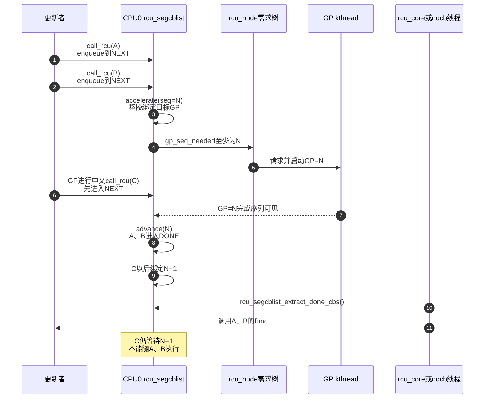

# 第11章\_Tree\_RCU\_rcu\_segcblist回调状态机

## 11.1\_场景\_三个callback对应哪一轮GP

CPU0 在不同时间登记三个旧对象：

```c
call_rcu(&obj_a->rcu, free_obj_rcu); /* GP=N开始以前 */
call_rcu(&obj_b->rcu, free_obj_rcu); /* GP=N进行期间，仍可能由N覆盖 */
call_rcu(&obj_c->rcu, free_obj_rcu); /* 太晚，只能等N+1 */
```

`call_rcu()` 必须很快返回，不能为每个对象创建线程、completion 和独立队列；但以后又必须知道：

```text
A是否已经过目标GP
B是否已经绑定目标GP
C是否还没分配代际
哪些callback已经安全但尚未执行
```

`rcu_segcblist` 用 **一条链表 + 四个边界 + 少量目标序列** 表达这些关系。

## 11.2\_四段不是四条链表

`include/linux/rcu_segcblist.h` 定义：

```text
[head, *tails[DONE])                 DONE
[*tails[DONE], *tails[WAIT])         WAIT
[*tails[WAIT], *tails[NEXT_READY])   NEXT_READY
[*tails[NEXT_READY], *tails[NEXT])   NEXT
```


`tails[]` 保存的是指向各段末尾 `next` 槽的指针，因此空段可以让相邻多个 tail 指向同一个位置；没有空的哨兵节点，也不需要四份链表头。

`gp_seq[]` 对 WAIT/NEXT_READY 等非空段记录目标 GP。DONE 已经安全，NEXT 尚未分配，所以不需要有效目标序列。

## 11.3\_对象和状态所有权

```c
struct demo_obj {
	struct rcu_head rcu;
	/* 其他业务字段。 */
};

static void free_obj_rcu(struct rcu_head *head)
{
	struct demo_obj *obj = container_of(head, struct demo_obj, rcu);
	kfree(obj);
}
```

| 对象 | 保存位置 | 谁写 | 谁消费 |
| --- | --- | --- | --- |
| callback函数 | `rcu_head.func` | `call_rcu()` | `rcu_do_batch()` |
| 链表链接 | `rcu_head.next` | enqueue/分段操作 | callback提取和执行 |
| 分段边界 | `rcu_data.cblist.tails[]` | 本CPU或NOCB锁保护路径 | 加速、推进、提取、barrier |
| 目标代际 | `cblist.gp_seq[]` | accelerate | advance与GP需求路径 |
| 总数/分段数 | `len/seglen` | enqueue、移动、执行 | 过载、barrier、诊断 |

同一个 `rcu_head` 在 callback 完成前不得再次 `call_rcu()`；开启 `CONFIG_DEBUG_OBJECTS_RCU_HEAD` 可帮助发现重复入队。

## 11.4\_S0到S5\_回调状态推进

| 阶段 | 函数 | 回调所在段 | 已知事实 | 下一步 |
| --- | --- | --- | --- | --- |
| S0 登记 | `rcu_segcblist_enqueue()` | NEXT | 只知道需要未来GP | 请求/加速代际 |
| S1 分配 | `rcu_segcblist_accelerate()` | WAIT或NEXT_READY | 已绑定某个 `gp_seq` | 等GP推进 |
| S2 GP进行 | 无需移动每个节点 | WAIT/NEXT_READY | 目标GP尚未完成 | 保持边界 |
| S3 GP完成观察 | `rcu_segcblist_advance(completed_seq)` | DONE | 目标序列已完成 | 等执行上下文 |
| S4 提取 | `rcu_segcblist_extract_done_cbs()` | 临时 `rcu_cblist` | 已从共享分段取出 | 批量调用func |
| S5 剩余回插 | `rcu_segcblist_insert_done_cbs()` | DONE头部 | 批次因限流未执行完 | 下次core继续 |

这不是每个 callback 自己更新状态字段。移动 `tails[]` 边界就能让一整段 callback 同时换阶段。

## 11.5\_enqueue为什么总进NEXT

`rcu_segcblist_enqueue(rsclp, rhp)` 的核心动作是：

```c
rcu_segcblist_inc_len(rsclp);
rcu_segcblist_inc_seglen(rsclp, RCU_NEXT_TAIL);
WRITE_ONCE(*rsclp->tails[RCU_NEXT_TAIL], rhp);
WRITE_ONCE(rsclp->tails[RCU_NEXT_TAIL], &rhp->next);
```

入队时通常不能在无锁快速路径中完整判断当前 GP 是否已经开始到足以覆盖该 callback 的边界。因此先放 NEXT；后续 acceleration 在合适锁/中断状态下统一分配代际。

这也说明 `call_rcu()` 返回时的精确结论只有：callback 已被 RCU 管线接管。它未必已经请求完 GP，更没有执行。

## 11.6\_accelerate怎样绑定目标GP

`rcu_segcblist_accelerate(rsclp, seq)` 把尚未分配的尾部 callback 绑定到 `seq` 或更合适的后续 GP，并整理 WAIT/NEXT_READY 段边界。

调用者再通过 `rcu_segcblist_nextgp()` 取得最近需要的 GP，沿 `rcu_node.gp_seq_needed` 向根提出需求。多个 callback 可以共享同一 `gp_seq` 段，无需每项存一个序列字段。

若已有段等待更早 GP，新 callback 不能插到它前面破坏 FIFO；若目标序列可合并，tail 边界可以合并而不遍历每个 `rcu_head`。

## 11.7\_advance为何可能一次推进多段

本 CPU 感知全局完成序列后调用 `rcu_segcblist_advance(rsclp, seq)`。它从 WAIT 开始检查：凡目标 `gp_seq` 已被 `seq` 覆盖的连续段，都把其尾边界并入 DONE；随后填补可能出现的空 WAIT 段。

例子：

```text
推进前：DONE=[] | WAIT=[A,B]@N | NEXT_READY=[C]@N+1 | NEXT=[D]
观察完成N：DONE=[A,B] | WAIT=[C]@N+1 | NEXT_READY=[] | NEXT=[D]
观察完成N+1：DONE=[A,B,C] | WAIT=[] | NEXT_READY=[] | NEXT=[D]
```

`D` 仍在 NEXT，因为“全局某轮已完成”不能反向覆盖一个在其边界以后才登记且尚未分配的 callback。

## 11.8\_完整回调代际时序



## 11.9\_entrain为何服务rcu\_barrier

`rcu_segcblist_entrain()` 把一个 barrier callback 放到当前 cblist **所有既有 callback 之后的最后非空等待位置**。当这个 barrier callback 被调用，同一 CPU 队列中在它以前的 callback 必然已经调用。

它不是普通 enqueue 的别名：barrier 需要保持“尾随既有队列”的逻辑，即使当前 callback 分散在 DONE、WAIT、NEXT_READY 或 NEXT。P20 会把每 CPU entrain 汇聚为全局 barrier 完成。

## 11.10\_迁移与合并为什么必须保留段语义

CPU offline 时不能把源链表所有节点粗暴追加到目标 NEXT：其中一些 callback 可能已经 DONE，另一些在等不同 GP。`rcu_segcblist_merge(dst, src)` 分别提取 DONE 与 pending 部分，再插入目标相应位置，保留“已安全”和“仍等待”的边界。

## 11.11\_不变量与常见误读

1. DONE 表示可执行，不表示已经执行。
2. WAIT 的 callback 已绑定目标 GP；NEXT 尚未绑定。
3. 四个 tail 可以重合，重合表示空段，不是链表损坏。
4. callback 顺序必须保持，barrier 和对象协议可能依赖先后。
5. 长度计数服务过载、barrier 与诊断，不能凭一个总数判断全部 callback 都在同阶段。
6. `call_rcu()` 只登记动作，不保证当前或下一固定物理 GP。

## 11.12\_源码与trace入口

版本化模块先进入 [回调与 NOCB 模块源码概念导读](../../../../../research/source_reading/rcu/navigation/P07_Linux_6.12_Tree_RCU_回调与NOCB模块源码概念导读.md#7.1_GP完成为什么还不等于callback执行)。实现直达入口为：

- [`call_rcu()` 与每 CPU queue 所有权交接](../../../../../research/source_reading/rcu/source_explanations/P09_Linux_6.12_Tree_RCU_回调与NOCB源码实现.md#9.4_call_rcu怎样把所有权交给每CPU队列)；
- [`rcu_segcblist_accelerate/advance()` 与 Tree RCU GP 连接](../../../../../research/source_reading/rcu/source_explanations/P09_Linux_6.12_Tree_RCU_回调与NOCB源码实现.md#9.5_accelerate与advance怎样连接callback和GP)；
- 普通 GP 怎样在 cleanup 先发布节点完成代际、再结束全局序列，见 [`rcu_gp_cleanup()`](../../../../../research/source_reading/rcu/source_explanations/P05_Linux_6.12_Tree_RCU_GP全局生命周期源码实现.md#5.11_rcu_gp_cleanup发布完成并承接下一代)；本章从该完成值继续解释 callback 进入 DONE；
- DONE 抽取、回插与执行见 [`rcu_do_batch()`](../../../../../research/source_reading/rcu/source_explanations/P09_Linux_6.12_Tree_RCU_回调与NOCB源码实现.md#9.6_rcu_do_batch为何先抽取再锁外执行)；
- `entrain()` 的 barrier 语义见 [P10 哨兵证明](../../../../../research/source_reading/rcu/source_explanations/P10_Linux_6.12_Tree_RCU_同步等待与rcu_barrier源码实现.md#10.6_barrier_callback与entrain如何证明队列前序已执行)，`merge()` 的 CPU hotplug 调用点见 [P06 callback 迁移](../../../../../research/source_reading/rcu/source_explanations/P06_Linux_6.12_Tree_RCU_拓扑与CPU热插拔源码实现.md#6.7_rcutree_migrate_callbacks保留callback代际与barrier证明)。

```bash
cd /sys/kernel/tracing
echo 1 | sudo tee events/rcu/rcu_segcb_stats/enable
echo 1 | sudo tee events/rcu/rcu_callback/enable
echo 1 | sudo tee tracing_on
```

上一篇：[Tree RCU rcu_node 树与分层汇聚](P10_Tree_RCU_rcu_node树与分层汇聚.md)。

下一篇：[Tree RCU 回调执行、批处理与限流](P12_Tree_RCU_回调执行_批处理与限流.md)。
