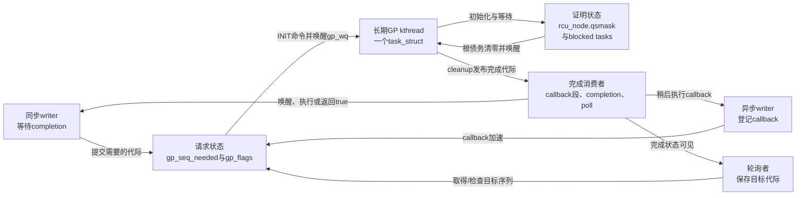
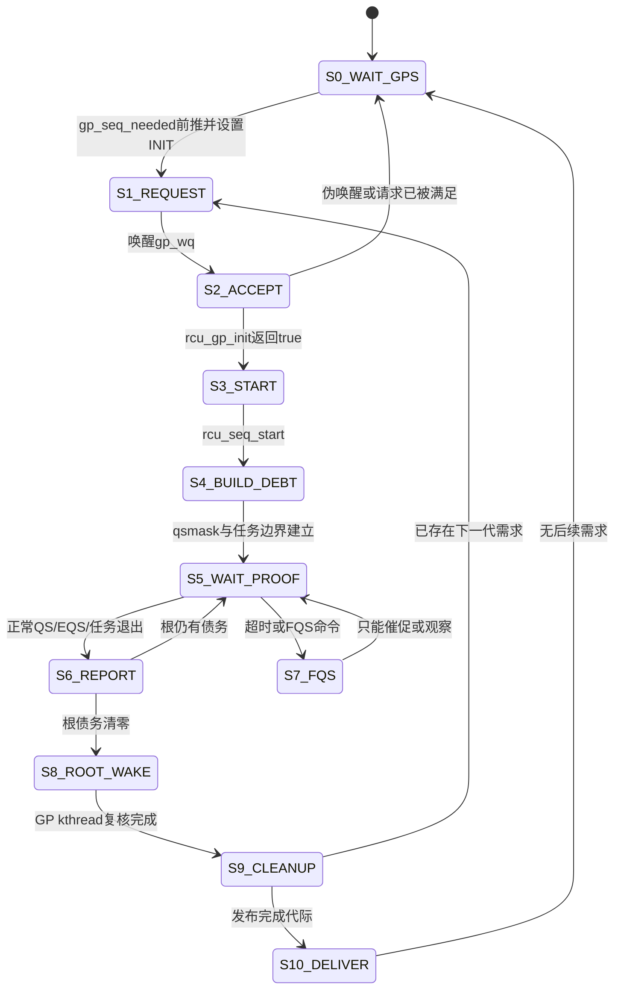
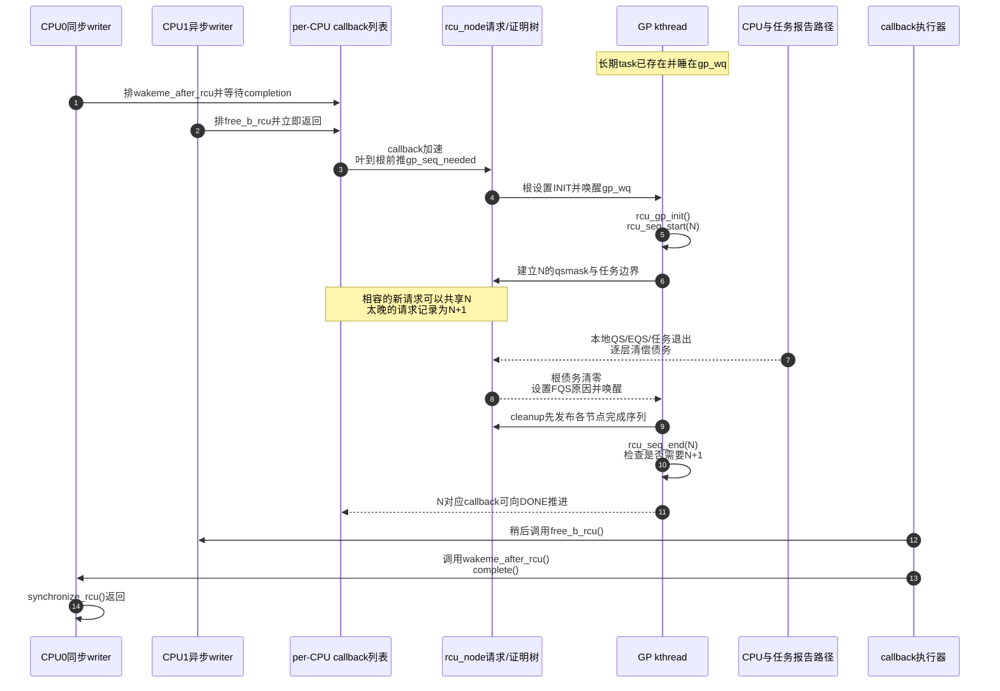

# 第12章\_Tree\_RCU\_GP请求与全局生命周期

## 12.1\_本章先回答GP究竟是什么

`GP` 是 **Grace Period（宽限期）** 的缩写。它首先是一个正确性概念，而不是某个线程、计时器或函数：更新者先在时刻 T 切断旧对象的未来可达入口，随后等待所有 **可能在 T 之前取得旧对象地址** 的 reader 离开受保护访问窗口；从 T 到这项证明成立之间的逻辑区间，就是该 RCU 域的一轮 GP。

抽象 GP 为什么只等待旧 reader、为什么晚到 reader 不属于本轮集合，见 [RCU 抽象机制推演](P02_RCU_抽象机制推演.md#2.6_第四步_定义宽限期要等待的集合)。本章只把这个结论映射到 **普通 Tree RCU** 的全局请求和执行实现。SRCU、Tasks RCU 和 expedited GP 各有不同的 reader 定义或控制路径，不能把本章字段直接套过去；家族边界见 [RCU 实现家族与内核配置](P22_RCU_实现家族与内核配置.md#22.2_三个正交维度)。

先排除四个常见误解：

- GP 不是固定等待若干毫秒；参与者未给出安全证据时，时间过去再久也不能释放对象。
- GP 不是“遍历系统中每一个 reader 对象”；Tree RCU 等待的是 CPU QS/EQS 证据和必要的被抢占任务债务。
- GP 不是 GP kthread；前者是一次逻辑证明周期，后者是反复执行许多物理 GP 的长期内核任务。
- GP 完成不等于所有 callback 已执行；它只让绑定该代际的 callback 获得向可执行状态推进的资格。

## 12.2\_六个必须分开的专有名词

| 名词 | 本章中的精确定义 | 它不是什么 |
| --- | --- | --- |
| GP / 宽限期 | 从旧入口边界封闭到旧 reader 债务全部被证明清偿的逻辑区间 | 固定延时、线程或回调 |
| GP 请求 | 调用者声明“至少需要完成到某个未来代际”的需求 | 一次独占的物理扫描 |
| 物理 GP | Tree RCU 全局状态机实际开始、等待并 cleanup 的一轮执行 | 某个调用者私有的 GP |
| GP 代际 | `gp_seq` 对物理 GP 开始、进行中和完成边界的版本化表达 | 只能表示 true/false 的布尔值 |
| GP kthread | 由调度器调度、长期存在并推进普通 Tree RCU 物理 GP 的内核任务 | 每个 writer 一个线程、callback 执行器或额外 CPU |
| 完成发布 | cleanup 将“这一代证明已成立”公布到全局、节点和完成消费者 | 业务对象已经由 callback 实际释放 |

源码字段名是 `rcu_state.gp_kthread`，线程入口函数是 `rcu_gp_kthread()`。一些讨论会把它简称为 `gp_thread` 或“GP 线程”；本专题统一写 **GP kthread**，避免把非正式简称误认成另一个源码对象。

“请求”和“物理 GP”必须分开。三个调用者可以提出三个逻辑需求，但只要同一轮物理 GP 的时间边界足以覆盖它们，它们就共享这一轮：

```c
/* CPU0：同步等待。 */
old_a = rcu_replace_pointer(ptr_a, new_a, true);
synchronize_rcu();
kfree(old_a);

/* CPU1：异步退休。 */
old_b = rcu_replace_pointer(ptr_b, new_b, true);
call_rcu(&old_b->rcu, free_b_rcu);

/* CPU2：取得一个将来可检查的目标代际。 */
cookie = get_state_synchronize_rcu();
do_other_work();
cond_synchronize_rcu(cookie);
```

## 12.3\_为什么需要一个长期存在的GP内核线程

普通 GP 要完成三类可能睡眠或持续很久的工作：建立本轮参与集合、等待分散 CPU/任务证据、把完成代际按顺序发布到整棵树。若让每个请求者自己执行，就会出现多个 CPU 同时初始化同一全局代际、请求者长时间占据业务调用栈、不同 cleanup 互相越过等问题。

Tree RCU 因而把这部分 **控制面** 串行交给一个长期内核任务：

1. `rcu_spawn_gp_kthread()` 在初始化阶段调用 `kthread_create()` 创建一个 `task_struct`；
2. 该任务的入口是 `rcu_gp_kthread()`，指针发布到 `rcu_state.gp_kthread`；
3. 没有请求时，它睡在 `rcu_state.gp_wq`；
4. 请求者写入命令状态并唤醒它；
5. 它完成一轮 GP 后再次睡眠或继续处理下一代需求。

这里的 kthread 是内核调度实体：它和其他可运行任务一样占用某个 CPU 的执行时间，但 **不是系统多出一颗专用 CPU**，也不固定代表提出请求的 writer。线程只创建一次，不是一轮 GP 创建一次。

“初始化阶段”还要再拆开：`start_kernel()` 较早调用的 `rcu_init()` 先建立拓扑、boot CPU 状态和执行基础设施，并不创建这个长期任务；`rcu_spawn_gp_kthread()` 通过 `early_initcall` 登记，等 `rest_init()` 已建立 `kthreadd` 后，才由 `kernel_init` 的 pre-SMP initcall 分派路径真正调用。稳定正文只保留这条启动边界；Linux 6.12.20 的完整启动调用链见 [GP 模块导读的线程创建阶段](../../../../../research/source_reading/rcu/navigation/P06_Linux_6.12_Tree_RCU_GP全局生命周期模块源码概念导读.md#6.5_线程怎样创建并安全发布)，逐行源码证据见 [从内核启动链定位 `early_initcall`](../../../../../research/source_reading/rcu/source_explanations/P05_Linux_6.12_Tree_RCU_GP全局生命周期源码实现.md#5.5.1_先从内核启动链定位early_initcall) 与 [`rcu_spawn_gp_kthread()` 创建/发布实现](../../../../../research/source_reading/rcu/source_explanations/P05_Linux_6.12_Tree_RCU_GP全局生命周期源码实现.md#5.5.2_rcu_spawn_gp_kthread怎样创建并发布任务)。



## 12.4\_请求执行与交付是三层而不是一条函数链

| 层 | 解决的问题 | 主要状态 | 典型执行者 |
| --- | --- | --- | --- |
| 请求层 | 至少需要完成到哪一代 | `rcu_data/rcu_node.gp_seq_needed`、`rcu_state.gp_flags` | callback 加速路径、同步/轮询调用者 |
| 执行层 | 当前物理 GP 是否开始、还欠什么证据 | `rcu_state.gp_seq/gp_state`、节点 `qsmask`、任务债务 | GP kthread、scheduler/context tracking、各 CPU 的 `rcu_core()` |
| 交付层 | 哪个消费者怎样得到完成结论 | callback 分段、`completion`、poll cookie、直接等待批次 | callback 执行器、等待任务、轮询调用者 |

请求层只保证“系统知道存在一个足够新的 GP 需求”。它不能直接宣布安全。执行层得到根完成条件以后，cleanup 才发布代际；交付层还要把这个代际转换成 callback 可执行、任务唤醒或轮询成功。

## 12.5\_它不是一个状态机而是五组正交状态

只盯着 `gp_state` 会误以为 GP 由一个枚举驱动。实际有五条正交状态轴：

| 状态轴 | 保存地址 | 主要写入者 | 后续读取者 | 表达的事实 |
| --- | --- | --- | --- | --- |
| 请求目标 | `rcu_data/rcu_node.gp_seq_needed` | callback 加速和请求漏斗 | 上层节点、cleanup | 至少还要完成到哪一代 |
| 物理代际 | `rcu_state/rcu_node/rcu_data.gp_seq` | GP kthread、节点同步、本地感知路径 | 请求者、CPU core、callback/poll | 哪一代已开始或完成 |
| 线程命令与观察阶段 | `rcu_state.gp_flags/gp_state/gp_wq` | 请求者、根报告、GP kthread | GP kthread、stall/trace | 线程为什么醒、正在睡在哪个阶段 |
| 安全证明债务 | `rcu_node.qsmask` 与 blocked-task 状态 | GP init 建债；CPU/任务报告清债 | 汇聚路径、FQS 循环 | 本轮还有哪些旧执行现场未被排除 |
| 结果交付 | callback 分段、`completion`、poll/直接等待状态 | cleanup、callback/core 路径 | 原调用者与 callback 执行器 | 谁已经有资格继续 |

这些字段不能互相替代：

- `gp_flags` 是给 GP kthread 的命令/唤醒条件，不是 GP 已完成的证明；
- `gp_state` 是阶段观察和诊断值，不是安全债务；
- `gp_wq` 是 GP kthread 自己等待请求或 FQS 时机的等待队列，不是所有 `synchronize_rcu()` 调用者共同睡眠的位置；
- `gp_seq_needed` 表示目标，不表示该目标已经开始；
- 根 `qsmask==0` 在抢占配置的单节点树上还要结合 blocked reader 条件，不能只看一个位图。

全局权威代际和 GP 请求决策主要在根 `rcu_node` 锁下串行化；每个节点的需求和证明债务由对应 `rnp->lock` 保护。`gp_state`、`gp_wake_time/gp_wake_seq` 等观察字段还会通过 `READ_ONCE/WRITE_ONCE` 在锁外写读，因此不能把 `struct rcu_state` 的分组注释扩大成“所有字段每次访问都持根锁”。请求漏斗也不会让所有 CPU 每次都直接争用根锁：若某层已记录相同或更远需求，后来的请求可提前停止向上。

### 12.5.1\_看到rcu\_state时不要把字段顺序当成学习顺序

Linux 6.12 的 `struct rcu_state` 还同时容纳拓扑、`rcu_barrier()`、expedited GP、stall、hotplug、同步等待者批处理和 NOCB 配置状态。它们与普通 GP 控制字段 **共址**，不等于由同一状态机推进：

```text
普通GP问题
    → 只跟踪gp_seq/gp_kthread/gp_wq/gp_flags/gp_state
    → 需要活性分析时再加入FQS与stall时间字段
    → 需要CPU集合边界时再加入ofl_lock

callback屏障、expedited、NOCB
    → 分别转入P20、P16、P19
```

完整的字段域、读写者和权威章节去向见 [Linux 6.12 `rcu_state` 完整字段域与权威去向](../../../../../research/source_reading/rcu/source_explanations/P05_Linux_6.12_Tree_RCU_GP全局生命周期源码实现.md#5.3.1_完整字段域与权威去向)。这个入口用于保证源码里没有“只出现、不解释”的沉默字段；当前章节仍只证明普通 GP 的稳定机制。

## 12.6\_三种接口怎样变成GP需求

### 12.6.1\_默认同步等待也先登记callback

Linux 6.12.20 中，`synchronize_rcu()` 进入 `synchronize_rcu_normal()`。默认 `rcu_normal_wake_from_gp=0` 时：

```text
synchronize_rcu()
    → synchronize_rcu_normal()
    → wait_rcu_gp(call_rcu_hurry)
    → __wait_rcu_gp()
    → 初始化栈上rcu_synchronize与completion
    → call_rcu_hurry(head, wakeme_after_rcu)
    → wait_for_completion()
```

原任务睡在自己的 `completion` 上，不是睡在 `rcu_state.gp_wq`。相关 GP 完成后，callback 进入可执行阶段；callback 执行器调用 `wakeme_after_rcu()`，其中的 `complete()` 才唤醒原任务。

6.12 还提供 `rcu_normal_wake_from_gp` 非零时的直接等待者批处理优化，请求进入 `rcu_state.srs_next` 等状态，由 GP init/cleanup 批量推进。它是可选分支，不能覆盖默认 callback 模型；Linux 5.10 也没有这组 6.12 状态。字段分工与裁剪源码见 [SRS 怎样批量交付同步等待者](../../../../../research/source_reading/rcu/source_explanations/P05_Linux_6.12_Tree_RCU_GP全局生命周期源码实现.md#5.11.2_SRS怎样批量交付同步等待者)。

### 12.6.2\_异步callback只登记动作不阻塞调用者

`call_rcu()` 把 callback 放入当前 CPU 的 `rcu_data.cblist`。加速路径给 callback 分配目标 `gp_seq`，并在必要时提出新 GP 请求。调用者随后返回；callback 真正执行由 P17/P18 的分段和批处理状态机决定。

### 12.6.3\_轮询接口保存的是目标序列

`get_state_synchronize_rcu()` 一类接口取得一个 cookie，表示“从当前边界算起，哪个最早完成值足以证明一轮 GP 已过去”。后续条件等待或轮询比较序列是否到达目标。cookie 不是 GP 对象的地址，也不占有 GP kthread。

在 Linux 6.12.20 的实现中，poll API 并不是只盯普通 `rcu_state.gp_seq`。它使用一条公共观察序列 `gp_seq_polled`，并分别由 `gp_seq_polled_snap` 与 `gp_seq_polled_exp_snap` 记录普通 GP、expedited GP 是否打开了当前观察区间。任一足够新的真实 GP 都可以满足 poll 目标，但结束路径只有在自己的快照仍匹配时才关闭这条公共序列，避免普通与 expedited 路径互相错误发布完成。对应源码见 [poll 公共序列怎样由普通与 expedited GP 共同推进](../../../../../research/source_reading/rcu/source_explanations/P05_Linux_6.12_Tree_RCU_GP全局生命周期源码实现.md#5.11.1_poll公共序列怎样由普通与expedited_GP共同推进)。

需要进一步区分：`get_state_synchronize_rcu()` 只取快照，**不保证所需 GP 会启动**；`start_poll_synchronize_rcu()` 才在取快照后通过普通请求漏斗确保需要的 GP 已被安排；`cond_synchronize_rcu(cookie)` 若发现目标尚未完成，会退回 `synchronize_rcu()` 等待。把三者都简称“poll 请求”会掩盖它们是否主动推进的差别。

## 12.7\_分散请求怎样漏斗汇聚并合并

callback 加速路径计算目标 `gp_seq_req`，随后 `rcu_start_this_gp()` 从本 CPU 的叶 `rcu_node` 向根推进：

1. 请求者进入时持有叶节点锁；
2. 每一层比较 `gp_seq_needed`、本层 GP 是否已经开始以及是否已有进行中 GP；
3. 若本层已经记录相同或更远目标，立即停止，不重复写根；
4. 否则写入本层 `gp_seq_needed` 并继续向父节点；
5. 到根且当前没有物理 GP 时，设置 `RCU_GP_FLAG_INIT`；
6. 调用者在释放相关节点锁后唤醒 GP kthread。

这是一条 **需求通信链**，不是安全证明链。`gp_seq_needed` 从叶向根表达未来需求；`qsmask` 清位则从叶向根汇聚本轮已经得到的证据。两条链方向相似，但字段、时机和含义完全不同。

## 12.8\_gp\_seq怎样表示开始与完成

`rcu_state.gp_seq`、各 `rcu_node.gp_seq` 与各 `rcu_data.gp_seq` 构成全局、节点、本地三份代际观察：

| 层 | 字段 | 作用 |
| --- | --- | --- |
| 全局 | `rcu_state.gp_seq` | 普通 Tree RCU 物理 GP 的权威序列 |
| 节点 | `rcu_node.gp_seq` | 本节点已经初始化或发布完成到哪一代 |
| CPU | `rcu_data.gp_seq` | 本 CPU 已感知哪一代，用于拒绝跨代 QS 报告 |
| 请求 | `gp_seq_needed` | 至少还需要推进到的未来代际 |

Linux 6.12.20 用 `rcu_seq_*` 辅助函数维护序列：

- `rcu_seq_start()` 进入进行中状态，并用屏障约束后续初始化不能跑到开始发布之前；
- `rcu_seq_end()` 在完成工作之后发布下一个完成值；
- `rcu_seq_snap()` 计算“从现在起完整经过一次操作”所需的最早目标；
- `rcu_seq_done()` 判断目标是否已经达到。

低位具体编码属于内部实现。正文不能用“奇数就是进行中、偶数就是完成”代替辅助函数契约，更不能把某个低位布局传播成 RCU API 保证。

## 12.9\_S0到S10\_一轮物理GP的统一生命周期

| 阶段 | 进入触发 | 修改前后状态 | 写入者与地址 | 后续读取者 | 退出条件 |
| --- | --- | --- | --- | --- | --- |
| S0 线程待命 | 初始化已创建 GP kthread | `gp_state→WAIT_GPS`，线程睡在 `gp_wq` | GP kthread / `rcu_state` | 请求路径、trace | `gp_flags` 出现 INIT |
| S1 提出需求 | callback、同步或 poll 需要未来代际 | 叶到根 `gp_seq_needed` 前推；根 `gp_flags|=INIT` | 请求 CPU / `rcu_node`、`rcu_state` | GP kthread | 请求者发出 wake |
| S2 接受请求 | GP kthread 被调度运行 | 消费命令；伪唤醒则回 S0 | GP kthread / `gp_flags` | GP 主循环 | `rcu_gp_init()` 成功返回 true |
| S3 开始代际 | 确认没有正在进行的普通 GP | `rcu_seq_start(rcu_state.gp_seq)` | GP kthread / 全局序列 | 节点、CPU、poll | 新代际已全局开始 |
| S4 封闭参与集合 | 协调 CPU hotplug 后遍历节点 | `qsmaskinit→qsmask`，写节点 `gp_seq`，接管旧 blocked tasks | GP kthread / 各 `rcu_node` | CPU core、汇聚路径 | 全树初始化完成 |
| S5 等待证明 | 参与集合已建立 | `gp_state→WAIT_FQS`，线程在 `gp_wq` 超时等待 | GP kthread / `rcu_state` | 根报告、stall | 根债务清零或到 FQS 时机 |
| S6 正常清债 | scheduler、EQS、任务退出等事件 | 本地证据写 `rcu_data`，再清叶与父节点位/任务债务 | 各 CPU、任务退出路径 / per-CPU 与节点 | 父节点、GP kthread | 根完成条件成立 |
| S7 FQS 慢路 | 等待超时、显式 FQS 或 callback 过载 | 观察 watching、催促重调度/urgent、必要时 IPI 或 boost | GP kthread与远端路径 | 参与 CPU、后续扫描 | 得到更多真实证据后回 S5/S6 |
| S8 根完成通知 | 最后一条债务清除 | 根路径设置 FQS 命令并唤醒 `gp_wq` | 最后报告者 / `gp_flags`、`gp_wq` | GP kthread | GP kthread复核根条件 |
| S9 cleanup发布 | FQS 循环确认根债务为零 | 节点完成序列→全局 `rcu_seq_end()`；检查下一代需求 | GP kthread / 节点和全局状态 | callback、poll、下一轮主循环 | 当前代际完整发布 |
| S10 交付结果 | 完成代际被各 CPU 感知 | callback 分段前推、completion 唤醒、poll 成功 | core/callback/等待路径 | 原请求者 | 各自消费完成结论 |

S8 只是“叫醒控制线程来复核并 cleanup”，不是根报告路径自己结束 GP。S10 也不是 GP kthread 直接调用所有业务 callback：GP kthread 发布代际，callback 执行器稍后消费这一结论。



## 12.10\_GP\_kthread的创建睡眠与主循环

GP kthread 的生命周期比任意一轮 GP 更长：

```text
start_kernel()
  → rcu_init()：先建立RCU基础设施，尚未创建普通GP任务
  → rest_init()：创建kernel_init和kthreadd
  → kernel_init等待kthreadd_done
  → kernel_init_freeable()
  → do_pre_smp_initcalls()
  → rcu_spawn_gp_kthread()
  → kthread_create(rcu_gp_kthread, ...)
  → 在活动时间写入之后release发布rcu_state.gp_kthread
  → wake_up_process()
  → 线程反复等待、执行GP、再次等待
```

`early_initcall(rcu_spawn_gp_kthread)` 是把函数入口登记到链接段，不是宏出现时立即执行。创建函数本身标记为 `__init`，启动结束后可被释放；它创建的任务对象和 `rcu_gp_kthread()` 主循环却跨越后续许多 GP 长期存在。完整源码顺序统一由 [Linux 6.12 Tree RCU GP 全局生命周期源码实现](../../../../../research/source_reading/rcu/source_explanations/P05_Linux_6.12_Tree_RCU_GP全局生命周期源码实现.md#5.5.1_先从内核启动链定位early_initcall)维护，本节不重复 `init/main.c` 和 initcall 宏体。

`kernel/rcu/tree.c::rcu_gp_kthread()` 的控制骨架应压缩为：

```c
for (;;) {
	/* 可能遇到伪唤醒，只有 init 成功才进入本轮执行。 */
	do {
		wait_for_gp_init_request();
	} while (!rcu_gp_init());

	rcu_gp_fqs_loop();
	rcu_gp_cleanup();
}
```

这里必须是 `rcu_gp_init()` 返回 **true** 才退出内层等待循环。旧版本文曾把分支写成“成功后 continue”，会错误跳过本轮 FQS 和 cleanup；那与 Linux 6.12.20 实现相反。

请求者与 GP kthread 通过共享状态和等待队列通信：请求者先在相应锁保护下写 `gp_seq_needed/gp_flags`，再 `swake_up_one()`；GP kthread 醒来重新读取状态。根完成报告也走同一 `gp_wq`，但设置的是 FQS 唤醒原因。正常路径没有“每个 CPU 都向 GP kthread 发送一个消息”；CPU 证据先写本地状态并沿 `rcu_node` 汇聚，只有根条件改变才需要唤醒全局线程。

## 12.11\_请求合并的三个时间场景

### 12.11.1\_请求到达时没有物理GP

请求目标尚未满足，路径把 `gp_seq_needed` 推到根，设置 INIT 并唤醒线程。GP kthread 启动 N，该请求等待 N 完成。

### 12.11.2\_请求到达时N正在进行且N足以覆盖它

若调用者的时间边界落在 N 已经封闭的旧 reader 集合之内，callback 可绑定 N。调用者不拥有 N，也不要求再启动一个线程。

### 12.11.3\_请求太晚或明确需要N之后的代际

请求把 `gp_seq_needed` 前推到 N 之后的目标。当前 N 不能中途重写已经封闭的历史集合；cleanup 发现未来需求后保留 INIT，主循环继续 N+1。

这正是请求合并仍能保持安全的原因：**共享的是足以覆盖多个需求的完成证明，不是把迟到事件硬塞进已经开始的历史边界。**

## 12.12\_端到端时序\_两个writer怎样共享一轮GP



## 12.13\_不要把其他RCU家族的GP线程套进来

| 名称 | reader定义与域 | 推进对象 | 与本章关系 |
| --- | --- | --- | --- |
| 普通 Tree RCU GP kthread | 系统普通 RCU 域；CPU QS/EQS 加必要任务债务 | `rcu_state` 与 `rcu_node` 树 | 本章主角 |
| SRCU GP work | 指定 `srcu_struct` 私有域；双 index 进入/退出计数 | 每个 SRCU 域的 `srcu_usage`/work | 不使用本章普通 `rcu_state.gp_kthread` 证明读者 |
| Tasks RCU GP kthread | 特定任务执行轨迹或显式 trace reader | 每个 Tasks flavor 的任务扫描状态 | reader 定义不同，不能共享普通 GP 结论 |
| expedited GP worker | 普通 RCU 安全条件，但使用更主动的探测与通知路径 | expedited 序列、选择掩码和 worker | 是另一条低延迟控制路径 |
| NOCB GP kthread | 管理 offload callback 等待哪个普通 GP | NOCB callback 队列 | 名字含 GP，但不创建第二套普通 Tree RCU 宽限期 |

尤其要区分“可抢占”和“可睡眠”：`CONFIG_PREEMPT_RCU` 允许调度器抢占普通 RCU reader，并把被抢占任务登记为共享债务；它不因此允许 reader 主动等待 mutex、I/O 或 completion。需要主动阻塞且保持保护时，应使用 SRCU 等符合调用场景的机制，见 [SRCU 私有域与双 index 状态机](P23_SRCU_私有域与双_index_状态机.md#23.3_读者为什么能睡眠和迁移)。

## 12.14\_安全性活性成本与选择边界

- **安全性：** 根债务未清，cleanup 不能发布完成；没有固定超时替代证明。
- **活性：** 某 CPU 或任务迟迟不提供证据，GP 可长期停在等待/FQS 阶段，callback 也会积压。
- **批量收益：** 多个对象、callback 和等待者共享物理 GP，开始、扫描与 cleanup 固定成本被摊薄。
- **串行代价：** 全局普通 GP 由一条控制主线推进；慢参与者会提高同域多个调用者的完成延迟。
- **调度代价：** GP kthread 的睡眠/唤醒和 FQS 会消耗调度与缓存一致性成本，但这些成本从高频 reader 快路径移到了按 GP 或慢路径发生的位置。
- **交付边界：** 若真正需要等待此前 callback 都执行完，使用的是 `rcu_barrier()` 一类 callback 屏障，而不是仅凭 GP 完成推断执行完成。

## 12.15\_源码阅读和观察入口

稳定概念与版本实现分开阅读：

| 阅读目标 | 权威入口 |
| --- | --- |
| GP、请求、物理 GP 与 GP kthread 的模块协作 | [Linux 6.12 Tree RCU GP 全局生命周期模块源码概念导读](../../../../../research/source_reading/rcu/navigation/P06_Linux_6.12_Tree_RCU_GP全局生命周期模块源码概念导读.md#6.1_模块问题与版本边界) |
| 内核启动、early initcall 分派、创建与任务发布 | [启动链定位](../../../../../research/source_reading/rcu/source_explanations/P05_Linux_6.12_Tree_RCU_GP全局生命周期源码实现.md#5.5.1_先从内核启动链定位early_initcall) → [`rcu_spawn_gp_kthread()`](../../../../../research/source_reading/rcu/source_explanations/P05_Linux_6.12_Tree_RCU_GP全局生命周期源码实现.md#5.5.2_rcu_spawn_gp_kthread怎样创建并发布任务) |
| 请求、唤醒、init、FQS、cleanup 与再次休眠 | [普通物理 GP 端到端源码时序](../../../../../research/source_reading/rcu/source_explanations/P05_Linux_6.12_Tree_RCU_GP全局生命周期源码实现.md#5.13_端到端源码时序) |
| CPU QS/EQS 怎样产生 | [Tree RCU QS、EQS 与 Context Tracking](P13_Tree_RCU_QS_EQS与Context_Tracking.md#13.1_Tree_RCU_QS_EQS与_Context_Tracking) |
| 节点债务怎样逐层汇聚 | [Tree RCU rcu_node 树与分层汇聚](P14_Tree_RCU_rcu_node树与分层汇聚.md#14.1_问题_为什么不让所有CPU清一个全局位图) |
| callback 怎样绑定和消费 GP 代际 | [Tree RCU rcu_segcblist 回调状态机](P17_Tree_RCU_rcu_segcblist回调状态机.md#17.1_场景_三个callback对应哪一轮GP) |

运行时可以从 `rcu_grace_period` 和 `rcu_callback` trace event 观察请求、开始、FQS、结束与 callback 推进。事件是否存在取决于目标内核 tracing 配置；未开启事件或路径未执行时，“没有 trace”不能证明 GP 没有发生。

上一篇：[Tree RCU 初始化、拓扑与执行上下文](P11_Tree_RCU_初始化_拓扑与执行上下文.md)。

下一篇：[Tree RCU QS、EQS 与 Context Tracking](P13_Tree_RCU_QS_EQS与Context_Tracking.md)。
