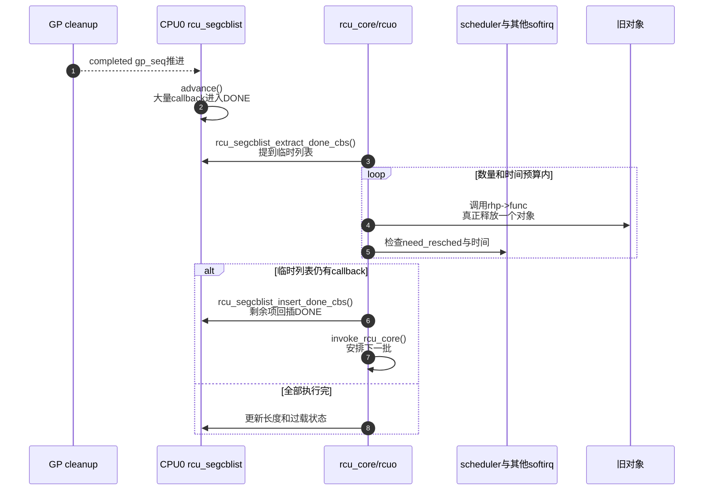

# 第12章\_Tree\_RCU\_回调执行\_批处理与限流

## 12.1\_场景\_一次GP后突然成熟五万个callback

网络模块批量替换五万个短对象，并为每个旧对象调用：

```c
static void flow_free_rcu(struct rcu_head *head)
{
	struct flow *flow = container_of(head, struct flow, rcu);
	kfree(flow);
}

for_each_old_flow(flow)
	call_rcu(&flow->rcu, flow_free_rcu);
```

它们可能共享同一物理 GP，同时进入 DONE。若为每项唤醒一个线程，会制造调度风暴；若一次 softirq 不受限制地执行五万个 callback，网络、定时器等其他 softirq 和可运行任务会被长时间饿死。

回调执行层必须在两种成本之间折中：**批量执行以摊薄调度开销，同时限流以交还 CPU。**

## 12.2\_先区分四个时刻

```text
T0 call_rcu()返回
    → callback只被接管

T1 目标GP开始
    → callback仍不能执行

T2 目标GP完成
    → callback进入DONE，只是具备安全资格

T3 rcu_core/nocb执行func
    → callback真正完成，旧对象才被释放
```

`synchronize_rcu()` 主要得到 T2 类读者完成结论；`rcu_barrier()` 等待调用前 callback 的 T3。把 T2 与 T3 合并，是模块卸载 UAF 的常见来源。

## 12.3\_谁调用rcu\_do\_batch

非 offload CPU 上：

```text
invoke_rcu_core()
    → RCU_SOFTIRQ或per-CPU rcuc kthread
    → rcu_core()
    → cblist存在DONE且scheduler fully active
    → rcu_do_batch(rdp)
```

NOCB CPU 则由 `rcuo` callback kthread 调用同一 `rcu_do_batch()`。所以回调函数必须按实际配置理解上下文，不能假设“`call_rcu()` 的调用者稍后同步执行它”。

## 12.4\_S0到S6\_一次批处理周期

| 阶段 | 动作 | 共享状态 | 上下文 | 退出条件 |
| --- | --- | --- | --- | --- |
| S0 检查 | `rcu_segcblist_ready_cbs()` | DONE 是否非空 | softirq/rcuc/rcuo | 无回调则返回 |
| S1 计算预算 | 读取 pending、`blimit`、`rcu_divisor`、时间上限 | 本批数量/时间目标 | 执行上下文 | 预算确定 |
| S2 提取 | 关中断/取得NOCB锁，`rcu_segcblist_extract_done_cbs()` | DONE移到临时 `rcu_cblist` | 本CPU/回调线程 | 与并发enqueue隔离 |
| S3 执行 | 逐项清debug状态并调用 `rhp->func` | 对象可能真正释放 | 回调上下文 | 列表空或预算触发 |
| S4 让出判断 | need-resched、softirq公平、时间预算、cond_resched | 本地调度状态 | 执行上下文 | 决定继续或停止 |
| S5 回插剩余 | `rcu_segcblist_insert_done_cbs()` | 未执行项回到DONE头 | 锁保护路径 | 队列重新一致 |
| S6 再触发 | 若仍ready则 `invoke_rcu_core()` | 工作标志/softirq | `rcu_core()` | 下批以后执行 |

## 12.5\_提取后为什么在锁外调用func

`rcu_do_batch()` 先在关中断和 NOCB 锁保护下把 DONE 段提到临时普通 `rcu_cblist`，随后释放锁才调用 callback：

```c
rcu_nocb_lock_irqsave(rdp, flags);
rcu_segcblist_extract_done_cbs(&rdp->cblist, &rcl);
rcu_nocb_unlock_irqrestore(rdp, flags);

while ((rhp = rcu_cblist_dequeue(&rcl)) != NULL)
	rhp->func(rhp);
```

否则任意 callback 的释放、锁和后续 `call_rcu()` 都会发生在 cblist 内部锁下，既可能死锁，也会让入队路径承受不可预测锁持有时间。

## 12.6\_数量预算和时间预算

6.12.20 的本批数量近似为：

```c
pending = DONE段数量;
bl = max(rdp->blimit, pending >> rcu_divisor);
```

积压越多，批量可自适应变大；正常情况下保留基础 `blimit`。softirq 中达到数量阈值且有其他调度需求时停止，还用 `rcu_resched_ns`（默认代码为 3ms）限制占用其他 softirq 的时间。

在 `rcuc/rcuoc` kthread 中，代码可以临时 enable BH 并 `cond_resched_tasks_rcu_qs()`，给调度器机会；`rcuc` 自身仍有时间检查，以免推迟 QS 报告。

若 callback 过载，`rdp->blimit` 可被提高以加速排空；降到 `qlowmark` 后恢复普通限额。吞吐和公平不是固定常量，而是根据积压、上下文和调度压力共同决定。

## 12.7\_回调函数允许做什么

安全模板：

```c
static void route_free_rcu(struct rcu_head *head)
{
	struct route *route = container_of(head, struct route, rcu);

	/* 短小、不可阻塞；只做有界清理。 */
	kfree(route);
}
```

不应在普通 RCU callback 中执行：

```c
static void bad_free_rcu(struct rcu_head *head)
{
	mutex_lock(&slow_mutex);     /* 可能睡眠：错误 */
	flush_workqueue(slow_wq);    /* 可能长期等待：错误 */
	msleep(100);                 /* 错误 */
	mutex_unlock(&slow_mutex);
}
```

即使 NOCB callback 在 kthread 中执行，也不应由同一个 callback 阻塞整条回调管线。需要可睡眠的复杂销毁时，callback 应只完成 RCU 生命周期交接并把工作转交到明确的 workqueue，同时重新审查模块卸载时需等待哪条工作链。

## 12.8\_kfree\_rcu与kvfree\_rcu

`kfree_rcu(ptr, rcu_member)` 把“从 `rcu_head` 找回对象并释放”编码进 RCU 延迟回收。调用时仍只是登记，实际释放发生在 GP 和 callback 管线之后。

`kvfree_rcu()` 支持更复杂/批量的延迟释放，6.12 有 `kfree_rcu` 批处理、内存压力和 monitor/workqueue 路径。不能从 API 名字推导它等价于每对象 `call_rcu(head, kfree)`：批量化会改变执行上下文、内存峰值和释放时延，但不改变必须先过 GP 的安全条件。

## 12.9\_完整批处理时序



## 12.10\_回调积压的因果链

```text
更新速率持续高于callback处理速率
    → cblist长度增长
    → 多代旧对象同时存活，内存峰值上升
    → RCU提高批量/触发FQS/过载策略
    → callback执行占用更多CPU
    → 若业务负载也饱和，调度与GP可能进一步迟延
```

“RCU 内存瓶颈”通常不是 reader 数量本身生成引用计数，而是更新产生旧对象的速度、GP完成速度与 callback执行速度三者失衡。诊断必须分别测这三个阶段。

## 12.11\_trace和指标

```bash
cd /sys/kernel/tracing
echo 1 | sudo tee events/rcu/rcu_batch_start/enable
echo 1 | sudo tee events/rcu/rcu_batch_end/enable
echo 1 | sudo tee events/rcu/rcu_invoke_callback/enable
echo 1 | sudo tee tracing_on
```

观察每批预算、实际执行数、是否仍有 callback、need-resched 和执行上下文。一次批次小不一定是吞吐问题，可能是主动公平限流；DONE 长期增长才说明处理速度不足。

## 12.12\_源码入口

- [普通 GP cleanup 的完成发布](../../../../../research/source_reading/rcu/source_explanations/P05_Linux_6.12_Tree_RCU_GP全局生命周期源码实现.md#5.11_rcu_gp_cleanup发布完成并承接下一代)只提供 callback 变成可执行的代际前提；以下入口才解释何时由哪个执行者真正调用函数。
- [回调与 NOCB 模块源码概念导读](../../../../../research/source_reading/rcu/navigation/P07_Linux_6.12_Tree_RCU_回调与NOCB模块源码概念导读.md#7.5_普通callback状态机)先建立完整执行链。
- [`invoke_rcu_core()` 与 softirq/rcuc 选择](../../../../../research/source_reading/rcu/source_explanations/P09_Linux_6.12_Tree_RCU_回调与NOCB源码实现.md#9.7_普通CPU怎样选择softirq或rcuc执行者)。
- [`rcu_do_batch()` 的 DONE 抽取、锁外调用、预算与回插](../../../../../research/source_reading/rcu/source_explanations/P09_Linux_6.12_Tree_RCU_回调与NOCB源码实现.md#9.6_rcu_do_batch为何先抽取再锁外执行)。
- [NOCB callback kthread 执行者](../../../../../research/source_reading/rcu/source_explanations/P09_Linux_6.12_Tree_RCU_回调与NOCB源码实现.md#9.10_NOCB_CB线程只执行成熟批次)。
- `kernel/rcu/tree.c` 中 kfree/kvfree RCU 批处理路径。
- `rcu_do_batch()` 与批量释放路径在真正执行延迟动作前后登记 `rcu_callback_map`；先从 [RCU Lockdep适配模块源码概念导读](../../../../../research/source_reading/rcu/navigation/P12_Linux_6.12_RCU_Lockdep适配模块源码概念导读.md#12.4.3_callback上下文链)建立调用链，再进入 [`rcu_callback_map` 上下文标记](../../../../../research/source_reading/rcu/source_explanations/P04_Linux_6.12_RCU_Lockdep适配层源码实现.md#4.7_rcu_callback_map怎样标记延迟动作上下文)核对定义、影子状态、消费者和修改边界。

上一篇：[Tree RCU rcu_segcblist 回调状态机](P11_Tree_RCU_rcu_segcblist回调状态机.md)。

下一篇：[Tree RCU 同步等待与 rcu_barrier](P13_Tree_RCU_同步等待与rcu_barrier.md)。
