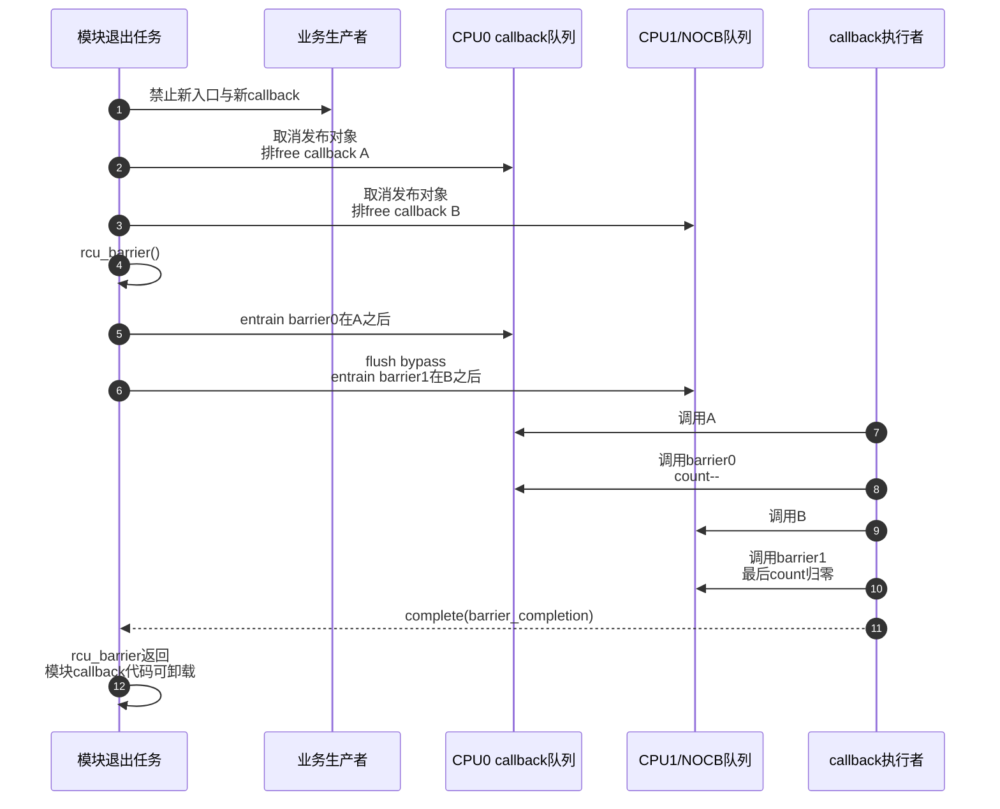

# 第13章\_Tree\_RCU\_同步等待与rcu\_barrier


## 13.1\_GP完成callback执行和barrier完成不是同一事件

P11、P12 已经把 callback 从登记、绑定 GP、成熟到实际调用的过程分开。于是等待方必须先说清自己要的是哪一个完成条件：旧 reader 已离场、某个专用 callback 已执行，还是调用前散落在所有队列中的 callback 都已执行。本章用同一个模块退出现场比较这些条件，不把三个名字相近的接口压成“都等 RCU”。

## 13.2\_模块卸载场景暴露三种不同等待

模块 callback `demo_free_rcu()` 位于模块文本段。删除对象时：

```c
static void demo_free_rcu(struct rcu_head *head)
{
	struct demo_obj *obj = container_of(head, struct demo_obj, rcu);
	kfree(obj);
}

static void demo_remove(struct demo_obj *obj)
{
	spin_lock(&demo_lock);
	hlist_del_rcu(&obj->node);
	spin_unlock(&demo_lock);
	call_rcu(&obj->rcu, demo_free_rcu);
}
```

模块退出不仅要让 reader 离场，还要确保此前登记的 `demo_free_rcu()` 已经 **实际调用完**，否则模块代码卸载后 RCU 再跳到该函数就会执行失效地址。

正确关闭骨架：

```c
static void __exit demo_exit(void)
{
	/* 先阻止新对象、新lookup和新callback继续产生。 */
	demo_stop_producers();
	demo_unpublish_all_objects(); /* 每项通过call_rcu退休。 */

	/* 等待所有调用前已登记的RCU callback真正执行。 */
	rcu_barrier();

	/* 现在模块callback代码与其释放的对象都已收尾。 */
}
```

仅调用 `synchronize_rcu()` 不足以替代这里的 `rcu_barrier()`。

## 13.3\_四个相近接口等待什么

| 接口 | 截止边界 | 返回时保证 | 不保证 |
| --- | --- | --- | --- |
| `synchronize_rcu()` | 调用前既存普通 RCU reader | 满足语义的 GP 已过去 | 此前所有 callback 已执行 |
| `call_rcu(head, func)` | callback登记时形成目标代际 | 只保证请求被接管并立即返回 | GP已完成或func已调用 |
| `rcu_barrier()` | 调用前已经登记的普通 RCU callback | 这些 callback 已实际调用完成 | 新 callback、无条件经过新GP |
| `synchronize_rcu_expedited()` | 调用前既存 reader | 更积极取得同类reader证明 | 此前 callback 全执行 |

`rcu_barrier()` 在系统没有 pending callback 时可以立即返回，甚至不经过一轮 GP；它等待的是队列顺序，不是以 GP 为目标。

## 13.4\_为什么多等一个GP仍不能替代barrier

考虑这个时间线：

```text
callback C目标GP=N
    → GP=N完成，C进入DONE
    → callback执行线程尚未获得CPU
    → 模块调用synchronize_rcu()并完成GP=N+1
    → C仍可能只是在DONE队列
```

GP=N+1 只证明 reader 边界，不会替 callback线程执行 C。模块此时卸载仍可能留下指向模块文本的 `C->func`。

P17/P18 已把状态拆成：

```text
GP完成 → WAIT进入DONE → rcu_do_batch提取 → 调用func
```

`synchronize_rcu()` 等前半，`rcu_barrier()`覆盖到最后一步。

## 13.5\_默认synchronize\_rcu的等待对象

默认 6.12.20 路径：

```text
synchronize_rcu()
    → synchronize_rcu_normal()
    → wait_rcu_gp(call_rcu_hurry)
    → 调用者栈上struct rcu_synchronize
    → 初始化completion并排wakeme_after_rcu callback
    → wait_for_completion()
```

GP 后 callback 执行 `wakeme_after_rcu()`，`complete()` 原调用者。这是用一个专用 callback 等“足够新 GP”的实现技巧，不等于它顺便排在系统所有既有 callback 后面。它只保证自己的 GP 语义。

6.12 可选 `rcu_normal_wake_from_gp` 直接等待者批处理分支改变交付路径，不改变同步接口只等 reader 的契约。

该可选分支在 `rcu_state` 中使用六组 `srs_*` 状态：

| 字段 | 精确职责 |
| --- | --- |
| `srs_next` | 新调用者把自己的栈上 `rcu_synchronize.head` 无锁加入的请求入口 |
| `srs_wait_tail` | GP init 插入 dummy wait-head 后，锁存“由当前物理 GP 覆盖到哪里” |
| `srs_done_tail` | cleanup 已经交给直接完成/workqueue 的批次边界，使用 release/acquire 交接 |
| `srs_wait_nodes[]` | 预分配的 dummy wait-head 分隔节点；不是每个调用者的等待对象池 |
| `srs_cleanup_work` | GP kthread不宜一次唤醒过多调用者时，继续完成剩余批次 |
| `srs_cleanups_pending` | 正在飞行的 cleanup work 数，用于安全回收 dummy 节点和协调新批次 |

默认值 `rcu_normal_wake_from_gp=0` 时，同步调用者仍走 callback+completion；不能因为这些字段存在，就把可选优化写成所有 `synchronize_rcu()` 的固定实现。

Linux 6.12.20 的模块阅读入口是 [同步等待与 rcu_barrier 模块源码概念导读](../../../../../research/source_reading/rcu/navigation/P08_Linux_6.12_Tree_RCU_同步等待与rcu_barrier模块源码概念导读.md#8.1_等RCU至少有三种不同对象)；具体请求加入和 GP init 划界见 [SRS 请求划批](../../../../../research/source_reading/rcu/source_explanations/P05_Linux_6.12_Tree_RCU_GP全局生命周期源码实现.md#5.13_SRS怎样登记请求并冻结本轮批次)，cleanup 与 workqueue 唤醒见 [SRS 完成交付](../../../../../research/source_reading/rcu/source_explanations/P05_Linux_6.12_Tree_RCU_GP全局生命周期源码实现.md#5.14_SRS怎样在cleanup与workqueue之间交付等待者)。

## 13.6\_barrier怎样在分散队列后放哨兵

callback 分布在所有 possible CPU 的 `rcu_data.cblist`，NOCB CPU 还可能有 `nocb_bypass`。`rcu_barrier()` 不能只在当前 CPU 排一个 callback。

算法是：

1. `barrier_mutex` 串行化并发 barrier；若另一 barrier 已覆盖本请求，可提前返回；
2. `barrier_sequence` 开始新一轮 barrier 代际；
3. 初始化 `barrier_completion` 和 `barrier_cpu_count`；
4. 遍历 possible CPU；没有 callback 的队列只记录快照；
5. 有 callback 的在线 CPU 通过跨 CPU handler 调用 `rcu_barrier_entrain(rdp)`；离线/特殊队列在受保护路径直接处理；
6. entrain 前 flush NOCB bypass，再把 `rdp->barrier_head` 放在该队列所有既有 callback 后面；
7. 每个 barrier callback 被调用时计数减一，最后一个 `complete()`；
8. 调用者醒来并结束 `barrier_sequence`。

这里还有一个容易被结构体短注释误导的字段：`barrier_lock` 注释说保护 `barrier_seq_snap`，而 `barrier_seq_snap` 实际位于每 CPU `rcu_data`，并不在 `rcu_state` 中。该 raw spinlock把每 CPU 快照、哨兵 callback 登记以及 hotplug/callback 迁移放进同一可序列化边界；`barrier_mutex` 则负责串行化可睡眠的整个 `rcu_barrier()` 调用。两把锁的保护范围和可睡眠属性不同。

## 13.7\_为什么初始计数不是零

6.12.20 设置：

```c
atomic_set(&rcu_state.barrier_cpu_count, 2);
```

遍历过程中，某个刚 entrain 的 barrier callback 可能立刻被执行；如果从零开始并边遍历边加，计数可能过早回零并唤醒。先放两个哨兵引用，全部 CPU 队列处理完后再 `atomic_sub_and_test(2)`，保证扫描完成以前 completion 不会成立。

这是典型的生命周期技巧：先持有发布者自己的基础引用，再把各异步分支登记完，最后归还基础引用。

## 13.8\_entrain如何证明前序callback已经执行

`rcu_segcblist_entrain()` 把 barrier callback 接到当前队列最后一个非空分段的尾部。由于同一 cblist 保持 callback 顺序：

```text
旧callback A → 旧callback B → barrier_head
```

当 `barrier_head.func` 被调用，A、B 必然已经被同一执行管线调用。

NOCB bypass 必须先 flush，否则 B 可能仍躲在旁路中，而 barrier_head 已进入主 cblist；6.12 的 `rcu_barrier_entrain()` 明确调用 `rcu_nocb_flush_bypass()` 并在需要时唤醒 nocb GP 线程。

## 13.9\_完整模块退出时序



第一步“阻止新 callback”不能省略：`rcu_barrier()` 只覆盖调用前已登记项。若生产者在 barrier 扫描后又排一个模块 callback，返回时仍可能遗留。

## 13.10\_两种正确关闭方案

两种方案都必须先关闭生产入口，再选择谁承担旧对象回收：已经用 callback 异步退休的对象要等 callback 全部执行；集中摘除、尚未排队的对象可以等一次 GP 后由退出线程同步释放。两条路径不能在没有所有权账本时混用。

### 13.10.1\_异步逐对象退休

```c
stop_producers();
unpublish_all_with_call_rcu();
rcu_barrier();
```

适合运行期已经大量使用 `call_rcu()`，退出时需要等这些 callback 和最后一批对象一起完成。

### 13.10.2\_同步批量退休

```c
stop_producers();
list = unpublish_all_without_callback();
synchronize_rcu();
free_detached_list_directly(list);
```

如果能证明没有其他旧 callback 指向模块代码，这种方案用一轮 GP 后由退出任务直接批量释放，不需要为这批对象再 `rcu_barrier()`。两种方案不能混成“先同步 GP，然后假设所有历史 callback 都完成”。

## 13.11\_调用上下文和死锁边界

`synchronize_rcu()` 与 `rcu_barrier()` 都会阻塞，必须在可睡眠上下文调用；不得在普通 RCU 读侧、持有会被 callback/reader 获取的锁或中断上下文中等待。

典型死锁：

```text
退出任务持有module_lock调用rcu_barrier
    → 旧callback需要module_lock才能完成
    → barrier等待callback
    → callback等待barrier持有的锁
```

关闭顺序必须先撤销入口、停止生产者并释放 callback 需要的锁，再等待。

## 13.12\_源码和trace入口

- [`synchronize_rcu()` 的普通/expedited/早期退化分流](../../../../../research/source_reading/rcu/source_explanations/P10_Linux_6.12_Tree_RCU_同步等待与rcu_barrier源码实现.md#10.4_synchronize_rcu怎样选择普通expedited或早期空GP)。
- [默认 `wait_rcu_gp()` 与可选 SRS 等待对象](../../../../../research/source_reading/rcu/source_explanations/P10_Linux_6.12_Tree_RCU_同步等待与rcu_barrier源码实现.md#10.5_默认分支为何等待调用者自己的completion)；`__wait_rcu_gp()/wakeme_after_rcu()` 函数体见 [P02 等待桥](../../../../../research/source_reading/rcu/source_explanations/P02_Linux_6.12_Tree_RCU_等待桥_QS与节点汇聚关键函数源码实现.md#2.3___wait_rcu_gp与wakeme_after_rcu连接等待者)。
- [`rcu_barrier_callback()` 与 `rcu_barrier_entrain()` 的队尾哨兵证明](../../../../../research/source_reading/rcu/source_explanations/P10_Linux_6.12_Tree_RCU_同步等待与rcu_barrier源码实现.md#10.6_barrier_callback与entrain如何证明队列前序已执行)。
- [`rcu_barrier()` 的全 CPU 扫描、count=2 与完成发布](../../../../../research/source_reading/rcu/source_explanations/P10_Linux_6.12_Tree_RCU_同步等待与rcu_barrier源码实现.md#10.8_rcu_barrier怎样扫描所有队列并等待真实执行)。

`rcu_barrier` trace 事件可观察 Begin、EarlyExit、每 CPU 排队和 LastCB；事件存在性依内核配置，先检查 `/sys/kernel/tracing/events/rcu/`。

上一篇：[Tree RCU 回调执行、批处理与限流](P12_Tree_RCU_回调执行_批处理与限流.md)。

下一篇：[Tree RCU force-QS、迟延与 Stall](P14_Tree_RCU_force_QS迟延与Stall.md)。
