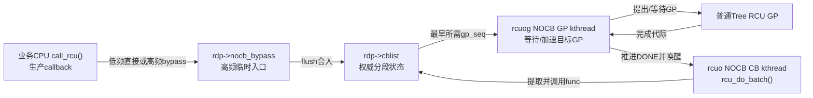
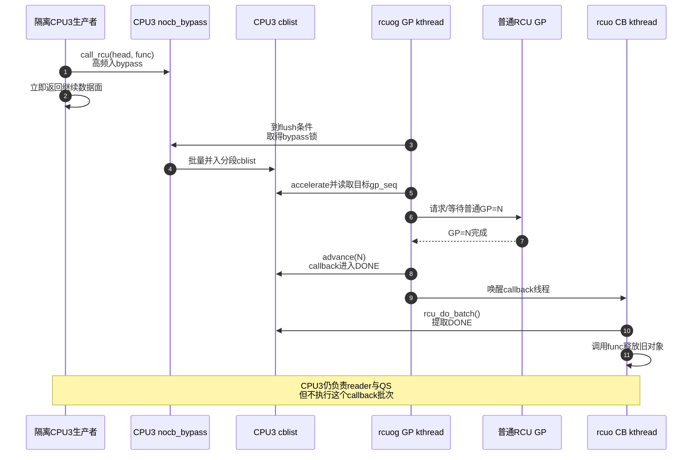

# 第16章\_Tree\_RCU\_NOCB回调卸载

## 16.1\_场景\_隔离CPU不希望执行回调批次

CPU3 被用于低延迟数据面，应用希望尽量减少 scheduler tick、softirq 和内核回调在该 CPU 上产生的尾延迟。数据面仍会删除对象：

```c
old = rcu_replace_pointer(flow_slot, new, true);
call_rcu(&old->rcu, flow_free_rcu);
```

普通非 offload 路径最终可能在 CPU3 的 `rcu_core()` 中调用 `rcu_do_batch()`。即使 callback 很短，一次大批量也会扰动 CPU3。

NOCB 把指定 CPU 的 **callback GP 管理与执行** 交给 kthread；它没有取消 CPU3 对普通 RCU reader/QS 的责任，也没有让 `call_rcu()` 变成零开销远端发送。

## 16.2\_卸载前后责任对比

| 责任 | 普通CPU | NOCB CPU |
| --- | --- | --- |
| reader执行约束/任务跟踪 | 本CPU/当前任务 | 不变，仍在本CPU/任务 |
| QS/EQS形成 | scheduler/context tracking | 不变 |
| CPU位上报 | 本CPU RCU路径或远端EQS扫描 | 不变 |
| callback入队 | 本CPU cblist | 本CPU的 offloaded cblist/bypass |
| callback等待目标GP | 本CPU `rcu_core`协助 | NOCB GP kthread |
| READY callback执行 | 本CPU softirq/rcuc | NOCB CB kthread |

NOCB 的名字是 no-callbacks-on-this-CPU 的工程目标，不是 no-RCU-accounting-on-this-CPU。

## 16.3\_两个线程与一个生产者路径



实际线程可按组共享：`rcu_nocb_gp_kthread()` 可代表一组 offload CPU 管理 GP；每个 offload `rcu_data` 有对应 callback kthread/关联。线程布局取决于 grouping、CPU 数与配置，不能从一个线程名推导固定一对一关系。

## 16.4\_为什么需要bypass

若大量 CPU/中断同时向一个 offload CPU 的 `cblist` 入队，每次都取得 `nocb_lock`，生产者会在共享锁上排队。`nocb_bypass` 是一个由 `nocb_bypass_lock` 保护的普通 `rcu_cblist`，允许高频入队先聚集，再批量 flush 到权威 `rcu_segcblist`。

`call_rcu_nocb()` 大致在以下条件间选择：

```text
早期启动或低频、主锁容易取得
    → 直接进入cblist

bypass已经非空或单位时间入队过多
    → 进入nocb_bypass

bypass太旧、太满、出现非lazy callback或需推进
    → 取得两类锁并flush到cblist
```

旁路移除的是每次高频入队争用主锁的成本，换来额外链表、长度记账、flush时机和一致性协议。

## 16.5\_bypass不是第二个权威GP队列

callback 只有并入 `cblist` 后，才能由 `rcu_segcblist` 的 accelerate/advance 状态机绑定 GP 并进入 DONE。因此任何需要得出“当前所有 callback 到哪里了”的路径，必须先考虑 bypass：

- NOCB GP kthread 周期/条件 flush；
- `rcu_barrier_entrain()` 在尾随 callback 前 flush；
- CPU deoffload/hotplug 前 flush；
- bypass 老化或达到阈值时 flush；
- 新的非 lazy callback 需要避免被长 lazy 定时拖延时 flush。

若只读 `cblist` 长度而忽略 bypass，会漏掉已经由 `call_rcu()` 交付、但尚未进入分段队列的 callback。

## 16.6\_S0到S7\_一次offload\_callback生命周期

| 阶段 | 触发 | 主要状态 | 执行者 | 退出条件 |
| --- | --- | --- | --- | --- |
| S0 登记 | offload CPU `call_rcu()` | callback进入bypass或cblist，总长度增加 | 业务CPU | callback被接管 |
| S1 唤醒判断 | 新callback/时间/长度阈值 | `nocb_gp_wq`、deferred wake状态 | 生产者/本地core | GP线程会处理 |
| S2 flush | `nocb_gp_wait()` 等 | bypass合入cblist | NOCB GP kthread | 权威队列完整 |
| S3 加速 | 检查最早 pending callback | 分配 `gp_seq`、提出GP需求 | NOCB GP kthread | 知道等待哪轮 |
| S4 等GP | 普通Tree RCU推进 | callback仍WAIT/NEXT_READY | GP线程 | 目标代际完成 |
| S5 advance | GP完成可见 | callback进入DONE | NOCB GP/锁保护路径 | READY非空 |
| S6 唤醒CB | DONE出现 | callback kthread等待条件成立 | NOCB GP kthread | CB线程运行 |
| S7 执行 | `nocb_cb_wait()` → `rcu_do_batch()` | callback func被调用、长度下降 | NOCB CB kthread | 批次完成/限流 |

## 16.7\_端到端时序



## 16.8\_配置与观察

启动参数示例：

```text
rcu_nocbs=3 nohz_full=3 isolcpus=managed_irq,3
```

三者不是同义参数：`rcu_nocbs` 只指定 callback offload；`nohz_full` 针对 tick 隔离；`isolcpus`/cpuset/调度 affinity 处理任务和中断放置。只配置 NOCB 不能保证 CPU3 没有其他内核扰动。

```bash
cat /proc/cmdline
cat /sys/devices/system/cpu/nohz_full 2>/dev/null
ps -eLo pid,psr,cls,rtprio,comm | grep -E 'rcuo|rcuog|rcuop'
grep -E 'CONFIG_RCU_NOCB_CPU=' /boot/config-"$(uname -r)"
```

线程名和 affinity 随版本/配置变化，源码中的 `rcu_nocb_gp_kthread()`、`rcu_nocb_cb_kthread()` 才是职责锚点。

## 16.9\_动态offload/deoffload为何复杂

Linux 6.12.20 提供 `rcu_nocb_cpu_offload(cpu)` 和 `rcu_nocb_cpu_deoffload(cpu)`。切换至少要同步：

```text
cblist的offloaded标志
NOCB锁与本地core并发
bypass是否已flush
GP/CB kthread是否已创建、park或唤醒
已经DONE与仍pending callback由谁执行
barrier是否正在给队列entrain哨兵callback
```

它不是改一个 cpumask 后立即完成的无状态操作。用户通常应优先用启动参数建立稳定隔离配置，只有明确的运行时管理场景才动态切换。

`rcu_state` 中只有两项 NOCB 全局配置协调字段，但它们不能代表 per-CPU callback 状态：

- `nocb_mutex` 串行化 offload/deoffload、启动组织以及需要避免锁状态失衡的管理路径；真正的 callback、bypass、等待队列和线程指针仍在各 `rcu_data`/NOCB 分组对象中。
- `nocb_is_setup` 表示 NOCB 启动组织是否已经建立。路径会结合 `rcu_scheduler_fully_active`、启动 cpumask 和对应 kthread 状态判断是否可继续；它不是“所有 callback 已经卸载”或“当前没有回调”的证明。

这两个字段只在 `CONFIG_RCU_NOCB_CPU` 下编译进 `rcu_state`。配置关闭时，整组全局管理状态消失，但普通 Tree RCU 的 reader、GP 与 callback 语义仍然存在。

## 16.10\_性能取舍

| 收益 | 代价 |
| --- | --- |
| 隔离CPU不执行 callback 批次 | `call_rcu()`仍要本地/共享记账 |
| callback线程可放到 housekeeping CPU | 增加线程、唤醒和跨CPU缓存访问 |
| bypass降低高频主锁争用 | 增加暂存、flush延迟和内存峰值 |
| GP/CB职责分离 | 诊断需要同时检查两类线程和普通GP |

若 housekeeping CPU 资源不足，offload callback 会积压；被隔离 CPU 很干净，不等于系统整体回收吞吐足够。

## 16.11\_源码和trace入口

- [普通 GP 长期线程的端到端源码时序](../../../../../research/source_reading/rcu/source_explanations/P05_Linux_6.12_Tree_RCU_GP全局生命周期源码实现.md#5.16_端到端源码时序)：它创建并发布普通 Tree RCU 的权威完成代际；NOCB GP kthread只是等待、观察并推进 offloaded callback，不创建另一套普通 GP。
- [回调与 NOCB 模块源码概念导读](../../../../../research/source_reading/rcu/navigation/P07_Linux_6.12_Tree_RCU_回调与NOCB模块源码概念导读.md#7.6_NOCB为何拆成GP线程与CB线程)：先分清 producer、GP 观察者与 callback 执行者。
- [`call_rcu_nocb()`、bypass、flush 与防搁浅唤醒](../../../../../research/source_reading/rcu/source_explanations/P09_Linux_6.12_Tree_RCU_回调与NOCB源码实现.md#9.8_nocb_bypass怎样降低生产者锁竞争又避免搁浅)。
- [`nocb_gp_wait()` 的目标代际推进](../../../../../research/source_reading/rcu/source_explanations/P09_Linux_6.12_Tree_RCU_回调与NOCB源码实现.md#9.9_NOCB_GP线程怎样推进队列并等待最早目标代际)与 [`nocb_cb_wait()` 的成熟批次执行](../../../../../research/source_reading/rcu/source_explanations/P09_Linux_6.12_Tree_RCU_回调与NOCB源码实现.md#9.10_NOCB_CB线程只执行成熟批次)。
- [`rcu_nocb_cpu_offload()` / `deoffload()` 的动态切换](../../../../../research/source_reading/rcu/source_explanations/P09_Linux_6.12_Tree_RCU_回调与NOCB源码实现.md#9.11_动态offload为何只允许offline_CPU并等待状态交接)。

上一篇：[Tree RCU Expedited GP](P15_Tree_RCU_Expedited_GP.md)。

下一篇：[Tree RCU CPU 热插拔与回调迁移](P17_Tree_RCU_CPU热插拔与回调迁移.md)。
