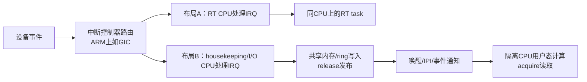
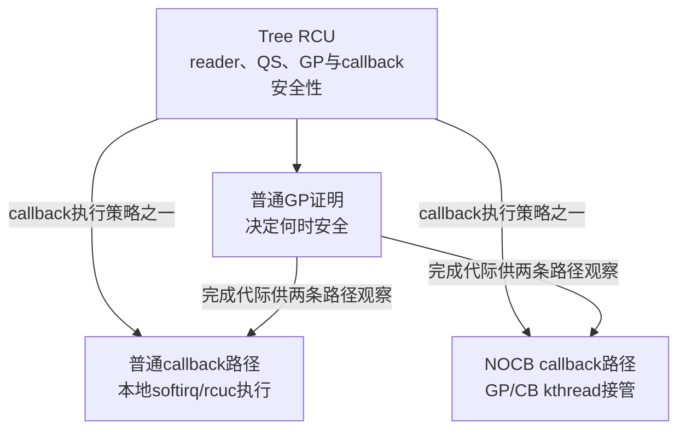
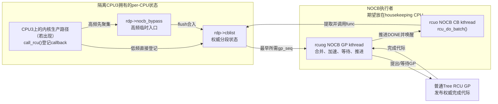
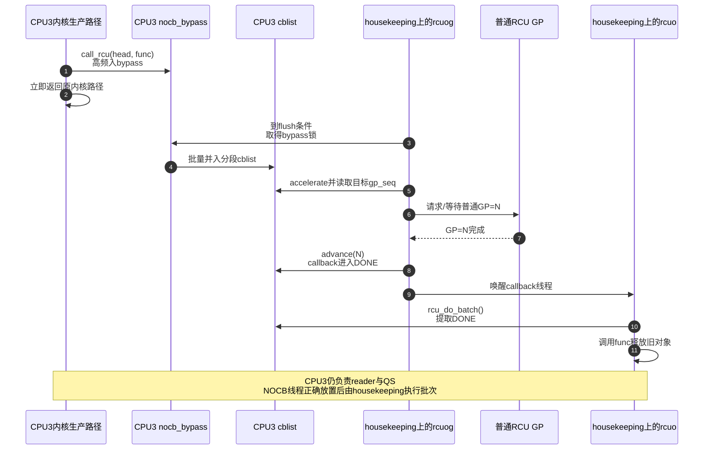

# 第16章\_Tree\_RCU\_NOCB回调卸载

## 16.1\_场景\_隔离CPU不希望执行回调批次

本章所称 NOCB，是 Tree RCU 把 callback 侧处理交给专用 kthread 的 no-callbacks 卸载策略；`NO_HZ_FULL` 是允许指定运行中 CPU 动态省略周期调度 tick 的 full-dynticks 模式；housekeeping CPU 是承接被迁移内核工作的非隔离 CPU；RT task 是受实时 deadline 与优先级约束的任务。

先采用这组机制最典型的模型：CPU3 专门运行一个长时间停留在用户态的计算任务，CPU0～CPU2 作为 housekeeping CPU 承担 I/O、普通内核线程和后台工作。目标不是让 CPU3 更快接收外设中断，而是让它获得尽量连续、可预测的计算窗口。

即使 CPU3 的业务代码不直接使用 RCU，Linux 内核仍然有自己的 per-CPU RCU 状态。若 CPU3 上的某条内核路径产生 callback，例如内核态数据面更新对象：

```c
old = rcu_replace_pointer(flow_slot, new, true);
call_rcu(&old->rcu, flow_free_rcu);
```

普通非 offload 路径最终可能在 CPU3 的 `rcu_core()` 中调用 `rcu_do_batch()`。即使每个 callback 很短，一次大批量也会扰动 CPU3；一个耗时很长的 callback 或连续出现的多个小批次也能产生同类问题。callback 为什么成批执行、单批怎样限流，见 [Tree RCU 回调执行、批处理与限流](P12_Tree_RCU_回调执行_批处理与限流.md#12.1_场景_一次GP后突然成熟五万个callback)。

NOCB 把指定 CPU 的 **callback GP 管理与执行** 交给 kthread；它没有取消 CPU3 对普通 RCU reader/QS 的责任，也没有让 `call_rcu()` 变成零开销远端发送。

### 16.1.1\_先分开两种实时架构

“实时”只说明 deadline 重要，并没有规定 IRQ、I/O 和计算必须怎样放置。至少要区分两种常见架构：

| 架构 | 端到端路径 | 为什么这样放 | NOCB/NO_HZ_FULL的位置 |
| --- | --- | --- | --- |
| 外部事件快速响应 | 设备 → 中断控制器（ARM 上如 GIC）→ 目标 CPU 的 IRQ/线程化 IRQ → RT task → 执行器 | 避免一次核间交接，压缩最紧的 event-to-action 延迟 | 该 CPU 必须频繁进内核时，`NO_HZ_FULL` 未必有收益；NOCB 仍可单独用于减少 callback 噪声 |
| 隔离核持续计算 | 设备 → housekeeping/I/O CPU → 共享内存或 ring → 唤醒/通知隔离 CPU → 用户态计算 | 把 IRQ、协议栈和后台工作留在 housekeeping，换取长计算段的低 jitter | `NO_HZ_FULL` 减少周期 tick，NOCB 减少 callback 侧工作，二者在这里最自然地配套 |



布局 B 并不免费：它增加了缓存行所有权迁移、内存屏障、唤醒/IPI 和调度交接。对最紧的外部事件 deadline，布局 A 可能更短；对长时间计算和尾延迟控制，布局 B 往往更可控。是否“把可转嫁工作都转嫁”必须按完整最坏时延链决定，不能只追求某个 CPU 表面上没有 IRQ。

中断控制器只负责路由和分发，不缓存业务动作；ARM 平台上的 GIC 也是如此。若采用分离布局，通常是 **I/O CPU 接收和初步处理事件，再把数据交给计算 CPU**；不是把“实时接收”留在计算 CPU、再莫名把反应动作发回其他 CPU。

### 16.1.2\_隔离计算核为什么仍要处理RCU责任

“既然是纯计算，为什么还会用 RCU？”需要分开用户态业务与内核机制：

- 纯用户态算法不会直接调用内核 `rcu_read_lock()` 或 `call_rcu()`；
- 但系统调用、缺页、调度、设备路径以及偶发运行在该 CPU 上的内核代码都可能读写 RCU 保护状态；
- RCU 还必须知道该 CPU 当前在用户态、idle 还是内核态，才能形成 QS/EQS 证据；
- 若内核代码在 CPU3 上调用 `call_rcu()`，callback 仍会登记到 CPU3 对应的 per-CPU 队列，只是该队列可以被标为 offloaded。

所以 NOCB 不是为“计算函数里不守规矩地调用 RCU”兜底，而是提前建立一个 **持续成立的 callback 执行策略**：未来归入 CPU3 队列的 callback 仍然可以登记和等待普通 GP，但 callback 侧管理与实际调用由 NOCB 线程承担。

同样，`NO_HZ_FULL` 也不是运行时进入一个永不退出的“计算模式”。CPU3 每次满足条件时动态停 tick，条件破坏时按需恢复。当前 Linux 的启动配置会让 `nohz_full` CPU 同时进入 RCU callback offload 集合，因此不存在“每次进入 `NO_HZ_FULL` 前先把本地 RCU 账单清空”的串行步骤：

```text
启动时建立长期属性
    CPU3 ∈ nohz_full集合
    CPU3的callback队列 ∈ NOCB offload集合

运行时反复变化
    单一用户任务且无tick依赖 → 停周期tick
    IRQ/新任务/tick依赖出现   → 必要时恢复tick
    CPU3产生callback          → 进入offloaded队列，由NOCB侧推进和执行
```

`NO_HZ_FULL` 的动态 tick 状态与 NOCB 的 callback 队列属性是两组相关但不同的状态。前者会随运行条件反复切换，后者使未来 callback 不再要求本地 CPU 承担同一套执行路径。

### 16.1.3\_把三个判断改成可以落地的版本

| 原判断 | 合理性 | 精确版本 |
| --- | --- | --- |
| 进入 `NO_HZ_FULL` 前，RT CPU 的 RCU 账单要有处理方案，所以 NOCB 合理 | **方向正确，时间顺序要改** | 不是每次停 tick 前临时清空 callback；而是在启动/配置期让该 CPU 的 callback 队列长期进入 offload 协议，使运行期未来 callback 也不要求本地批量执行 |
| 计算函数里可能出现“不守规矩的 RCU”，所以仍需 NOCB 转接 | **内核态情形正确，纯用户态说法不成立** | 用户态算法不会直接调用内核 RCU；系统调用、缺页、调度、设备路径或同 CPU 上的内核代码仍可能涉及 RCU。NOCB 只转移 callback 侧管理与调用，不转移 reader/QS，也不是业务 IPC |
| `NO_HZ_FULL` 理想上只做计算，能转嫁的中断和后台工作都尽量转嫁 | **作为隔离目标合理，但不能绝对化** | 应迁移会破坏目标 CPU jitter 且允许迁移的工作；不可迁移 IRQ、必要 IPI、异常、缺页和少量内核路径仍可能发生。分核还会增加缓存一致性和通知成本，必须以端到端 deadline 决策 |

这三条定稿后，NOCB 的位置就很清楚：它不是外部事件分发器，也不是核间业务数据通道，而是 CPU isolation 方案里专门处理 **RCU callback 执行位置** 的一块。

### 16.1.4\_先纠正RCU\_IRQ\_callback这个说法

“大量 RCU IRQ callback 把 RT task 的时间消耗了”抓住了 **同一 CPU 上发生时间竞争** 这个核心，但有两个术语需要校正：

1. `call_rcu()` 登记的是 **RCU callback**，不是硬件 IRQ handler。普通 Tree RCU 路径通常由 `RCU_SOFTIRQ` 或 RCU 的 per-CPU kthread 进入 `rcu_core()`，再由 `rcu_do_batch()` 调用已经成熟的 callback；具体使用 softirq 还是线程上下文取决于内核版本、抢占模型与配置。
2. callback 没有增加 RT task 自己完成算法所需的计算量，而是在 RT task 所在 CPU 上占用了一段执行窗口。RT task 在这段墙上时间里没有获得 CPU 服务，所以它的 **响应时间/完成时间** 变长，最终可能越过 deadline。

因此更精确的表述是：

> 普通 Tree RCU 的 callback 批次若在 RT task 所在 CPU 上执行，会占用该 CPU 的服务时间并形成调度干扰；当 RT task 原有余量小于这段干扰时，它可能错过 deadline。NOCB 用可调度的 kthread 接管 callback 侧处理，配合 CPU 亲和性把实际执行移到 housekeeping CPU，从而减少这种 RCU callback 抖动。

### 16.1.5\_从CPU时间线看deadline为什么会错过

先只看一个简化的单 CPU 作业：RT task 在时刻 0 释放，deadline 是 200 μs，它真正需要获得 180 μs 的 CPU 执行时间。前 90 μs 执行 RT 代码后，CPU 转去执行一个 30 μs 的 RCU callback 批次，随后 RT task 才完成剩余 90 μs：

```text
墙上时间       0                    90       120                  200  210 μs
deadline       |--------------------------------------------------|
CPU执行内容    |---- RT 90 μs -----| RCU 30 |---- RT 90 μs ------|
RT累计服务     0                    90        90                  170  180 μs
                                                                    ↑
                                                              实际完成，迟到10 μs
```

RT task 的计算需求仍然是 180 μs，但响应时间从理想的 180 μs 增加到 210 μs。用一个只用于建立直觉、并非完整实时调度分析的预算式表示：

```text
R_RT ≈ C_RT + B + I_high + I_RCU + I_other

C_RT    RT task 自身需要的CPU执行时间
B       锁、资源和不可抢占区造成的阻塞
I_high  更高优先级任务造成的干扰
I_RCU   同一CPU上实际妨碍该作业前进的RCU callback时间
I_other IRQ、timer、workqueue、迁移任务等其他干扰
```

只有在 `R_RT <= deadline` 时，这个作业才按时完成。例子中 `180 + 30 = 210 μs > 200 μs`，因此发生 deadline miss。这里不要求“一定有大量 callback”：**一个重 callback、一个大批次或多个短批次的累计干扰** 都可能超过仅有的 20 μs 余量。

还要注意，callback 是否真的能抢在某个 RT task 前运行，取决于抢占模型、callback 执行上下文和双方优先级。例如线程化 softirq/RCU kthread 可能被更高优先级 RT task 抢占。NOCB 的价值不是声称“任何 callback 都必然抢占 RT task”，而是把这类工作从隔离 CPU 的本地执行责任中移出，使其位置和优先级能够被单独管理，并减少尾延迟中的一个不确定来源。

### 16.1.6\_为什么普通系统不一定需要卸载

批处理本来是在两个成本之间折中：一次处理多个 callback 可以摊薄调度、锁和唤醒开销，数量/时间限流又能防止单批无限占用 CPU。对没有专用隔离 CPU、更新量较低或延迟余量较大的通用系统，本地批处理通常比额外的跨 CPU 唤醒和线程切换更经济。

只有当系统确实需要把某组 CPU 留给 NO_HZ_FULL、HPC 数据面或实时任务，并且能够给 housekeeping CPU 预留 callback 处理能力时，NOCB 的额外机制成本才有清晰收益。它是 **执行位置与抖动控制策略**，不是普通 Tree RCU 路径的无条件升级。NO_HZ 的完整动态 tick 模型见 [Linux 时间基础与 timekeeping 框架速览](../../asynchrony/timers/P02_Linux_时间基础与_timekeeping_框架速览.md#2.5_NO_HZ_/_高精度定时器配置对驱动的影响)。

## 16.2\_卸载前后责任对比

上一节已经确定 NOCB 解决的是隔离 CPU 上的 callback 噪声。本节继续按 reader、QS、GP、队列和执行者逐项划界，避免把“callback 卸载”扩大成“整个 RCU 从此不再经过该 CPU”。

### 16.2.1\_NOCB不是另一套RCU实现

Tree RCU 的普通 GP 继续回答“旧 reader 是否都已越过边界，callback 是否已经安全”；NOCB 回答的是“指定 CPU 产生的 callback 由谁管理等待、由谁调用”。当前 Linux 6.12 的 `CONFIG_RCU_NOCB_CPU` 直接依赖 `TREE_RCU`，也从配置关系上证明它不是与 Tree RCU、Tiny RCU 并列的第三套实现。



NOCB 的名字表达的是 no-CBs CPU / no-callbacks-on-this-CPU 这一工程目标，不是 no-RCU-accounting-on-this-CPU，更不是“这个 CPU 从此不能调用 RCU”。NOCB CPU 仍然可以：

- 进入和退出 `rcu_read_lock()` 读侧临界区；
- 调用 `call_rcu()` 登记 callback；
- 通过调度、用户态、idle/EQS 等事件形成 QS 证据；
- 参与普通 Tree RCU 的分层 GP 判定。

### 16.2.2\_真正转移的责任

| 责任 | 普通CPU | NOCB CPU |
| --- | --- | --- |
| reader执行约束/任务跟踪 | 本CPU/当前任务 | 不变，仍在本CPU/任务 |
| QS/EQS形成 | scheduler/context tracking | 不变 |
| CPU位上报 | 本CPU RCU路径或远端EQS扫描 | 不变 |
| `call_rcu()`生产者动作 | 填写 `rcu_head` 并登记 | 仍要填写、记账和入队，成本不为零 |
| callback队列所有权 | 本CPU `rcu_data.cblist` | 仍属于该 CPU 的 `rcu_data`，但标为 offloaded，并可先入 `nocb_bypass` |
| callback等待目标GP | 本CPU `rcu_core()` 协助推进 | NOCB GP kthread 组织、加速并等待普通 GP |
| callback安全性依据 | 普通 Tree RCU 的 `gp_seq` | 完全相同，不另建 GP 算法 |
| READY callback执行 | 本CPU softirq/`rcuc` 路径 | NOCB CB kthread 调用 `rcu_do_batch()` |
| callback线程物理落点 | 随本地执行路径自然在该 CPU | 由 scheduler 决定；需 affinity/cpuset/cgroup 才能约束到 housekeeping CPU |

这说明 NOCB 不只是把最后的 `func(head)` 搬到线程：它还把 offloaded callback 的 bypass 合并、目标 GP 组织、等待、DONE 推进和 CB 线程唤醒等 **callback 侧 GP 管理** 交给 NOCB GP kthread。另一方面，它没有把 reader/QS 责任或普通 Tree RCU 的权威 GP 线程一并搬走。

## 16.3\_两个线程与一个生产者路径



图里的状态仍归 CPU3 对应的 `struct rcu_data` 所有，不是把 callback 数据复制到一份全局“远端 RCU 队列”。变化的是谁取得这些锁、读取这些队列并推进状态：

- **生产者** 仍在 `call_rcu()` 所在上下文写入 `rcu_head`、队列长度和唤醒状态；
- **NOCB GP kthread** 读取 `nocb_bypass`/`cblist`，把 callback 绑定到普通 GP，观察完成代际并推进到 DONE；
- **NOCB CB kthread** 读取 DONE 段，在锁外调用 callback 函数并更新批次记账；
- **普通 Tree RCU GP** 继续汇聚 QS 并发布 `gp_seq`，它不被 `rcuog` 取代。

实际线程可按组共享：`rcu_nocb_gp_kthread()` 可代表一组 offload CPU 管理 GP；每个 offloaded `rcu_data` 有对应 callback kthread/关联。线程布局取决于 grouping、CPU 数与配置，不能从一个线程名推导固定一对一关系。

### 16.3.1\_卸载责任不等于自动完成CPU隔离

选择 CPU3 进入 `rcu_nocbs`，保证的是 CPU3 的 callback 队列走 NOCB 处理协议；它 **不自动保证 `rcuo`/`rcuog` 线程永远不会被 scheduler 放回 CPU3**。Linux 6.12 的 Kconfig 说明也明确指出，NOCB kthread 可以被调度到被卸载 CPU，只是线程可在 callback 之间被抢占，并能通过 affinity 或 cgroup 约束到期望的 CPU 集合。

因此“让 RT CPU 不执行该 callback 批次”需要两层配置共同成立：

1. **职责层**：用 `rcu_nocbs` 或 `nohz_full` 让目标 CPU 的 callback 队列进入 offloaded 模式；
2. **放置层**：用线程亲和性、cpuset/cgroup 和完整的 housekeeping 规划，把 `rcuo`/`rcuog` 及其他非实时工作约束到 housekeeping CPU。

如果只做第一层而没有管理线程落点，系统已经改用 NOCB 协议，但“物理上不在 CPU3 执行 callback”这一部署目标仍不能从配置本身推出。

## 16.4\_为什么需要bypass

`call_rcu()` 通常取得当前 CPU 的 `rcu_data`，本地 IRQ 关闭会串行化该 CPU 上的本地入队；真正需要避免的是 **高频本地生产者每次都与远端 NOCB GP/CB kthread 争用同一个 `nocb_lock`**。若每次 callback 都直接进入主 `cblist`，这个共享锁就会回到高频生产路径。

`nocb_bypass` 是一个由 `nocb_bypass_lock` 保护的普通 `rcu_cblist`，允许高频入队先聚集，再批量 flush 到权威 `rcu_segcblist`。它不是为了让任意 CPU 无规则地把 callback 推给 CPU3，而是为了缩短 CPU3 的 producer 与负责 CPU3 队列的 NOCB kthread 在主锁上的直接竞争。

`call_rcu_nocb()` 大致在以下条件间选择：

```text
早期启动或低频、主锁容易取得
    → 直接进入cblist

bypass已经非空或单位时间入队过多
    → 进入nocb_bypass

bypass太旧、太满、出现非lazy callback或需推进
    → 取得两类锁并flush到cblist
```

旁路移除的是每次高频入队争用主锁的成本，换来额外链表、长度记账、flush时机和一致性协议。

## 16.5\_bypass不是第二个权威GP队列

callback 只有并入 `cblist` 后，才能由 `rcu_segcblist` 的 accelerate/advance 状态机绑定 GP 并进入 DONE。因此任何需要得出“当前所有 callback 到哪里了”的路径，必须先考虑 bypass：

- NOCB GP kthread 周期/条件 flush；
- `rcu_barrier_entrain()` 在尾随 callback 前 flush；
- CPU deoffload/hotplug 前 flush；
- bypass 老化或达到阈值时 flush；
- 新的非 lazy callback 需要避免被长 lazy 定时拖延时 flush。

若只读 `cblist` 长度而忽略 bypass，会漏掉已经由 `call_rcu()` 交付、但尚未进入分段队列的 callback。

## 16.6\_S0到S7\_一次offload\_callback生命周期

NOCB 不是单一开关状态，而是 **per-CPU 回调队列状态、NOCB 分组线程状态和普通 GP 代际状态** 协作形成的分布式状态机。把一个 callback 的完整周期统一编号后，各处字段和线程才不会被误认为彼此独立：

| 阶段 | 触发与写入者 | 状态与存储位置 | 后续读取者/通信 | 退出条件 |
| --- | --- | --- | --- | --- |
| S0 登记 | offloaded CPU 上的 `call_rcu()` 生产者 | callback 进入该 CPU `rcu_data` 的 `nocb_bypass` 或 `cblist`，总长度增加 | 生产者留下共享队列状态 | callback 所有权已交给 RCU |
| S1 唤醒判断 | 新 callback、时间或长度阈值触发生产者/本地 core 更新 | NOCB deferred-wake 状态与 `nocb_gp_wq` 条件 | 直接唤醒或延迟唤醒 GP 线程 | GP 线程不会永久漏看新工作 |
| S2 flush | NOCB GP kthread 的等待/扫描路径 | `nocb_bypass` 批量合入同一 `rcu_data.cblist` | GP 线程在对应锁下恢复权威队列全貌 | 待推进 callback 已进入分段队列 |
| S3 加速 | NOCB GP kthread 检查最早 pending callback | `rcu_segcblist` 段边界绑定目标 `gp_seq` | 向普通 Tree RCU 提出/维持 GP 需求 | 已知最早需要等待哪轮 GP |
| S4 等 GP | 普通 Tree RCU 汇聚 reader/QS 证据并推进全局代际 | callback 仍在 WAIT/NEXT_READY，普通 `rcu_state`/`rcu_node` 保存 GP 权威状态 | NOCB GP kthread 观察完成代际 | 目标 `gp_seq` 已完成 |
| S5 advance | NOCB GP/锁保护路径读到 GP 完成 | `rcu_segcblist` 把符合条件的 callback 推进到 DONE | DONE 非空成为 CB 线程条件 | 至少一个 callback 已安全可执行 |
| S6 唤醒 CB | NOCB GP kthread 发现 DONE | CB kthread 等待条件/唤醒状态改变 | 等待队列把状态变化传给 CB 线程 | CB 线程开始取得批次 |
| S7 执行 | NOCB CB kthread 经 `nocb_cb_wait()` 进入 `rcu_do_batch()` | 从 DONE 摘取 callback，锁外调用 `func`，再更新长度和批次状态 | callback 释放对象；后续路径观察队列余量 | 达到批次完成、数量预算或时间预算 |

## 16.7\_端到端时序

同一个 callback 在普通路径和 NOCB 路径上的安全条件没有区别：都必须等普通 Tree RCU 的目标 GP 完成。区别只出现在 callback 侧状态由谁推进、最终在哪个执行上下文调用 `func`。下面假定管理员已经把 NOCB 线程约束到 housekeeping CPU；如果没有做线程放置，图中的 CPU 归属只是目标而不是保证。



对 RT task 而言，变化可以压缩为下面这条因果链：

```text
普通路径
CPU3上的内核路径产生callback
    → CPU3的本地RCU执行路径推进并调用成熟批次
    → callback区间与RT作业竞争CPU3服务时间
    → 响应时间增加，尾部样本可能越过deadline

NOCB + 正确线程放置
CPU3上的内核路径产生callback并完成必要入队/唤醒记账
    → housekeeping CPU上的rcuog推进等待状态
    → housekeeping CPU上的rcuo调用成熟批次
    → CPU3仍承担call_rcu、reader和QS成本，但不承担该callback批次的实际执行时间
```

因此 NOCB 减少的是 `I_RCU` 中 callback 管理和实际调用这一大段，不会把 `call_rcu()` 入队、缓存一致性、reader/QS、必要唤醒以及其他 IRQ/timer/workqueue 干扰全部归零。

## 16.8\_配置与观察

机制职责成立后，部署还要分别配置 callback 协议、动态 tick 和执行者落点，并用运行状态验证三层都真正生效。

### 16.8.1\_先分开三类配置

启动参数示例：

```text
rcu_nocbs=3 nohz_full=3 isolcpus=managed_irq,3
```

三者不是同义参数，不能把一条启动命令误读成一个不可拆分的“实时开关”：

| 层次 | 典型配置 | 解决的问题 | 没有保证什么 |
| --- | --- | --- | --- |
| RCU callback 职责 | `rcu_nocbs=3` | CPU3 对应 callback 队列进入 NOCB 协议 | 不自动绑定 NOCB kthread，也不迁走其他内核工作 |
| full dynticks | `nohz_full=3` | CPU3 只有一个用户态 runnable task 且没有 tick 依赖时，尽量停止周期调度 tick | 不等于永久停 tick，也不等于所有 timer、IRQ 和调度活动消失 |
| 任务/中断/线程放置 | affinity、cpuset/cgroup、housekeeping 规划，必要时结合 `isolcpus` | 指定哪些执行者能够落到哪些 CPU | 每类 IRQ、内核线程和工作队列仍需按自身接口核查 |

在编译了 `CONFIG_RCU_NOCB_CPU` 的本专题 Linux 6.12 实现中，`rcu_init_nohz()` 会把非空的 `tick_nohz_full_mask` 并入 `rcu_nocb_mask`，因此 `nohz_full` CPU 会进入 callback offload 集合；它还会合并显式 `rcu_nocbs` 或“默认全部卸载”策略，给对应 `rcu_data.cblist` 设置 offloaded 标志并组织 NOCB 线程分组。这里的“组织”不等于立即创建线程，真正的 GP/CB kthread 在后续启动阶段建立。

这段初始化建立的是 **CPU3 callback 队列的长期 offload 属性**，不是“在 CPU3 每次停 tick 前先搬走当前 callback”的运行时清账动作。运行期即使 CPU3 因 IRQ 或系统调用进入内核，或者因新的 tick 依赖而恢复周期 tick，它的 callback 队列也不会因此自动退回普通本地执行；反过来，NOCB 属性成立也不能保证 CPU3 此刻一定处于停 tick 状态。

还要保留至少一个非 `nohz_full` 的 housekeeping CPU。启动 CPU 会被排除在 `nohz_full` 集合外；实际部署还要确保 housekeeping 集合有能力承接 RCU、timer、workqueue、IRQ 和调度工作，不能只把 CPU3 从各类 mask 中删掉而不为被迁走的工作准备执行资源。

### 16.8.2\_rcu\_nocb\_poll改变谁主动通知

默认模式下，no-CBs CPU 把 callback 放进原先为空的队列时，会 `wake_up()` 对应 NOCB GP kthread。启用 `rcu_nocb_poll` 后，生产者不再承担这次唤醒，GP kthread 主动轮询自己管理的 CPU 队列：

```text
默认唤醒模式
offloaded CPU入队
    → 必要时wake_up(NOCB GP kthread)
    → GP线程醒来检查队列

rcu_nocb_poll
offloaded CPU入队
    → 不执行这次GP线程唤醒
    → GP线程周期性主动检查队列
```

被移除的唤醒成本没有消失，而是转换为 polling、调度活动和能耗；所以它只适合对 offloaded CPU 抖动极其敏感、并且愿意为此承担能效代价的配置。它减少的是 no-CBs CPU 对 **NOCB GP kthread** 的通知开销，不应笼统说成“让 callback kthread 自动轮询”。

### 16.8.3\_运行时观察

```bash
cat /proc/cmdline
cat /sys/devices/system/cpu/nohz_full 2>/dev/null
ps -eLo pid,psr,cls,rtprio,comm | grep -E 'rcuo|rcuog|rcuop'
grep -E 'CONFIG_RCU_NOCB_CPU=' /boot/config-"$(uname -r)"
```

观察时至少要同时回答四个问题：目标 CPU 是否确实进入 offload mask、NOCB 线程是否存在、这些线程当前/允许运行在哪些 CPU、callback 是否仍在积压。只看到 `rcuo*` 线程名不能证明它已经离开 RT CPU，只看到 `nohz_full` 也不能证明其他抖动源已经迁走。

线程名和 affinity 随版本/配置变化，源码中的 `rcu_nocb_gp_kthread()`、`rcu_nocb_cb_kthread()` 才是职责锚点。

## 16.9\_动态offload/deoffload为何复杂

Linux 6.12.20 提供 `rcu_nocb_cpu_offload(cpu)` 和 `rcu_nocb_cpu_deoffload(cpu)`。切换至少要同步：

```text
cblist的offloaded标志
NOCB锁与本地core并发
bypass是否已flush
GP/CB kthread是否已创建、park或唤醒
已经DONE与仍pending callback由谁执行
barrier是否正在给队列entrain哨兵callback
```

它不是改一个 cpumask 后立即完成的无状态操作。用户通常应优先用启动参数建立稳定隔离配置，只有明确的运行时管理场景才动态切换。

`rcu_state` 中只有两项 NOCB 全局配置协调字段，但它们不能代表 per-CPU callback 状态：

- `nocb_mutex` 串行化 offload/deoffload、启动组织以及需要避免锁状态失衡的管理路径；真正的 callback、bypass、等待队列和线程指针仍在各 `rcu_data`/NOCB 分组对象中。
- `nocb_is_setup` 表示 NOCB 启动组织是否已经建立。路径会结合 `rcu_scheduler_fully_active`、启动 cpumask 和对应 kthread 状态判断是否可继续；它不是“所有 callback 已经卸载”或“当前没有回调”的证明。

这两个字段只在 `CONFIG_RCU_NOCB_CPU` 下编译进 `rcu_state`。配置关闭时，整组全局管理状态消失，但普通 Tree RCU 的 reader、GP 与 callback 语义仍然存在。

## 16.10\_性能取舍

| 改变 | 对隔离/RT CPU的收益 | 转移到别处的成本 |
| --- | --- | --- |
| callback 批次由 CB kthread 调用 | 正确放置线程后，不再由本地 `rcu_core()` 消耗这段服务时间 | housekeeping CPU 承担 callback 本体和批处理开销 |
| GP/CB 职责分离 | 大块 callback 工作变得可调度、可单独设 affinity | 增加线程、等待队列、唤醒和 context switch |
| offloaded `call_rcu()` 入队 | 生产者快速返回，不同步等待 callback | 仍有本地/共享记账、锁、缓存行通信和可能的 GP 线程唤醒 |
| bypass 聚合高频入队 | 降低生产者争用主 `nocb_lock` 的频率 | 增加暂存、flush 延迟、状态协议和内存峰值 |
| `rcu_nocb_poll` 主动轮询 | 进一步减少 no-CBs CPU 的 GP 线程唤醒工作 | 增加 polling 活动和能耗 |
| callback 集中到 housekeeping CPU | 减少计算 CPU 的 OS jitter | 可能集中缓存污染、内存回收和调度压力 |

若 housekeeping CPU 资源不足，offloaded callback 会积压，旧对象存活时间和内存峰值都会增加；被隔离 CPU 很干净，不等于系统整体回收吞吐足够。反过来，如果系统没有专用 CPU、callback 产生率很低且 deadline 余量充足，普通本地路径往往能以更少的跨 CPU 协调获得更好吞吐。

NOCB 也不承担 I/O CPU 与计算 CPU 之间的业务数据传递。共享内存/ring、内存序、唤醒和背压属于应用或数据面的核间通信协议；NOCB 只处理内核 RCU callback。把 IRQ、workqueue、timer 和 RCU callback 都规划到 housekeeping CPU 是一个系统级隔离方案，其中每一类工作都要使用自己的放置接口，而且仍会存在不可迁移的中断、必要 IPI、缺页和异常慢路径。

### 16.10.1\_实时优先级不是免费保障

Linux 6.12 还允许在适用配置下把 offloaded CB kthread 设为 `SCHED_FIFO`，用于避免它被大量 `SCHED_OTHER` 后台负载饿死。这解决了“callback 永远得不到 CPU、内存持续积压”的一面，却会制造相反风险：callback flood 时，`rcuo` 线程可能长时间占用它所在的 CPU。

因此需要同时满足：

- callback 线程所在 housekeeping CPU 有明确容量预算；
- 延迟敏感任务要么使用更高的可证明优先级，要么根本不与 callback 线程共享 CPU；
- callback backlog、批次时间和 RT deadline miss 要一起观测，不能只验证隔离 CPU 的平均利用率；
- 不能把“启用 NOCB”写成“获得 deterministic latency”或“获得硬实时保证”。

NOCB 的正确收益描述是 **减少 callback 带来的一个可识别抖动源**。系统级实时性仍要由任务优先级、IRQ、timer、workqueue、内存分配、锁阻塞和硬件最坏时延共同证明。

### 16.10.2\_选择边界

优先考虑 NOCB 的条件是：有明确的 RT/HPC/NO_HZ_FULL/CPU isolation 目标；callback 批次确实进入尾延迟因果链；存在能够承接回调的 housekeeping CPU；并且愿意管理线程 affinity、优先级和 callback backlog。

优先保留普通 callback 路径的条件是：CPU 都承担通用工作；负载更关心总吞吐和局部性；callback 率较低或限流后的延迟已满足目标；系统没有足够的 housekeeping 容量。选择依据不是“NOCB 更先进”，而是 **是否值得用额外同步和调度成本换取指定 CPU 的时间隔离**。

对实时系统还应先回答更上层的问题：如果 deadline 是“外设事件到执行器动作”，先比较 IRQ 与 RT task 同核、分核两种端到端时延，再决定是否需要 full dynticks；如果目标是“一个长计算段尽量不被内核噪声打断”，`NO_HZ_FULL` + NOCB + housekeeping 规划才是更直接的候选。不要先看见“RT”就套用同一组启动参数。

## 16.11\_源码和trace入口

- [RCU 分类坐标与 Kconfig 映射](P04_RCU_分类坐标与内核配置.md#4.9.2_本章名称到API配置和启动参数的完整映射)：确认 NOCB 是 Tree RCU 的 callback 执行策略，而不是独立 RCU 实现。
- [普通回调批次为何会实际占用 CPU，以及怎样受数量/时间预算限制](P12_Tree_RCU_回调执行_批处理与限流.md#12.6_数量预算和时间预算)：先确认问题来自 callback 执行阶段，而不是把 GP 等待时间误算成 CPU 执行时间。
- [普通 GP 长期线程的端到端源码时序](../../../../../research/source_reading/rcu/source_explanations/P05_Linux_6.12_Tree_RCU_GP全局生命周期源码实现.md#5.16_端到端源码时序)：它创建并发布普通 Tree RCU 的权威完成代际；NOCB GP kthread只是等待、观察并推进 offloaded callback，不创建另一套普通 GP。
- [回调与 NOCB 模块源码概念导读](../../../../../research/source_reading/rcu/navigation/P07_Linux_6.12_Tree_RCU_回调与NOCB模块源码概念导读.md#7.6_NOCB为何拆成GP线程与CB线程)：先分清 producer、GP 观察者与 callback 执行者。
- [`call_rcu_nocb()`、bypass、flush 与防搁浅唤醒](../../../../../research/source_reading/rcu/source_explanations/P09_Linux_6.12_Tree_RCU_回调与NOCB源码实现.md#9.8_nocb_bypass怎样降低生产者锁竞争又避免搁浅)。
- [`nocb_gp_wait()` 的目标代际推进](../../../../../research/source_reading/rcu/source_explanations/P09_Linux_6.12_Tree_RCU_回调与NOCB源码实现.md#9.9_NOCB_GP线程怎样推进队列并等待最早目标代际)与 [`nocb_cb_wait()` 的成熟批次执行](../../../../../research/source_reading/rcu/source_explanations/P09_Linux_6.12_Tree_RCU_回调与NOCB源码实现.md#9.10_NOCB_CB线程只执行成熟批次)。
- [`rcu_nocb_cpu_offload()` / `deoffload()` 的动态切换](../../../../../research/source_reading/rcu/source_explanations/P09_Linux_6.12_Tree_RCU_回调与NOCB源码实现.md#9.11_动态offload为何只允许offline_CPU并等待状态交接)。
- [`rcu_init_nohz()` 在启动后半程建立 offload mask 与线程分组](../../../../../research/source_reading/rcu/source_explanations/P12_Linux_6.12_Tree_RCU_rcu_init启动初始化源码实现.md#12.16_函数返回后RCU还远未进入完整运行态)：它不改变 `rcu_init()` 的普通 Tree RCU 初始化职责，也不在此处创建 NOCB kthread。

上一篇：[Tree RCU Expedited GP](P15_Tree_RCU_Expedited_GP.md)。

下一篇：[Tree RCU CPU 热插拔与回调迁移](P17_Tree_RCU_CPU热插拔与回调迁移.md)。
