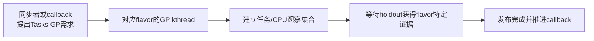
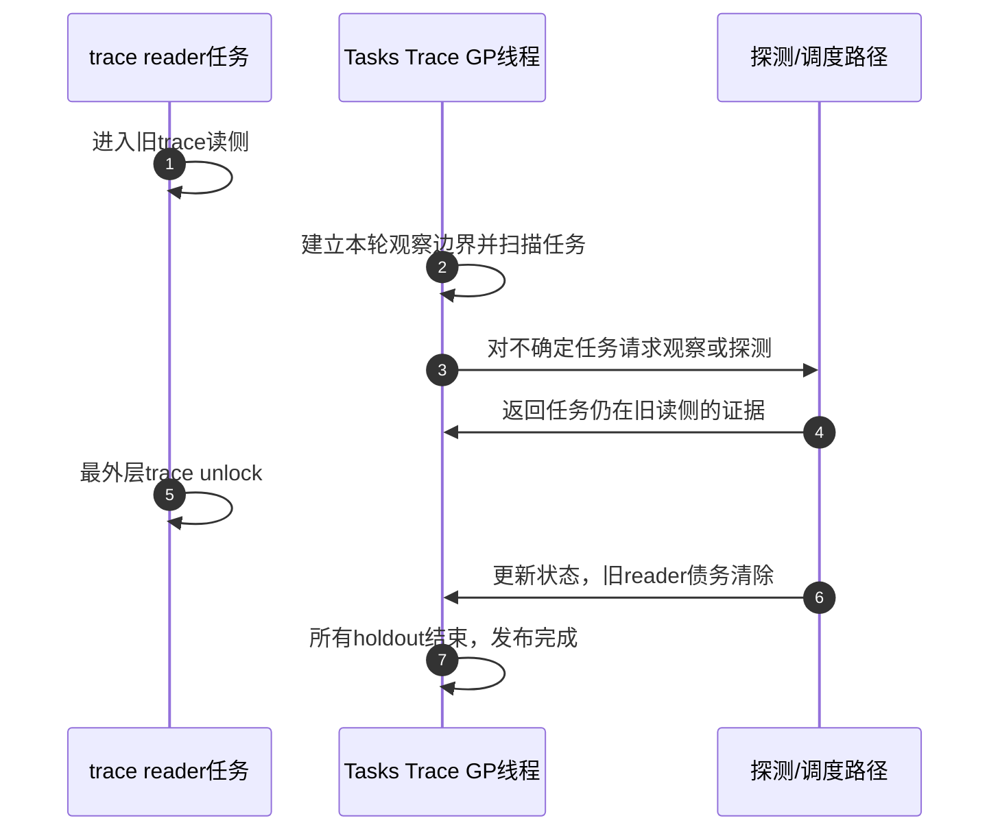

# 第19章\_Tasks\_RCU\_任务轨迹宽限期

P18 的 SRCU 仍然围绕显式对象保护域记账；Tasks **RCU（Read-Copy Update，读-复制-更新）** 家族换了问题：更新者需要修改或回收的是 **可能仍被任务执行轨迹触及的代码或 tracing 状态**。因此它不能照搬普通 Tree RCU 的短对象 reader，也不能用 SRCU 的双 index 计数定义所有旧执行。

本章先建立共同任务轨迹问题，再比较 Tasks、Tasks Rude 与 Tasks Trace 三种 flavor 的完成证据。Tiny RCU 属于普通 RCU 的单 CPU 实现轴，将在 P20 单独讲解，不再与 Tasks 家族混排。

先建立后文源码名称的最小入口。**BPF（Berkeley Packet Filter，伯克利包过滤器）** 在现代 Linux 中也指受验证程序及其内核执行设施；`rcu_read_lock_trace()` 与 `rcu_read_unlock_trace()` 是 Tasks Trace RCU 的显式读侧边界函数。`schedule_on_each_cpu()` 是让每个在线 CPU 执行一次给定工作的函数，Tasks Rude 借这类动作取得强制调度边界。后文伪代码中的 `AND` 是表示 logical conjunction（逻辑合取）的运算符名称，说明多个独立生命期条件必须同时满足。

先给这个家族一张“身份证”。它内部包含三个 flavor，因此共同骨架和各自完成证据必须分栏理解：

| 层次 | Tasks RCU 家族在本专题中的答案 | 本章展开位置 |
| --- | --- | --- |
| 分类位置 | 保护旧任务执行轨迹的 flavor 家族；不是普通 RCU 的 Tree/Tiny 后端选择 | 19.1～19.2 |
| 问题背景 | 更新后仍可能有任务停留在旧代码或 trace 执行轨迹，普通对象宽限期没有覆盖该 reader 集合 | 19.1 |
| reader 与完成证据 | Tasks 等自然任务边界，Tasks Rude 强制 CPU 跨调度边界，Tasks Trace 观察显式 trace reader | 19.3～19.6 |
| 运行原理 | 共享宽限期内核线程、callback 运输和 holdout 框架，由 flavor 钩子改变观察集合、探测与完成条件 | 19.2～19.6 |
| 初始化与实现 | 全局 flavor 控制对象和每 CPU callback 队列在启动期建立；当前材料只闭合到模块源码导读 | 19.8 |
| 选择边界 | 只关闭对应旧代码轨迹；若对象还由普通 RCU、SRCU 或 kref 保护，必须分别关闭其他生命期 | 19.7～19.9 |

## 19.1\_为什么普通对象GP不能直接证明旧代码轨迹消失

设 ftrace/BPF 更新者准备替换一段 trampoline。任务 A 在更新边界前进入旧函数路径，但没有位于普通 `rcu_read_lock()` 包围的对象读侧：

```text
T0：任务A开始执行旧函数入口
T1：更新者发布新入口
T2：普通RCU GP完成
T3：任务A仍可能从旧入口返回路径继续执行
```

普通 RCU GP 只对其定义的普通 reader 集合负责。若旧代码路径没有落入该保护域，T2 不能自动证明任务 A 已离开旧指令范围。需要先定义 **什么任务状态足以证明旧执行轨迹结束**，再围绕这一定义收集证据。

## 19.2\_Tasks家族的共同角色与状态

Linux 6.12.20 的 Tasks 家族共享一部分控制骨架：

| 角色 / 状态 | 主要职责 |
| --- | --- |
| `struct rcu_tasks` flavor 控制对象 | 保存 GP 线程、回调队列、扫描与完成函数 |
| 每 CPU callback 队列 | 接收对应 flavor 的异步请求 |
| Tasks GP kthread | 启动一轮任务轨迹扫描、等待 holdout、发布完成 |
| `task_struct` 相关状态 | 保存任务是否仍可能属于旧集合的证据或显式 trace 读侧状态 |
| flavor 特定扫描/探测函数 | 定义何种事件可以移除 holdout |

共同骨架只说明“怎样调度一轮扫描和交付 callback”，不说明“什么叫完成”。三种 flavor 的核心差异恰好在后者。



## 19.3\_经典Tasks\_RCU等待任务经过可证明边界

经典 Tasks RCU 没有要求调用者在每段旧函数路径外显式写一对普通读锁。它通过扫描既有任务，并观察任务是否经过能够切断旧执行轨迹的边界来缩小 holdout 集合，例如自愿上下文切换、用户态或 idle 等。

证明思路是：

1. GP 边界之后才开始运行新路径的未来任务不属于旧集合；
2. GP 边界前已存在的任务先被保守列入观察范围；
3. 某任务经过 flavor 认可的边界后，不可能仍连续停留在边界前的旧轨迹中；
4. 所有 holdout 都被排除后，本轮 Tasks GP 才完成。

“任务已经排队但尚未运行”本身不是旧执行证据。与普通 RCU 的晚到 reader 一样，只有已经进入受保护旧轨迹的执行才需要被本轮覆盖。

## 19.4\_Tasks\_Rude用系统扰动换取简单边界

Tasks Rude 不细致追踪每条旧函数轨迹，而是对在线 CPU 施加调度动作，使执行跨过强制的调度边界。它的代价是 IPI、调度和对无关 CPU 的扰动，因此只适用于少数明确要求这种保证的内部路径。

它与经典 Tasks 的比较应放在同一场景中：

| 比较项 | Tasks | Tasks Rude |
| --- | --- | --- |
| 观察对象 | 任务及其自然执行边界 | 在线 CPU 上的调度边界 |
| 推进方式 | 扫描并等待 holdout 自然报告 | 主动让 CPU 执行调度工作 |
| GP 延迟 | 可能被迟迟不经过边界的任务拉长 | 通常更主动，但系统扰动更大 |
| 适用范围 | 能以任务轨迹定义安全条件的路径 | 少数需要粗粒度强制边界的内部场景 |

Tasks Rude 不是“总是更快的 Tasks”。它改变了成本位置和观察粒度，仍必须由具体调用方契约证明适用。

## 19.5\_Tasks\_Trace为什么需要显式trace读侧

Sleepable BPF 或 tracing 路径可能跨越调度和阻塞边界。此时“任务发生过一次自愿切换”不一定能排除旧 trace reader，因为 reader 的合法生命期本来就可能跨过这次切换。

Tasks Trace 因而引入显式 `rcu_read_lock_trace()` / `rcu_read_unlock_trace()` 边界和每任务状态。GP 扫描者需要判断：

- 任务是否处于 trace reader 中；
- 该 reader 是否早于本轮 GP 边界；
- 能否通过被动观察确认它退出；
- 长时间无进展时是否需要 IPI 或其他探测帮助暴露状态。



这与 PREEMPT_RCU 的 blocked-task 机制有相似外形，但保护域不同：前者服务普通对象 reader，后者服务显式 trace reader。字段相似不能推出 GP 可互换。

## 19.6\_三种flavor的模块差异

| 模块 | 共同职责 | Tasks | Tasks Rude | Tasks Trace |
| --- | --- | --- | --- | --- |
| 请求交付 | 接收同步/异步 GP 需求 | 共享 Tasks 控制骨架 | 共享 | 共享 |
| 旧集合建立 | 找出边界前可能仍相关的执行 | 扫描任务 | 面向在线 CPU | 扫描显式 trace 状态 |
| 正常证据 | 移除 holdout | 自愿切换、user、idle 等 | CPU 经强制调度边界 | trace reader 退出或可证明不在旧区 |
| 主动推进 | 处理迟延参与者 | 周期复查 | `schedule_on_each_cpu()` 类动作 | 必要探测/IPI |
| 主要代价 | 完成安全证明 | 扫描和潜在长 GP | 跨 CPU 扰动 | 每任务状态、扫描和探测 |

共用骨架不应被复制三遍；实现阅读应围绕“flavor 钩子怎样改变旧集合和完成条件”比较。

## 19.7\_与普通RCU或SRCU组合时怎样判断

同一对象可能同时面对多种访问入口：

- 数据结构通过普通 RCU 指针被查找；
- 对象内代码或 trampoline 正被 Tasks Trace reader 执行；
- 控制路径又通过 kref 持有长引用。

此时必须分别关闭每个保护域，不能选一个听起来最强的 GP 代替其余条件。安全释放条件可能是：

```text
普通RCU对象reader结束
    AND
Tasks Trace旧代码reader结束
    AND
所有长期引用归零
```

具体子系统若只需要其中一项，就不应机械叠加全部等待；选择依据是实际入口和对象所有权。

## 19.8\_源码证据与版本边界

Linux 6.12.20 的 Tasks 家族核心实现在 `kernel/rcu/tasks.h`，代表性 BPF/ftrace 调用方分布在对应子系统。进入源码前先读 [Tasks RCU 模块源码概念导读](../../../../../research/source_reading/rcu/navigation/P10_Linux_6.12_Tasks_RCU模块源码概念导读.md#10.1_模块问题与三个flavor)，按“共享控制骨架 → flavor 钩子 → 任务/CPU证据 → callback 完成”顺序核对。

本仓库当前没有为 `tasks.h` 每个函数体建立独立逐行实现文档，因此本章只使用已核对源码树的模块级结论，不虚构唯一函数讲解入口。新增实现讲解前，应继续遵守同一函数体只展开一次的证据规则。

## 19.9\_选择与验收

面对调用点，先回答：

1. 保护的是对象地址，还是任务可能继续执行的旧代码轨迹；
2. 旧轨迹是否能用自然任务边界证明结束；
3. reader 是否有显式 trace 临界区并允许跨阻塞；
4. 调用方是否真的接受 Tasks Rude 的跨 CPU 调度扰动；
5. 是否还存在普通 RCU、SRCU 或引用计数提供的另一层生命期。

读完后不应再把 Tasks、Tasks Trace 和 Tiny RCU 放在同一“实现大小”列表中。前两者改变保护域和证明对象；Tiny 只改变普通 RCU 在单 CPU 上的底层组织。

上一篇：[SRCU 私有域与双 index 状态机](P18_SRCU_私有域与双_index_状态机.md)。

下一篇：[Tiny RCU 单 CPU 实现](P20_Tiny_RCU_单CPU实现.md)。
