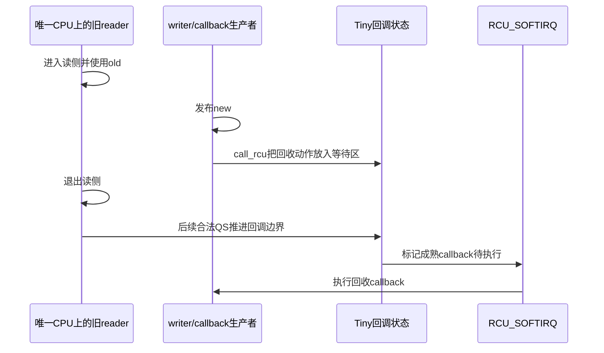

# 第20章\_Tiny\_RCU\_单CPU实现

P19 讨论的是 Tasks 家族怎样重新定义旧执行轨迹。本章回到 **普通 RCU 公共契约**，只改变部署条件：当内核是单 CPU、非 PREEMPT_RCU 构建时，Tiny RCU 可以删除 Tree RCU 的跨 CPU 汇聚树和长期 GP 协调复杂度。

Tiny 不是应用在运行时选择的轻量 flavor。相同的普通 RCU 调用点由 Kconfig 选择底层实现，调用者仍需遵守 P03 的发布、取得和回收协议。

## 20.1\_单CPU删除了什么问题

Tree RCU 之所以需要 `rcu_node` 树，是因为多个 CPU 各自可能包含旧 reader，证据需要避免集中争用并逐层汇聚。单 CPU 构建中：

- 同一时刻只有一个 CPU 执行内核代码；
- 不存在来自其他 CPU 的并行旧 reader；
- 不需要为多个 CPU 建立 `qsmask` 位图或父子节点传播；
- 不需要用缓存一致性在 CPU 间搬运节点状态。

但单 CPU 并没有删除时间问题。旧 reader 与 callback 仍可能在时间上先后交错，所以实现仍需区分“还在等 QS”和“已经可执行”的回调集合。

## 20.2\_共同契约与Tiny状态的映射

| 普通 RCU 问题 | Tree RCU 的代表实现 | Tiny RCU 的简化 |
| --- | --- | --- |
| 谁可能仍是旧 reader | 多 CPU + 可选被抢占任务 | 当前唯一 CPU 上的非抢占读侧 |
| 怎样得到 QS | 每 CPU 调度/EQS证据再汇聚 | 唯一 CPU 经过合法 QS |
| 怎样保存回调 | 每 CPU `rcu_segcblist` 与节点/GP代际 | `rcu_ctrlblk` 等紧凑回调状态 |
| 怎样发布成熟资格 | 全局 GP 完成后推进分段 | QS 到达时移动待等待/可调用边界 |
| 怎样执行 callback | softirq、`rcuc`、NOCB线程 | `RCU_SOFTIRQ` 等本地执行路径 |

Tiny 的正确性没有来自“代码很少”，而来自单 CPU 和非抢占读侧这一组更强部署前提。

## 20.3\_一次Tiny回调周期

设 reader 正在使用旧对象，writer 发布新入口并调用 `call_rcu()`：

| 阶段 | 状态变化 | 安全含义 |
| --- | --- | --- |
| T0 reader进入 | 当前 CPU 位于普通读侧 | 旧对象必须保留 |
| T1 writer发布 | 正式入口改为新对象 | 未来 reader 取得新版本 |
| T2 callback入队 | 回收动作进入等待队列 | 仅表示已提交，尚不能执行 |
| T3 唯一CPU经过QS | 旧非抢占 reader 必然已退出 | T2 以前的回调可以成熟 |
| T4 softirq执行 | 调用成熟 callback | 旧对象才真正释放 |



同 Tree RCU 一样，QS、callback 成熟和 callback 实际执行仍是三个不同事件。单 CPU 只让“收集谁的 QS”变简单，没有把 callback 执行折叠进读侧退出。

## 20.4\_为什么同步等待可能看起来几乎为空

在符合 Tiny RCU 前提的上下文中，调用 `synchronize_rcu()` 的任务本身已经发生调度或处于可以推出先前 reader 已跨界的位置，实现可能不需要启动 Tree RCU 那样的全局 GP kthread 周期。

不能据此推出：

- `synchronize_rcu()` 在所有配置下都是空操作；
- callback 可以在入队后立即执行；
- 单 CPU 上允许 reader 把裸指针带出读侧；
- Tiny 的结论可以外推到 SMP 或 PREEMPT_RCU。

看似很轻的同步路径依赖的是强构建条件，而不是 API 放弃了旧 reader 语义。

## 20.5\_Tiny与其他名称不能怎样互换

| 名称 | 所在分类轴 | 为什么不能替代Tiny |
| --- | --- | --- |
| SRCU | 私有保护域 / 可阻塞 reader | 即使单 CPU，主动阻塞 reader 仍需显式域记账 |
| Tasks RCU | 任务执行轨迹 flavor | 等待对象不是普通短读侧 |
| PREEMPT_RCU | Tree 普通 reader 执行模型 | Tiny 的构建前提排除了这套任务债务模型 |
| NOCB | callback 执行策略 | 解决回调负载位置，不删除跨 CPU 证明 |
| expedited | GP 策略 | 用更高扰动缩短等待，不是单 CPU 实现 |

这张表也是选择边界：应用作者通常选择普通 RCU、SRCU 或 Tasks 语义；Tree/Tiny 由目标内核构建决定。

## 20.6\_配置边界和源码证据

Linux 6.12.20 的典型构建关系是：[SMP 构建](../../../../foundations/computer_architecture/cache_coherence/P01_缓存一致性问题与缓存行.md#1.1.3_Linux中的CONFIG_SMP表示构建能力)默认选择 Tree RCU；`CONFIG_SMP=n` 且未启用 PREEMPT_RCU 的构建默认选择 Tiny RCU。这里描述的是 Kconfig 构建选择，不是根据运行时 online CPU 数量切换实现；实际结果必须以目标 `.config` 为准：

```bash
grep -E '^(CONFIG_SMP|CONFIG_TREE_RCU|CONFIG_TINY_RCU|CONFIG_PREEMPT_RCU)=' .config
```

Tiny 核心实现位于 `kernel/rcu/tiny.c`，公共接口仍来自 `include/linux/rcupdate.h` 和 RCU 公共更新路径。版本化阅读顺序见 [Tiny RCU 模块源码概念导读](../../../../../research/source_reading/rcu/navigation/P11_Linux_6.12_Tiny_RCU模块源码概念导读.md#11.1_模块问题与单CPU前提)。

仓库当前的既有 RCU 配置快照启用了 `CONFIG_TREE_RCU=y` 和 `CONFIG_PREEMPT_RCU=y`，因此可用于 Tree RCU 证据，不是 Tiny RCU 的运行实验环境。Tiny 章节的源码结论受固定 Linux 6.12.20 提交约束，不能伪装成当前板级实测结果。

## 20.7\_验收与主线回收

读完应能回答：

1. Tiny 删除的是哪一类跨 CPU 状态，而不是哪一条公共语义；
2. 为什么单 CPU 仍需回调等待区与成熟区；
3. 为什么 Tiny 不能与 Tasks RCU 放在同一 flavor 列表中；
4. 为什么某个 Tiny 快路径结论不能外推到 Tree RCU；
5. 应用代码何时只需要写普通 RCU API，而不应检查 `CONFIG_TINY_RCU` 复制业务逻辑。

至此，分类层中的普通 Tree/Tiny、SRCU 和 Tasks 家族已经分别闭合。下一章进入应用层，讨论 RCU 的临时读侧生命期怎样与 kref 的长引用生命期组合。

上一篇：[Tasks RCU 任务轨迹宽限期](P19_Tasks_RCU_任务轨迹宽限期.md)。

下一篇：[RCU、kref 与复合对象生命周期](P21_RCU_kref与复合对象生命周期.md)。
