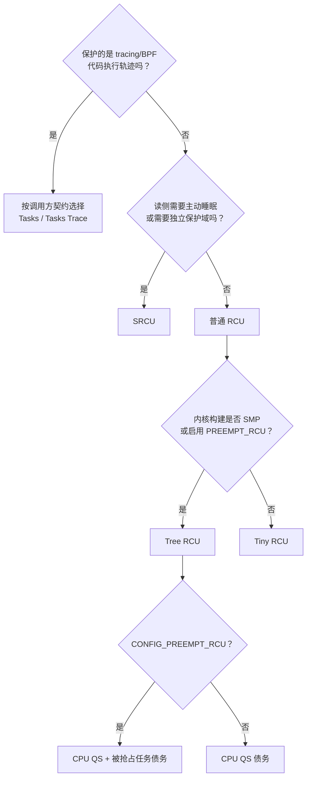

# 第22章\_RCU\_实现家族与内核配置

前面已经分别完成普通 Tree RCU 的非抢占式和抢占式证明。现在才适合讨论“RCU 有哪些种类”：这些名称不是快、慢档位，而是在回答 **谁是读者、读者允许做什么、更新者要等待什么证据**。

## 22.1\_先用四个实际需求拆开名字

假设同一个驱动中有四类需求：

```c
/* A：中断或系统调用快速查表，读者很短，不睡眠。 */
rcu_read_lock();
p = rcu_dereference(table[id]);
if (p)
	consume(p);
rcu_read_unlock();

/* B：通知链回调可能取得 mutex、等待 I/O。 */
idx = srcu_read_lock(&notify_srcu);
invoke_sleepable_listeners();
srcu_read_unlock(&notify_srcu, idx);

/* C：BPF/ftrace 需要回收曾被正在执行的 trampoline 访问的代码。 */
synchronize_rcu_tasks_trace();

/* D：同一份普通 RCU 源码被编译进单 CPU、小内存内核。 */
call_rcu(&obj->rcu, obj_free_rcu);
```

四段代码都与 RCU 有关，但问题并不相同：

| 需求 | 真正要保护的执行现场 | 适合的机制 |
| --- | --- | --- |
| A | 通过普通 RCU 入口取得对象的短读侧 | 普通 RCU；SMP 上通常是 Tree RCU |
| B | 可能主动阻塞的、属于某个子系统的读侧 | SRCU 私有域 |
| C | tracing/BPF 代码执行轨迹 | Tasks Trace RCU；具体代码还可能组合普通 RCU、percpu ref |
| D | 普通 RCU 语义，但部署目标只有一个 CPU | Tiny RCU 底层实现 |

因此，选择之前不能只问“哪个 RCU 更快”，而应先写出合法读者的边界。

## 22.2\_三个正交维度

RCU 名称至少分为三层：

1. **底层实现**：Tree RCU 还是 Tiny RCU，解决 CPU 规模和状态组织问题。
2. **读侧语义**：普通 RCU、SRCU 还是 Tasks RCU 家族，决定“什么算旧读者”。
3. **接口包装**：`rcu_read_lock_bh()`、`rcu_read_lock_sched()` 等还附加了怎样的本地执行约束。

这三个维度也给出了“非抢占式 Tree RCU”的解析规则：`Tree RCU` 指底层实现家族，`非抢占式` 指 `!CONFIG_PREEMPT_RCU` 下的读侧方式，二者不是同义关系。Tree RCU 在不同构建配置下可以采用非抢占式或抢占式普通 reader 模型，Tiny RCU 则是单 CPU、非抢占构建中的另一种普通 RCU 底层实现。两种 Tree RCU 模型分别由 [P05 非抢占式证明](P05_非抢占式_Tree_RCU_问题与证明模型.md#5.1.1_标题里的两个限定不是同义关系)和 [P07 抢占式证明](P07_抢占式_Tree_RCU_问题与任务跟踪模型.md#7.1_先制造非抢占模型无法解释的现场)展开；Tiny RCU 的单 CPU 证明见 [P24 实现边界](P24_Tasks_RCU与Tiny_RCU实现边界.md#24.1_Tasks_RCU与_Tiny_RCU实现边界)。


把三层混在一起，会得到两种典型错误：把 Tiny RCU 当成应用可手选的“精简 API”，或者把 Linux 6.12 的 `rcu_read_lock_sched()` 当成仍拥有独立 GP 引擎的历史 RCU-sched。

## 22.3\_普通\_Tree\_RCU与\_PREEMPT\_RCU

`CONFIG_TREE_RCU` 是 SMP 系统的主要普通 RCU 实现。它用：

- 每 CPU `rcu_data` 保存本地 GP 感知、QS 债务和回调队列；
- `rcu_node` 树分层汇聚 `qsmask`；
- `rcu_state` 保存全局 `gp_seq` 和 GP 线程状态；
- context tracking 的 watching/EQS 状态处理用户态、idle 和离线 CPU。

`CONFIG_PREEMPT_RCU` 默认随 `CONFIG_PREEMPTION` 选中，并 `select TREE_RCU`。它不是另一套 GP 树，而是在 Tree RCU 上增加可抢占读者任务跟踪：

```text
current->rcu_read_lock_nesting
        +
current->rcu_blocked_node / rcu_node_entry
        +
rcu_node.blkd_tasks / gp_tasks
```

CPU 的 `qsmask` 位清除，只能证明该 CPU 已提供 QS；若 `gp_tasks` 仍指向被抢占旧读者，GP 仍不能完成。完整状态机见 [抢占式 Tree RCU 源码同步机制](P08_抢占式_Tree_RCU_源码同步机制.md)。

## 22.4\_Tiny\_RCU是部署选择而不是调用点选择

Linux 6.12.20 中：

```text
CONFIG_TREE_RCU：默认在 SMP=y 时选中
CONFIG_PREEMPT_RCU：默认在 PREEMPTION=y 时选中，并选中 TREE_RCU
CONFIG_TINY_RCU：默认在 SMP=n 且 PREEMPT_RCU=n 时选中
```

应用代码仍调用 `rcu_read_lock()`、`call_rcu()` 等普通接口。Kconfig 在整份内核的构建层选择 Tree 或 Tiny 实现，不能让某一个对象在运行时自行选择 Tiny。

Tiny 只有一个 CPU，不必构造 `rcu_node` 汇聚树；但它仍须区分待等待回调和已经可调用回调，仍须等待这个唯一 CPU 经过 QS。第 24 章会把这条单 CPU 时序落到 `rcu_ctrlblk`、`rcu_qs()` 和 `RCU_SOFTIRQ`。

## 22.5\_SRCU改变的是读者身份和记账方式

每个 `struct srcu_struct` 定义一个私有保护域。读者显式更新该域的每 CPU、双 index 计数，所以任务即使睡眠、迁移，更新者仍可通过“全域 lock 总数等于 unlock 总数”判断旧读者是否退出。

这意味着它用更多读侧记账换来了两项能力：

- 读侧允许主动阻塞；
- GP 只等待同一个 `srcu_struct` 中的旧读者，而不是系统普通 RCU 域。

不要因为回调函数可能睡眠就机械使用 SRCU；若读侧实际短小且不阻塞，普通 RCU 的读路径通常更合适。完整代码与双扫描证据见下一章。

进入版本源码时也必须沿两条独立分支阅读：普通 Tree RCU 的全局请求和长期线程进入 [Tree RCU GP 全局生命周期模块源码概念导读](../../../../../research/source_reading/rcu/navigation/P06_Linux_6.12_Tree_RCU_GP全局生命周期模块源码概念导读.md#6.1_模块问题与版本边界)；SRCU 私有域和双 index 进入 [Tree SRCU 模块源码概念导读](../../../../../research/source_reading/rcu/navigation/P07_Linux_6.12_Tree_SRCU模块源码概念导读.md#7.1_先分清Tree_RCU与Tree_SRCU)。两篇导读共享总索引，不共享 GP 状态机。

## 22.6\_Tasks\_RCU家族等待的是任务执行轨迹

Linux 6.12.20 的 Tasks 家族共享 `struct rcu_tasks`、每 CPU 回调队列和 GP kthread，但每个 flavor 注入不同的扫描、holdout 检查和 GP 完成函数。

| flavor | 读者边界或 QS | 典型用途 | 主要代价 |
| --- | --- | --- | --- |
| Tasks RCU | 既有任务经过自愿切换、用户态、idle 等边界 | ftrace trampoline、函数前导代码变更 | 扫描任务表，GP 可能很长 |
| Tasks Rude RCU | 对在线 CPU 执行 `schedule_on_each_cpu()` | 少数需要强制跨 CPU 调度边界的内部路径 | IPI 和不必要的上下文切换 |
| Tasks Trace RCU | 显式 `rcu_read_lock_trace()` 读者退出 | sleepable BPF、tracing hook | 每任务状态、扫描、必要时 IPI |

它们可以与普通 RCU 同时等待，因为同一对象可能同时被普通数据访问路径和代码执行路径引用。一个 GP 的完成不能凭名称推导出另一个 flavor 的 GP 也完成。

## 22.7\_RCU-bh与\_RCU-sched在\_6.12的位置

`rcu_read_lock_bh()` 会附加禁止本地软中断的约束，`rcu_read_lock_sched()` 表达禁止抢占的约束。不过 Linux 5.0 以后，普通 RCU GP 已统一覆盖先前 RCU-bh 与 RCU-sched 的读侧语义。因此在 6.12 中，它们主要用于表达调用上下文和 lockdep 契约，不应画成三棵互相独立的 GP 树。

## 22.8\_从约束选择实现



这里的 Tree/Tiny 分支通常由 Kconfig 决定，应用作者真正需要选择的是普通 RCU、SRCU 或特定 Tasks 语义。

## 22.9\_在目标内核上核对配置

不要仅根据发行版名称猜配置：

```bash
grep -E '^(CONFIG_(TREE|TINY|PREEMPT)_RCU|CONFIG_(TREE|TINY)_SRCU|CONFIG_TASKS(_TRACE|_RUDE)?_RCU)=' .config
```

本仓库核对的 i.MX6ULL Linux 6.12.20 配置为 `CONFIG_TREE_RCU=y`、`CONFIG_PREEMPT_RCU=y`、`CONFIG_PREEMPT=y` 和 `CONFIG_CONTEXT_TRACKING=y`。因此它能作为 **抢占式 Tree RCU** 的具体证据载体，却不能拿来声称板子当前正在运行 Tiny RCU。

版本配置关系来自 [`kernel/rcu/Kconfig`](../../../../../research/source_reading/linux/kernel/rcu/Kconfig)，PREEMPT_RCU 读者跟踪来自 [`tree_plugin.h`](../../../../../research/source_reading/linux/kernel/rcu/tree_plugin.h)。

完成上述家族和配置判断后，再从 [Linux 6.12 RCU 源码总阅读索引](../../../../../research/source_reading/rcu/navigation/P01_Linux_6.12_RCU源码总阅读索引.md#1.2_第一步必须先判断正在读哪一种RCU)进入相应模块导读；不要只因文件位于 `kernel/rcu/` 就把不同家族串成同一条状态机。

上一篇：[Tree RCU CPU 热插拔与回调迁移](P21_Tree_RCU_CPU热插拔与回调迁移.md)。

下一篇：[SRCU 私有域与双 index 状态机](P23_SRCU_私有域与双_index_状态机.md)。
