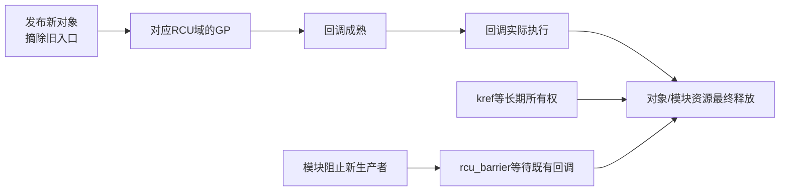
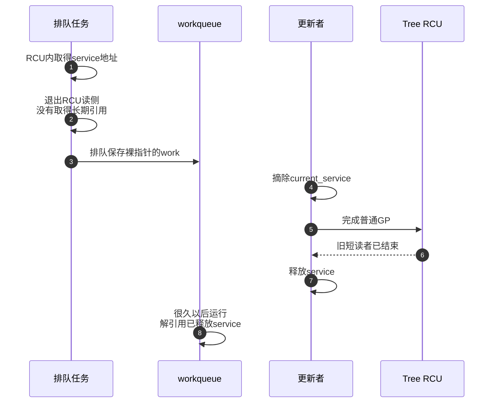

# 第24章\_RCU\_调试验证与集成误用

“RCU 出问题”至少可能指四件不同的事：对象入口和生命周期协议错误、GP 没完成、回调已成熟但没执行，或者回调已排队但模块先卸载。它们的日志和修复方向完全不同。本章固定三个可重建的故障，再给出从对象到 GP、回调和卸载的诊断顺序。

## 24.1\_先建立四条互不等价的状态链

| 状态链 | 关键问题 | 典型现象 | 优先证据 |
| --- | --- | --- | --- |
| 对象可达性与所有权 | 旧入口是否先摘除；裸指针是否逃逸；引用是否唯一释放 | KASAN UAF、double-free、偶发数据损坏 | 对象地址、发布点、get/put、释放栈 |
| GP 安全性 | 相关 CPU/任务是否仍欠 QS | `RCU Stall`、`synchronize_rcu()` 久等 | `gp_seq`、`qsmask`、blocked reader、stall 输出 |
| 回调成熟与执行 | GP 已结束后，回调是否从 WAIT/NEXT_READY 进入 DONE 并得到 CPU 时间 | 回调积压、内存持续增长 | `rcu_segcblist`、RCU softirq、NOCB GP/CB kthread |
| 卸载与代码生命期 | 指向模块 text 的既有回调是否都已经执行 | 卸载后跳入已释放模块代码 | 阻止新回调的边界、`rcu_barrier()`、生产者退出 |



`synchronize_rcu()` 只跨过图中的 GP 边，不能自动替代回调执行、kref 归零或模块生产者停机。

## 24.2\_故障一\_工作队列保存了读区外裸指针

这类故障的关键不是 reader 当场越界，而是它把只在读区内有效的借用指针交给了异步执行者。需要同时观察取得时刻、排队时刻、GP 完成和工作真正运行的顺序。

### 24.2.1\_能编译的错误代码

```c
struct service {
	struct kref ref;
	struct rcu_head rcu;
	int value;
};

struct service_work {
	struct work_struct work;
	struct service *service;
};

static struct service __rcu *current_service;

static int bad_queue_service(struct service_work *sw)
{
	rcu_read_lock();
	sw->service = rcu_dereference(current_service);
	rcu_read_unlock();

	/* 错误：队列只复制work地址，不会替service取得引用。 */
	return queue_work(system_wq, &sw->work) ? 0 : -EBUSY;
}
```

错误时序：



GP 没有出错：`service_work` 在 GP 开始前已经退出读侧，RCU 有权不再把它当读者。工作队列也没有出错：它只承诺调度 `work_struct`，不理解 `service` 的所有权。

### 24.2.2\_正确的引用交接

```c
static void service_release(struct kref *ref)
{
	struct service *service;

	service = container_of(ref, struct service, ref);
	kfree_rcu(service, rcu);
}

static int queue_service(struct service_work *sw)
{
	struct service *service;

	rcu_read_lock();
	service = rcu_dereference(current_service);
	if (service && !kref_get_unless_zero(&service->ref))
		service = NULL;
	rcu_read_unlock();
	if (!service)
		return -ENOENT;

	sw->service = service;
	if (!queue_work(system_wq, &sw->work)) {
		kref_put(&service->ref, service_release);
		return -EBUSY;
	}
	return 0;
}

static void service_workfn(struct work_struct *work)
{
	struct service_work *sw;

	sw = container_of(work, struct service_work, work);
	use_service(sw->service);
	kref_put(&sw->service->ref, service_release);
}
```

发布入口持有初始引用；更新者摘除旧入口后归还该引用。lookup reader 只在 RCU 防止对象物理释放的窗口内执行 `kref_get_unless_zero()`。最后 put 的 release 是唯一释放入口，但它调用 `kfree_rcu()`，继续等待仍可能只拿到裸地址、尚未来得及 get 的并发 lookup reader。

## 24.3\_故障二\_模块只等GP\_却没有等自己的回调执行

这里对象内存可能已经满足 GP 条件，真正危险的是 callback 函数体仍位于即将卸载的模块文本段。诊断必须把“callback 已成熟”和“callback 已实际调用完”分开。

### 24.3.1\_为什么synchronize\_rcu()不够

模块删除对象时排队：

```c
static void module_obj_free_rcu(struct rcu_head *head)
{
	struct module_obj *obj;

	obj = container_of(head, struct module_obj, rcu);
	kfree(obj);
}

static void module_obj_remove(struct module_obj *obj)
{
	list_del_rcu(&obj->node);
	call_rcu(&obj->rcu, module_obj_free_rcu);
}
```

`module_obj_free_rcu()` 的函数地址位于模块 text。即使卸载路径调用 `synchronize_rcu()`，它只能保证一次相关 GP 已过去；已经排队的回调可能成熟后仍留在 per-CPU/NOCB 回调队列，尚未真正执行。此时卸载模块会留下指向已释放 text 的函数指针。

### 24.3.2\_完整卸载顺序

```c
static void module_stop(void)
{
	/* 1. 从外部入口撤销注册，阻止新请求进入。 */
	unregister_driver_entry();

	/* 2. 取消/同步所有仍可能调用module_obj_remove()的生产者。 */
	cancel_work_sync(&producer_work);
	del_timer_sync(&producer_timer);

	/* 3. 摘除剩余对象并排队其RCU回调。 */
	remove_all_module_objects();

	/* 4. 等待此前排队的普通RCU回调实际调用完毕。 */
	rcu_barrier();

	/* 5. 此后才允许模块text和私有资源消失。 */
}
```

顺序不能交换：若 `rcu_barrier()` 后仍有 producer 能排队新回调，barrier 返回只覆盖调用前已有回调，新回调仍会指向即将卸载的模块代码。若使用 `call_srcu()` 或 Tasks Trace 回调，则必须使用对应域的 barrier，不能用普通 `rcu_barrier()` 跨域代替。

## 24.4\_故障三\_永不退出的旧读者只会卡住\_不会被超时释放

```c
static void broken_reader(void)
{
	rcu_read_lock();
	while (!READ_ONCE(stop_reader))
		cpu_relax();
	rcu_read_unlock();
}
```

在非抢占式 Tree RCU 中，这个循环阻止所在 CPU 提供可跨过该读者的普通 QS；在 PREEMPT_RCU 中，任务若被抢占，会进入 `rcu_node.blkd_tasks/gp_tasks` 并以任务债务继续阻塞 GP。两种配置的状态位置不同，安全结论相同：

```text
没有足够QS/任务退出证明
    → GP不能完成
    → synchronize_rcu()继续等待
    → call_rcu()回调继续积压
    → 可能触发stall warning
```

force-QS、IPI、boost 和 stall 检测只能催促或诊断。它们不会在超时后伪造证明并提前释放对象。可复现实验见 [晚到读者与抢占读者的对象回收实验](../../../../../labs/kernel/rcu/P01_晚到读者与抢占读者/README.md)。

## 24.5\_端到端诊断流程

前面的故障分别来自使用期逃逸、完成条件选错和活性停滞。统一诊断时应先确认运行配置，再重建同一对象或同一 GP 的时间线，最后才用 trace、lockdep、stall 日志或内存错误报告验证假设。

### 24.5.1\_D0\_先确认运行配置和flavor

```bash
zgrep -E 'CONFIG_(TREE|TINY|PREEMPT)_RCU|CONFIG_TASKS(_TRACE|_RUDE)?_RCU|CONFIG_RCU_NOCB_CPU' /proc/config.gz
```

若目标系统没有 `/proc/config.gz`，改查发布的内核配置或构建树 `.config`。不能用源码中存在 `PREEMPT_RCU` 分支推导运行内核已经启用它。

### 24.5.2\_D1\_先画对象时间线

记录同一个对象地址的五个事件：

```text
分配/初始化
    → 发布到哪个入口
    → 从所有合法入口摘除
    → 提交哪个flavor的GP/回调
    → 谁执行唯一最终释放
```

若对象带 kref，再记录初始发布引用、每次逃逸 get/put 和 release。若是 root + 多 block，分别画 root GP 与 block kref；不要拿一个“引用数”概括所有权图。

### 24.5.3\_D2\_用stall输出定位欠债者

Linux 6.12 的 stall 信息来自 `kernel/rcu/tree_stall.h` 等路径。阅读时先找：

- 哪个 flavor 和 GP 序号停滞；
- 哪些 CPU 仍在等待集合中；
- CPU 是否长期关中断、禁抢占或没有调度；
- PREEMPT_RCU 是否报告 blocked task；
- GP kthread 自身是否长期得不到运行机会。

诊断最后一项时，先用 [GP 全局生命周期模块导读](../../../../../research/source_reading/rcu/navigation/P03_Linux_6.12_Tree_RCU_GP全局生命周期模块源码概念导读.md#3.7_一次唤醒怎样进入主循环和初始化)和 [force-QS 与 Stall 模块导读](../../../../../research/source_reading/rcu/navigation/P05_Linux_6.12_Tree_RCU_force_QS与Stall模块源码概念导读.md#5.1_为什么GP已经在等还要有force_QS)区分模块职责，再分别进入 [普通 GP 长期任务的主循环](../../../../../research/source_reading/rcu/source_explanations/P05_Linux_6.12_Tree_RCU_GP全局生命周期源码实现.md#5.8_rcu_gp_kthread串联一轮物理GP)和 [force-QS 与 Stall 源码实现](../../../../../research/source_reading/rcu/source_explanations/P07_Linux_6.12_Tree_RCU_force_QS与Stall源码实现.md#7.2_源码符号覆盖账本)，区分“线程没有请求而正常休眠”“已被唤醒但尚未获调度”“运行在 FQS 等待阶段”三种状态，并定位活动时间、欠债 CPU/任务和 stall 分类。不要看到 stall 就直接增大超时参数；延长阈值只能减少告警频率，不能修复永不退出的读侧、关中断循环或 GP kthread 饥饿。

### 24.5.4\_D3\_按本机available\_events选择tracepoint

```bash
mount -t tracefs nodev /sys/kernel/tracing
grep '^rcu:' /sys/kernel/tracing/available_events

echo 1 > /sys/kernel/tracing/events/rcu/rcu_grace_period/enable
echo 1 > /sys/kernel/tracing/events/rcu/rcu_quiescent_state_report/enable
echo 1 > /sys/kernel/tracing/events/rcu/rcu_callback/enable
echo 1 > /sys/kernel/tracing/tracing_on
```

具体事件取决于内核配置，必须先查 `available_events`。PREEMPT_RCU 实验还可检查 `rcu_preempt_task` 和 `rcu_unlock_preempted_task`；回调执行可检查目标内核实际提供的 invoke/batch 事件。采集完成后关闭事件，避免长期 tracing 影响时序。

### 24.5.5\_D4\_根据状态链选择动态检查器

| 工具或配置 | 能帮助发现 |
| --- | --- |
| `CONFIG_PROVE_RCU` / lockdep | 错误读侧上下文、可疑 dereference 条件、部分非法同步等待 |
| Sparse `make C=1/C=2` | `__rcu` address-space 类型误用 |
| `CONFIG_DEBUG_OBJECTS_RCU_HEAD` | 同一 `rcu_head` 重复排队等回调对象错误 |
| KASAN | 测试实际覆盖到的 UAF/越界 |
| KCSAN | 测试实际覆盖到的数据竞争 |
| rcutorture | RCU 实现、配置和异常交错压力；不理解业务对象所有权 |

rcutorture 的实现位于 `kernel/rcu/rcutorture.c`，自动化脚本位于 `tools/testing/selftests/rcutorture/`。它适合验证内核 RCU 子系统和配置组合，不替代驱动专用的删除、卸载和引用逃逸测试。

## 24.6\_组合机制的职责矩阵

| 机制 | 它解决什么 | 它不解决什么 |
| --- | --- | --- |
| RCU | 发布/取得、短读侧生命期、GP 后回收 | 多写者互斥、任意字段一致性、读区外生命期 |
| spinlock/mutex | 更新串行化和复合不变量 | 旧裸读者的延迟回收 |
| kref/refcount | 已成功取得的长期所有权 | 从共享入口到安全 get 之间的竞态窗口 |
| workqueue/timer | 把动作安排到未来上下文 | 被保存对象和模块 text 的生命期 |
| devres | 设备解绑时的资源托管 | RCU GP、回调执行、硬件停止顺序 |
| `rcu_barrier()` | 等调用前已经排队的对应普通 RCU 回调执行 | 新回调、其他 flavor、没有排队成回调的旧读者用途 |

## 24.7\_交付前故障注入核对表

| 操作 | 期望观察 |
| --- | --- |
| 在读者取指针后延迟更新者 | 旧读者继续安全使用，更新后读者只见新对象 |
| 在读者尚未 dereference 前延迟它 | GP 可完成；读者恢复后取得新对象 |
| 在 PREEMPT_RCU 读侧内强制抢占 | CPU QS 与 blocked task 债务分离，任务 unlock 后 GP 才完成 |
| 延迟回调执行而非 GP | 对象不提前释放；能区分“GP完成”和“回调执行” |
| 在模块退出边界并发排队回调 | producer 先停止，barrier 后不再出现新模块回调 |
| 对复合 root 复用/替换部分 block | 旧 root 的 GP 前，各 block 的版本引用不被提前归还 |

上一篇：[RCU 类型语义、Sparse 与 Lockdep](P23_RCU_类型语义_Sparse与Lockdep.md)。

下一篇：[RCU 内存序、误用与选择边界](P25_RCU_内存序_误用与选择边界.md)。
