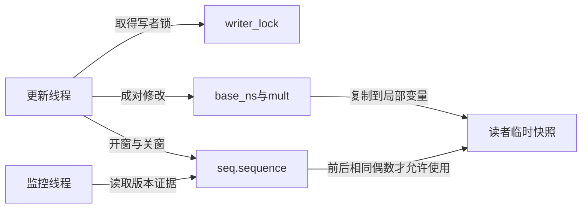
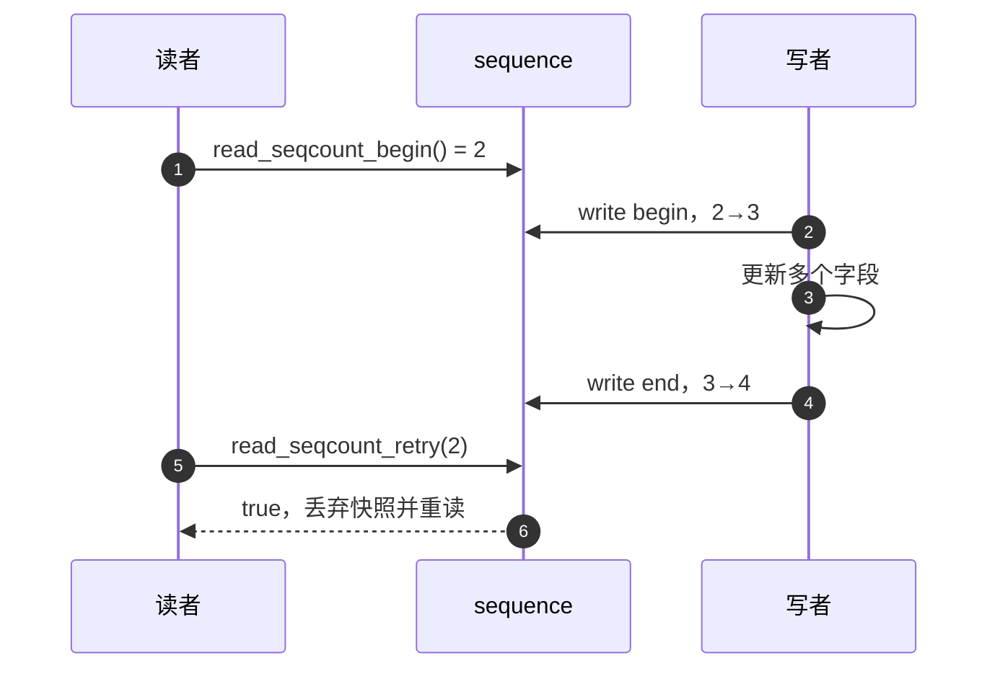
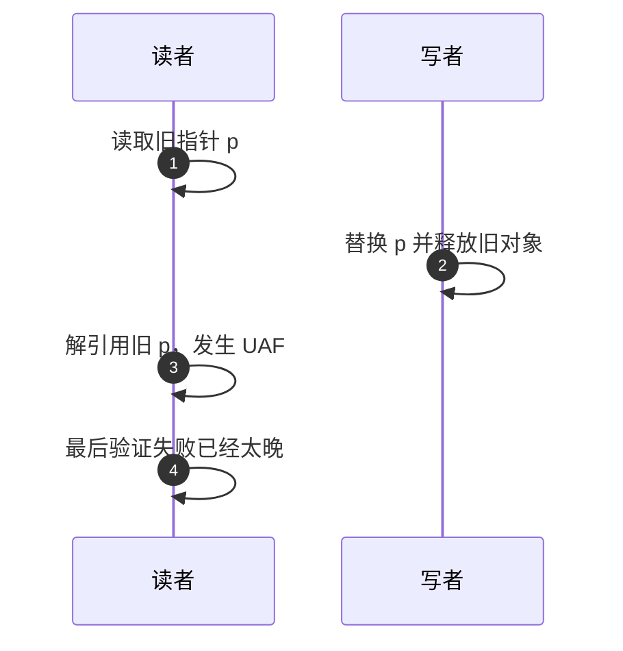

# 第1章\_seqcount\_seqlock\_读重试快照机制

## 1.1\_问题模型

一个计时换算参数包含基准base_ns与比例mult。更新线程必须成对修改它们，监控线程只需取得某个完整版本来计算显示值；若基准来自新版本、比例来自旧版本，计算可能错误。用锁包住复制可以直接解决，但读者很多、每次只复制几个字段时，可以考虑把读侧成本转移给最后验证和偶尔重做。不是所有读操作都适合这种转移：若读者必须阻止更新或执行不可撤回的动作，应继续使用锁。

序列计数器seqcount为这种可重复的短快照提供版本证据。它位于内核同步接口层，使用一个共享序号和调用者自己的数据，不保存每个读者的登记。读者先取序号、复制数据、再验证；遇到写入或版本变化就丢弃副本并重试。下面先建立使用边界，下一章再从失败反例证明为什么需要奇偶两次变化。





序号为偶数表示当前没有写者处在更新窗口，奇数表示写入进行中。读者前后看到相同偶数值时，才接受本次快照。

## 1.2\_seqcount\_不是什么

- 它不提供写者互斥；所有写者必须由外部机制严格串行化。
- 它不阻止读者看到中间值；读者可能先读到混合状态，只是在使用前必须验证并丢弃失败结果。
- 它不保护指针指向对象的生命周期；读者可能在验证前解引用已失效地址。
- 它不保证读者一定快速成功；写入频繁时读者可能多次重试。
- 它不是通用事务，也不适合带不可撤销副作用的读操作。

因此读窗口内只能复制可以安全暂存的数据，不能在验证成功前执行 I/O、释放对象、推进队列或产生其他不可回滚副作用。

## 1.3\_基本读写模式

下面是一组可集成到内核代码中的初始化、更新和读取函数。限定所有读写都来自普通任务上下文，不允许中断、软中断或NMI读取；对象必须在发布前初始化，并由外围生命期协议保证所有调用期间有效。这里用原始自旋锁raw_spinlock_t使这个短写窗口的不可抢占性明确，包括实时配置；这不是建议所有业务都换成原始锁。窗口中只有固定标量赋值，不能分配、等待或调用未知回调。

```c
#include <linux/compiler.h>
#include <linux/seqlock.h>
#include <linux/spinlock.h>
#include <linux/types.h>

struct clock_values {
    u64 base_ns;
    u32 mult;
};

struct clock_snapshot {
    seqcount_t seq;
    raw_spinlock_t writer_lock;
    u64 base_ns;
    u32 mult;
};

static void init_clock(struct clock_snapshot *c, u64 ns, u32 mult)
{
    /* 对象尚未共享，先构造锁、序号和完整初值。 */
    raw_spin_lock_init(&c->writer_lock);
    seqcount_init(&c->seq);
    c->base_ns = ns;
    c->mult = mult;
}

static void update_clock(struct clock_snapshot *c, u64 ns, u32 mult)
{
    raw_spin_lock(&c->writer_lock); /* 串行化写者并禁止抢占。 */
    write_seqcount_begin(&c->seq);
    WRITE_ONCE(c->base_ns, ns);
    WRITE_ONCE(c->mult, mult);
    write_seqcount_end(&c->seq);
    raw_spin_unlock(&c->writer_lock);
}

static struct clock_values read_clock(struct clock_snapshot *c)
{
    struct clock_values value;
    unsigned int start;

    do {
        start = read_seqcount_begin(&c->seq);
        value.base_ns = READ_ONCE(c->base_ns);
        value.mult = READ_ONCE(c->mult);
    } while (read_seqcount_retry(&c->seq, start));
    return value; /* 验证以后才把局部副本交给调用者。 */
}
```

读者不在循环里写调用者提供的输出地址，避免把失败候选提前发布到未知共享位置。READ_ONCE/WRITE_ONCE标记字段访问，不把两个字段变成一个原子事务，也不替代seqcount顺序协议；在32位机器上不能据此假设任意宽度字段都是单指令原子访问。这里允许候选读到中间组合，依靠最后验证拒绝它，前提是每次读取本身安全。

应使用官方接口，不要手写序号加一和屏障。接口内部的准确实现随体系结构和seqcount变体变化，不能固定背成“两次smp_wmb加两次smp_rmb”。本组内核函数已静态对照固定版本接口，尚未编译加载；下一章提供能独立编译运行的C交错模型。模型不使用真实共享并发，不应把这些内核用法直接翻译成普通C变量的多线程读写。

## 1.4\_写者为什么不能在奇数状态下睡眠

写者进入 `write_seqcount_begin()` 后，读者会等待奇数序号结束或不断重试。如果写者被高优先级读者抢占，而读者持续等待写者把序号恢复为偶数，就可能形成实时 livelock。

因此写侧必须：

1. 严格串行化多个写者；
2. 在整个奇数窗口内不可被抢占；
3. 若读者可在 hardirq/softirq 运行，还要防止相应中断上下文打断写者并开始读取；
4. 保持写窗口短小，不调用睡眠函数。

非实时配置的普通spinlock与raw_spinlock在这里不能无条件混称：PREEMPT_RT下普通spinlock的实现及抢占属性不同。上例选择raw_spinlock并限制读者上下文，使前提清楚；若使用普通spinlock或mutex，必须按所选seqcount变体和配置检查不可抢占保护，不能仅凭“有锁”推导。外部mutex只串行写者时，plain seqcount仍需额外保护奇数窗口，关联锁变体的具体处理放到第5章。

## 1.5\_关联锁的\_seqcount\_类型

现代内核提供带关联锁信息的 seqcount 类型，例如 `seqcount_spinlock_t`、`seqcount_mutex_t` 等。关联锁主要用于 lockdep 验证和在需要时满足写侧不可抢占条件；它不替调用者自动获取外部锁。

```c
seqcount_spinlock_t seq;
spinlock_t lock;

spin_lock_init(&lock);
seqcount_spinlock_init(&seq, &lock);
```

具体初始化宏和可用变体应以当前内核 `include/linux/seqlock.h` 为准。

## 1.6\_seqlock

`seqlock_t` 把 seqcount 与写侧 spinlock 封装在一起，适合写者使用自旋锁串行化的传统场景：

```c
seqlock_t lock;

seqlock_init(&lock);

write_seqlock(&lock);
state.a = new_a;
state.b = new_b;
write_sequnlock(&lock);

do {
    seq = read_seqbegin(&lock);
    a = state.a;
    b = state.b;
} while (read_seqretry(&lock, seq));
```

以上只展示把第一组示例的显式写者锁与seqcount换成封装后的调用位置，state、new_a/new_b和读者局部变量代表外围业务字段，并非另一份可独立编译的程序。`seqlock_t`组合写写互斥和序号窗口，读者仍复制后验证；它不保护指针生命周期，也不允许写侧任意睡眠。实时配置、关联锁和可中断读者的区别在后续章节分别展开。

## 1.7\_指针为什么危险

假设写者先替换指针并释放旧对象，读者可能在 seqcount 窗口中取得旧地址并立刻解引用。即使最后 `read_seqcount_retry()` 返回 true，UAF 已经发生，重试无法撤销。



需要替换并回收对象时使用 RCU、引用计数或锁保护生命周期。seqcount 可以与这些机制组合，但不能替代它们。

## 1.8\_适用与不适用场景

| 场景 | 结论 |
| --- | --- |
| 时间基准、统计组合、坐标或参数快照 | 适合，字段可安全复制且写少 |
| 指针链表、树、可释放对象 | 不单独使用 seqcount |
| 写入很频繁、读窗口很长 | 读者可能饥饿，应换锁或重新设计 |
| 读操作有 I/O 或不可回滚副作用 | 不适合重试模型 |
| 读者需要阻止写者 | 使用 rwlock/rwsem 等 |
| 新旧对象可并存并延迟回收 | 使用 RCU |

## 1.9\_与\_RCU\_和读写锁的边界

| 机制 | 读者策略 | 写者策略 | 生命周期 |
| --- | --- | --- | --- |
| seqcount/seqlock | 复制后验证，失败重试 | 原地更新，写者串行 | 不提供对象保活 |
| rwlock/rwsem | 持读锁阻止写者 | 写锁独占 | 回收者也遵守同一锁协议时，锁覆盖的访问才有效 |
| RCU | 允许读取旧版本 | 发布新版本、延迟回收 | 匹配读侧范围与回收协议保住旧引用，不自动生成多字段一致快照 |

RCU 的硬件基础、CPU/任务状态通知和宽限期统一参见 [RCU 专题](../rcu/大纲.md)。

## 1.10\_常见错误

| 错误 | 后果 |
| --- | --- |
| 多写者直接调用 begin/end | 序号窗口互相嵌套，读者可能接受坏快照 |
| 写窗口被抢占或睡眠 | 读者长时间自旋或实时 livelock |
| 读者验证前执行副作用 | 重试无法撤销已经发生的操作 |
| 用 seqcount 保护可释放指针 | 验证前已经 UAF |
| 手写 `sequence++` 和固定屏障 | 破坏架构及内核版本语义 |
| 认为读者永远无等待 | 遇到奇数序号和频繁写入仍会重试/自旋 |

## 1.11\_核对表

- 所有写者由什么机制串行化？
- 写窗口是否保证不可抢占并且不会睡眠？
- 读者所在 IRQ/softirq 上下文能否打断写者？
- 读窗口是否只复制安全标量，验证成功后才使用？
- 是否存在指针和对象回收，需要 RCU 或引用计数？
- 最坏写入频率下，读者重试是否可接受？

下一篇：[一致快照的证明模型](P02_一致快照的证明模型.md)。

固定版本源码从[序列计数器源码总阅读索引](../../../../../research/source_reading/sequence_counters/navigation/P01_Linux_6.12_序列计数器源码总阅读索引.md#1.1_版本边界与阅读任务)进入。本章建立调用协议，证明、内存顺序、latch和实时配置分别沿后续章节展开，不把接口用法当成全部正确性证明。
